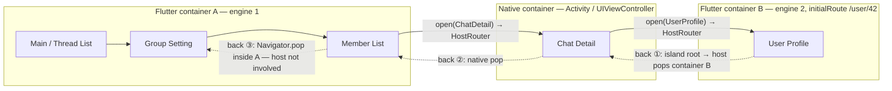
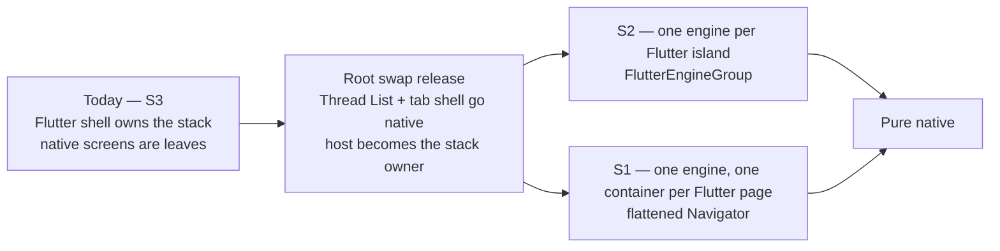
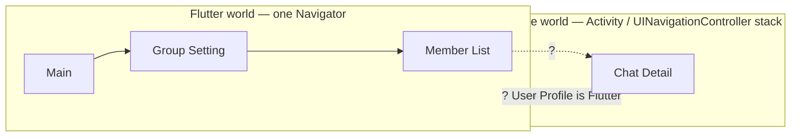
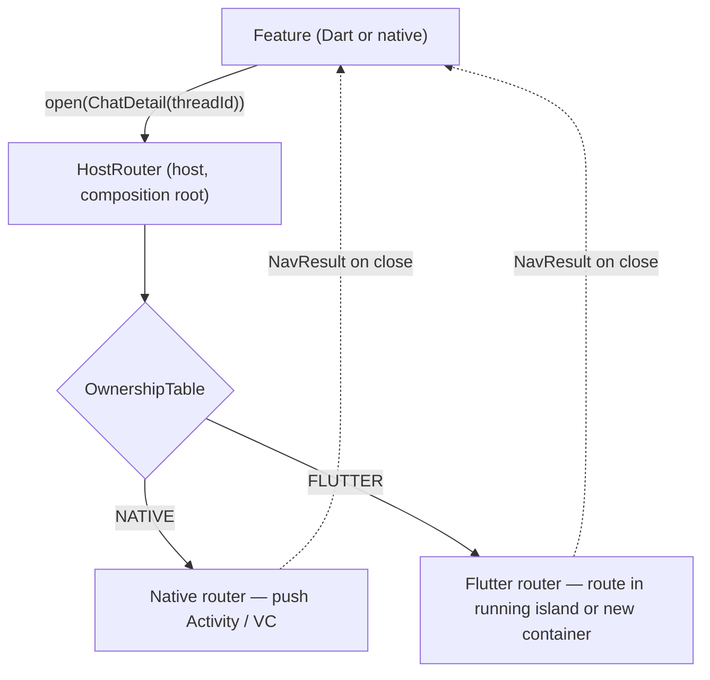
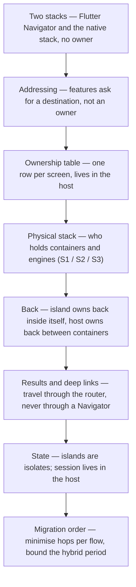

# Content Skeleton — "Half Flutter, Half Native: Who Owns Navigation Mid-Migration?"

Writing contract for the post. Sources: brainstorm §3–§9 + 4 sub-reports. Every external claim below carries its URL; anything marked **(author)** is our own experience/artifact and needs no citation. Tense rule: *today* = Flutter shell owns the stack, Chat Detail is the first screen going native; *option* = S1 vs S2 not decided; never "we shipped" for undecided parts.

## 0. Thesis + close

- `> [!TIP]` **Features ask for a destination, never for "the native screen". The host resolves who renders it and owns the physical stack and the back between islands. And the number your migration order must minimise is Flutter↔Native hops per user flow — not screens migrated.**
- Close ("the question was wrong"): "Who owns navigation?" is wrong in one word — **owns**, singular, as if one thing could. Two things do: a *contract* (who renders a destination — one table, one row per screen) and a *stack owner* (who holds the physical back stack — the host, from the root swap on). Today's honest answer for us: nobody yet — the table is being built and the stack owner flips at the root swap.

## 1. Section map (12)

| # | H2 | Purpose | Anchor claims (URL) | Words |
|---|----|---------|---------------------|-------|
| 1 | *(hook, no H2)* | The 3-hop flow (Group Setting → Member List → **native** Chat Detail → **Flutter** User Profile → back ×3). "How does Flutter open a native screen" is five lines and not the question. Link token post + series funnel. | (author); Pigeon https://pub.dev/packages/pigeon | 250 |
| 2 | TIP + `## Table of contents` | thesis | — | 80 |
| 3 | Two Navigation Worlds, One Back Button | Flutter `Navigator` (one widget-tree stack) vs Activity/Fragment/`NavController` + `UINavigationController`. Diagram a. flutter#15559 opened 2018-03-15, exact case, "this question is 8 years old". | https://github.com/flutter/flutter/issues/15559 | 300 |
| 4 | The Easy Answer: `openNativeChatDetail` | MethodChannel `openNativeChatDetail(threadId)` from Dart; `openFlutterViewController(route:)` from Swift. Works; couples every caller to *migration state*. Same shape as token post's "easy answer". | (author) | 300 |
| 5 | Reveal 1: Features Ask for a Destination, the Host Decides Who Renders It | Artifact 1: `AppDestination` sealed types (Dart, Pigeon) + Kotlin/Swift `HostRouter` + ownership table diff view (today / +6 mo / +12 mo). Diagram b. Prior art: Android multi-module ("features never reference peers; deep links are the public API"), DeepLinkDispatch, ARouter, Coordinator/RIBs (children ask parent). Strangler Fig (router = proxy), Branch by Abstraction (router = abstraction with two implementations). | https://developer.android.com/guide/navigation/integrations/multi-module ; https://github.com/airbnb/DeepLinkDispatch ; https://github.com/alibaba/ARouter ; https://khanlou.com/2015/01/the-coordinator/ ; https://github.com/uber/RIBs ; https://martinfowler.com/bliki/StranglerFigApplication.html ; https://martinfowler.com/bliki/BranchByAbstraction.html | 650 |
| 6 | Reveal 2: The Contract Doesn't Say Who Holds the Stack | S1/S2/S3 table. Google 2018 (#15559 xster quote: option 4 long-term / option 2 now) vs 2021 (Flutter 2.0, 2021-03-03: "~99% to ~180kB per instance"; docs: "hybrid mixture of native -> Flutter -> native -> Flutter", `FlutterEngineGroup`, engines talk only via channels through the host). Lineage: option 2 → FlutterBoost (Xianyu, "use Flutter like a WebView"); option 4 → EngineGroup (docs sample, cult.fit one engine per tab, ByteDance "continuous Flutter in one VC, new engine for isolated zones"). Where we are: **S3 today**; the root swap flips ownership; **S1 vs S2 open** — criteria listed, no verdict. Diagram: ownership flip with open branch. | https://github.com/flutter/flutter/issues/15559 ; https://flutter.dev/blog/whats-new-in-flutter-2-0 ; https://docs.flutter.dev/add-to-app/multiple-flutters ; https://github.com/alibaba/flutter_boost ; https://www.alibabacloud.com/blog/how-to-use-flutter-for-hybrid-development-alibabas-open-source-code-instance_594897 ; https://blog.cult.fit/posts/flutter ; https://blog.flutter.dev/google-i-o-spotlight-flutter-in-action-at-bytedance-c22f4b6dc9ef ; https://github.com/flutter/samples/tree/main/add_to_app/multiple_flutters | 650 |
| 7 | Reveal 3: Back Is the Real Problem | Artifact 3 diagram (walk the 3-hop flow, who handles each back). Rule: **island owns back inside itself; host owns back between containers**. `PopScope` (3.16, replaces `WillPopScope`; predictive back needs sync `canPop`) + `SystemNavigator.pop()`/host callback at island root; iOS: `SystemNavigator.pop` unreliable in add-to-app (#71832/#55760) → tell host; `interactivePopGestureRecognizer` conflict (#64616); nested Navigator + system back (#103028/#145159); results via router not stack; deep links only via host (Shopify: open as modal, don't rebuild stack); state per isolate (#115533) → host owns session (token post). Back/results/deep-link/state/transition/flip table. | https://docs.flutter.dev/release/breaking-changes/android-predictive-back ; https://github.com/flutter/flutter/issues/71832 ; https://github.com/flutter/flutter/issues/55760 ; https://github.com/flutter/flutter/issues/64616 ; https://github.com/flutter/flutter/issues/103028 ; https://github.com/flutter/flutter/issues/145159 ; https://github.com/flutter/flutter/issues/115533 ; https://api.flutter.dev/flutter/services/SystemChannels/navigation-constant.html ; https://shopify.engineering/migrating-our-largest-mobile-app-to-react-native | 650 |
| 8 | What It Costs | Artifact 2 hop-count table (illustrative flows from our app map, labelled). Engine cost: docs load sequence — one Dart VM per process, never shuts down; one isolate per engine; EngineGroup shares GPU context/font metrics/isolate-group snapshot, "~180kB" incremental; **first frame not measured on our app yet** (deferred to a deep dive). Airbnb RN p90 first render 280 ms iOS / 440 ms Android + 50 ms delay as the analog warning that cross-world transitions have a visible cost. | https://docs.flutter.dev/add-to-app/performance ; https://docs.flutter.dev/add-to-app/multiple-flutters ; https://medium.com/airbnb-engineering/react-native-at-airbnb-the-technology-dafd0b43838 | 450 |
| 9 | The Invariant, and Why It Changes the Migration Order | Invariant sentence. GPay 2020-09-18 "tried a hybrid approach … clean rewrite as it was not scalable"; Airbnb 2018 "Hybrid apps are hard…"; Nubank 2021 "mixed state … platform team … crucial"; Betterment ~2 yrs → 85%; Xianyu hybrid for years. Migrate by flow; hybrid period bounded. | https://developers.googleblog.com/google-pay-picks-flutter-to-drive-its-global-product-development/ ; https://medium.com/airbnb-engineering/building-a-cross-platform-mobile-team-3e1837b40a88 ; https://building.nubank.com/scaling-with-flutter/ ; https://verygood.ventures/blog/betterment-flutter-revitalized-our-codebase ; https://www.alibabacloud.com/blog/flutter-analysis-and-practice-evolution-and-innovation-of-flutter-based-architecture-24ec9e6d1fb | 350 |
| 10 | What's Still Broken or Undecided for Us | S1 vs S2 undecided (criteria); root-swap release not shipped; iOS swipe-back inside islands; cold island first frame; deep link into island mid-flow; no measurements yet; hop table not traffic-weighted. | (author) | 250 |
| 11 | FAQ | 5 Qs (§6 below) | FlutterBoost/thrio URLs | 400 |
| 12 | Ladder + close + footer | Ladder mermaid; "the question was wrong"; next = data-layer post; `## References` grouped as brainstorm §9. | — | 300 |

Target ≈ 3,300–3,600 words body (code/tables extra).

## 2. Artifact 1 — contract + router (final form; redacted, token-post naming)

Naming: `packages/host_contracts` (platform team, interfaces only), Flutter module `flutter_module/`, host `Host Android` / `Host iOS`. No bundle ids/endpoints.

```dart
// packages/host_contracts/pigeons/navigation.dart   (platform team; Pigeon input)
import 'package:pigeon/pigeon.dart';

/// Where a feature wants to go. Says nothing about who renders it.
sealed class AppDestination {}
class ThreadList   extends AppDestination {}
class ChatDetail   extends AppDestination { ChatDetail(this.threadId, {this.messageId}); String threadId; String? messageId; }
class GroupSetting extends AppDestination { GroupSetting(this.threadId); String threadId; }
class MemberList   extends AppDestination { MemberList(this.threadId); String threadId; }
class UserProfile  extends AppDestination { UserProfile(this.userId); String userId; }

/// What a screen hands back when it closes. Also owner-agnostic.
class NavResult { NavResult(this.kind, this.payload); String kind; Map<String, Object?> payload; }

/// Feature → host. The only navigation API a feature is allowed to call.
@HostApi()
abstract class AppNavigator {
  @async NavResult? open(AppDestination destination);  // completes when the destination closes
  void close(NavResult? result);                       // "I'm done; whoever opened me gets this"
}
```
Note in prose: Pigeon can generate the Kotlin/Swift mirrors of the sealed hierarchy; on older Pigeon an enum + args map does the same job — the point is the *shape*, not the codegen.

```kotlin
// Host Android — the only implementation of AppNavigator
class HostRouter(
    private val ownership: OwnershipTable,
    private val native: NativeRouter,        // Activity / NavController side
    private val flutter: FlutterIslandRouter // opens or reuses a Flutter container
) : AppNavigator {
    override fun open(destination: AppDestination, callback: (Result<NavResult?>) -> Unit) =
        when (ownership.ownerOf(destination)) {
            Owner.NATIVE  -> native.open(destination, callback)
            Owner.FLUTTER -> flutter.open(destination, callback)
        }
    override fun close(result: NavResult?) = topContainer().finishWith(result)
}

// The table. Migrating a screen = one row.
object OwnershipTable {
    fun ownerOf(d: AppDestination): Owner = when (d) {
        is ChatDetail -> Owner.NATIVE      // first screen to go native
        is ThreadList, is GroupSetting, is MemberList, is UserProfile -> Owner.FLUTTER
    }
}
```

```swift
// Host iOS — HostRouter.swift
final class HostRouter: AppNavigator {
    func open(destination: AppDestination, completion: @escaping (Result<NavResult?, Error>) -> Void) {
        switch ownership.owner(of: destination) {
        case .native:  native.open(destination, completion)     // push a UIViewController
        case .flutter: flutter.open(destination, completion)    // FlutterViewController on a (new or running) engine
        }
    }
    func close(result: NavResult?) { navigationController.popViewController(returning: result) }
}
```

Dart-side thin router (`host_contracts` Dart) — the S1/S2 decision lives *here*, not in the contract:
```dart
// packages/host_contracts/lib/app_navigator.dart — what features import
Future<NavResult?> open(AppDestination d) {
  // S2: Flutter-owned destination inside a running island → plain Navigator.push, no bridge.
  // S1: every open goes to the host, which shows exactly one route per container.
  return _table.isFlutter(d) && _strategy == Strategy.islandNavigator
      ? Navigator.of(ctx).push(routeFor(d))
      : _host.open(d);              // Pigeon call → HostRouter
}
```

Ownership table diff view (prose table in post):

| Destination | Today | +6 months (plan) | +12 months (plan) | Caller code |
|---|---|---|---|---|
| ThreadList (tab root) | Flutter | Native (root swap) | Native | unchanged |
| ChatDetail | Native (in progress) | Native | Native | unchanged |
| GroupSetting | Flutter | Native | Native | unchanged |
| MemberList | Flutter | Native | Native | unchanged |
| UserProfile | Flutter | Flutter | Native | unchanged |
Label: "+6/+12 columns are the plan, not shipped."

Easy-answer code (section 4):
```dart
// feature code, the reflex
await MethodChannel('app/nav').invokeMethod('openNativeChatDetail', {'threadId': id});
```
```swift
// native Chat Detail, tap avatar
present(FlutterViewController(engine: engine, route: "/user/\(userId)"), animated: true)
```

## 3. Artifact 2 — hop-count table (illustrative)

Caption: *Illustrative flows derived from our app map (Main tabs: Contacts / Thread List / Settings; Chat Detail; Group Setting; Member List; User Profile). Not traffic-weighted. Assumptions: Main shell + tabs stay Flutter at every checkpoint (root swap not yet); a notification deep link enters directly at Chat Detail; a crossing is counted every time the flow moves between a Flutter-owned and a native-owned screen, forward **and** back.*

Checkpoints:
- **A1 — screen by screen, after release 1:** native = {Chat Detail}.
- **A3 — screen by screen, after release 3** (Chat Detail → User Profile → Group Setting, by individual priority): native = {Chat Detail, User Profile, Group Setting}; Member List still Flutter.
- **B — flow by flow, after release 1** (the chat surface as one release): native = {Chat Detail, Group Setting, Member List, User Profile}.

| # | Flow (round trip) | A1 | A3 | B |
|---|---|---|---|---|
| 1 | Thread List → Chat Detail → back | 2 | 2 | 2 |
| 2 | Thread List → Chat Detail → User Profile (avatar) → back ×2 | 4 | 2 | 2 |
| 3 | Thread List → Chat Detail → Group Setting → Member List → User Profile → back ×4 | 4 | 6 | 2 |
| 4 | … → Member List → User Profile → "Message" → Chat Detail (new thread) → back ×5 | 6 | 6 | 2 |
| 5 | Notification → Chat Detail → back (lands on Thread List) | 1 | 1 | 1 |
| 6 | Contacts → User Profile → Chat Detail → back ×2 | 2 | 2 | 2 |
| 7 | Thread List (long-press) → Group Setting → Member List → back ×2 | 0 | 4 | 2 |
| 8 | Settings → own User Profile → back | 0 | 2 | 2 |
|   | **Total crossings** | **19** | **25** | **15** |
|   | Screens native | 1 | 3 | 4 |

Reading (2 lines): A3 migrated more screens than A1 and *increased* crossings 19 → 25, because it left Member List sandwiched between native neighbours; B is at 15 with every flow paying exactly the one unavoidable hop at the tab root — which is what the root swap removes. Cost tracks crossings, not screens.

## 4. Artifact 3 — physical-stack diagram (S2 assumed; say so)


Reading: three physical containers; back ① and ② are the host's, back ③ is the island's; the user sees one stack.

Ownership-flip diagram:

Reading: the branch after the root swap is the open decision.

## 5. Other diagrams

(a) Two worlds:

(b) Router resolve:

(c) Ladder:


## 6. Tables

S1/S2/S3 (from brainstorm §3.2, cells short): owner · engines · Navigator shape · back · cost/edge cases · who uses it (S1: FlutterBoost/Xianyu, Google's option 2; S2: docs sample, cult.fit, ByteDance middle ground, thrio multi-engine; S3: us today).

Back/results/deep-link/state/transition/flip table (brainstorm §3.4).

Case mini-table (§9): Xianyu/FlutterBoost · GPay · Airbnb · Nubank · Betterment · cult.fit · Shopify (analog) — with URL each.

## 7. FAQ

1. **Why not FlutterBoost or thrio?** Built native-first (native containers own everything, Flutter "like a WebView"); we're going the other way and shrinking Flutter — adopting a container framework for the part we're deleting is the wrong bet; thrio's memory table (42.76 vs 91.67 MB) is a README claim, methodology unpublished. https://github.com/alibaba/flutter_boost ; https://github.com/foxsofter/flutter_thrio
2. **Why not one engine and a flattened Navigator (S1)?** It's still on the table; cost = every Flutter→Flutter push crosses the bridge and re-attaches the engine; wins = one isolate, no state split, native-native back. Criteria in §10.
3. **Pigeon destinations vs `go_router`/`pushRoute` strings?** Strings are fine *inside* an island; the cross-world contract should be typed so a renamed route breaks at compile time in three languages, not at runtime in one.
4. **Are tabs islands?** Each tab root is a destination; before the root swap the shell is Flutter and tabs are plain routes; after it, a Flutter tab is an island (cult.fit: one engine per tab). https://blog.cult.fit/posts/flutter
5. **What if we never finish?** Then you're Xianyu — hybrid for years, and you need a platform team (Nubank quote). Bound it: GPay/Airbnb quotes.

## 8. Gap check

- Docs performance page (current) has **no ms numbers** → do not cite cold/warm ranges; describe the load sequence and say "not measured on our app". (Sub-report's 200/400–800 ms figures dropped.)
- Pigeon sealed-class support: no version claim; hedge as above.
- Airbnb "220 screens": omitted. BMW/Toyota/eBay: omitted. Nuvigator: not mentioned. Impeller dates: not mentioned. Flutter 2.0 date = 2021-03-03. `PopScope` = 3.16 (Nov 2023). thrio numbers = "README claim".
- FlutterBoost "v5 (2025)": say "still maintained; v5 adds OpenHarmony" without a year, or omit the version.
- All 4 verbatim quotes copied from plan.md.

## 9. Post-review corrections (applied to the post)
- ByteDance "continuous Flutter in one VC…" is a sub-report paraphrase, not in the I/O article → removed from S2 row.
- FlutterBoost quote is from the README: "to use Flutter as easy as using a WebView" (not the Alibaba Cloud blog).
- thrio memory figures are screenshots in alibaba/flutter_boost#933 (linked from thrio README) → cite as claim, no numbers.
- `SystemNavigator.pop` on iOS: engine pops the enclosing nav controller / dismisses a presented VC (`FlutterPlatformPlugin.mm`); #71832 was the custom-container case, fixed 2023 → reworded; #55760 dropped (exit-app, not add-to-app).
- Betterment: "85% just over a year after fully adopting Flutter, after a six-month ramp" (VGV article), not "two years".
- Nubank quote tail restored: "…crucial to solving these types of bugs."
- Ownership-table +6 column aligned with hop-table checkpoint B; +12 = root swap.
