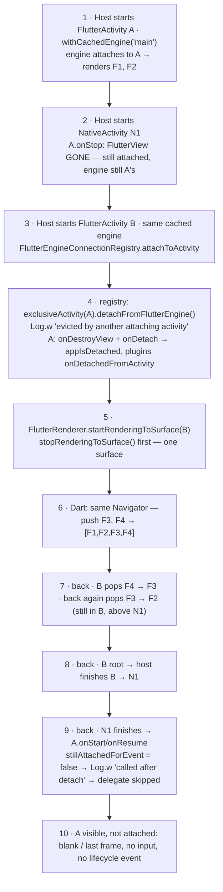
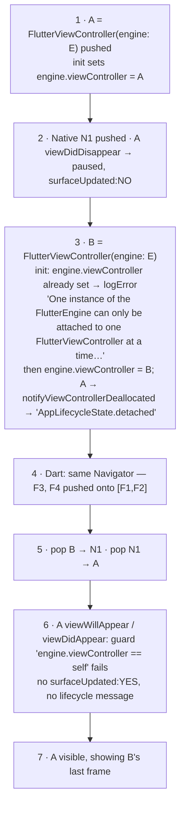
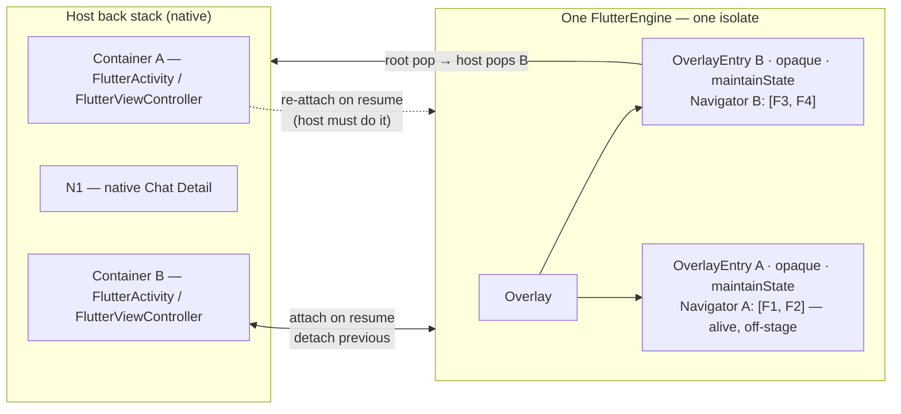
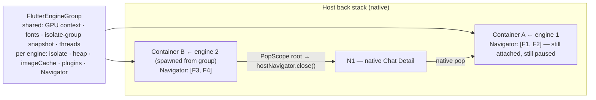
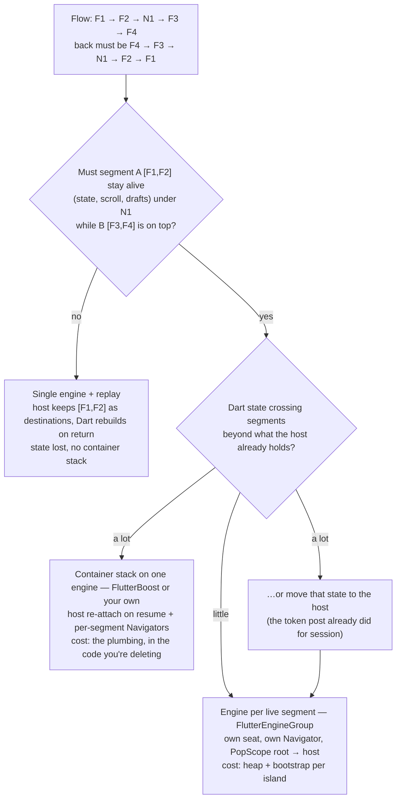

# Content Skeleton — "One Flutter Engine or Two? What Really Happens When Native Sits Between Two Flutter Screens"

Writing contract for Phase 2. Sources pinned: flutter/flutter `4abfc5dcd07da2046780aa29d35837076932ef7f` (master, 2026-08-16), alibaba/flutter_boost `6df80cc1ea425cde1bac7d0265407977221061df` (main, last commit 2024-10-14). Permalink bases:
- `FF = https://github.com/flutter/flutter/blob/4abfc5dcd07da2046780aa29d35837076932ef7f/engine/src/flutter/shell/platform`
- `FB = https://github.com/alibaba/flutter_boost/blob/6df80cc1ea425cde1bac7d0265407977221061df`

Diagram decision: site dark-mode CSS covers flowchart class names only (`src/styles/typography.css` comment) → **no `sequenceDiagram`**; timelines drawn as `flowchart TB` with one node per step, layer named in the label. Zero ms/MB anywhere.

## 0. Thesis + close

**TIP (draft):** On both platforms a `FlutterEngine` attaches to exactly one container at a time. So "one cached engine for both Flutter segments" is not the cheap default — it is the FlutterBoost architecture: the host re-attaches the engine on every resume and Dart keeps a stack of per-segment `Navigator`s alive off-stage. Two engines from a `FlutterEngineGroup` buy back exactly those two things and charge an isolate boundary and a second bootstrap. Choose by whether a Flutter segment must stay alive under a native screen, and by how much Dart state crosses segments — not by how many features you have.

**Close (draft):** "Single engine or engine group?" was the wrong axis. The two facts that decide it are older and duller: an engine has one seat, and a segment needs its own Navigator. Once you accept both, "single engine" means "I will write the container stack myself," and "engine group" means "I will pay for the second bootstrap." We chose to pay, on two conditions, and we'll publish the number that either confirms it or sends us back to this post.

## 1. Section map (11)

| # | H2 | Purpose | Anchor claims (URL) | Words |
|---|---|---|---|---|
| 1 | (hook, no H2) | The flow, back ×4; where #4 stopped ("S1 vs S2 open; one cached engine looked cheap"); promise: mechanism now, numbers in the benchmark post | #4 post link; docs multiple-flutters "hybrid mixture of native -> Flutter -> native -> Flutter" | 250 |
| 2 | The Reflex Answer: One Cached Engine, Two Containers | Five lines per platform; why it *seems* fine (Dart state outlives a container — docs iOS "Your Flutter and Dart state will outlive one FlutterViewController"; Android "cached FlutterEngine outlives any FlutterActivity or FlutterFragment that displays it") | docs add-to-app android/add-flutter-screen; ios/add-flutter-screen | 250 |
| 3 | Reveal 1: The Engine Has One Seat | Eviction + no re-attach, both OS, from source; timeline diagrams; the docs sentence that hints without warning | `FF/android/.../ExclusiveAppComponent.java#L8-L14`; `FlutterEngineConnectionRegistry.java#L316-L327`; `FlutterActivity.java#L898-L909`, `#L1516-L1526`; `FlutterFragment.java#L1203`; `FlutterRenderer.java#L1142-L1150`; `FlutterActivityAndFragmentDelegate.java#L671-L690`, `#L772-L821`; `FF/darwin/ios/framework/Headers/FlutterEngine.h#L311-L327`; `Source/FlutterViewController.mm#L190-L204`, `#L823-L862`; `Source/FlutterEngine.mm#L558-L570`; docs android quote "set up a method channel and explicitly instruct their Dart code to change Navigator routes" | 700 |
| 4 | Reveal 2: Even Re-attached, the Navigator Is Wrong | `[F1,F2,F3,F4]`; back shows F2 above N1; segments = stack of Navigators; FlutterBoost source as the price list; honest refinement of #4's S1 row | `FB/lib/src/flutter_boost_app.dart#L63`, `#L156-L172`; `FB/lib/src/container_overlay.dart#L28-L34`; `FB/lib/src/boost_container.dart#L16-L48`, `#L155`; `FB/android/.../FlutterBoostActivity.java#L79-L86`, `#L88-L90`, `#L114-L145`, `#L180-L192`, `#L215-L226`; `FB/ios/Classes/container/FBFlutterViewContainer.m#L246-L262`, `#L285-L307`; flutter_boost#1871 | 750 |
| 5 | Reveal 3: What Two Engines Buy, and What They Cost | Group shares / per-engine list; "~180 kB static only"; rule *one engine per live segment*; `PopScope` root unchanged; registry sketch; issue table | docs multiple-flutters; Flutter 2.0 release notes; `FF/darwin/ios/framework/Headers/FlutterEngineGroup.h#L45-L47`; api javadoc FlutterEngineGroup; #115533, #72033, #78590, #122364, #79335, #159718, #156802, #165372, #162074; samples multiple_flutters | 650 |
| 6 | Four Ways to Hold Two Segments | Options table + readings; PlatformView caveats | docs platform-views (android/ios); #144499, #148662; #64616 (swipe) | 350 |
| 7 | The Decision, and Ours | Decision tree + verdict S2 with two conditions; when we'd switch | #115533 (state), #4 criteria | 350 |
| 8 | What's Still Undecided for Us | numbers/threshold; iOS swipe-back inside islands; PlatformView inside islands + group (#165372); nested Navigator + system back "still rough" (#145159); pool policy | #145159, #165372, #64616 | 150 |
| 9 | Frequently Asked Questions | 5 (see §7 below) | per FAQ | 350 |
| 10 | Where the Original Question Went Wrong | one seat per engine + one Navigator per segment; ladder mermaid optional (short) | — | 200 |
| 11 | (footer + References) | Next in series: data-layer (#6); numbers → benchmark post. References grouped | brainstorm §9 | — |

Target 3,000–3,600 words.

## 2. Artifact 1 — eviction timelines (flowchart fallback)

### Android



Reading (draft): steps 3–4 are the eviction (`ExclusiveAppComponent`, `FlutterEngineConnectionRegistry.attachToActivity`, `FlutterActivity.detachFromFlutterEngine`); step 5 the one-surface rule (`FlutterRenderer`); step 6–7 the Navigator being wrong even before eviction matters; step 9 the missing re-attach (`stillAttachedForEvent`); `FlutterFragment` identical (`#L1203`). Note: step 6 shows N1 vanishing from history — Reveal 2 picks that up.

### iOS



Reading (draft): `FlutterEngine.h` "A FlutterEngine can only have one FlutterViewController at a time…"; `initWithEngine:` error string; every lifecycle method in `FlutterViewController.mm` (`viewWillAppear`, `viewDidAppear`, `viewWillDisappear`, `viewDidDisappear`) starts with `if (self.engine.viewController == self)`. The symptom FlutterBoost's own iOS comment names (§4 below): "on swipe-back the previous page shows the same content as the top page".

## 3. Artifact 2 — two topologies

### (a) Single engine done right = container stack (S1, refined)



Reading: host owns the stack; **one** engine; the host re-attaches it to whichever Flutter container resumes; Dart keeps one Navigator per container as an opaque, state-keeping OverlayEntry — the entry below is not painted but not disposed. This is `FlutterBoostApp` (`_containers`, `Overlay`), `ContainerOverlayEntry(opaque: true, maintainState: true)`, `BoostContainer` (`GlobalKey<NavigatorState>`, `NavigatorExt`). Post #4 called S1 "flattened, one route per container" — that is the degenerate case; the general one is one Navigator per segment.

### (b) One engine per live segment (S2)



Reading: nothing re-attaches because nothing was evicted; each engine keeps its seat; back at an island root is the `PopScope` from #4; the host's only new job is a segment→engine registry (spawn on open, destroy on close, one spare warm).

## 4. Artifact 3 — decision tree (replaces the ChatGPT tree)



Annotation: our position = `yes` (Member List keeps scroll + selection) → `little` (host holds session/device/env; features self-fetch) → **S2**, conditions below.

## 5. Tables

### (i) Four ways to hold two segments

| | (a) One engine, container stack | (b) Engine per live segment | (c) One engine + replay | (d) N1 as PlatformView (S3′) |
|---|---|---|---|---|
| Eviction | must neutralise + re-attach on resume | none | must (finish A, relaunch A′) | n/a — one container |
| Navigator model | stack of Navigators, off-stage kept | one root Navigator per engine | one, rebuilt from destinations | one, N1 is a route |
| Segment A state | kept | kept | lost | kept |
| Plumbing we own | most; lives in Flutter (being deleted) | registry + `PopScope` root (exists) | medium | PlatformView wrappers |
| Shared Dart state | free | via host (#115533) | free | free |
| Known rough edges | Boost #1871, memory #669/#1457; predictive back gap | #122364 #79335 #165372 #156802 | few | #144499 #148662; docs "avoid if possible" |
| Fit for shrinking Flutter | poor | **good** | ok for leaf segments | poor — inverts direction |

### (ii) What you must write

| Concern | Single engine, container stack | Engine per live segment |
|---|---|---|
| Eviction | override `detachFromFlutterEngine` to no-op (Android); `setViewController:self` in `viewWillAppear` (iOS) | nothing |
| Re-attach on resume | `attachToActivity` + `flutterView.attachToFlutterEngine` (Boost `performAttach`) | nothing |
| Lifecycle dispatch | take over (`shouldDispatchAppLifecycleState=false`) | engine does it per container |
| Black frame on transition | Boost: reflection into `FlutterRenderer.isDisplayingFlutterUi`; iOS `surfaceUpdated` ordering | first frame of a fresh island — measure |
| Plugins | re-bind `ActivityAware` on each attach | register per engine (#78590) |
| Dart | container manager + Overlay + per-segment Navigator + host↔Dart container messages | `PopScope` root (from #4) |
| Host | container id ↔ Dart segment mapping | segment id ↔ engine registry, spawn/destroy, one spare |
| Already exists from #4 | `HostRouter`, `AppDestination`, `AppNavigator.open/close` | same |

### (iii) What two engines cost — facts with URLs, no numbers

| Fact | Source |
|---|---|
| Separate isolate per engine → no shared Dart singletons | docs multiple-flutters; #115533 |
| `imageCache` per engine, no sharing | #72033 (open) |
| Plugins must be registered per engine | #78590 |
| "~180 kB per instance" is engine static allocation, not your heap | Flutter 2.0 release notes / multiple-flutters page |
| Group shares GPU context, fonts, isolate-group snapshot, thread pool | multiple-flutters page; `FlutterEngineGroup.h#L45-L47` |
| Group isolates observed on the same thread | #162074 |
| Android SIGSEGV spawn → detach → spawn | #122364 (P2) |
| iOS crash with multiple engines | #79335 |
| iOS freeze after platform view + group | #159718 |
| iOS memory well above the documented figure reported | #156802 |
| Group + PlatformView blank when switching engines | #165372 |
| `main()` bootstrap runs per island — where first-frame goes | author; measurement recipe: Android `FlutterUiDisplayListener` / iOS `setFlutterViewDidRenderCallback:` (name only) |

## 6. Code sketches

Reflex answer:
```kotlin
// Both containers, same cached engine — looks fine, fails on the second back
startActivity(FlutterActivity.withCachedEngine("main").build(this))          // A
// … native Chat Detail …
startActivity(FlutterActivity.withCachedEngine("main").build(this))          // B
```
```swift
let a = FlutterViewController(engine: engine, nibName: nil, bundle: nil)     // A
// … native Chat Detail …
let b = FlutterViewController(engine: engine, nibName: nil, bundle: nil)     // B — logs the "one at a time" error
```

FlutterBoost excerpts (≤4): Java `detachFromFlutterEngine()` no-op with its TODO comment (`#L79-L86`); `performAttach()` (`#L180-L192`); `setIsFlutterUiDisplayed` reflection with "Fix black screen when activity transition" + `Log.e("You *should* keep fields in …FlutterRenderer.")` (`#L215-L226`); Dart `ContainerOverlayEntry(... opaque: true, maintainState: true)` (`container_overlay.dart#L28-L34`). iOS one-liner: `if (ENGINE.viewController != self) ENGINE.viewController = self;` in `viewWillAppear`/`viewDidAppear` (`FBFlutterViewContainer.m#L246-L250`, `#L285-L299`) + translated comment at `#L303`: "update only after show, otherwise it flickers; or on swipe-back the previous page shows the same content as the top page".

`PopScope` root — verbatim from #4.

Registry sketch (≤15 lines each):
```kotlin
object FlutterSegments {                                     // host-side, Application scope
  private val group by lazy { FlutterEngineGroup(app) }
  private var spare: FlutterEngine? = null
  fun open(segmentId: String, initialRoute: String): FlutterEngine {
    val e = spare ?: group.createAndRunEngine(app, DartEntrypoint.createDefault(), initialRoute)
    spare = null
    FlutterEngineCache.getInstance().put(segmentId, e)      // FlutterActivity.withCachedEngine(segmentId)
    prewarm(); return e
  }
  fun close(segmentId: String) { FlutterEngineCache.getInstance().remove(segmentId)?.destroy() }
  private fun prewarm() { spare = group.createAndRunEngine(app, DartEntrypoint.createDefault()) }
}
```
```swift
final class FlutterSegments {                                // host-side singleton
  private let group = FlutterEngineGroup(name: "segments", project: nil)
  private var live: [String: FlutterEngine] = [:]
  private var spare: FlutterEngine?
  func open(_ id: String, initialRoute: String) -> FlutterViewController {
    let e = spare ?? group.makeEngine(withEntrypoint: nil, libraryURI: nil, initialRoute: initialRoute)
    spare = nil; live[id] = e; prewarm()
    return FlutterViewController(engine: e, nibName: nil, bundle: nil)
  }
  func close(_ id: String) { live[id]?.viewController = nil; live[id] = nil }
  private func prewarm() { spare = group.makeEngine(withEntrypoint: nil, libraryURI: nil) }
}
```
(Caveat in text: `initialRoute` on a spare engine — a pre-warmed engine already ran `main()`, so route it via `pushRoute`/our `HostRouter` instead of `initialRoute`; say so.)

## 7. FAQ (5)

1. **Why not just adopt FlutterBoost, then?** It *is* option (a), production-tested. Two reasons we don't: it puts the container stack in the Dart side we're deleting (post #4's argument), and its Android side reaches into engine private fields to hide the black frame — you inherit that coupling with every Flutter upgrade. Fine when Flutter is what you're growing; wrong dependency direction for us. (`FlutterBoostActivity.java#L215-L226`)
2. **Can I keep one engine and call `attachToActivity` / `setViewController` myself?** Yes — that is exactly Boost's `performAttach` / `attatchFlutterEngine`. Then you still need the segment stack in Dart, or back shows F2 above N1. (`#L180-L192`, `FBFlutterViewContainer.m#L246-L250`)
3. **Does the group need engine A alive for engine B?** No; shared resources persist while any engine lives. What A's survival buys you is [F1,F2]'s state — the thing the whole flow is about. (docs multiple-flutters)
4. **How many engines is too many?** One per live segment on the host stack, plus one spare; F→N→F→N→F needs three. Docs give no maximum; your device's memory does — measure with the recipe named above. (multiple-flutters; #72033 image cache)
5. **Are tabs segments?** After the root swap a Flutter tab is a segment like any other; before it, tabs are plain routes in the shell (as #4 said). cult.fit ran one engine per tab. (#4 FAQ; cult.fit link)

## 8. Post #4 touch list

- Footer `_Next in this series: …_` → prepend: `_First, the engine question this post left open: [One Flutter Engine or Two? …](/posts/one-flutter-engine-or-two-native-between-flutter-screens/) — why one cached engine cannot serve two Flutter segments with native in between, and what two engines cost._` then keep the data-layer sentence verbatim.
- "What's Still Broken or Undecided" bullet **S1 vs S2 is not decided** → append one clause: "(decided in [the engine post](/posts/…): S2, on two conditions stated there)". Nothing else changes.

## 9. Gap check / rules

- Every claim above has a URL or is marked author. No ms/MB. `sequenceDiagram` not used (dark-mode CSS covers flowcharts only) — timelines are `flowchart TB`.
- Quotes verified 2026-08-16 against the pinned SHAs above; Phase 3 re-opens each permalink.
- Boost main still `WillPopScope` at the pinned SHA (`flutter_boost_app.dart#L156`) — say "at the pinned commit".
- #103028 closed invalid → do not cite as a bug; #145159 open P2 → "still rough".
