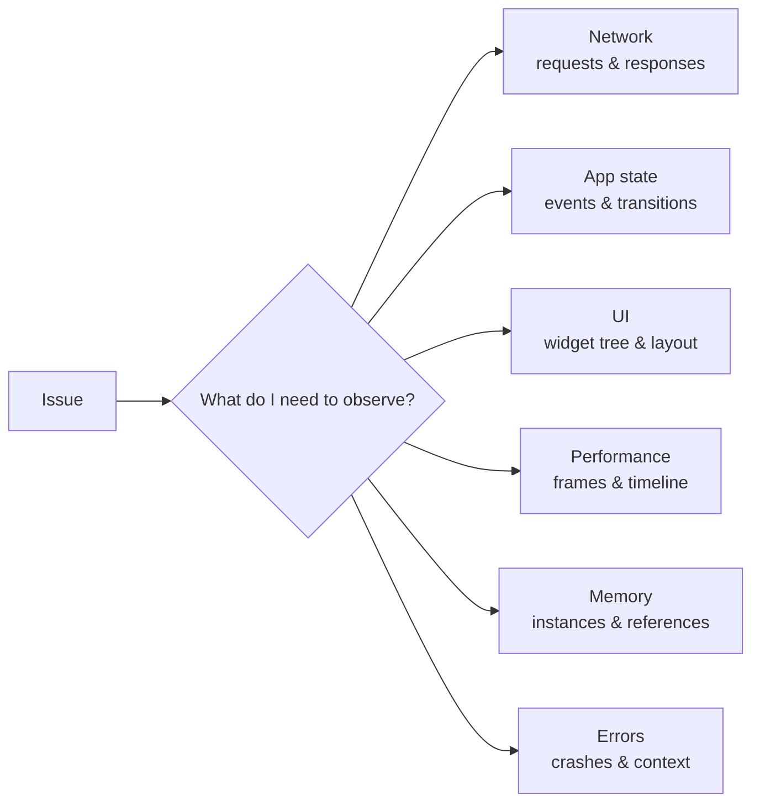
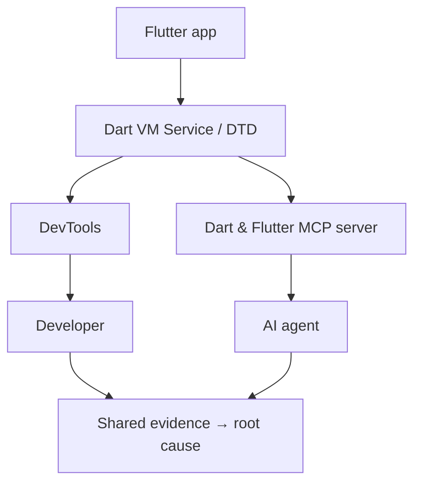
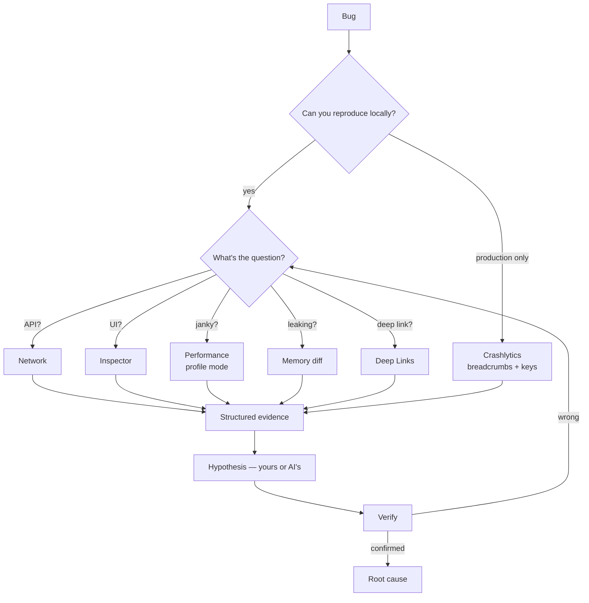

# Content Skeleton — "Still Debugging Flutter With print()?"

Slug `still-debugging-flutter-with-print` · series `mobile-debugging` #1 · articleType `big-question` · tags `mobile-debugging, flutter, debugging, devtools`
All citations verified 2026-08-27. Images downloaded to `src/assets/images/` and visually checked.

## Citation map (final URLs)

| # | Claim | Source |
| --- | --- | --- |
| C1 | Network view records HTTP/HTTPS/WebSocket from `dart:io`, plus `dio`, `cupertino_http`, `cronet_http`, `ok_http`, anything via `http_profile` | https://docs.flutter.dev/tools/devtools/network |
| C2 | Filter keys `method`/`m`, `status`/`s`, `type`/`t`; examples `my-endpoint m:get t:json s:200`, `https s:404` | https://docs.flutter.dev/tools/devtools/network |
| C3 | Startup traffic: `flutter run --start-paused` (or `dart run --pause-isolates-on-start --observe`), open Network, resume | https://docs.flutter.dev/tools/devtools/network |
| C4 | Inspector: select widget mode, guidelines, highlight repaints, slow animations (`timeDilation = 5.0`), oversized images; debug msg "dash.png has a display size of 213×392 but a decode size of 2130×392"; fixes `RepaintBoundary`, `cacheWidth`/`cacheHeight` | https://docs.flutter.dev/tools/devtools/inspector |
| C5 | Frames chart: UI + raster bars per frame, red = janky (over budget); frame analysis hints; profile-mode warning (quote: "Frame rendering times aren't indicative of release performance when running in debug mode", paraphrase-safe) | https://docs.flutter.dev/tools/devtools/performance |
| C6 | Timeline events: framework events, HTTP, GC + custom events via `dart:developer` `Timeline`/`TimelineTask` | https://docs.flutter.dev/tools/devtools/performance |
| C7 | Memory view: Profile / Diff snapshots / Trace instances; retaining path; shallow vs retained size | https://docs.flutter.dev/tools/devtools/memory |
| C8 | Logging view aggregates Dart runtime (GC), framework events, stdout/stderr, app-level logs | https://docs.flutter.dev/tools/devtools/logging |
| C9 | Deep Links validator: Android + iOS (iOS as of Flutter 3.27); checks website config + manifest/app config; import project, get fix instructions | https://docs.flutter.dev/tools/devtools/deep-links |
| C10 | MCP server: official, experimental ("likely to evolve quickly"), Dart 3.9+, `dart mcp-server`; analyze/fix errors, resolve symbols, pub.dev search, pubspec deps, introspect + interact with running app (screenshot/tap/text/scroll), hot reload, run tests, format; clients: Claude Code (official Flutter plugin), Cursor, Gemini CLI/Code Assist, Copilot (Dart Code ≥3.116), Codex CLI, Antigravity, OpenCode | https://docs.flutter.dev/ai/mcp-server |
| C11 | DevTools extensions: a package can ship its own DevTools tab, auto-shown when the app depends on it; docs name `provider` and `shared_preferences` (do NOT claim drift/patrol unless re-verified at draft time) | https://docs.flutter.dev/tools/devtools/extensions |
| C12 | Crashlytics custom keys: `FirebaseCrashlytics.instance.setCustomKey('str_key', 'hello')`; max 64 pairs, 1 kB each | https://firebase.google.com/docs/crashlytics/flutter/customize-crash-reports |
| C13 | Crashlytics logs: `FirebaseCrashlytics.instance.log(...)`; 64 kB/session, oldest dropped | https://firebase.google.com/docs/crashlytics/flutter/customize-crash-reports |
| C14 | Breadcrumbs: automatic screen_view + custom Analytics events before crash/non-fatal/ANR; REQUIRE Google Analytics enabled + Analytics SDK | https://firebase.google.com/docs/crashlytics/flutter/customize-crash-reports |
| C15 | Community: "most developers barely scratch the surface of Flutter's Dart DevTools" — Nikhith Sunil, Level Up Coding, Jul 2025 | https://levelup.gitconnected.com/7-dart-devtools-features-every-flutter-developer-should-use-daily-22659e04230d |
| C16 | Community: MCP kills the copy-the-DTD-URI ritual — Marius Bughiu, startdebugging.net, 2026-05-28 | https://startdebugging.net/2026/05/dart-flutter-mcp-server-claude-code-cursor/ |
| C17 | `riverpod_devtools` v1.1.2 (community, unverified uploader, NOT official): live provider state, dependency graph, event log + drive state via optional bundled MCP server | https://pub.dev/packages/riverpod_devtools (verified 2026-08-27) |
| C18 | Screenshot licenses: flutter.dev CC BY 4.0; Firebase docs CC BY 4.0 (no usable screenshots on Crashlytics page → §8 text-only) | site footers, verified |

Internal links: performance BQ post `/posts/is-the-framework-really-why-your-app-is-slow` (§5); scroll-jank post `/posts/i-made-messages-load-fast-so-why-does-scrolling-still-stutter` (§5, frame pipeline depth); e2ee opener `/posts/how-do-messengers-really-encrypt-your-messages` (§ event-schema example vocabulary, optional).

## Images (all in `src/assets/images/`, checked)

| File | § | Draft caption (what you see + what it replaces) |
| --- | --- | --- |
| `flutter-devtools-network-view.png` | 3 | Every request as a row — method, status, duration — with headers, body and a timing waterfall one click away. This screen replaces every `print("RESPONSE $data")` you've ever written. |
| `flutter-devtools-network-filter.png` | 3 | The filter dialog documents its own query language: `method:get status:404`, negations included. You query traffic instead of scrolling for it. |
| `flutter-devtools-inspector.png` | 4 | Select a widget on the device, land on its node: layout diagram with real constraints, every property, and why it has that padding. Nobody reads a 40-level tree by eye. |
| `flutter-devtools-repaint-rainbow-before.webp` + `-after.webp` | 4 | Highlight-repaints, before/after: whole screen repainting for one spinner vs. only the spinner after a `RepaintBoundary`. The tool shows the repaint; you stop guessing. |
| `flutter-devtools-oversized-image.png` | 4 | Highlight Oversized Images inverts and flips any image decoded far larger than displayed — memory waste you can literally see. |
| `flutter-devtools-frames-chart.png` | 5 | The frames chart: blue frames within budget, red jank bars, average FPS in the corner. "It feels janky" becomes "frames 92–96 blew the budget". |
| `flutter-devtools-timeline-events.png` | 5 | Timeline Events: per-thread trace of what each frame actually spent time on — compositing, tree finalization, your own `Timeline` events. |
| `flutter-devtools-memory-diff.png` | 6 | Diff Snapshots: 2,763 new instances, 307 released — and the shortest retaining path naming exactly who still holds them. `print("dispose")` cannot answer this. |
| `flutter-devtools-deep-link-validator.png` | 7 | Deep Link Validator: "10 domains not verified", per-domain status, a Fix button — the assetlinks/manifest spelunking session you didn't have. |

Footer attribution: "DevTools screenshots from the official [Flutter documentation](https://docs.flutter.dev/tools/devtools), © Flutter authors, [CC BY 4.0](https://creativecommons.org/licenses/by/4.0/)."

## Sections

**1. Hook (no heading) + thesis.** Years of mobile work; the loop `bug → Logcat → search → add print → rebuild → guess`. Chat-screen example: 5 APIs interleaved with Bloc/Firebase/analytics noise; miss one request by scrolling. Then TIP thesis: *Debugging is an evidence problem. Logs are one evidence source, but we use them for every question — and every question has a tool that answers it better. The gap matters double now that AI reads your evidence too.* C15 supports "most devs underuse". `## Table of contents` after hook.

**2. A tool for every question.** The draft's ladder ("API called? → search log. Request body? → search log. Why rebuild? → add print()") as `text` block. Then the question→tool table (API called / request-response / websocket / which widget / why janky / what leaks / app events / deep link / prod-only crash → Network / Network / Network / Inspector / Performance / Memory / Logging / Deep Links / Crashlytics). Mermaid flowchart A (observe axes). Log demoted to "one data source". `dart devtools` or IDE embedding — the point is information density, not the browser.



**3. Network: stop print(response).** Chat-open example request list. C1 capture scope (incl. Dio — the "but I use Dio" objection dies here), C2 filters, image ×2. The searching-vs-querying contrast. Sub-trick: startup APIs finish before DevTools opens → C3 `--start-paused` recipe as 5-line text block.

**4. UI: Inspector before reading trees by eye.** RenderFlex-overflow / mystery-padding opener. Select widget mode + properties (image). Visual toggles: guidelines, repaint rainbow (image pair, C4 + `RepaintBoundary`), oversized images (image, C4 exact debug message + `cacheWidth/cacheHeight` fix), slow animations `timeDilation`.

**5. Jank: measure first, optimize second.** The draft's guess-cascade (`try const → add RepaintBoundary → cache → "Flutter is slow"`) as text block. Frames chart image; frame → timeline → what consumed the time (timeline image, C5, C6 incl. custom Timeline events). Profile-mode rule (C5) — debug numbers lie; link both performance posts. Principle line: measure first, optimize second.

**6. Memory: log can't answer liveness.** Screen opened/closed 20×, memory climbs; `print("dispose")` proves dispose ran, not that objects died. The four questions (still alive? who holds it? how many? survives GC?). Snapshot A → flow → GC → snapshot B → diff → retaining path (C7, image). Mental-model shift block.

**7. Deep links have their own debugger.** The layer-too-low stack (`adb shell → logcat → AndroidManifest → assetlinks.json → Info.plist`) as text block. Validator: website config + manifest, Android + iOS since 3.27 (C9, image). Principle: find the failing layer first, then dig.

**8. Production: evidence you can't attach a debugger to.** Local vs production split. Crashlytics-only (author decision): `setCustomKey` (C12), `log` (C13) code block; breadcrumbs = automatic screen_view + custom events, requires Analytics SDK (C14 — say it, it's a real setup gotcha). Stack trace answers "where it died"; breadcrumbs + keys answer "what happened before". Draft's user-journey text block (opened thread → pressed send → e2ee route → session failed → exception). Name Sentry once as alternative, no guide. Text-only section (C18).

**9. The AI angle: structured evidence beats log dumps.** Draft's strongest move, merged from its §4+§10+§11: 2,000 Logcat lines force AI to reconstruct what the app already knew; token budget spent on noise-filtering, not reasoning. Before/after evidence block (raw log spam vs request+status+state+last-events). Structured event schema (original artifact b, author's real send flow):

```text
event=message_send_failed
thread_id=123  message_id=456
route=e2ee  stage=encrypt
reason=session_missing  attempt=2
```

Then MCP: official server, C10 capability list, one-line setup `dart mcp-server`, experimental caveat verbatim; C16 quote (the DTD-URI ritual). Extensions ecosystem C11 (+C17 riverpod_devtools labeled community). Mermaid flowchart B:



**10. The checklist + where this series goes.** Decision flowchart (original artifact a):



Q&A checklist (compact list, from draft §14). Log/breakpoints get their turn only after tools answered the cheap questions. Closer: the fast-vs-slow debugger gap = who gets the right evidence faster; AI raises the stakes. Series roadmap teaser: Android toolbox, iOS toolbox, production observability, AI-native debugging. Footer attribution line.

## Meta description candidates (140-160 chars, pick at draft)

1. "Network, Inspector, Performance, Memory, Deep Links, Crashlytics, MCP: the Flutter debugging toolbox that replaces log-grepping with real evidence." (149)
2. "Why print()-debugging wastes your time in Flutter — and the official tools (DevTools, Crashlytics, MCP server) that answer each question better." (145)
