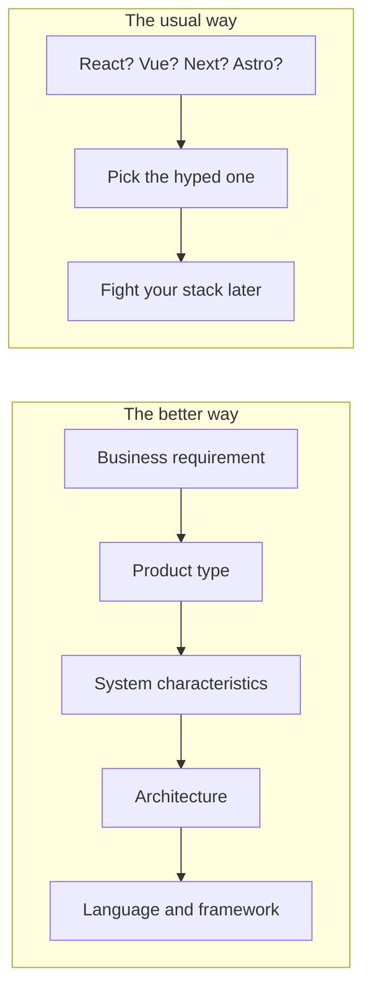
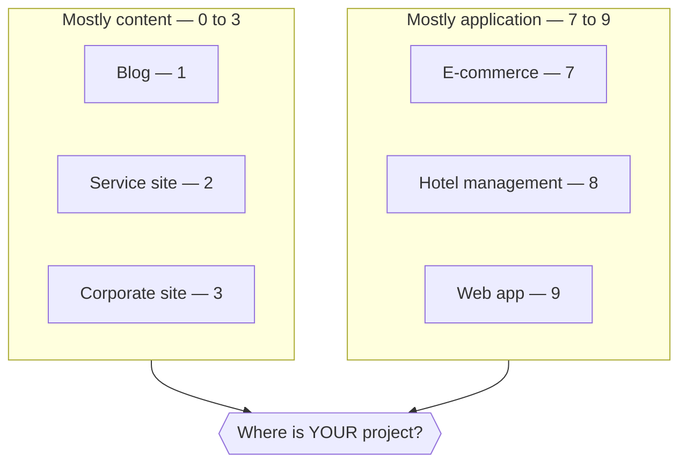
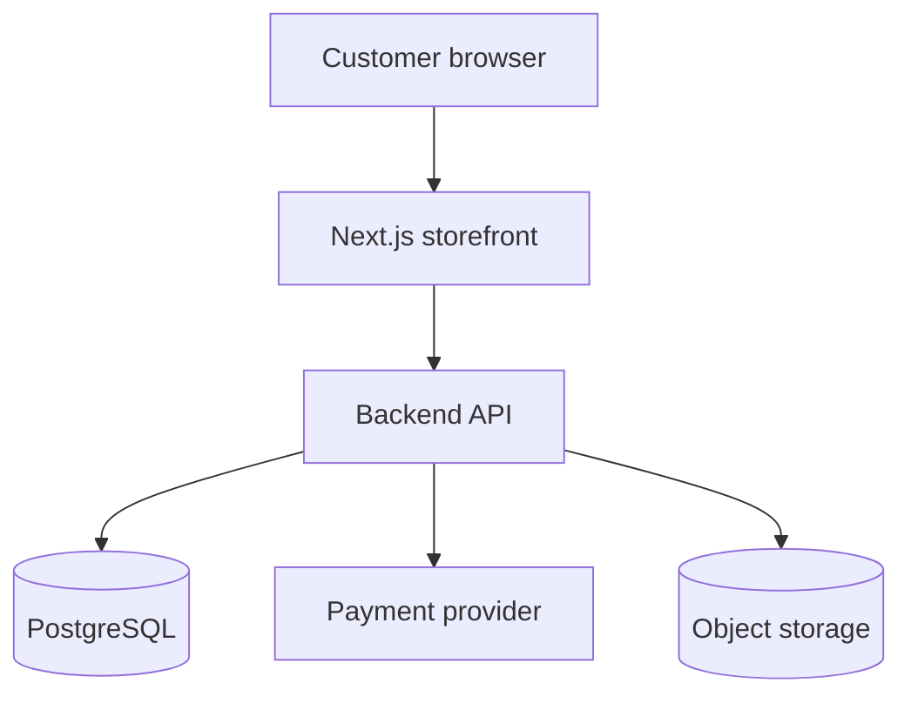
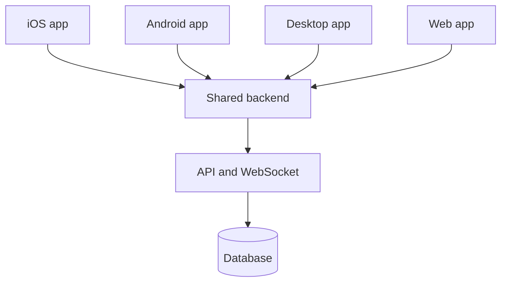
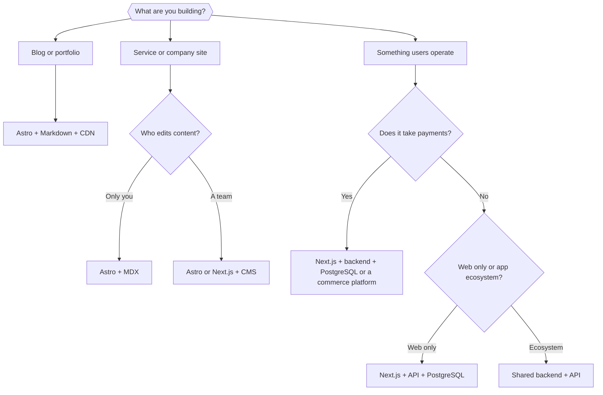

You have an idea. You want a website. And the first question everyone asks is the wrong one: _"Should I learn React or Vue? Next.js or Astro?"_

Here is the whole article in one sentence:

> [!TIP]
> **Don't choose a framework first. Choose the system requirements first.** The framework is the _last_ decision, not the first.

The diagram above compares two paths: picking a framework because it is popular, versus deriving it step by step from what your product actually needs.

This post gives you that derivation as a reusable framework: 6 website types, 8 criteria, one decision matrix, and one decision tree. By the end, you can answer "what should I build my website with?" for almost any project — without asking Reddit.

## Table of contents

## "A Website" Is Not One Kind of Product

A personal blog and a hotel booking system both run in a browser. That is where the similarity ends. Calling both "a website" is like calling both a bicycle and a truck "a vehicle."

| Type                              | What it really is    | What matters most                              |
| --------------------------------- | -------------------- | ---------------------------------------------- |
| **Personal blog**                 | Publishing           | SEO, speed, pleasant reading                   |
| **Service / marketing site**      | Marketing            | Branding, landing pages, conversion            |
| **Corporate site with CMS**       | Content + workflow   | Admin panel, multiple writers, publishing flow |
| **Hotel management**              | Business application | Auth, CRUD, bookings, calendar, database       |
| **E-commerce**                    | Transaction system   | Cart, payment, inventory, orders               |
| **Web app (in an app ecosystem)** | Application          | State, auth, realtime, APIs, complex UI        |

Same browser. Completely different technical requirements. That is why "what's the best framework?" has no answer — but "what's the best framework _for a publishing product_?" does.

## The 8 Criteria That Actually Matter

Before touching any technology name, score your project against these eight questions.

### 1. Rendering model: do users read, or do they interact?

This is the first fork in the road.

| Profile               | Typical needs                                     | Typical tools                    |
| --------------------- | ------------------------------------------------- | -------------------------------- |
| **Content-heavy**     | Static generation, SSR/SSG, CDN, HTML-first       | Astro, Hugo, Eleventy, Next.js   |
| **Application-heavy** | Client-side state, SPA, hydration, APIs, realtime | React/Next.js, Vue/Nuxt, Angular |

If people mostly _read_ your pages, you barely need JavaScript in the browser. If they mostly _do things_ (drag, edit, buy), you need an application framework.

### 2. SEO: does Google bring your visitors?

If your traffic depends on search, SEO becomes a top-level requirement — fast pages, clean HTML, good metadata. A blog lives or dies by this. An internal hotel dashboard could rank nowhere on Google and nobody would care.

### 3. Content management: who writes the content?

| Who writes                   | What you need                                               |
| ---------------------------- | ----------------------------------------------------------- |
| Just you (a developer)       | Markdown files + Git. No database, no admin panel.          |
| A team / non-technical staff | Admin UI, logins, drafts, roles, media uploads — a real CMS |

When non-developers need to edit content, a CMS stops being a nice-to-have. Options range from WordPress to headless CMSs like Sanity, Strapi, Payload, or Directus.

### 4. Data complexity: how deep does your data go?

| Level                  | Data                                         | Examples                                      |
| ---------------------- | -------------------------------------------- | --------------------------------------------- |
| **0 — Static**         | HTML, CSS, Markdown                          | Portfolio, landing page, docs                 |
| **1 — Content**        | Posts, tags, authors, images                 | Blog, corporate site                          |
| **2 — Business data**  | Users, orders, bookings, inventory, payments | Hotel system, e-commerce                      |
| **3 — Realtime state** | Live updates, presence, collaboration        | Chat, collaborative editor, trading dashboard |

The rule is simple: every level up the ladder means more backend. Level 0–1 can live in files on a CDN. Level 2 needs a database and an API. Level 3 needs realtime infrastructure.

### 5. Interaction complexity: clicking links vs. running software

Compare what users actually _do_: on a blog they open, read, search. In a hotel system they drag bookings across a calendar, check guests in, take payments. The first is a document; the second is software that happens to run in a browser.

The diagram places the six website types on a 0–10 scale from pure content to pure application — and asks where your project sits.

### 6. Transaction criticality: what happens when a bug bites?

If a blog goes down, readers wait. If an e-commerce checkout has a bug, this happens:

| Step                | Result                               |
| ------------------- | ------------------------------------ |
| Customer pays       | Money leaves their account           |
| Order isn't created | You don't know they paid             |
| Inventory is wrong  | You oversell                         |
| Outcome             | Lost money, lost trust, refund chaos |

Payments, orders, and inventory demand database transactions, testing, and monitoring at a totally different level. **This — not "my site is big" — is what justifies heavier architecture.**

### 7. Scale: don't ask "does it scale?" — ask "scale _what_?"

| Dimension | From → To                 | What it stresses                         |
| --------- | ------------------------- | ---------------------------------------- |
| Traffic   | 1k → 10M visitors/day     | Caching, CDN, infrastructure             |
| Data      | 1k → 1B records           | Database design, queries                 |
| Team      | 1 → 50 developers         | Code structure, type safety, conventions |
| Business  | Side project → enterprise | Compliance, reliability, process         |

A framework that handles huge traffic beautifully may be painful for a 50-person team, and vice versa. Name the dimension before you optimize for it.

### 8. Team and ecosystem: the most practical criterion

If your team already knows React and TypeScript, choosing Next.js usually beats making everyone learn a new ecosystem because of a benchmark chart. Also weigh: hiring pool, library availability, documentation quality, community size, and long-term maintenance.

## The Decision Matrix

Score each website type against the criteria and the picture becomes obvious:

| Type             |  SEO  | Content | Interaction | Backend | Transactions | Realtime |
| ---------------- | :---: | :-----: | :---------: | :-----: | :----------: | :------: |
| Blog             | ★★★★★ |  ★★★★★  |      ★      |    ★    |      ★       |    ★     |
| Service site     | ★★★★★ |  ★★★★   |     ★★      |    ★    |      ★       |    ★     |
| Corporate + CMS  | ★★★★★ |  ★★★★★  |     ★★      |   ★★★   |      ★       |    ★     |
| Hotel management |   ★   |    ★    |    ★★★★★    |  ★★★★★  |     ★★★★     |   ★★★    |
| E-commerce       | ★★★★  |   ★★★   |    ★★★★★    |  ★★★★★  |    ★★★★★     |   ★★★    |
| Web app          |  ★★   |    ★    |    ★★★★★    |  ★★★★★  |    varies    |  varies  |

Read it row by row: the top three rows are content products; the bottom three are applications. Two different worlds — and two different families of tech stacks.

## Six Real Scenarios, Six Different Stacks

Now map each row of the matrix to actual technology.

### Case 1: "I want a personal blog to share what I know"

| Requirement               | Level |
| ------------------------- | ----- |
| Content, SEO, performance | HIGH  |
| Interaction, database     | LOW   |

**A good stack:** Astro + Markdown/MDX + TypeScript + Tailwind + Pagefind (search) + Cloudflare (hosting). Content lives in Git, builds to static HTML, costs almost nothing. This very blog runs on exactly this stack.

### Case 2: "I want a site that sells my services"

| Requirement                 | Level  |
| --------------------------- | ------ |
| SEO, performance, marketing | HIGH   |
| CMS                         | MEDIUM |
| Interaction                 | LOW    |

**A good stack:** Astro + MDX if you edit content yourself. Add a headless CMS the moment a marketing person needs to edit pages without you.

### Case 3: "My company needs a branded site the staff can update"

| Requirement               | Level       |
| ------------------------- | ----------- |
| SEO, branding, CMS, admin | HIGH        |
| Multi-user workflow       | MEDIUM–HIGH |

**A good stack:** Astro or Next.js on the front + a headless CMS (Sanity, Strapi, Payload…) + CDN. Key insight: **your framework does not have to provide the CMS.** Frontend, CMS, and database can be three separate, replaceable pieces.

### Case 4: "I want to manage my hotel: rooms, bookings, check-ins"

| Requirement                                    | Level |
| ---------------------------------------------- | ----- |
| CRUD, database, auth, calendar, business logic | HIGH  |
| SEO                                            | LOW   |

Stop thinking "I'm building a website." You are building **a business application that runs in a browser**. That mental switch changes everything.

**A good stack:** React/Next.js frontend → API layer → backend with real business logic → PostgreSQL.

### Case 5: "I want to sell clothes online: cart, payment, inventory"

| Requirement                | Level     |
| -------------------------- | --------- |
| SEO, UX, client state      | HIGH      |
| Payment, inventory, orders | VERY HIGH |

The diagram shows a typical e-commerce architecture: a Next.js storefront talking to a backend API, which owns the database, the payment provider, and file storage.

**A good stack:** the architecture above — or skip building it and use a commerce platform (Shopify and friends). Remember criterion 6: payment + inventory + orders is why this architecture is heavier, not vanity.

### Case 6: "My web app is part of a mobile + desktop ecosystem"

| Requirement                                            | Level |
| ------------------------------------------------------ | ----- |
| API design, auth, shared state, realtime, offline sync | HIGH  |
| SEO                                                    | LOW   |

The diagram shows an app-ecosystem architecture: four clients — iOS, Android, desktop, and web — all speaking to one shared backend over APIs and WebSockets.

Here the web frontend is just **one client among four**. The real decisions are API design, authentication, type sharing, and sync — the framework is a detail.

## The Decision Tree

All of the above, compressed into one flowchart:

The decision tree walks from "what are you building?" through content-vs-application and payment questions down to a concrete starting stack.

Treat the leaves as _defaults_, not laws. Swap Astro for Hugo, Next.js for Nuxt, PostgreSQL for MySQL — the _shape_ of the answer is what matters.

## Score Your Own Project

Rate your project 0–5 on each criterion:

| Criterion      | Your score (0–5) |
| -------------- | :--------------: |
| SEO            |                  |
| Content        |                  |
| Interactivity  |                  |
| Realtime       |                  |
| Database       |                  |
| Authentication |                  |
| Transactions   |                  |
| Performance    |                  |

Two worked examples:

| Criterion      |                    Blog-like project                     |                       App-like project                        |
| -------------- | :------------------------------------------------------: | :-----------------------------------------------------------: |
| SEO            |                            5                             |                               2                               |
| Content        |                            5                             |                               1                               |
| Interactivity  |                            1                             |                               5                               |
| Realtime       |                            0                             |                               4                               |
| Database       |                            1                             |                               5                               |
| Authentication |                            0                             |                               5                               |
| Transactions   |                            0                             |                               5                               |
| Performance    |                            5                             |                               4                               |
| **Verdict**    | **Content-oriented** → static-first stack (Astro family) | **Application-oriented** → app framework + backend + database |

If your scores cluster at the top of the table, build content-first. If they cluster at the bottom, build an application. If they split evenly — you may actually have _two_ products (say, a marketing site + an app) that deserve two stacks.

## Frequently Asked Questions

**Do I need to learn a backend language to build a website?**
Only if your project sits at data level 2 or higher. A blog, portfolio, or marketing site needs zero backend code — static files on a CDN are enough. A booking system or a store cannot avoid one.

**Is WordPress still a valid choice?**
Yes — for the corporate-CMS and service-site cases it remains the fastest path when a non-technical team owns the content. It loses to static-first stacks on performance and to custom backends on complex business logic.

**Can one framework really cover every case?**
Next.js comes closest: it can render a blog statically and power a full application. But "can" is not "should" — for a pure content site it carries more machinery than the job needs, and simpler tools ship faster.

**What about mobile? Should my website be an app instead?**
Reverse the question from case 6: if users mainly need quick access to content, a fast website wins. If they need offline use, push notifications, or daily engagement, plan an app ecosystem — and design the shared backend first.

**How do I choose a programming language, not just a framework?**
The language usually follows the architecture. Content-first stacks are JavaScript/TypeScript territory. Custom backends open the field: TypeScript (Node), Python (Django), PHP (Laravel), Go, or Java (Spring) — pick the one your team can maintain for years, using criterion 8.

## The Framework Outlives the Hype

Frameworks rise and fall. Requirements don't. Whatever is trending next year will still have to answer the same eight questions: How is it rendered? Who writes the content? How deep is the data? What breaks when a transaction fails?

So the next time someone asks _"React or Vue?"_, you know the honest answer: **wrong question — what are you building?**

Start from the requirement. Derive the architecture. Choose the stack last. That order is the entire secret.
