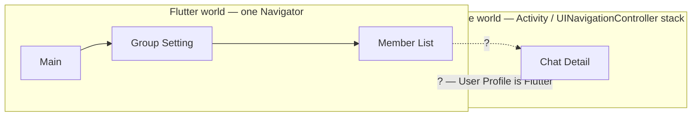
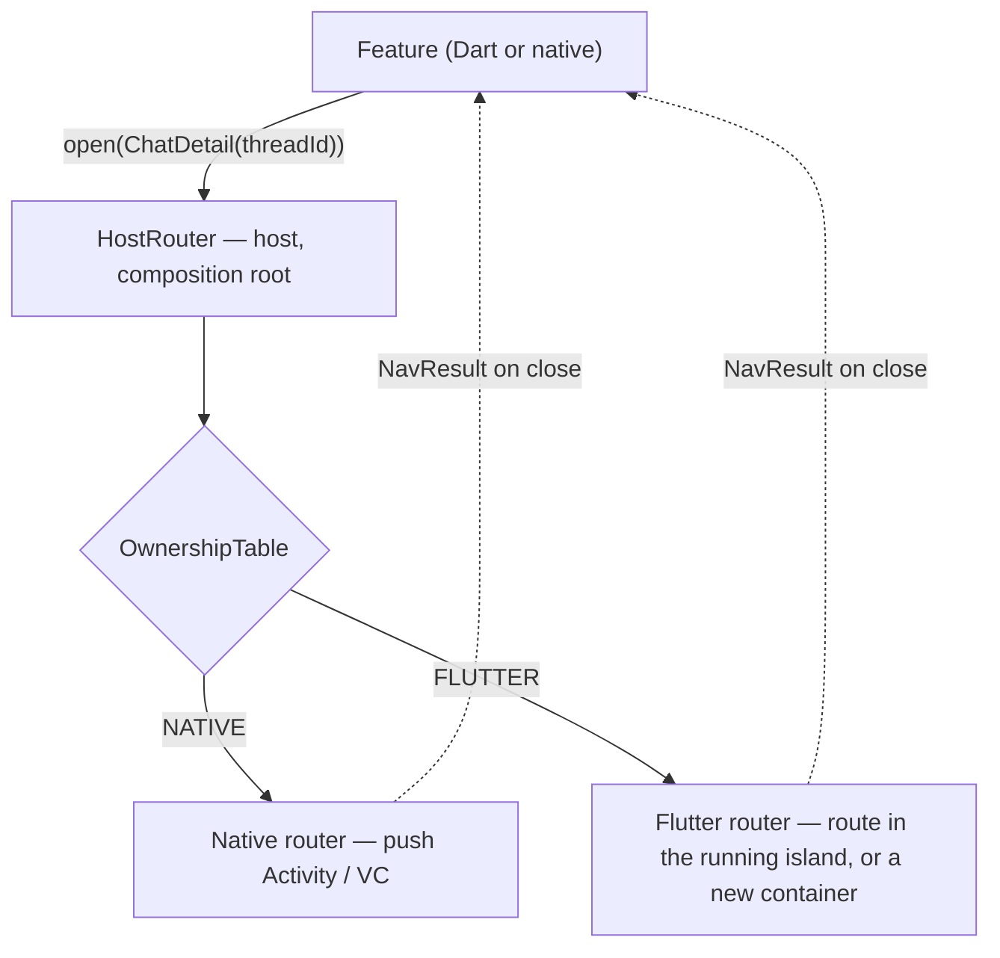
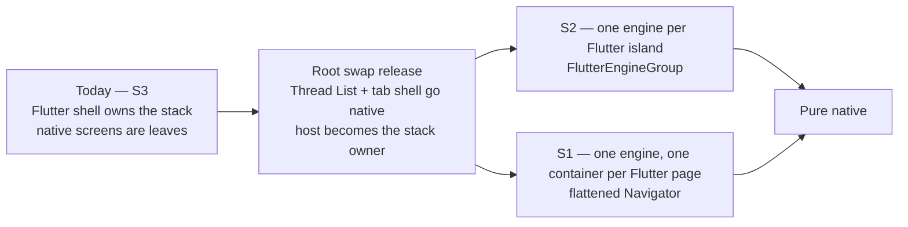
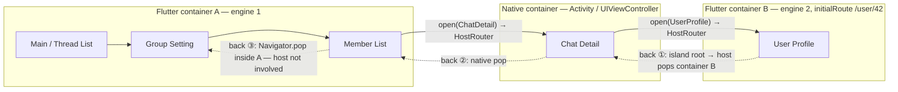
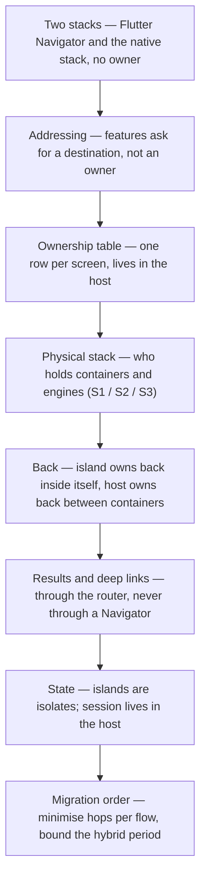

Same app as [the token post](/posts/how-does-a-flutter-module-get-a-token-from-the-native-host/): it started as almost entirely Flutter, and it is moving down to native — a native host, features split into packages, one team per package. We can't rewrite it in one release, so screens move one at a time. Chat Detail is the first to go native.

Here is a flow a user makes on an ordinary day. Open a group's settings, open its member list, tap a member, land in a chat with them, tap their avatar, look at their profile. Then press back three times.

```
Flutter Group Setting → Flutter Member List → NATIVE Chat Detail → Flutter User Profile
                                                                    ← back ← back ← back
```

The question everyone asked first was "how does Flutter open a native screen?" That one is five lines — a `MethodChannel`, or a typed [Pigeon](https://pub.dev/packages/pigeon) call, and the host pushes an Activity. It is not the question. The question is what happens on the third `back`, who decides that Chat Detail is native *this month*, and what every caller has to know to survive the month it stops being.

> [!TIP]
> **Features ask for a destination, never for "the native screen".** The host resolves who renders it, and the host owns the physical stack and the back between islands. And the number a migration order must minimise is **Flutter↔Native hops per user flow — not screens migrated**.

This post follows the same device as the token post: start from the reflex answer, take three turns that each show the previous answer was incomplete, and end with an invariant. It is a [Mobile Architecture](/series/mobile-architecture/) post about ownership, not a tutorial on `pushRoute`. Assumptions: the Flutter shell still owns the stack today; Chat Detail is going native; the platform team owns the contracts package. Where our design is still open, I say so instead of pretending.

## Table of contents

## Two Navigation Worlds, One Back Button

Flutter has one navigation stack: the `Navigator`, a widget that holds a list of routes. Native has another: Activities and Fragments behind a `NavController` on Android, `UINavigationController` (or a SwiftUI `NavigationStack`) on iOS. Each stack knows how to push, pop and animate its own screens. Neither knows the other exists.



The diagram is the whole problem in one picture: the Flutter world has a stack of three routes, the native world has a stack of one, and the two dotted arrows — Member List opening Chat Detail, Chat Detail opening a Flutter User Profile — are exactly where nobody is in charge. The moment a flow crosses that dotted line and comes back, the user has one back button and the app has two stacks.

None of this is new. [flutter/flutter#15559](https://github.com/flutter/flutter/issues/15559), "How to manage page stack in flutter/native hybrid App?", was opened on 2018-03-15 and describes precisely native → Flutter → Flutter → native → Flutter. The question is eight years old. What changed since is that Google now has an official answer, and three companies shipped libraries because the official answer wasn't enough for them. We'll get to both.

## The Easy Answer: `openNativeChatDetail`

Because Chat Detail is the screen that moved, the reflex is to make the caller say so:

```dart
// Member List — Dart, the reflex
await MethodChannel('app/nav')
    .invokeMethod('openNativeChatDetail', {'threadId': thread.id});
```

And from the other side, native Chat Detail opening a Flutter profile:

```swift
// Native Chat Detail — tap avatar
let vc = FlutterViewController(engine: engine, nibName: nil, bundle: nil)
vc.pushRoute("/user/\(userId)")
present(vc, animated: true)
```

Both work on day one. Both hard-code **the state of the migration** into the caller. `openNativeChatDetail` says: Chat Detail is native. `route: "/user/…"` says: User Profile is Flutter. Six months from now, when User Profile goes native, every native screen that ever presented a `FlutterViewController` for it has to change; and when Group Setting goes native, every Dart call site that pushed it with `Navigator.push` becomes a channel call. The migration plan is smeared across N call sites owned by N teams, and — this is the token post's argument again — the people fixing them are not the people who moved the screen.

Note what the problem is *not*: the channel. A method call per navigation costs nothing measurable. The problem is that the caller knows the owner.

## Reveal 1: Features Ask for a Destination, the Host Decides Who Renders It

The fix has the same shape as the token fix: the feature declares what it wants, in a contract it doesn't own the implementation of, and one place in the host resolves it.

A feature wants to go *somewhere*. Give that somewhere a type:

```dart
// packages/host_contracts/pigeons/navigation.dart   (platform team; Pigeon input)
import 'package:pigeon/pigeon.dart';

/// Where a feature wants to go. Says nothing about who renders it.
sealed class AppDestination {}
class ThreadList   extends AppDestination {}
class ChatDetail   extends AppDestination { ChatDetail(this.threadId, {this.messageId}); String threadId; String? messageId; }
class GroupSetting extends AppDestination { GroupSetting(this.threadId); String threadId; }
class MemberList   extends AppDestination { MemberList(this.threadId); String threadId; }
class UserProfile  extends AppDestination { UserProfile(this.userId); String userId; }

/// What a screen hands back when it closes. Also owner-agnostic.
class NavResult { NavResult(this.kind, this.payload); String kind; Map<String, Object?> payload; }

/// Feature → host. The only navigation API a feature is allowed to call.
@HostApi()
abstract class AppNavigator {
  @async NavResult? open(AppDestination destination);  // completes when the destination closes
  void close(NavResult? result);                       // "I'm done; whoever opened me gets this"
}
```

Pigeon generates the Kotlin and Swift mirrors of that hierarchy (on an older Pigeon an enum plus an args map does the same job — the point is the shape, not the codegen). It lives in `host_contracts`, the interfaces-only package from the token post, owned by the platform team. `ChatDetail(threadId)` says nothing about Activities, `FlutterViewController`s or routes. It says *where*.

The host implements `AppNavigator` once, at the composition root, and the implementation is a table lookup:

```kotlin
// Host Android — the only implementation of AppNavigator
class HostRouter(
    private val ownership: OwnershipTable,
    private val native: NativeRouter,        // Activity / NavController side
    private val flutter: FlutterIslandRouter // opens or reuses a Flutter container
) : AppNavigator {
    override fun open(destination: AppDestination, callback: (Result<NavResult?>) -> Unit) =
        when (ownership.ownerOf(destination)) {
            Owner.NATIVE  -> native.open(destination, callback)
            Owner.FLUTTER -> flutter.open(destination, callback)
        }
    override fun close(result: NavResult?) = topContainer().finishWith(result)
}

// The table. Migrating a screen = one row.
object OwnershipTable {
    fun ownerOf(d: AppDestination): Owner = when (d) {
        is ChatDetail -> Owner.NATIVE      // first screen to go native
        is ThreadList, is GroupSetting, is MemberList, is UserProfile -> Owner.FLUTTER
    }
}
```

```swift
// Host iOS — HostRouter.swift
final class HostRouter: AppNavigator {
    func open(destination: AppDestination, completion: @escaping (Result<NavResult?, Error>) -> Void) {
        switch ownership.owner(of: destination) {
        case .native:  native.open(destination, completion)   // push a UIViewController
        case .flutter: flutter.open(destination, completion)  // FlutterViewController on a new or running engine
        }
    }
    func close(result: NavResult?) { topContainer().finish(with: result) }  // pops the VC, completes the pending open()
}
```



Reading top to bottom: a feature — Dart or native, it doesn't matter — asks the host router to open a destination; the router consults the ownership table and hands the destination to the native router or the Flutter router; when the screen closes, its result comes back to the caller through the same path, not through either world's stack.

The payoff is the table over time. Callers don't appear in it, because callers don't change:

| Destination | Today | +6 months (plan) | +12 months (plan) | Caller code |
| --- | --- | --- | --- | --- |
| ThreadList (tab root) | Flutter | Flutter | Native (root swap) | unchanged |
| ChatDetail | Native (in progress) | Native | Native | unchanged |
| GroupSetting | Flutter | Native | Native | unchanged |
| MemberList | Flutter | Native | Native | unchanged |
| UserProfile | Flutter | Native | Native | unchanged |

The +6 and +12 columns are the shape of a plan, not something shipped — the middle column is the "chat surface first" checkpoint the hop table below argues for, and the last one is the root swap. What the table buys is that the plan can change without touching a feature: reorder two rows and no team outside the platform team notices.

None of this is original, and it's worth knowing whose shoulders it stands on. Android's own guidance for [navigation in multi-module projects](https://developer.android.com/guide/navigation/integrations/multi-module) is that feature modules never reference each other; the app module owns the graph and deep links are the public API. Airbnb's [DeepLinkDispatch](https://github.com/airbnb/DeepLinkDispatch) and Alibaba's [ARouter](https://github.com/alibaba/ARouter) made a URI the contract between modules a decade ago. On iOS the [Coordinator](https://khanlou.com/2015/01/the-coordinator/) and Uber's [RIBs](https://github.com/uber/RIBs) say the same thing about hierarchy: a child never navigates to a peer, it asks its parent router. And the migration shape is Fowler's [Strangler Fig](https://martinfowler.com/bliki/StranglerFigApplication.html) — the router is the proxy in front of old and new — implemented as [Branch by Abstraction](https://martinfowler.com/bliki/BranchByAbstraction.html): one abstraction, two implementations, flipped one destination at a time.

So the contract solves *addressing*. Here is what it does not solve.

## Reveal 2: The Contract Doesn't Say Who Holds the Stack

`open(UserProfile)` from native Chat Detail resolves to `Owner.FLUTTER`. Fine. Now: which Flutter? The engine that is currently showing Group Setting and Member List, underneath the native Chat Detail? A new one? And when User Profile is on screen and the user presses back, which stack pops?

The contract has nothing to say. That's a different question — who holds the *physical* stack of containers and engines — and there are three honest answers to it:

| | Who holds the physical stack | Engines | Flutter `Navigator` | Back | Cost / edge cases | Who runs it |
| --- | --- | --- | --- | --- | --- | --- |
| **S1** Native owns stack, one native container per Flutter *page* | Native — one Activity/VC per Flutter page | 1, re-attached to each container | Flattened: each container shows one route; a Flutter push asks the host for a new container | Native↔native everywhere | Heavy plumbing; iOS swipe-back and blank-frame edge cases; one isolate, so no state split | [FlutterBoost](https://github.com/alibaba/flutter_boost) (Alibaba Xianyu; its README's philosophy is "to use Flutter as easy as using a WebView") — Google's 2018 "option 2" |
| **S2** Native owns stack, one engine per Flutter *island* | Native holds containers; each island has its own Navigator inside | N, via `FlutterEngineGroup` | Real Navigator per island; Flutter→Flutter inside an island is a plain push | Island owns back inside; host owns back between containers | One isolate per engine → no shared Dart state; engine lifecycle bugs; official recommendation | [Flutter docs sample](https://github.com/flutter/samples/tree/main/add_to_app/multiple_flutters); [cult.fit](https://blog.cult.fit/posts/flutter) (one engine per tab) — a descendant of Google's "option 4" |
| **S3** Flutter owns stack, native screens are leaves | The Flutter `Navigator`; a native screen is presented on top of the single FlutterActivity/VC | 1 | Full | Flutter, until a native leaf needs to open Flutter | Works only while Flutter is the shell — breaks the moment native must push Flutter | **Us, today** |

Google's answer moved between the two dates that matter. In 2018, [on #15559](https://github.com/flutter/flutter/issues/15559#issuecomment-373549082), xster from the Flutter team wrote that "the long-term solution is option 4" — a `FlutterActivity` per Flutter page — and "if you're trying to implement this right away, perhaps opt for a low-ish cost solution for now like option 2", the single Flutter view re-embedded in each Activity. Option 2 is FlutterBoost's lineage; Alibaba [open-sourced it in 2019](https://www.alibabacloud.com/blog/how-to-use-flutter-for-hybrid-development-alibabas-open-source-code-instance_594897) and Xianyu ran hybrid on it for years. Option 4 needed cheap engines, and those arrived with [Flutter 2.0 on 2021-03-03](https://flutter.dev/blog/whats-new-in-flutter-2-0), which "reduced the static memory cost of creating additional Flutter engines by ~99% to ~180kB per instance". Today the [official multiple-Flutters page](https://docs.flutter.dev/add-to-app/multiple-flutters) names our scenario verbatim — "the navigation stack might be a hybrid mixture of native -> Flutter -> native -> Flutter" — recommends `FlutterEngineGroup`, and states that engines talk to each other only "using platform channels (or Pigeon) through the host platform".

Where we are: S3, because a Flutter-first app *starts* there — the Flutter shell is the root, and native Chat Detail is presented on top of it. S3 fails at exactly the arrow in the first diagram: native Chat Detail wanting to open a Flutter User Profile. Under the shell, the Flutter Navigator is *below* the native screen; pushing into it shows nothing. So the ownership has to flip: the release in which Thread List and the tab shell go native is the release in which the host becomes the stack owner. We call it the **root swap**, and it hasn't shipped.



Reading left to right: today the Flutter shell owns the stack; the root swap hands ownership to the host; after that the app runs S1 or S2 for the remaining months of the migration and ends native either way. The branch is our open decision, and I'd rather show the criteria than fake a verdict:

- **How much Flutter→Flutter navigation survives per island.** If Group Setting → Member List stays Flutter for a while, S2 makes that a free push; S1 makes it a bridge call and a container.
- **How much Dart state the islands share.** Under S2 each island is an isolate ([#115533](https://github.com/flutter/flutter/issues/115533)): a Dart singleton in one engine is invisible in the next. Everything shared has to live in the host — which is where the token post already put session, device and environment, so for us this cost is mostly paid.
- **First-frame cost of a cold island**, on our devices, measured — see "What It Costs".
- **How long the hybrid period lasts.** S1's plumbing amortises over years; S2's engine-lifecycle bug history ([#122364](https://github.com/flutter/flutter/issues/122364), [#79335](https://github.com/flutter/flutter/issues/79335) — both since fixed) matters less if islands are few and short-lived.

Notice that the contract from Reveal 1 is untouched by any of this. The strategy lives in the *Flutter router* behind `HostRouter`, and in one Dart helper features call:

```dart
// packages/host_contracts/lib/app_navigator.dart — what features import
Future<NavResult?> open(AppDestination d) {
  // S2: Flutter-owned destination inside a running island → plain Navigator.push, no bridge.
  // S1: every open goes to the host, which shows exactly one route per container.
  return _table.isFlutter(d) && _strategy == Strategy.islandNavigator
      ? Navigator.of(ctx).push<NavResult?>(routeFor(d))
      : hostNavigator.open(d);      // Pigeon AppNavigator client → HostRouter
}
```

Same call site either way. That's what "the contract is the seam" means: S1 versus S2 is a decision the platform team can make late, and change, without a feature team learning about it.

## Reveal 3: Back Is the Real Problem

Push is a decision. Back is a *consequence* — of every decision the previous two sections made — and it's where hybrid apps actually break. Walk the flow from the top of the post through S2 (assumed here, so the diagram has one shape; under S1 every Flutter box below becomes its own container):



Reading it: three physical containers stacked by the host — a Flutter container holding three routes, a native Chat Detail, and a second Flutter container spawned with `initialRoute` for the profile. Back ① is at the root of island B, so the island cannot pop anything itself; it tells the host, and the host pops the container. Back ② is native popping native. Back ③ happens entirely inside island A's Navigator; the host never hears about it. The user pressed the same button three times and three different owners answered.

That gives the rule, and it is the second half of the thesis: **an island owns back inside itself; the host owns back between containers.** In code, at an island's root route:

```dart
PopScope(
  canPop: false,                     // synchronous — predictive back needs to know before the gesture
  onPopInvokedWithResult: (didPop, _) {        // 3.22+ callback; onPopInvoked before that
    if (!didPop) hostNavigator.close(null);    // island root: hand back to the host
  },
  child: ...,
)
```

[`PopScope`](https://docs.flutter.dev/release/breaking-changes/android-predictive-back) replaced `WillPopScope` in Flutter 3.16 because Android's predictive back must know *synchronously* whether the pop will happen — an async "can I?" callback can't drive a gesture preview. And the "hand back to the host" line is a host call on purpose, not `SystemNavigator.pop()`. On Android that finishes the Activity. On iOS the engine *guesses* for you: it pops the enclosing `UINavigationController` or dismisses a modally presented `FlutterViewController` ([`FlutterPlatformPlugin`](https://github.com/flutter/flutter/blob/master/engine/src/flutter/shell/platform/darwin/ios/framework/Source/FlutterPlatformPlugin.mm)), and does nothing when the Flutter view controller sits inside a custom container — which is what [#71832](https://github.com/flutter/flutter/issues/71832) was about until it was fixed. The host already knows exactly which container it put the island in, so the island doesn't let the engine guess; it asks the owner.

The rest of the back story is a table, because each row is a decision the router must make on top of "open X":

| Concern | What actually happens in native → Flutter → native | Decision |
| --- | --- | --- |
| Back | Physical stack `[Flutter A][Native Chat Detail][Flutter B]`; system back must pop B's Navigator until root, then pop B's container | Island owns back inside itself; host owns back between containers; `PopScope(canPop: false)` + host `close()` at island root |
| Swipe-back (iOS) | `FlutterViewController` inside a `UINavigationController` collides with `interactivePopGestureRecognizer` ([#64616](https://github.com/flutter/flutter/issues/64616)) | Host decides per container which recognizer wins; not solved for us yet (see below) |
| Nested Navigators | System back reaches the wrong Navigator ([#103028](https://github.com/flutter/flutter/issues/103028), [#145159](https://github.com/flutter/flutter/issues/145159)) | One Navigator per island, no nesting inside an island |
| Screen result | Flutter → native → Flutter: `Navigator.pop(result)` cannot cross a container | Results travel through the router (`close(result)` → the `open()` future), never through a Navigator |
| Deep link / push notification | Which world builds the stack? | Only the host parses URIs; islands receive an `initialRoute`; a deep link opens the target, it does not reconstruct history ([Shopify](https://shopify.engineering/migrating-our-largest-mobile-app-to-react-native) did the same with RN: open as a modal, don't rebuild the stack) |
| State | Islands are isolates; no shared Dart singletons ([#115533](https://github.com/flutter/flutter/issues/115533)) | Session, user cache, flags live in the host — [the token post's design](/posts/how-does-a-flutter-module-get-a-token-from-the-native-host/) |
| First frame | A cold engine attaching to a container shows blank | Pre-warm one engine per anticipated island; measure |
| Ownership flip | When Thread List goes native, the app root changes | Plan the root swap as its own release; the contract makes it a table change for callers |

Every row says the same thing in a different costume: the two stacks cannot negotiate with each other, so anything that has to cross — back, a result, a URI, a session — goes through the one owner that sees both.

## What It Costs

Two costs, one counted and one not.

The counted one is *hops*, and it is the reason the migration order matters. Below are eight flows from our app map — Main tabs (Contacts / Thread List / Settings), Chat Detail, Group Setting, Member List, User Profile. They are **illustrative**: taken from the map, not weighted by traffic. Assumptions: the Main shell and tabs stay Flutter at every checkpoint (root swap not yet); a notification enters directly at Chat Detail; a crossing is counted every time the flow moves between a Flutter-owned and a native-owned screen, forward **and** back.

Three checkpoints. **A1** — screen by screen, after release 1: native = {Chat Detail}. **A3** — screen by screen, after release 3, ordered by individual priority (Chat Detail → User Profile → Group Setting): native = {Chat Detail, User Profile, Group Setting}, Member List still Flutter. **B** — flow by flow, after release 1, shipping the chat surface as one unit: native = {Chat Detail, Group Setting, Member List, User Profile}.

| # | Flow (round trip) | A1 | A3 | B |
| --- | --- | --- | --- | --- |
| 1 | Thread List → Chat Detail → back | 2 | 2 | 2 |
| 2 | Thread List → Chat Detail → User Profile (avatar) → back ×2 | 4 | 2 | 2 |
| 3 | Thread List → Chat Detail → Group Setting → Member List → User Profile → back ×4 | 4 | 6 | 2 |
| 4 | … → Member List → User Profile → "Message" → Chat Detail (new thread) → back ×5 | 6 | 6 | 2 |
| 5 | Notification → Chat Detail → back (lands on Thread List) | 1 | 1 | 1 |
| 6 | Contacts → User Profile → Chat Detail → back ×2 | 2 | 2 | 2 |
| 7 | Thread List (long-press) → Group Setting → Member List → back ×2 | 0 | 4 | 2 |
| 8 | Settings → own User Profile → back | 0 | 2 | 2 |
| | **Total crossings** | **19** | **25** | **15** |
| | Screens native | 1 | 3 | 4 |

Two things to read off it. First, A3 migrated *more* screens than A1 and the crossings went **up**, 19 → 25 — because it left Member List sandwiched between two native neighbours, and flows 3, 4 and 7 now bounce through it. Second, B sits at 15 with almost every flow paying exactly one round trip: the unavoidable hop at the Flutter tab root, which is the hop the root swap removes. Cost tracks crossings, not screens. That is the whole argument for migrating by flow, and the table is cheap enough that we'll redo it with real traffic weights before each release.

The uncounted cost is the engine. What the [load sequence](https://docs.flutter.dev/add-to-app/performance) guarantees: one Dart VM per process, started once and never shut down; one isolate per `FlutterEngine`; the engine's shared library loaded once. What `FlutterEngineGroup` adds: engines spawned from one group share the GPU context, font metrics and isolate-group snapshot, and the incremental memory is the "~180kB" above — the *first* engine still pays full price. What I don't have is a first-frame number for a cold island on our devices, and I won't quote someone else's phone. That measurement — cold engine vs `FlutterEngineCache` vs `FlutterEngineGroup.createAndRunEngine`, one low-end Android, one mid Android, one iPhone — is the deep dive this post owes, and it is one of the S1-vs-S2 criteria above. The analog that keeps me honest about it is Airbnb's: on their hybrid RN stack a screen's [p90 first render was 280 ms on iOS and 440 ms on Android](https://medium.com/airbnb-engineering/react-native-at-airbnb-the-technology-dafd0b43838), and they added a 50 ms artificial delay on RN transitions to hide navigation-bar flicker. Cross-world transitions have a visible cost; the only question is whether you know yours.

## The Invariant, and Why It Changes the Migration Order

Pulling the three reveals into one sentence:

**A feature asks for a destination. The host owns the ownership table, the physical stack, and the back between islands. Results, deep links and shared state cross through the host, never through a Navigator. And the migration order is chosen to minimise hops per flow — flow by flow, not screen by screen — with an end date.**

The end date is not decoration. The people who tried to live in the hybrid state say the same thing from different directions. Google Pay, [2020](https://developers.googleblog.com/google-pay-picks-flutter-to-drive-its-global-product-development/): "The team first tried a hybrid approach, and then decided to do a clean rewrite as it was not scalable." Airbnb, [2018](https://medium.com/airbnb-engineering/building-a-cross-platform-mobile-team-3e1837b40a88), on the way out of React Native: "Hybrid apps are hard… How do you share state across your app?… How do you decide what platform to use for a new feature?" Nubank, [2021](https://building.nubank.com/scaling-with-flutter/), who chose to stay mixed: "an app that exists in a mixed state (native, React Native, and Flutter)… having a platform team focused on supporting the product teams is crucial to solving these types of bugs." Betterment, going the other way, [reached 85% Flutter just over a year after fully adopting it](https://verygood.ventures/blog/betterment-flutter-revitalized-our-codebase), after a six-month ramp; Xianyu [ran hybrid for years](https://www.alibabacloud.com/blog/flutter-analysis-and-practice-evolution-and-innovation-of-flutter-based-architecture-24ec9e6d1fb) and built FlutterBoost to survive it.

The router doesn't shorten the hybrid period by itself. What it does is make re-sequencing cheap — so when the hop table says "ship Group Setting and Member List with Chat Detail, not User Profile", changing the plan is a table edit and a release, not a refactor across five teams.

## What's Still Broken or Undecided for Us

Per the rule of this blog, the honest list:

- **S1 vs S2 is not decided.** The criteria are above; the measurement that decides the third one hasn't been run. (Decided since, on two conditions, in [the engine post](/posts/one-flutter-engine-or-two-native-between-flutter-screens/).)
- **The root swap hasn't shipped.** Until Thread List and the tab shell are native we're in S3, and native Chat Detail → Flutter User Profile is exactly the flow S3 handles worst.
- **iOS swipe-back inside islands** — the `interactivePopGestureRecognizer` conflict — is unresolved; we don't yet know whether we disable the native gesture per container or hand it to Flutter.
- **Cold island first frame** is unmeasured on our devices; every claim above about "visible blank" is documented, not observed.
- **Deep link into an island mid-flow** (a notification for a chat while Group Setting is open) has a rule — open the target, don't rebuild — but no implementation.
- **The hop table is not traffic-weighted.** Eight flows from the map is enough to show the shape, not enough to pick a release.

## Frequently Asked Questions

**Why not just use FlutterBoost or thrio?**
They were built for the opposite direction. [FlutterBoost](https://github.com/alibaba/flutter_boost) and [flutter_thrio](https://github.com/foxsofter/flutter_thrio) assume a native-first app in which native containers own everything and Flutter is used, in FlutterBoost's words, "as easy as using a WebView" — a good bet when Flutter is what you're growing. We're shrinking it. Adopting a container framework for the part of the app that's being deleted is the wrong dependency to take on, and both libraries entangle exactly the Dart side we want to keep thin. (thrio's README claims lower memory than Boost when Flutter pages are opened back to back and points at a third-party comparison thread, [flutter_boost#933](https://github.com/alibaba/flutter_boost/issues/933); the evidence there is screenshots from demo apps, so treat it as a claim, not a benchmark.)

**Why not one engine and a flattened Navigator (S1)?**
It's still on the table. The cost is that every Flutter→Flutter push becomes a bridge call plus a container, and the engine re-attaches per page; the wins are one isolate, no state split, and native↔native back everywhere. If most of our remaining Flutter is leaf screens with no Flutter children, S1 gets more attractive.

**Typed Pigeon destinations, or `go_router` paths and `pushRoute` strings?**
Strings are fine *inside* an island — use whatever router you like there. The cross-world contract should be typed, because a renamed destination should break at compile time in three languages, not at runtime in one.

**Are tabs islands?**
Each tab root is a destination like any other. Before the root swap the shell is Flutter and tabs are plain routes; after it, a Flutter tab is an island — cult.fit ran [one engine per tab](https://blog.cult.fit/posts/flutter) inside a React Native shell exactly this way.

**What if we never finish?**
Then you're Xianyu: hybrid for years, and you need a platform team whose job is the seam — which is Nubank's point too. It's a legitimate place to be, as long as it's chosen. The failure mode is drifting there.

## Where the Original Question Went Wrong

The ladder this post climbed:



It runs from the fact (two stacks, no owner) through the seam that makes callers stable (a destination, a table), into the part the seam doesn't cover (containers, engines, back), through everything that must cross via the host, and ends at the decision that actually determines the cost: what to migrate together.

"Who owns navigation?" is wrong in one word — **owns**, singular, as if one thing could. Two things do. A *contract* owns *what renders where*: one table, one row per screen, and a feature never sees it. A *stack owner* owns *the physical back stack*: the host, from the root swap on. Ask which of the two you're talking about, and most of the arguments in the group chat turn out to be about the other one.

And for us, today, the honest answer is: nobody yet. The table is being built, the stack owner flips at a release that hasn't shipped, and the migration order is being redrawn around a hop table. That's a better place to be than the one where every caller knew Chat Detail was native.

_Next in this series: first, the engine question this post left open — [One Flutter Engine or Two? What Really Happens When Native Sits Between Two Flutter Screens](/posts/one-flutter-engine-or-two-native-between-flutter-screens/): why one cached engine cannot serve two Flutter segments with native between them, and what two engines cost. Then the same dependency-direction question asked of the data layer — should the database live in Flutter or in a native core? What TDLib, Postbox and MSYS suggest about where a mobile app's data layer belongs, and what it costs to put it on the wrong side._

## References

**Official Flutter**

- [Multiple Flutter screens or views](https://docs.flutter.dev/add-to-app/multiple-flutters) — `FlutterEngineGroup`, "~180kB", the hybrid-stack scenario
- [Load sequence, performance, and memory](https://docs.flutter.dev/add-to-app/performance)
- [Add a Flutter screen to an Android app](https://docs.flutter.dev/add-to-app/android/add-flutter-screen) · [to an iOS app](https://docs.flutter.dev/add-to-app/ios/add-flutter-screen) · [Add a Flutter Fragment](https://docs.flutter.dev/add-to-app/android/add-flutter-fragment)
- [Android predictive back / `PopScope`](https://docs.flutter.dev/release/breaking-changes/android-predictive-back)
- [`NavigationChannel`](https://api.flutter.dev/javadoc/io/flutter/embedding/engine/systemchannels/NavigationChannel.html) · [`SystemChannels.navigation`](https://api.flutter.dev/flutter/services/SystemChannels/navigation-constant.html)
- [`FlutterEngineGroup` — Android](https://api.flutter.dev/javadoc/io/flutter/embedding/engine/FlutterEngineGroup.html) · [iOS](https://api.flutter.dev/ios-embedder/interface_flutter_engine_group.html)
- [Sample: add_to_app/multiple_flutters](https://github.com/flutter/samples/tree/main/add_to_app/multiple_flutters)
- [Pigeon](https://pub.dev/packages/pigeon)
- [What's New in Flutter 2.0](https://flutter.dev/blog/whats-new-in-flutter-2-0) (2021-03-03)

**Flutter GitHub issues**

- [#15559 How to manage page stack in flutter/native hybrid App?](https://github.com/flutter/flutter/issues/15559) (2018)
- [#64616 iOS interactive pop gesture vs `FlutterViewController`](https://github.com/flutter/flutter/issues/64616)
- [#71832 `SystemNavigator.pop` inside an iOS container](https://github.com/flutter/flutter/issues/71832) · [`FlutterPlatformPlugin` — what `popSystemNavigator` does on iOS](https://github.com/flutter/flutter/blob/master/engine/src/flutter/shell/platform/darwin/ios/framework/Source/FlutterPlatformPlugin.mm)
- [#103028](https://github.com/flutter/flutter/issues/103028) · [#145159](https://github.com/flutter/flutter/issues/145159) nested Navigator + system back
- [#115533 data sync across multiple engines](https://github.com/flutter/flutter/issues/115533)
- [#122364](https://github.com/flutter/flutter/issues/122364) · [#79335](https://github.com/flutter/flutter/issues/79335) `FlutterEngineGroup` lifecycle crashes
- [#59895 iOS initial route ignored](https://github.com/flutter/flutter/issues/59895)

**Hybrid-stack libraries**

- [alibaba/flutter_boost](https://github.com/alibaba/flutter_boost) · [How to Use Flutter for Hybrid Development (Alibaba, 2019)](https://www.alibabacloud.com/blog/how-to-use-flutter-for-hybrid-development-alibabas-open-source-code-instance_594897) · [Evolution of Flutter-based architecture at Xianyu](https://www.alibabacloud.com/blog/flutter-analysis-and-practice-evolution-and-innovation-of-flutter-based-architecture-24ec9e6d1fb)
- [flutter_thrio](https://github.com/foxsofter/flutter_thrio) · [yuewen/mix_stack](https://github.com/yuewen/mix_stack)
- [Google I/O Spotlight: Flutter in action at ByteDance (2021)](https://blog.flutter.dev/google-i-o-spotlight-flutter-in-action-at-bytedance-c22f4b6dc9ef)

**Case studies**

- [Google Pay picks Flutter (2020-09-18)](https://developers.googleblog.com/google-pay-picks-flutter-to-drive-its-global-product-development/)
- [Nubank: Scaling mobile development with Flutter (2021-02-10)](https://building.nubank.com/scaling-with-flutter/)
- [Betterment (Very Good Ventures)](https://verygood.ventures/blog/betterment-flutter-revitalized-our-codebase)
- [cult.fit: Creating a better user experience with Flutter (2022)](https://blog.cult.fit/posts/flutter)
- [LeanCode: Flutter add-to-app challenges](https://leancode.co/blog/flutter-add-to-app-overview-and-challenges)

**Analogs outside Flutter**

- Airbnb: [React Native at Airbnb: The Technology](https://medium.com/airbnb-engineering/react-native-at-airbnb-the-technology-dafd0b43838) · [Building a Cross-Platform Mobile Team](https://medium.com/airbnb-engineering/building-a-cross-platform-mobile-team-3e1837b40a88) · [airbnb/native-navigation](https://github.com/airbnb/native-navigation)
- Shopify: [Migrating our largest mobile app to React Native](https://shopify.engineering/migrating-our-largest-mobile-app-to-react-native) · [MobileBridge (2025)](https://shopify.engineering/mobilebridge-native-webviews)
- [Callstack: Handling navigation in React Native brownfield apps](https://www.callstack.com/blog/handling-navigation-in-react-native-brownfield-apps)
- [Android: Navigation in multi-module projects](https://developer.android.com/guide/navigation/integrations/multi-module)
- [airbnb/DeepLinkDispatch](https://github.com/airbnb/DeepLinkDispatch) · [alibaba/ARouter](https://github.com/alibaba/ARouter) · [uber/RIBs](https://github.com/uber/RIBs)
- [Soroush Khanlou, The Coordinator (2015)](https://khanlou.com/2015/01/the-coordinator/)
- Martin Fowler: [Strangler Fig Application](https://martinfowler.com/bliki/StranglerFigApplication.html) · [Branch by Abstraction](https://martinfowler.com/bliki/BranchByAbstraction.html)
