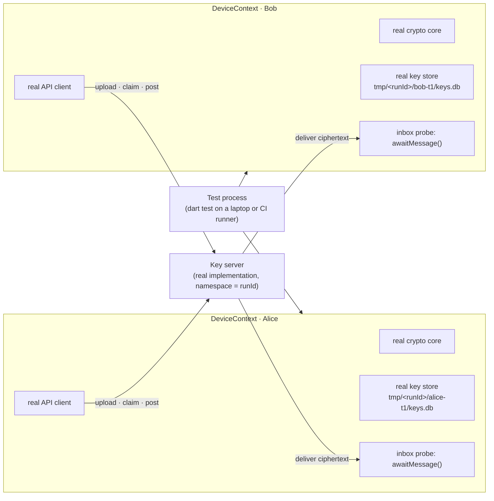
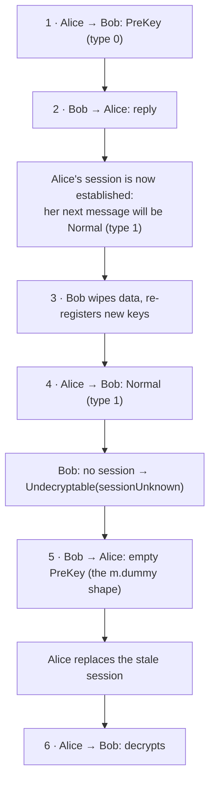

The requirement fits in six lines. Two words in it — a device's *identity key* (its long-lived key pair) and its *session state* (the per-conversation crypto state it keeps for each other device) — get proper definitions below; read them loosely for now:

```text
Alice has device A: its own identity key KA, its own store,
                    its own session state.
Bob has device B:   its own identity key KB, its own store,
                    its own session state.
Alice sends "hello Bob".
The record the server stores is not "hello Bob".
Bob's device turns what it receives back into "hello Bob".
KA ≠ KB, store A ≠ store B, session A ≠ session B —
or the test proves nothing.
```

That is the whole of an end-to-end encrypted (E2EE) chat, reduced to what must be true. It is not a unit test: it needs real key generation, a real place to keep the keys, a real server in the middle, and two device identities that share nothing. And it does not need a screen. The [previous post](/posts/which-mobile-testing-tool-do-i-need-ask-the-boundary-not-the-platform/) put this exact case on its map as a row no vendor names — the *headless system test* — and deferred it. This post builds it: one harness, three tests, in code you can read without running.

The app behind this post is a production chat app; every identifier, endpoint, and incident below is invented, and the code is illustrative — the shape is the point. What is not invented is the protocol: the app speaks Olm, the ratchet-based protocol that the Matrix specification standardizes (a *ratchet* is defined with the other terms below), and every claim about what a key or a message *is* is quoted from that specification or from vodozemac, the reference Rust implementation.

> [!TIP]
> **"Real" is not a boolean.** A headless two-device harness runs real crypto, a real key store, and a real backend under a *fake OS* — no emulator, no screen — and that is exactly the realism this invariant needs. It is also the only place where the two ugliest E2EE bugs, an exhausted pool of one-time keys and a session the other side no longer has, can be reproduced on demand instead of waited for in production.

## Table of contents

## Why Not Two Emulators?

The reflex is to boot two emulators, install the app on both, and drive them with UI automation until Bob's screen shows Alice's text. It works, and it is the most expensive possible way to prove the six lines above, because none of them mention a screen.

Ask what the invariant actually depends on. It depends on the crypto core (key generation, session establishment, encryption), on the key store (keys must survive a restart), on the protocol (which message type carries what), and on the server (it hands out keys and delivers ciphertext). It does not depend on Android or iOS, on push notifications, on the notification service extension, or on a single pixel. So the honest realism table for this test is:

| Layer | Real? |
|---|---|
| Crypto core | ✓ the production library |
| Key store | ✓ the production database file, in a temp directory |
| Backend | ✓ the real server implementation, in a throwaway *namespace* — a prefix that keeps one run's users and messages apart from every other run's |
| Network | ✓ real HTTP and a real delivery channel |
| Operating system | ✗ a host process on a laptop or CI runner |
| Push, screen, app lifecycle | ✗ not present |

Google's engineering book states the principle the harness relies on: "We prefer realistic tests because they give more confidence that the system under test is working properly. If unit tests rely too much on test doubles, an engineer might need to run integration tests or manually verify that their feature is working as expected..." And the trade the book allows: "a test double can be very useful when the real implementation is slow... it is often simpler to use a real implementation until it becomes too slow to use, at which point the tests can be updated to use a test double instead." Crypto on a laptop is fast. A server is the only slow part, and the harness keeps even that real, because the failure modes we are after live in the conversation between client and server.

There is precedent for every piece. The Matrix Dart SDK's own test suite runs two real `Client` instances with real vodozemac crypto under plain `dart test` — only the HTTP layer is a fake — and the `dart-vodozemac` package's test script is literally `cargo build` followed by `dart test .` on macOS, Linux, or Windows. The Matrix Rust SDK goes one step further in its integration-testing crate, against a real Matrix server (a *homeserver*; Synapse is the reference implementation): "This set of tests requires a Synapse instance, and it runs the tests from this directory against this real-world server... You can get it up and running with `docker compose`". That crate is the closest thing to what follows; the Dart SDK tests are the proof that real crypto on the host is normal. Two more references for the shape rather than the stack: Complement, "a black box integration testing framework for Matrix homeservers", which drives real clients over bare HTTP against containerized servers, and the classic Signal `SessionBuilderTest`, an Alice/Bob session test whose negative case reads `throw new AssertionError("Should fail with missing unsigned prekey!")` — the style every failure-mode test below borrows.

## The Protocol in Five Hundred Words

You need eight terms to read the code. Here they are, in the order the code meets them, with the specification's own wording where it matters.

**Ratchet.** The mechanism underneath everything else: each side keeps a chain of secrets and *advances* it with every message, deriving a fresh key per message and forgetting the old one. That is why a stolen key unlocks nothing older, why a session cannot simply be rebuilt from the same public keys once it has moved on, and why the library complains when messages arrive too far out of order — the key they need has already been discarded.

**Identity key.** Each device has a long-lived key pair. Its public half is what other devices use to address it; the private half never leaves the device. In the code it appears as `identityKeys.curve25519` — Curve25519 is the elliptic curve the key lives on; the name matters only because it is the field the tests compare.

**One-time key.** From the Matrix client-server specification: "In addition to the device keys, which are long-lived, some encryption algorithms require that devices may also have a number of one-time keys, which are only used once and discarded after use." A device generates a batch, uploads the public halves, keeps the private halves. When Alice wants to start talking to Bob, she *claims* one of Bob's one-time keys from the server, and the server must give it out exactly once: "Servers must ensure that each one-time key is only claimed once".

**Fallback key.** What happens when the batch is gone? "Fallback keys are similar to one-time keys, but are not consumed once used. If a fallback key has been uploaded, it will be returned by the server when the device has run out of one-time keys and a user tries to claim a key." The key is marked as such — "Fallback keys for key algorithms whose format is a signed JSON object should contain a property named `fallback` with a value of `true`" — and it comes with a cost the harness will quote back at you: "sessions started using fallback keys could be vulnerable to replay attacks", meaning an attacker who captured an old first message could feed it to Bob again and Bob would build a second session from it. The server keeps the device informed through its sync response (the periodic "what changed" answer a chat client polls for): `device_one_time_keys_count` and `device_unused_fallback_key_types`.

**PreKey message, type 0.** Alice's first message to Bob carries everything Bob needs to build a matching session. The Olm specification lists the payload fields: the "One-Time-Key" (Bob's single-use key, so Bob knows which private half to use), the "Base-Key" (Alice's single-use key), the "Identity-Key" (Alice's identity key), and the "Message" itself — "An embedded Olm message with its own version and MAC", where the MAC (message authentication code) is the tag that lets Bob detect a tampered ciphertext. In vodozemac this is `MessageType::PreKey = 0`.

**Normal message, type 1.** Once a session exists on both sides, messages shrink to a ratchet header plus ciphertext: `MessageType::Normal = 1`. The rule for when Alice may switch is the sentence the third test depends on: "Alice will continue to send pre-key messages until she receives a message from Bob." And: "Once a message has been received from the other side, a session is considered established, and a more compact form is used."

**Session.** The ratchet state each side keeps per remote device. Alice's is created *outbound* from Bob's claimed key; Bob's is created *inbound* from Alice's PreKey message — vodozemac's `create_outbound_session` and `create_inbound_session`. If Bob no longer has the private half of the one-time key Alice used, the inbound creation fails with `SessionCreationError::MissingOneTimeKey`, whose doc comment says it all: "The pre-key message contained an unknown one-time key. This happens either because we never had such a one-time key, or because it has already been used up." Once a session exists, a message that does not decrypt on it is a `DecryptionError` — `InvalidMAC` for a tampered or mismatched ciphertext, `MissingMessageKey` for a key "already used up, or because the Session has been ratcheted forwards and the message key has been discarded", `TooBigMessageGap` for messages too far out of order. The two errors live at different call sites, and the harness keeps them apart.

**Pickle.** The serialized account or session you persist. Restoring from disk is how a device survives a restart with its sessions intact — and deleting it is how the third test simulates cleared app data.

One clash of vocabulary, since the [E2EE series opener](/posts/how-do-messengers-really-encrypt-your-messages/) used the same word differently: there, a *prekey* was a key Bob publishes in advance (the X3DH key-agreement sense). Here, *PreKey message* is a wire message type — the first message of a session, which happens to carry such a key.

And what should a client do with a message it cannot decrypt? The specification is unambiguous: "When this happens to an Olm-encrypted message, the client should assume that the Olm session has become corrupted and create a new one to replace it." Then: "Olm does not have a way to recover from the failure, making this session replacement process required. To establish a new session, the client sends an m.dummy to-device event to the other party to notify them of the new session details." A *to-device event* is a message addressed to one specific device rather than to a room, and `m.dummy` is the emptiest one there is: "The event does not have any content associated with it." With a brake: "Clients should not create a new session with another device if it has already created one for that given device in the past 1 hour." Note what the specification does *not* say: it does not say "try your other sessions". Matrix's Olm keeps one session per remote device and replaces it; Signal's Sesame layer is the design that keeps several and converges on an active one. If your app keeps several, that is app policy, and the harness should say so.

So the key server — yours, not Matrix's — has four jobs the harness talks to: store the keys a device uploads; hand out exactly one one-time key per claim; return the fallback key when the pool is empty; deliver ciphertext to the addressed device. Three more things exist only because the tests need them: the upload response reports how many one-time keys the server now holds; a test-only endpoint returns the stored record of a message; and the server accepts a device re-registering with new keys under the same device id, which the third test does and which a strict server may refuse — if yours does, model the reinstall as a new device id instead (a row in the list at the end).

## The Harness



Two logical devices in one process. Each `DeviceContext` owns a real crypto account, a real store file in its own temporary directory, a real API client pointed at a namespace that exists only for this run, and a probe on its own delivery channel — four sibling parts, not a pipeline. Nothing is shared between the two contexts except the server. The code follows in reading order; every name the harness *defines* appears before it is used, and the five names it *assumes* from the app are introduced here so you are not left guessing: `Account` and `Session` are the crypto core's account and per-peer session objects (vodozemac's names); `KeyStore` is the app's encrypted database wrapper (SQLCipher, an encrypted SQLite); `KeyServerApi` is the app's HTTP client for the four server jobs above; and `claimKeys` returns a `ClaimedKeys` — the peer's identity key, one key (a one-time key, or the fallback key when the pool is empty), and a `fallback` flag — or `null` when the server has nothing to give.

A few Dart constructs for readers coming from other languages: `sealed class` declares a closed set of subclasses, so a check like `isA<Received>()` on an `Outcome` has exactly one alternative; `(alice, bob)` is a record, Dart's tuple; `isA<T>().having(getter, 'label', value)` asserts the type and then one field, and the label is what the failure message prints; `late` marks a field assigned after construction; `..` is a cascade (call a method, keep the receiver); and `!` asserts a nullable value is not null.

### Results, then the device

Every test needs to say three things about a message: it was sent (and what went over the wire), it was received and decrypted, or it could not be decrypted *and why*. The "why" is the harness's vocabulary for failure modes. Some values map to library errors, some are the app's own decisions, and the comments say which:

```dart
enum Reason {
  sessionUnknown, // app-level: no session for a Normal message
  missingOneTimeKey, // SessionCreationError::MissingOneTimeKey
  sessionSetupFailed, // any other SessionCreationError
  badMac, // DecryptionError::InvalidMAC
  ratchetGap, // MissingMessageKey / TooBigMessageGap
  malformed, // the wire message could not be parsed
  noKeyAvailable, // the claim returned nothing
}

sealed class Outcome {}

class Received extends Outcome {
  final String text;
  Received(this.text);
}

class Undecryptable extends Outcome {
  final Reason reason;
  Undecryptable(this.reason);
}
```

`sessionUnknown` and `noKeyAvailable` are not library errors at all — there is no session to call `decrypt` on, and no key to build one from — and the harness names them so a test can assert them instead of catching a null. The result of sending, and the shape of a message as the server delivers it:

```dart
class Sent {
  final String? messageId;
  final String? payload; // the ciphertext that went over the wire
  final int? type; // 0 = PreKey, 1 = Normal
  final Reason? failure;
  Sent.ok(this.messageId, this.payload, this.type) : failure = null;
  Sent.failed(this.failure) : messageId = null, payload = null, type = null;
}

/// One message as the key server delivers it to a device.
class WireMessage {
  final String id, senderDevice, senderKey, ciphertext;
  final int type;
  WireMessage(
    this.id,
    this.senderDevice,
    this.senderKey,
    this.ciphertext,
    this.type,
  );
}
```

A `DeviceContext` is one logical phone. Booting it creates the directory, opens the store, and subscribes to the delivery channel; it does not touch crypto yet:

```dart
class DeviceContext {
  final String userId, deviceId;
  final Directory dir;
  final KeyStore store; // real SQLCipher file under dir
  final KeyServerApi api; // real HTTP client, test namespace
  late Account account; // real Olm-compatible core
  final Map<String, Session> sessions = {}; // remote deviceId → session
  late final StreamQueue<WireMessage> _inbox;

  DeviceContext._(this.userId, this.deviceId, this.dir, this.store, this.api);

  static Future<DeviceContext> boot({
    required String user,
    required String name,
    required String runId,
  }) async {
    final dir = Directory('${Directory.systemTemp.path}/$runId/$name')
      ..createSync(recursive: true);
    final ctx = DeviceContext._(
      '$user+$runId@test.local',
      name,
      dir,
      KeyStore.open('${dir.path}/keys.db'),
      KeyServerApi(namespace: runId),
    );
    ctx._inbox = StreamQueue(ctx.api.messages(ctx.deviceId));
    return ctx;
  }
```

The `StreamQueue` (from Dart's `package:async`) is the probe's buffer: it subscribes at boot, so a message that arrives before the test asks for it is not lost. The user id carries the run id, so two runs on the same server cannot see each other's users. The class stays open — the next four snippets are its methods.

### Bootstrap: keys created, uploaded, persisted

`bootstrap` is the device's first launch. It creates the account, generates the one-time keys and — unless a test says otherwise — the fallback key, uploads the public halves, tells the account they are published, and persists the pickle. It returns the server's count of one-time keys for this device; `topUpKeys` is the same upload for a device that already exists, and its return value is what the second test checks after Bob's pool has been drained:

```dart
  Future<int> bootstrap({int oneTimeKeys = 10, bool fallbackKey = true}) async {
    account = Account.create();
    account.generateOneTimeKeys(oneTimeKeys);
    if (fallbackKey) account.generateFallbackKey();
    final count = await api.uploadKeys(
      deviceId: deviceId,
      identityKeys: account.identityKeys,
      oneTimeKeys: account.oneTimeKeys,
      fallbackKey: fallbackKey ? account.fallbackKey : null,
    );
    account.markKeysAsPublished();
    await store.storeAccount(account.pickle());
    return count; // one-time keys the server now holds for this device
  }

  Future<int> topUpKeys({int oneTimeKeys = 10}) async {
    account.generateOneTimeKeys(oneTimeKeys);
    final count = await api.uploadKeys(
      deviceId: deviceId,
      identityKeys: account.identityKeys,
      oneTimeKeys: account.oneTimeKeys,
    );
    account.markKeysAsPublished();
    await store.storeAccount(account.pickle());
    return count;
  }
```

The two parameters are the failure-injection hooks. `oneTimeKeys: 1` makes the pool trivially exhaustible; `fallbackKey: false` removes the safety net. Nothing else in the harness knows the difference — which is the point: the failure is produced by the same code path production uses, with smaller numbers.

### The probe: await, never sleep

A distributed assertion — "Bob receives Alice's message" — must wait for something that happens in another process. The wrong way is `sleep(3000)` and hope; Android's own testing docs call it out: "You should avoid pausing your tests for an arbitrary period (sleep) to let the app run and stabilize." The right way is to await the event under a hard deadline (still inside `DeviceContext`):

```dart
  Future<WireMessage> awaitMessage({
    Duration timeout = const Duration(seconds: 10),
  }) => _inbox.next.timeout(timeout);
```

Ten seconds is a deadline, not a delay: the future completes the instant the message lands, and the test fails loudly if it never does. The Matrix Rust SDK's integration tests use the same idea with a polling helper, `wait_until_some`, that retries with a growing backoff until a deadline — polling rather than awaiting, but the same contract. The one thing neither does is wait a fixed time and look.

### Send and receive

`send` is the sender's half of the protocol in twenty lines. No session for this device yet? Claim a key — the server returns a one-time key, or the fallback key, or nothing — and create the outbound session. Then encrypt, persist the session, and post the ciphertext. The message type is the library's decision: PreKey until Bob has replied, Normal after:

```dart
  Future<Sent> send(DeviceContext to, String text) async {
    var session = sessions[to.deviceId];
    if (session == null) {
      final bundle = await api.claimKeys(to.userId, to.deviceId);
      if (bundle == null) return Sent.failed(Reason.noKeyAvailable);
      session = account.createOutboundSession(
        bundle.identityKey,
        bundle.oneTimeKey, // the fallback key when the pool is empty
      );
      sessions[to.deviceId] = session;
    }
    final msg = session.encrypt(text); // PreKey until the peer replies
    await store.storeSession(to.deviceId, session.pickle());
    final id = await api.postMessage(
      to: to.deviceId,
      from: deviceId,
      senderKey: account.identityKeys.curve25519,
      ciphertext: msg.ciphertext,
      type: msg.type,
    );
    return Sent.ok(id, msg.ciphertext, msg.type);
  }
```

`receive` is the receiver's half, and it is where the two error families are kept apart. A PreKey message goes to `createInboundSession`, which can fail with `MissingOneTimeKey` or another `SessionCreationError`. A Normal message needs an existing session — and if there is none, that is the app-level `sessionUnknown`, decided before any library call — and then `decrypt`, which can fail with `InvalidMAC` or, for a message the ratchet has moved past, another `DecryptionError`:

```dart
  Future<Outcome> receive(WireMessage m) async {
    Session? session = sessions[m.senderDevice];
    String text;
    try {
      if (m.type == 0) {
        final r = account.createInboundSession(
          m.senderKey,
          PreKeyMessage.parse(m.ciphertext),
        );
        session = r.session;
        text = r.plaintext;
      } else {
        // app-level: nothing to call the library on
        if (session == null) return Undecryptable(Reason.sessionUnknown);
        text = session.decrypt(m.ciphertext);
      }
    } on MissingOneTimeKey {
      return Undecryptable(Reason.missingOneTimeKey);
    } on SessionCreationError {
      return Undecryptable(Reason.sessionSetupFailed);
    } on InvalidMAC {
      return Undecryptable(Reason.badMac);
    } on DecryptionError {
      return Undecryptable(Reason.ratchetGap);
    } on FormatException {
      return Undecryptable(Reason.malformed);
    }
    sessions[m.senderDevice] = session;
    await store.storeSession(m.senderDevice, session.pickle());
    return Received(text);
  }
```

Notice that `receive` never throws and never returns garbage: every library error the core can raise, and a message that will not even parse, ends in an `Undecryptable` with a reason, and only a successful decrypt ends in `Received`. That is the fail-closed property the tests rely on. It also does not try any other session on failure — see the protocol note above; if your app does, this is the function where that policy lives, and the test that covers it should say "app policy" in its name.

### Failure injection and recovery

Two helpers do the damage and the repair. `wipe` is "the user cleared the app's data": the store file is deleted, the delivery subscription cancelled, the sessions forgotten — and the test then throws the context away and boots a new one, which is what makes the in-memory account disappear. `reestablishWith` is the client's side of the specification's recovery: forget the session, build a new one from a freshly claimed key, and send an empty message on it — the shape of Matrix's `m.dummy` event, which carries no content and delivers the new session inside a PreKey message. The one-hour rate limit the specification asks for is app policy and is not modelled here:

```dart
  /// App data cleared: the store file is deleted, the inbox subscription
  /// cancelled, the sessions forgotten. The test then drops this context.
  Future<void> wipe() async {
    await _inbox.cancel(immediate: true);
    sessions.clear();
    await store.close();
    dir.deleteSync(recursive: true);
  }

  /// The spec's m.dummy shape: a fresh session, carrying an empty message.
  Future<Sent> reestablishWith(DeviceContext peer) async {
    sessions.remove(peer.deviceId);
    return send(peer, '');
  }
}
```

### One namespace per run, fresh devices per test

Tests that share devices share state, and the second test deliberately drains a device's keys. So each test boots its own pair, under one run namespace that is deleted — server side and temp directory — at the end:

```dart
final runId = 'run-${DateTime.now().millisecondsSinceEpoch}';

Future<(DeviceContext, DeviceContext)> pair(String tag) async {
  final alice = await DeviceContext.boot(
    user: 'alice',
    name: 'alice-$tag',
    runId: runId,
  );
  final bob = await DeviceContext.boot(
    user: 'bob',
    name: 'bob-$tag',
    runId: runId,
  );
  return (alice, bob);
}

void main() {
  tearDownAll(() async {
    await KeyServerApi(namespace: runId).deleteNamespace();
    Directory(
      '${Directory.systemTemp.path}/$runId',
    ).deleteSync(recursive: true);
  });
  // tests follow
}
```


## Test 1 — Alice Sends, Bob Decrypts, the Server Never Holds the Text

**Requirement.** Alice's "hello Bob" arrives on Bob's device as "hello Bob"; the bytes that crossed the wire do not contain it; the record the server keeps does not contain it; and the two devices share neither identity key nor store.

```dart
  test(
    'alice sends, bob decrypts, and the server never holds the text',
    () async {
      final (alice, bob) = await pair('t1');
      await alice.bootstrap();
      await bob.bootstrap();
      expect(
        alice.account.identityKeys.curve25519,
        isNot(bob.account.identityKeys.curve25519),
      );
      expect(alice.dir.path, isNot(bob.dir.path));

      final sent = await alice.send(bob, 'hello Bob');
      expect(sent.payload, isNot(contains('hello Bob')));

      final outcome = await bob.receive(await bob.awaitMessage());
      expect(
        outcome,
        isA<Received>().having((r) => r.text, 'text', 'hello Bob'),
      );

      final record = await bob.api.fetchRecord(sent.messageId!);
      expect(record.content, isNot(contains('hello Bob')));
    },
  );
```

Four assertions, and the first two are the ones people skip. Without the identity-key and store-path checks, a harness that accidentally wires both devices to one account passes every later test while proving nothing — and the key check compares the key *material* (the Curve25519 string), not the objects, because two distinct objects holding the same key would pass an identity comparison. Without the payload and record checks, a system that quietly sends plaintext passes the decrypt assertion — Bob would "decrypt" a string that was never encrypted. The last assertion is the security invariant in test form: the server's copy is ciphertext, which is what end-to-end means.

**What this reproduces.** Nothing yet; this is the baseline that every failure test starts from. It also runs, end to end, the exact sequence a first message takes in production: claim, outbound session, PreKey message, inbound session, decrypt, persist.

## Test 2 — Bob's One-Time Keys Run Out

The pool of one-time keys is finite, and every new sender takes one. A device that has been offline for a while, or is simply popular, hits zero. The specification's answer is the fallback key; the harness checks both what happens when it is there and what happens when it is not.

**Requirement (2a).** Bob uploaded one one-time key and a fallback key. Someone else claims the one key. Alice must still be able to start a conversation, Bob must decrypt it, and Bob must top the pool back up.

```dart
  test(
    'when bob is out of one-time keys, the fallback key still works',
    () async {
      final (alice, bob) = await pair('t2a');
      await alice.bootstrap();
      await bob.bootstrap(oneTimeKeys: 1); // and a fallback key
      final other = await DeviceContext.boot(
        user: 'carol',
        name: 'carol-t2a',
        runId: runId,
      );
      await other.bootstrap();
      await other.send(bob, 'I took your only key'); // pool is now 0
      await bob.receive(await bob.awaitMessage()); // consume carol's message

      final bundle = await alice.api.claimKeys(bob.userId, bob.deviceId);
      expect(bundle!.fallback, isTrue); // not consumed: send() gets it too

      await alice.send(bob, 'still reachable');
      final outcome = await bob.receive(await bob.awaitMessage());
      expect(
        outcome,
        isA<Received>().having((r) => r.text, 'text', 'still reachable'),
      );

      expect(await bob.topUpKeys(), greaterThan(0));
    },
  );
```

The provocation is two lines: a pool of one, and a third device that spends it. Bob then consumes Carol's message so that the next thing in his inbox is Alice's — the probe is a queue, and a test that forgets this asserts on the wrong message. The first assertion checks the server did what the specification says — "it will be returned by the server when the device has run out of one-time keys" — by looking at the `fallback` flag on the claimed bundle; the test can afford to claim once here and again inside `send`, because the same fallback key comes back both times ("not consumed once used"), which is not true of a one-time key. The second assertion checks Bob decrypts Alice's text — a `MissingOneTimeKey` would surface here as an `Undecryptable` if Bob had thrown away the fallback key's private half. The last checks the count goes back above zero after `topUpKeys`. Put the specification's caveat next to this test in your suite: "sessions started using fallback keys could be vulnerable to replay attacks" — the fallback key keeps the conversation alive, and topping up promptly is what keeps that window short.

**Requirement (2b).** Bob uploaded one one-time key and *no* fallback key. Someone else claims the key. Alice must be told there is nothing to build a session from — not left waiting on a message that will never decrypt.

```dart
  test(
    'when bob has no fallback key either, the sender is told, not stuck',
    () async {
      final (alice, bob) = await pair('t2b');
      await alice.bootstrap();
      await bob.bootstrap(oneTimeKeys: 1, fallbackKey: false);
      final other = await DeviceContext.boot(
        user: 'carol',
        name: 'carol-t2b',
        runId: runId,
      );
      await other.bootstrap();
      await other.send(bob, 'I took your only key');

      final sent = await alice.send(bob, 'anyone there?');
      expect(sent.failure, Reason.noKeyAvailable);
    },
  );
```

**What this reproduces.** The user-visible effect of 2b is that a new contact cannot start a conversation with Bob until Bob's device uploads keys again; the effect of 2a is that they can, and Bob is none the wiser. Both are the same server behaviour observed from the sender's side, which is why they are one test in two halves. Note the error in 2b is a *claim* result — the server returned nothing — not a library error. The library error for this family, `MissingOneTimeKey`, belongs to a different row: a PreKey message that names a key the receiver no longer holds, which is in the list at the end.

## Test 3 — Bob Wiped His Data; Alice Still Holds the Old Session

This is the bug that shows up as "unable to decrypt" after a reinstall, and it is the reason the protocol primer quoted the establishment rule. A session mismatch needs *two* things to be true: Alice must be sending Normal messages — so she must have received a reply from Bob first — and Bob must have lost the session Alice is using.



**Requirement.** After a two-way exchange, Bob clears his app data and registers fresh keys under the same device id. Alice's next message is a Normal message that Bob cannot decrypt; it is *reported*, not dropped or garbled. Bob re-establishes, Alice adopts the new session, and Alice's following message decrypts.

```dart
  test('after bob wipes his data, the first message is reported and the '
      'conversation heals on the next one', () async {
    var (alice, bob) = await pair('t3');
    await alice.bootstrap();
    await bob.bootstrap();
    await alice.send(bob, 'hello');
    await bob.receive(await bob.awaitMessage());
    await bob.send(alice, 'hi'); // the reply that establishes the session
    await alice.receive(await alice.awaitMessage());

    await bob.wipe();
    bob = await DeviceContext.boot(user: 'bob', name: 'bob-t3', runId: runId);
    await bob.bootstrap(); // same device id, brand-new keys

    final stale = await alice.send(bob, 'are you there?');
    expect(stale.type, 1); // Normal: alice thinks the session is fine
    final first = await bob.receive(await bob.awaitMessage());
    expect(
      first,
      isA<Undecryptable>().having(
        (u) => u.reason,
        'reason',
        Reason.sessionUnknown,
      ),
    );

    await bob.reestablishWith(alice);
    await alice.receive(await alice.awaitMessage()); // adopts the new session

    await alice.send(bob, 'second try');
    final second = await bob.receive(await bob.awaitMessage());
    expect(second, isA<Received>().having((r) => r.text, 'text', 'second try'));
  });
```

Walk the middle. Bob's reply is not decoration: without it, Alice "will continue to send pre-key messages until she receives a message from Bob", and a PreKey message against the reborn Bob would fail differently — `MissingOneTimeKey`, because it names a key the new Bob never had. The `expect(stale.type, 1)` line pins that down: Alice is on a Normal message, believing the session is fine. Bob, with an empty session table, returns `sessionUnknown` — the app-level reason, because there is nothing for the library to be called on. Then the recovery the specification requires: Bob "should assume that the Olm session has become corrupted and create a new one to replace it", and announces it with the empty PreKey message that `reestablishWith` sends. Alice's `receive` sees type 0, creates an inbound session, and replaces the stale one. Her next message is a Normal message on that new session — she has received on it, so it is established from her side — and Bob decrypts it on the session he created outbound.

**What this reproduces.** One "unable to decrypt" on Bob's screen, and then a working conversation — which is the *correct* production outcome, and the thing this test guards. The two wrong outcomes it catches are a Bob that stays wedged (no re-establishment, every later message fails) and a Bob that silently drops the first message so nobody knows a session was lost. The variant modelled is "app data cleared, same device id"; a reinstall that produces a *new* device id is a different row, in the list below, because then Alice's session is keyed to a device the server no longer lists.

## Namespaces, Teardown, and the Real Backend

The server in these tests is the real implementation, and it is disposable. Two patterns cover it. Google's "Hermetic Servers" post defines the goal: "If you can start up the entire server on a single machine that has no network connection AND the server works as expected, you have a hermetic server!" — though its own prescription leans on faking the datastore, which this harness deliberately does not do. Testcontainers describes the mechanism most teams use — "an open source library for providing throwaway, lightweight instances of databases, message brokers, web browsers, or just about anything that can run in a Docker container". The Matrix Rust SDK does exactly that for its homeserver with a `docker-compose.yml` and a `down --volumes --remove-orphans` teardown. If a container is not an option, a staging deployment with a per-run namespace — which is what `runId` is for — gives the same isolation at the cost of a shared server; the `tearDownAll` deletes the namespace either way.

## Scenarios You Add Next

Each of these is the same harness with one more provocation, written in the catalogue form the tests above use — protocol cause, provocation, assertion:

- **Replayed one-time key.** Cause: the same PreKey message reaches Bob twice. Provocation: feed Bob's `receive` the same `WireMessage` again. Assert: `Undecryptable(missingOneTimeKey)` the second time, and the first session still decrypts later messages.
- **Reinstall with a new device id.** Cause: Alice's session is keyed to a device the server no longer lists. Provocation: boot Bob under a new `name` after `wipe`. Assert: Alice's send targets the new device after her device list refreshes; the old session is never used.
- **Multi-device fan-out.** Cause: Bob has two devices. Provocation: boot `bob-phone` and `bob-laptop`, both bootstrapped. Assert: Alice's send produces one ciphertext per device and both decrypt.
- **Revoked device.** Cause: a device is removed server-side. Provocation: delete one of Bob's devices via the API. Assert: Alice's next send excludes it and the revoked context never receives.
- **Out of order.** Cause: messages arrive in the wrong sequence. Provocation: collect three `WireMessage`s, deliver them 3-1-2. Assert: all decrypt (the ratchet tolerates gaps up to `TooBigMessageGap`), and a gap beyond the limit surfaces as `Undecryptable(ratchetGap)`.
- **Offline receiver.** Cause: Bob is away while Alice sends. Provocation: send before Bob's `awaitMessage` is called. Assert: the `StreamQueue` still delivers, in order.
- **Tampered ciphertext.** Cause: a byte flipped in transit. Provocation: mutate `ciphertext` before `receive`. Assert: `Undecryptable(badMac)` — fail closed, never partial plaintext.
- **Property form.** Replace the literal strings with generated ones and run test 1 across hundreds of random plaintexts and key batches; the invariants do not change, only the inputs.

## What This Harness Cannot Prove

Everything with a ✗ in the realism table. That the key store's encryption key survives in the Android Keystore or iOS Keychain across a process kill; that the notification service extension can decrypt in its 24 MB budget; that a message pushed while the app is dead is decrypted when the notification is tapped; that a WebSocket reconnect after a network change redelivers what was missed. Each of those is an invariant that depends on the operating system, and the [previous post's map](/posts/which-mobile-testing-tool-do-i-need-ask-the-boundary-not-the-platform/) has a row for them: raise *that subset* to instrumentation tests — tests installed on a real device or emulator next to the app — and keep the hundred protocol scenarios down here, where they run in seconds.

## Where This Sits in the Contract

Two posts ago this series proposed a [verification contract](/posts/the-agent-says-all-tests-pass-so-why-does-qc-still-reject-the-build/) with a field called *verification by layer*: one line per check, at the lowest layer that proves it. The three tests above are three of those lines, and the harness is what "lowest layer that proves it" turns out to mean for an E2EE conversation:

```text
Invariants: I1 the server never holds plaintext;
            I2 an exhausted one-time-key pool never blocks a conversation
               that has a fallback key, and reports one that does not;
            I3 a lost session is reported once and heals on the next message.
Verification by layer:
  headless system test — alice→bob round trip + payload/record checks (I1)
  headless system test — pool of one, fallback present / absent (I2)
  headless system test — two-way exchange, wipe, Normal message,
                         re-establish (I3)
  instrumentation      — key-store survival across process kill (device row)
```

This is what a coding agent runs, unchanged, when it touches the crypto layer; it is what a reviewer reads to know which invariants a change was checked against; and it is what QC reads to know that "session mismatch after reinstall" is covered below the UI and only the notification path needs a phone. The agent did not write the harness. It could not have: the harness encodes which failures matter, and that is the part only someone who has watched them happen can supply.

If you remember one thing: **real crypto, real store, real backend, fake OS — and provoke the failure with the production code path and a smaller number.** Two emulators can show you that a message arrived. Only this can show you, on demand, what happens when it cannot.

## Sources

Graded: primary = the specification, the library's source, or the maintainers' own documents; secondary = third-party reporting, flagged in the text. All quotes above are from primary sources, checked 2026-08-29.

**Protocol (primary)**

- [Matrix Client-Server API v1.18](https://spec.matrix.org/v1.18/client-server-api/) — one-time keys ("only used once and discarded after use"; "only claimed once"), fallback keys ("not consumed once used"; "when the device has run out of one-time keys"; the `fallback` property; replay-attack caveat), `device_one_time_keys_count`, `device_unused_fallback_key_types`, "Recovering from undecryptable messages" (`m.dummy`, one-hour limit), the `m.dummy` event definition
- [Matrix Specification — Olm: A Cryptographic Ratchet, v1.18](https://spec.matrix.org/v1.18/olm-megolm/olm/) — PreKey message payload fields ("An embedded Olm message with its own version and MAC"); "Alice will continue to send pre-key messages until she receives a message from Bob"; "Once a message has been received from the other side, a session is considered established"
- [vodozemac](https://github.com/matrix-org/vodozemac) — `MessageType::PreKey = 0` / `Normal = 1` (`src/olm/messages/mod.rs`), `SessionCreationError::MissingOneTimeKey` and its doc comment (`src/olm/account/mod.rs`), `DecryptionError::{InvalidMAC, MissingMessageKey, TooBigMessageGap}` (`src/olm/session/mod.rs`), `Account` API (`generate_one_time_keys`, `generate_fallback_key`, `mark_keys_as_published`, `create_outbound_session`, `create_inbound_session`)
- [Signal — The Sesame Algorithm](https://signal.org/docs/specifications/sesame/) — the multi-session, active-session design that Matrix's Olm does not use

**Prior art (primary)**

- [matrix-dart-sdk](https://github.com/famedly/matrix-dart-sdk) — `test/encryption/encrypt_decrypt_to_device_test.dart` and `olm_manager_test.dart`: two real `Client`s, real vodozemac, `FakeMatrixApi` for HTTP
- [dart-vodozemac](https://github.com/famedly/dart-vodozemac) — `scripts/run_io_tests.sh`: `cargo build` then `dart test .` on macOS/Linux/Windows
- [matrix-rust-sdk — integration testing crate](https://github.com/matrix-org/matrix-rust-sdk/tree/main/testing/matrix-sdk-integration-testing) — dockerized Synapse via `docker compose`; `src/tests/e2ee/`; `wait_until_some` in `src/helpers.rs`
- [Complement](https://github.com/matrix-org/complement) — "a black box integration testing framework for Matrix homeservers"
- [libsignal-protocol-java — SessionBuilderTest](https://github.com/signalapp/libsignal-protocol-java/blob/master/tests/src/test/java/org/whispersystems/libsignal/SessionBuilderTest.java) — archived 2021; cited for the Alice/Bob negative-test pattern, not as current code
- [Google Testing Blog — Hermetic Servers](https://testing.googleblog.com/2012/10/hermetic-servers.html) (2012) · [Testcontainers](https://testcontainers.com/) · [Software Engineering at Google, Ch. 13 — Test Doubles](https://abseil.io/resources/swe-book/html/ch13.html)
- [Android — Big test stability](https://developer.android.com/training/testing/instrumented-tests/stability) — "avoid pausing your tests for an arbitrary period (sleep)"
- [Dart `package:async` — StreamQueue](https://pub.dev/documentation/async/latest/async/StreamQueue-class.html)

**This series**

- [Which Mobile Testing Tool Do I Need? Ask the Boundary, Not the Platform](/posts/which-mobile-testing-tool-do-i-need-ask-the-boundary-not-the-platform/) — the map this harness is a row of
- [The Agent Says All Tests Pass. So Why Does QC Still Reject the Build?](/posts/the-agent-says-all-tests-pass-so-why-does-qc-still-reject-the-build/) — the verification contract
- [WhatsApp, Signal, Messenger, Telegram: How Do They Really Encrypt Your Messages?](/posts/how-do-messengers-really-encrypt-your-messages/) — E2EE basics this post does not repeat
