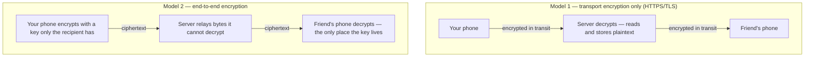
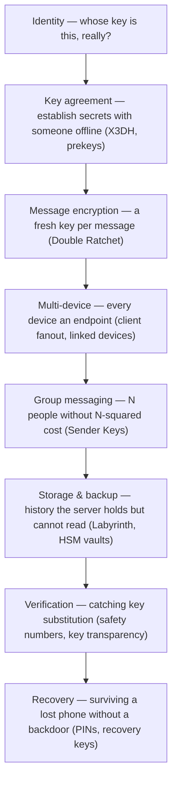

Type _"Meet me at the usual place tonight"_ and send it to the same friend on four apps: WhatsApp, Signal, Messenger, Telegram. Four lock icons, four privacy pages, four companies assuring you the message is "encrypted." Now ask the only question that matters: **in which of those four apps can the company itself read what you just wrote?**

The answer is not "none of them," and it's not the same answer for all four. On two of them, the operator provably cannot read it. On one, it depends on when your account was migrated and which chat you're in. On one, the default is that the company's servers can read every word — by design, in exchange for features you probably like.

Here is the whole article in one sentence:

> [!TIP]
> **End-to-end encryption doesn't add a lock to the wire — the wire was already locked.** E2EE removes the _server's_ ability to read your messages at all, and everything hard about it comes from keeping the product working after you take that ability away.

That claim needs unpacking, so this post does three things: it shows what E2EE actually changes compared to the encryption every app already has, it walks through how four real messengers got there — four very different journeys, with dates and engineering receipts — and it ends with an honest account of what E2EE still can't protect you from.

## Table of contents

## Your Messages Are Already Encrypted — So Why Isn't That Enough?

Every serious app already encrypts your messages. That's not the flex it sounds like: it's HTTPS, the same TLS encryption your browser uses for everything from your bank to a recipe blog. When your message leaves your phone, it travels through an encrypted tunnel to the app's server. Nobody snooping on café Wi-Fi can read it. Your ISP can't read it. That part has been solved for years.

The catch is _where the tunnel ends_. TLS protects the hop between you and the server — and then the server decrypts. Inside the data center, your message exists as plaintext: readable, storable, searchable, scannable. Then it's re-encrypted for the second hop down to your friend. Two locked pipes, with an open junction in the middle — and the junction belongs to the company.

The diagram shows the two models side by side: in the first, both hops are encrypted but the server in the middle decrypts and holds plaintext; in the second, the message is encrypted on your phone with a key only your friend's phone holds, so the server passes along ciphertext it has no ability to open.

End-to-end encryption is the second model. The message is locked _before it leaves your device_, with a key that exists only on your friend's device, and it stays locked across every server, queue, and disk in between. The server's job shrinks to moving opaque bytes.

That's why "is it encrypted?" is the wrong question — the answer is always yes. The right question is: **encrypted between whom and whom?** Between you and the server, or between you and the person you're talking to?

## What E2EE Actually Buys You

The difference between those two models sounds academic until you walk through what can go wrong. Three scenarios, one question each: what does an attacker get?

**Scenario one: the database leaks.** Companies get breached; message databases are a prize target. Under transport-only encryption, whatever the server stored — often full message history — is sitting there in readable form once the attacker is inside. Under E2EE, the breach yields ciphertext: mathematically useless without keys that were never on the server to steal.

**Scenario two: the server is compromised or compelled.** An attacker with control of the server — or a government with a subpoena — can ask for anything the server can produce. Under the first model, the server _can_ produce your conversations, so the only thing standing between your messages and disclosure is policy. Under E2EE, the honest answer to "hand over the plaintext" is: _there is no plaintext to hand over_. Not won't — can't.

**Scenario three: the provider itself changes.** Companies pivot, get acquired, tighten monetization, or quietly expand what they scan "to improve the service." Every one of those decisions is reversible policy. E2EE is the one commitment that isn't a policy: if the architecture never gives the server keys, a future product manager can't decide to start reading.

Notice the pattern across all three: E2EE doesn't make the server _trustworthy_ — it makes the server's trustworthiness **irrelevant to message content**. That's the actual definition, stripped of marketing: an end-to-end encrypted system is one where only the communicating devices hold the keys, so every machine in the middle handles ciphertext only.

Hold that definition, because the rest of this post is about what it costs to make it true in a real product — and the cost is much higher than the phrase "just encrypt it" suggests.

## Follow One Message — and Watch the Textbook Picture Fall Apart

The textbook version of E2EE is clean. You tap Send: your phone encrypts the message with a key it shares with exactly one other device. The ciphertext goes up to the server, which stores and forwards it — your friend might be offline, so the server holds the sealed envelope until their phone reconnects. Their phone downloads it, decrypts it, done. Alice, Bob, one key, one arrow.

Real life refuses to be a textbook. Ask five ordinary questions and the clean picture falls apart:

- **Your friend is offline.** You can't do a live key handshake with a phone that's off. Modern protocols solve this with _prekeys_ — bundles of one-time public keys uploaded in advance, so your phone can establish a shared secret with someone who isn't there. That's the problem Signal's [X3DH key agreement](https://signal.org/docs/specifications/x3dh/) exists to solve, and we'll meet it again later.
- **You have a laptop.** If keys live on exactly one device, what is WhatsApp Web? Every extra device is another endpoint that must encrypt and decrypt — without the server ever holding the keys as a convenient middleman.
- **You bought a new phone.** The keys were on the old one. Does your history follow you? _Should_ it?
- **You want backups.** A backup readable by the cloud provider is a backdoor with a friendlier name. A backup nobody can read is one forgotten password away from losing a decade of conversations.
- **Your group chat has 200 people.** Encrypting each message separately for every member's every device multiplies quickly. Group messaging needs its own cryptographic machinery.

Here's the insight this whole series is built on: **the encryption algorithm is the easy 10%.** AES and elliptic curves are solved problems with battle-tested libraries. The hard 90% is the _system around_ the encryption — identity, key distribution, multiple devices, groups, storage, backup, recovery — all rebuilt under one brutal constraint: the server is no longer allowed to see anything.

Four companies faced those questions and gave four different answers. That's what the next four sections are about — not "which app is best," but what each one chose and what that choice cost.

## Signal: Privacy as the Foundation

Signal is the reference point, because it never had to retrofit anything: privacy was the founding requirement, not a feature request.

The lineage starts in May 2010, when Whisper Systems launched [TextSecure and RedPhone](https://increment.com/security/story-of-signal/) — encrypted texting and encrypted calls — with end-to-end encryption on from day one. There was never an unencrypted era, never an opt-in toggle. After a detour through a Twitter acquisition and an open-source release, Moxie Marlinspike founded Open Whisper Systems in January 2013 to carry the work forward, and in [November 2015 the two apps merged and became Signal](https://en.wikipedia.org/wiki/Open_Whisper_Systems).

Along the way, the team built what is now simply called the Signal Protocol, and its two pillars answer two of the questions from the last section. [X3DH](https://signal.org/docs/specifications/x3dh/) handles key agreement with someone who's offline — the prekey trick above. The [Double Ratchet](https://signal.org/docs/specifications/doubleratchet/) then derives a _fresh key for every single message_, so stealing today's key doesn't unlock yesterday's history. And because encryption without identity is theater, Signal exposes _safety numbers_ — a fingerprint two people can compare to verify no one sits between them. (Each of these deserves its own article; that's exactly where this series goes next.)

What makes Signal most interesting, though, is how far it pushes past message content:

- **[Sealed Sender](https://signal.org/blog/sealed-sender/)** (2018) encrypts the sender's identity itself, so Signal's own servers see _who a message is for_ but not, in the normal case, _who it's from_. That's an attack on metadata — the layer most systems don't even try to protect.
- **Linked devices** let you run Signal on up to [five additional devices](https://support.signal.org/hc/en-us/articles/360007320551-Linked-Devices), each with its own keys — and a newly linked device can optionally receive [the last 45 days of history](https://signal.org/blog/a-synchronized-start-for-linked-devices/), delivered as an encrypted archive that Signal's servers can't read.
- **Backups** are [optional and end-to-end encrypted](https://support.signal.org/hc/en-us/articles/10074659364122-Backups-and-Device-Transfers-on-Signal), locked to a recovery key that you — not Signal — hold. Lose the key, lose the backup. That's not a bug; it's the honest price of the property.

Notice the trade-offs Signal accepts without blinking: no full cloud history, recovery that can genuinely fail, features that arrive slowly because every one must survive the "server sees nothing" constraint. Signal can afford that posture — it's a nonprofit with the smallest user base of the four. The interesting question is what happens when the same protocol meets a billion users. Which brings us to WhatsApp.

## WhatsApp: E2EE for a Billion Users

WhatsApp didn't invent its cryptography — it did something arguably harder: deployed someone else's, at a scale no E2EE system had ever seen.

In [November 2014, Open Whisper Systems announced a partnership with WhatsApp](https://signal.org/blog/whatsapp/) to integrate the Signal Protocol into the most-used messenger on Earth. The rollout ran quietly for over a year, platform by platform, and on [April 5, 2016 WhatsApp flipped the switch for everyone](https://www.eff.org/deeplinks/2016/04/whatsapp-rolls-out-end-end-encryption-its-1bn-users): roughly **one billion users**, every chat, every group, every call and media file, end-to-end encrypted by default. No toggle, no "secret mode" — the default path _is_ the encrypted path. It was the largest deployment of end-to-end encryption the world had seen to that point.

But the launch was the easy part. The next seven years of WhatsApp engineering read like a tour of the hard 90% from earlier — each unsolved system problem getting its own infrastructure:

**Multi-device (2021).** The original design chained everything to your phone: the phone held the keys, and WhatsApp Web was a remote screen for it. The [true multi-device architecture](https://engineering.fb.com/2021/07/14/security/whatsapp-multi-device/) shipped in July 2021 and changed the model fundamentally: each of up to four companion devices gets _its own identity key_, and your phone stops being a single point of failure. The cost lands on the sender: in a **client-fanout** model, sending "meet me tonight" to one friend means your phone encrypts it separately for _every device_ in the conversation — their phone, their laptop, their tablet, and yours. The server keeps a directory of which devices belong to which account, but never the keys. Groups would make naive fanout explode, so groups ride on the Signal Protocol's _Sender Key_ mechanism instead — one more piece of machinery that exists purely because "Alice→Bob" was never the real problem.

**Backups (2021).** For years, the quiet asterisk on WhatsApp's encryption was the backup: chats exported to iCloud or Google Drive were readable by the cloud provider — E2EE in transit, undone at rest. In September 2021, WhatsApp shipped [end-to-end encrypted backups](https://engineering.fb.com/2021/09/10/security/whatsapp-e2ee-backups/) built on a dedicated **hardware security module (HSM) Backup Key Vault**: your backup key is either a 64-digit code you keep yourself or a password-protected key held in tamper-resistant hardware that enforces rate limits on guesses — using the OPAQUE protocol so your password itself never reaches the vault. It's an entire hardware fleet, built so that a convenience feature wouldn't silently break the core promise.

**Key verification (2023).** Safety-number-style verification only works if people actually compare numbers, and almost nobody does. WhatsApp's answer, deployed in [April 2023, is key transparency](https://engineering.fb.com/2023/04/13/security/whatsapp-key-transparency/): an auditable, append-only public directory of keys that clients check _automatically_, shrinking the window in which a server could swap keys unnoticed. Meta open-sourced the auditable key directory implementation.

The pattern to take from WhatsApp: at a billion users, every "small" gap — a laptop, a backup, an unverified key — becomes its own multi-year infrastructure project. And WhatsApp still had one structural advantage: it was E2EE-by-default _before_ it grew features. Its sibling app made the opposite journey — and that's where the real engineering pain lives.

## Messenger: Retrofitting E2EE onto a Giant

Facebook Messenger is the most instructive case in this lineup, precisely because it did everything in the hardest possible order: build a feature-rich product on a readable server for a decade, _then_ try to take the server's eyes away.

The first attempt was contained: **Secret Conversations**, an opt-in encrypted mode built on the Signal Protocol, [began testing in July 2016](https://about.fb.com/news/2016/07/messenger-starts-testing-end-to-end-encryption-with-secret-conversations/) and [reached all users in October 2016](https://www.mediapost.com/publications/article/287771/). It was deliberately minimal — one-on-one only, a separate kind of chat you had to consciously start. Most users never did. Opt-in privacy is a niche feature; the population that needs protection most is rarely the population that flips toggles.

The real project — making E2EE the _default_ — took another seven years. On [December 6, 2023, Meta announced default end-to-end encryption](https://about.fb.com/news/2023/12/default-end-to-end-encryption-on-messenger/) for personal one-on-one chats and calls, and began migrating accounts. Note the verb: _began_. The rollout stretched well into 2024 and beyond — an [independent survey in June 2024](https://accountabletech.org/research/metas-e2e-survey/) found only about a third of surveyed users seeing E2EE labels on their chats — and no public source confirms a finish date. Upgrading a billion accounts' storage model is not a switch you flip.

Why did it take years? Meta's own [engineering account](https://engineering.fb.com/2023/12/06/security/building-end-to-end-security-for-messenger/) is unusually candid, and it maps one-to-one onto our "hard 90%" list:

- **The login model was wrong for E2EE.** WhatsApp grew from a phone-primary design; Messenger lets you log in with a username and password from _any_ browser or device, anywhere. Every fresh login is a brand-new endpoint that needs keys — with no primary phone standing by to vouch for it.
- **The web client had nowhere to keep secrets.** A native app has secure local storage for keys; a browser tab is ephemeral. Messenger's web version needed its own answer just to hold cryptographic state safely.
- **Message history lived on the server — readable.** A decade of Messenger conversations existed as server-side plaintext, and users absolutely expect history to follow them to every new device. Secret Conversations dodged this by keeping messages device-only; the default rollout couldn't dodge. Meta's answer is **[Labyrinth](https://engineering.fb.com/wp-content/uploads/2023/12/TheLabyrinthEncryptedMessageStorageProtocol_12-6-2023.pdf)**, a purpose-built protocol for storing message history on Meta's servers _encrypted under keys the clients control_ — ciphertext lives server-side, decryption happens on your devices, and keys rotate when a device is removed. When chats upgrade, users set up a recovery method such as a PIN to get that history back on a new device.
- **Features assumed a readable server.** Sticker search, link previews, ranking — years of product surface quietly depended on the server seeing content. Each had to be rebuilt with privacy-preserving machinery (anonymous credentials, oblivious HTTP relays) or changed.

One disambiguation, because the products get conflated: Instagram DMs are a separate system that was never end-to-end encrypted by default — encryption there was a buried opt-in, and [Meta removed it entirely in May 2026](https://www.macrumors.com/2026/05/08/instagram-end-to-end-encryption/), citing low adoption.

Messenger's story is the cost of retrofit, stated in years and whitepapers. If Signal shows what E2EE looks like as a foundation, Messenger shows what it costs as a renovation — and that gap _is_ the architecture lesson of this series. The full migration story deserves its own post; it's next in this series.

## Telegram: "Has E2EE" vs. "Defaults to E2EE"

Telegram is where careful wording matters most, because both of these statements are true: _Telegram has end-to-end encryption_, and _the chats you use on Telegram every day are almost certainly not end-to-end encrypted_.

Telegram runs two different chat systems side by side, and everything about the app follows from that split:

**Cloud Chats** are the default — every regular chat, and _every group chat without exception_. They're encrypted between your device and Telegram's servers and encrypted at rest, but [Telegram's servers hold the keys](https://telegram.org/faq), which means the operator can access plaintext. This is Model 1 from the top of the post, engineered well. It's also exactly why Telegram feels so effortless: log in anywhere and your entire history is just _there_, instantly, on any number of devices; nothing is ever lost with a dead phone. Those features are cheap when the server can read everything — that's the same readable-server convenience Messenger spent seven years engineering its way out of.

**Secret Chats** are Telegram's true E2EE mode, and they are opt-in with sharp edges: a Secret Chat [exists between exactly one pair of devices](https://tsf.telegram.org/manuals/e2ee-simple). Start one from your phone and it does not appear on your laptop — Secret Chats are [not available on Telegram Desktop or Web at all](https://telegram.org/faq). Log out, and they're gone. No cloud backup, no history sync, no groups — group E2EE simply does not exist on Telegram. Secret Chats also use Telegram's own protocol, MTProto, rather than the Signal Protocol the other three converged on.

The fair way to read Telegram is not "insecure app" but **a different bet**: Telegram optimized for a frictionless multi-device, full-history experience and treats E2EE as a special mode for when you ask for it, while Signal, WhatsApp, and — gradually — Messenger made E2EE the invariant and then spent years of engineering — client fanout, HSM vaults, Labyrinth — buying back the conveniences that a readable server gives you for free.

The catch is that defaults decide what actually happens. The privacy a system offers in a mode most users never enter is not the privacy most users get. Which brings us to the comparison — and to why comparison tables mislead.

## The Comparison Table — and Why a ✓ Doesn't Tell the Whole Story

Here's where the four apps actually stand, with the asterisks written out:

| App | Default E2EE | What's covered | Multi-device with E2EE | History & backups | Protocol |
| --- | --- | --- | --- | --- | --- |
| **Signal** | Yes — since launch ([2010](https://increment.com/security/story-of-signal/)) | Everything: chats, groups, calls | Yes — up to [5 linked devices](https://support.signal.org/hc/en-us/articles/360007320551-Linked-Devices), [45-day history transfer](https://signal.org/blog/a-synchronized-start-for-linked-devices/) | [Optional E2EE backup](https://support.signal.org/hc/en-us/articles/10074659364122-Backups-and-Device-Transfers-on-Signal), key held by you | Signal Protocol |
| **WhatsApp** | Yes — since [April 2016](https://www.eff.org/deeplinks/2016/04/whatsapp-rolls-out-end-end-encryption-its-1bn-users) | Chats, groups, calls, media | Yes — up to 4 companions, [client-fanout](https://engineering.fb.com/2021/07/14/security/whatsapp-multi-device/) | [Optional E2EE backup via HSM vault](https://engineering.fb.com/2021/09/10/security/whatsapp-e2ee-backups/) | Signal Protocol |
| **Messenger** | Rolling out since [Dec 2023](https://about.fb.com/news/2023/12/default-end-to-end-encryption-on-messenger/) — no confirmed finish | Personal 1:1 chats & calls | Yes — any-device login, [Labyrinth](https://engineering.fb.com/2023/12/06/security/building-end-to-end-security-for-messenger/)-backed | Server-stored, [Labyrinth](https://engineering.fb.com/wp-content/uploads/2023/12/TheLabyrinthEncryptedMessageStorageProtocol_12-6-2023.pdf)-encrypted | Signal Protocol + Labyrinth |
| **Telegram** | No | [Secret Chats only](https://telegram.org/faq): 1:1, opt-in, no groups | **Cloud Chats only — and Cloud Chats aren't E2EE.** Secret Chats: [one device pair](https://tsf.telegram.org/manuals/e2ee-simple) | Cloud: full history, server-readable. Secret: none — lost on logout | MTProto |

Useful — and dangerously flattening. A ✓ in a table can't carry any of the following, and these are where real-world security is decided:

- **Key management.** Who generates keys, where they live, how they rotate. Two ✓s can hide entirely different answers.
- **Metadata.** Every row of that table is about message _content_. Who you talk to, when, and how often is a separate battle (more on this two sections down).
- **Backup defaults.** WhatsApp's E2EE backup is optional — an encrypted chat backed up without it is readable at rest. The checkbox says "E2EE"; the default decides what's true for millions.
- **Verification.** An encrypted channel to an unverified key might be an encrypted channel to an impostor. Safety numbers and [key transparency](https://engineering.fb.com/2023/04/13/security/whatsapp-key-transparency/) exist for exactly this.
- **Recovery.** Every recovery path — PIN, recovery key, vault — is a deliberate, engineered dent in the "nobody but you" story. The honest ones (HSMs, rate limits, [OPAQUE](https://engineering.fb.com/2021/09/10/security/whatsapp-e2ee-backups/)) spend serious hardware making that dent as small as possible.
- **Implementation quality.** A protocol is a promise; code is what runs. Audits, open clients, and published whitepapers are how you check the promise was kept.

In other words: the table tells you what each system _claims to protect_. The next two sections are about what it takes to make such claims real — and against whom they hold.

## Behind the Send Button

Strip the branding away and every messenger in that table is assembling the same stack of subsystems. This is the map of the territory this series will explore — one or two sentences per layer here, a full article each later:

The diagram stacks the eight subsystems every end-to-end encrypted messenger must build, from proving whose key is whose at the top, through per-message encryption, multi-device fanout, and groups, down to encrypted storage, key verification, and account recovery.

- **Identity**: binding a cryptographic key to a person, so "encrypted to Bob" means _Bob_, not whoever the server claims is Bob.
- **Key agreement**: two devices deriving a shared secret without meeting — even when one is offline, which is what [prekeys and X3DH](https://signal.org/docs/specifications/x3dh/) are for.
- **Message encryption**: the [Double Ratchet](https://signal.org/docs/specifications/doubleratchet/) turning one shared secret into an endless stream of single-use keys, so one stolen key doesn't unlock a history.
- **Multi-device**: every phone, laptop and tablet as a first-class endpoint with its own keys — the problem WhatsApp's [client-fanout redesign](https://engineering.fb.com/2021/07/14/security/whatsapp-multi-device/) exists to solve.
- **Groups**: making 200-member chats affordable without the server reading anything — Sender Keys and friends.
- **Storage & backup**: keeping history available on servers that can't read it — [Labyrinth](https://engineering.fb.com/2023/12/06/security/building-end-to-end-security-for-messenger/), [HSM-backed vaults](https://engineering.fb.com/2021/09/10/security/whatsapp-e2ee-backups/).
- **Verification**: mechanisms that catch a server swapping keys — safety numbers you can compare, [transparency logs](https://engineering.fb.com/2023/04/13/security/whatsapp-key-transparency/) clients check automatically.
- **Recovery**: the adversarial art of letting the rightful owner back in without opening a door for anyone else.

Every app section above was really a story about which of these layers the company built, in what order, and what it deferred. Signal built the stack top-down from scratch; WhatsApp industrialized it; Messenger retrofitted it under a live product; Telegram built the top of the stack as an option and skipped the rest in exchange for cloud convenience.

If it seems excessive that _eight subsystems_ stand behind one green Send button — that's worth pressure-testing. Let's try to get away with less.

## A Thought Experiment: "Just Call encrypt(message, key)"

Suppose you're building a chat app and E2EE lands on your sprint. The optimistic version is one line: `send(encrypt(message, key))`. Ship it?

**Where does `key` come from?** You need a secret shared with your friend's phone — and only that phone. Send it through your server and the server saw it: game over before the first message. You need public-key cryptography and a key-agreement handshake.

**Fine — handshake. But your friend is asleep and their phone is off.** A handshake needs two parties. So your design now needs _prekeys_: your friend's phone publishes one-time public keys in advance, and you consume one to establish the secret without them — which is [X3DH](https://signal.org/docs/specifications/x3dh/), reinvented from necessity.

**What if a key is stolen next month?** If every message used that one key, the thief just unlocked your entire past. So keys must _change constantly_ — a new one per message, derived forward so old ones are unrecoverable. You've arrived at forward secrecy and the [Double Ratchet](https://signal.org/docs/specifications/doubleratchet/).

**Your friend opens their laptop.** The secret lives on their phone. Does the phone forward messages? (Then the phone is a single point of failure that must be online.) Does the laptop get its own keys? (Then you're encrypting every message multiple times and maintaining a device directory — hello, [client fanout](https://engineering.fb.com/2021/07/14/security/whatsapp-multi-device/).)

**They drop their phone in the sea.** No key, no history — unless you built encrypted storage the server can't read plus a recovery path — and every recovery path you add is attack surface you must armor with [dedicated hardware and rate limits](https://engineering.fb.com/2021/09/10/security/whatsapp-e2ee-backups/).

**Now add a 200-person group.** And a way to [verify keys](https://engineering.fb.com/2023/04/13/security/whatsapp-key-transparency/) so your server — which distributes all those public keys — can't quietly slip its own key into the middle and read everything after all.

One innocent function call, and the requirements avalanche has rebuilt the entire stack from the previous section — not because cryptographers enjoy complexity, but because each layer is the minimum honest answer to a question a real user _will_ ask: what if I'm offline, what about my laptop, what if I lose my phone. This is why "we added E2EE" is a years-long roadmap, and why Meta called Messenger's migration one of its largest engineering efforts.

## Who Is E2EE Protecting You From?

After all that machinery, the honest question: what does it actually defend against? Line up the attackers and the answer is sharper than the marketing:

| Attacker | Transport encryption only | With E2EE |
| --- | --- | --- |
| Eavesdropper on café Wi-Fi / your ISP | Protected | Protected |
| Hacker who dumps the server database | **Exposed** | Protected |
| Compromised or subpoenaed server | **Exposed** | Protected\* |
| The provider itself, reading at will | **Exposed** | Protected\* |
| Malware on your phone | Exposed | **Exposed** |
| The person you were scammed into trusting | Exposed | **Exposed** |

Three rows deserve the attention:

**The bottom two rows: E2EE ends at the endpoint.** Encryption in transit is irrelevant once a message is decrypted for display. Spyware on your phone reads your screen exactly like you do; a romance scammer is a fully authorized endpoint. No protocol fixes either — which is why "E2EE" and "safe" are not synonyms.

**The asterisks: content is not metadata.** E2EE seals what you said. It does not, by itself, hide _that_ you said something, _to whom_, _when_, and _how often_ — and a communication graph is intelligence gold even with every message unreadable. This isn't hypothetical: in [December 2023, Senator Ron Wyden's letter to the DOJ](https://www.wyden.senate.gov/imo/media/doc/wyden_smartphone_push_notification_surveillance_letter.pdf) revealed that governments — foreign and domestic — had been compelling Apple and Google to hand over **push-notification metadata**: which app pinged you, when, tied to which account, and [sometimes even unencrypted notification text](https://techcrunch.com/2023/12/06/us-senator-warns-governments-spying-apple-google-smartphone-users-via-push-notifications/). Your messenger's E2EE was never in the loop — the notification pipeline runs through the phone platforms. (Apple now requires a judge's order for such data.) Metadata protection is its own frontier: Signal's [Sealed Sender](https://signal.org/blog/sealed-sender/) is one live attempt, and it only narrows the gap.

**The middle rows are the point.** Look at what moved when E2EE arrived: every server-side attacker — breach, compromise, subpoena, the provider's own curiosity — dropped out of the content game. That reframe is worth stating plainly, because it's the actual philosophy of this whole field: E2EE isn't about _trusting_ the company more. It's about **building the system so the company doesn't need to be trusted with content at all** — so the sentence "we can't read your messages" is a description of the architecture, not a promise in a policy document.

## Frequently Asked Questions

**So is Telegram insecure, then?**
Wrong axis. Telegram's Cloud Chats are competently protected against outsiders — the point is that they're not protected _from Telegram_, which can read them. Whether that matters is your call to make consciously: for a public group about football it's irrelevant; for a dissident it's everything. The failure mode isn't using Telegram — it's assuming the everyday mode has the same properties as a [Secret Chat](https://telegram.org/faq) when it doesn't.

**Do backups break E2EE?**
They're historically where E2EE goes to die, yes. A plaintext-readable cloud backup undoes everything the protocol achieved — which is why the serious systems engineered E2EE-compatible storage: WhatsApp's [HSM-guarded backup vault](https://engineering.fb.com/2021/09/10/security/whatsapp-e2ee-backups/), Signal's [recovery-key backups](https://support.signal.org/hc/en-us/articles/10074659364122-Backups-and-Device-Transfers-on-Signal), Messenger's [Labyrinth](https://engineering.fb.com/2023/12/06/security/building-end-to-end-security-for-messenger/). Rule of thumb: a backup you can restore with nothing but your account password is a backup someone else can read.

**What does the server still know, even with E2EE?**
Typically: that your account exists, your contact graph as it observes it, when you're online, message timing and sizes, and device metadata — plus whatever the [push-notification pipeline](https://www.wyden.senate.gov/imo/media/doc/wyden_smartphone_push_notification_surveillance_letter.pdf) leaks through Apple and Google. Content is sealed; patterns are not. Reducing _that_ residue is the current frontier, and [Sealed Sender](https://signal.org/blog/sealed-sender/) shows both that progress is possible and how hard-won it is.

**Fine — which app should I use?**
The honest answer is the comparison table, not a brand name. If you want maximum default protection with no decisions to make, Signal's whole design is that. WhatsApp gives you the same core protocol where your contacts already are — turn on E2EE backups if you use backups. On Messenger, whether a given chat is E2EE still depends on the rollout reaching it. On Telegram, know that E2EE is something you must explicitly start, one device, one on one. The app matters less than knowing which of those sentences applies to the conversation you're having.

## The Lock Icon Is the Tip of the Iceberg

Four apps, one tap on Send, four different journeys for the same eleven words. Signal built the private-by-default machine from scratch. WhatsApp proved the same protocol survives contact with a billion users — then spent years armoring the edges: devices, backups, verification. Messenger is still mid-way through the most expensive renovation in messaging, dismantling a readable-server product while people use it. Telegram made the opposite bet and kept the server readable so everything else could feel free.

The lock icon shows you none of that. It's the visible 10% — the ciphertext on the wire — floating on the 90% that decides whether the promise holds: who holds the keys, how devices join, where history lives, how backups are sealed, what happens when your phone is gone.

So retire the question "is my app encrypted?" — every app answers yes, and the answer contains no information. The better question, the one this series exists to answer properly: **who holds the keys — and does the answer survive my laptop, my backups, and my lost phone?** Ask it of any messenger and you'll know more about its security than any lock icon will ever tell you.

Coming in this series: the Messenger migration as a full case study; the Signal Protocol's internals (X3DH and the Double Ratchet, with diagrams); how multi-device E2EE architectures really work; encrypted storage and backups from Labyrinth to HSM vaults; and what E2EE does to a message system's architecture — the bridge back to my message-systems series.

_Next in this series: why default E2EE took Messenger years — the engineering story of retrofitting encryption onto a product built around a server that could read everything._
