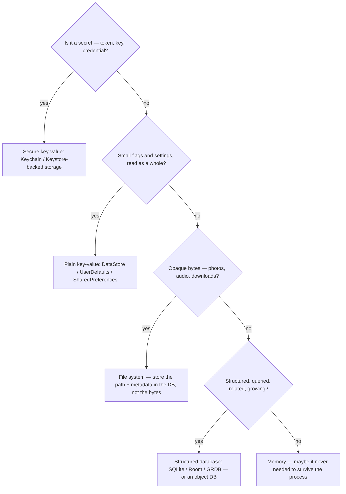
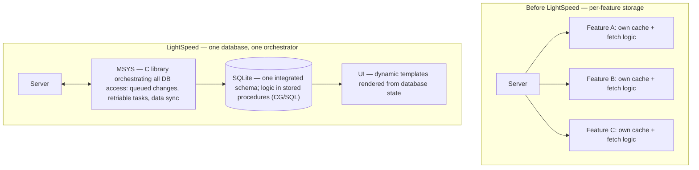

Open any mature mobile app and count the kinds of data it keeps on your phone. A dark-mode flag. An auth token. A list of contacts. A hundred thousand chat messages. The cryptographic session that encrypts those messages. Cached photos, half-downloaded videos, a draft you typed in an elevator with no signal.

All of it is "local data." And if you store those things the same way, you have already made your first architecture mistake — because a dark-mode flag and a hundred thousand messages have nothing in common: not size, not shape, not query patterns, not security requirements, not lifetime.

Yet the question developers actually ask is narrower and worse: _"SQLite or Realm? Which is faster?"_ — a benchmark question about one-fifth of the problem. Here is the whole article in one sentence:

> [!TIP]
> **Don't pick a database first — look at the data.** What is it, who owns it, who reads it, how is it queried, how long must it live? Answer those and the storage choice mostly makes itself — and the apps that store millions of messages all landed on the same answer for the hard part.

That claim needs receipts, so this post does three things: it lays out the five kinds of local storage every platform actually offers (only one of which is a database), it walks through how four real messengers — Messenger, Telegram, Signal, WhatsApp — store messages at a scale where storage mistakes are fatal, with sources graded by evidence quality, and it ends with the six questions that pick a storage engine better than any benchmark chart.

## Table of contents

## Not Everything Is a Database: The Five Kinds of Local Storage

Every platform — Android, iOS, Flutter, React Native — ships variations of the same five storage groups. Most storage mistakes are category mistakes: putting data in the wrong group, then blaming the tool.

**1. Memory.** The most underrated option. State that only matters while the app is alive — scroll positions, in-flight form input, a decoded image — doesn't need to survive the process, and persisting it buys you serialization bugs, stale-state bugs, and startup cost for nothing. The first storage question is not "where do I save this?" but "does this need saving at all?"

**2. Plain key-value.** `SharedPreferences` and DataStore on Android, `UserDefaults` on iOS, wrappers like `shared_preferences` in Flutter. Flat pairs of small values: settings, flags, the last-selected tab. It's a hash map with a disk behind it — that's the whole feature set. No queries, no relationships, no partial updates of large values.

**3. Secure key-value.** Same shape, different guarantee: backed by the hardware keystore — Keychain on iOS, Keystore-backed encrypted storage on Android. This is where secrets live: auth tokens, encryption keys, anything you'd rotate if the device were compromised. The mistake here is symmetric — secrets in plain preferences is a security bug; a thousand ordinary settings in secure storage is a performance bug.

**4. Structured database.** SQLite and everything standing on it (Room, GRDB, Drift), plus object databases like Realm. This group earns its complexity when the data is _structured, queried, related, and growing_: messages, contacts, orders, anything you filter, sort, join, paginate, or count.

**5. Files.** Photos, audio, video, downloads, exports — opaque bytes with a name. The rule the platforms converge on: big binary blobs go on the file system, and the _database stores the path plus metadata_, not the bytes. We'll see the strongest version of this rule in Signal's architecture below.

Five groups, and only one is a database. Calling everything "the database" is how token storage ends up in SQLite, messages end up in `SharedPreferences` JSON strings, and photos end up as blobs bloating a database file. The taxonomy is the first filter. The second is a decision tree the platform vendors have effectively already written.

## The Decision Tree the Platforms Already Wrote for You

You don't have to trust me on where the group boundaries are — Android's own documentation draws them, in unusually direct language.

On small settings, [the `SharedPreferences` page](https://developer.android.com/training/data-storage/shared-preferences) now points past itself: ["DataStore is the recommended modern alternative"](https://developer.android.com/topic/libraries/architecture/datastore). On when key-value stops being enough, [the DataStore page](https://developer.android.com/topic/libraries/architecture/datastore) is explicit: "If you need to support large or complex datasets, partial updates, or referential integrity, consider using Room instead of DataStore." And [Room](https://developer.android.com/training/data-storage/room) describes itself as an "abstraction layer over SQLite" adding "compile-time verification of SQL queries" — that is, the platform's blessed path into group four is still SQLite underneath.

Read those three sentences together and Google has answered the categorization question for you: small and flat → key-value; large, complex, related, partially updated → a real database; and the boundary between them is a property of the _data_, not a taste in libraries. Drawn as a tree:

The tree asks four questions in order: secrets go to hardware-backed secure storage before anything else; small whole-file settings go to key-value; opaque media bytes go to the file system with only their paths recorded in a database; and what remains — structured, queried, growing data — is the only branch that justifies a real database, while data that fails every test probably belongs in memory.

Notice what the tree does _not_ ask: "which database is fastest?" Four of the five branches are settled by the shape of the data alone. Only the last branch — structured, queried, growing — leaves a real choice. That choice is where the debate lives, so let's give it its fair hearing.

## SQLite vs Realm: Two Philosophies, Not Two Speeds

The structured-database branch has two genuinely different answers, and the difference is not speed — it's world-view.

**SQLite treats your data as relations.** Tables, rows, SQL, transactions — a model with half a century of theory behind it and a twenty-five-year-old embedded implementation that is probably [the most widely deployed database on Earth](https://www.sqlite.org/mostdeployed.html). Your objects are _projections_ of query results: you ask a question in SQL, you get rows, you map them. The model's power is the query layer — joins, aggregates, indexes, partial fetches — and its cost is the mapping layer — exactly the boilerplate Room and GRDB exist to absorb.

**Realm treats your data as live objects.** No SQL, no mapping: you persist objects, query them with a fluent API, and results are _live_ — a `RealmResults` collection updates itself when the underlying data changes, and [its `changes` stream](https://pub.dev/documentation/realm/latest/) pushes fine-grained notifications into your UI layer. The model's power is ergonomics and reactivity out of the box; its cost is that the database's object model and your app's object model become the same thing — schema, threading rules and object lifecycles reach directly into your code.

Both philosophies work. Both are fast enough for a settings screen, a todo app, and almost anything else small — which is why benchmark charts settle nothing: at the scale where both are instant, the benchmark is irrelevant, and at the scale where the choice hurts, the deciding factors are ones no benchmark measures — query complexity, migration story, how many platforms need to read the same file, and (as we'll see at the end) whether the engine will still be maintained in five years.

So instead of benchmarks, let's use evidence of a different kind. There is a category of app whose local database is the product: messengers. A chat app at scale stores _millions_ of rows, writes constantly, queries in every direction — conversations, search, unread counts, media galleries — and must do all of it offline. If any category of engineering team has been forced to get local storage exactly right, it's this one.

So: what do the apps that store millions of messages actually use?

## What the Messenger Evidence Shows — and How Much to Trust It

Four apps, four storage stories — but not four equally documented ones. For each app I'll flag the evidence grade: **★★★** means official engineering publications or open-source code you can read yourself; **★★** means credible third-party evidence (forensics, public tooling) without an official engineering account. The grades matter, because architecture folklore is full of confident claims about codebases nobody outside the company has seen.

### Messenger: the database becomes the app — ★★★

The best-documented case is Meta's 2020 Messenger rewrite, [Project LightSpeed](https://engineering.fb.com/2020/03/02/data-infrastructure/messenger/), because the team published the architecture and the numbers: the rewrite took the iOS app from over 1.7 million lines of code to 360,000, made it twice as fast to start, and cut the binary to roughly a quarter of its size.

What did they rebuild around? Not a framework — a database. One of the rewrite's four named principles was "leverage the SQLite database," and the article is specific about how far that went: "we leveraged the SQLite database as a universal system to support all the features." Before the rewrite, features each maintained their own caches and storage paths; afterwards, "we developed a single integrated schema for all features" — one shared relational model instead of forty private ones.

Then they went two steps further than most teams would dare. First, logic moved _into_ the database: Messenger extended SQLite with stored procedures, written in a purpose-built language Meta later open-sourced as [CG/SQL](https://engineering.fb.com/2020/10/08/open-source/cg-sql/), so business logic runs next to the data instead of being reimplemented per platform. Second, access got a single gatekeeper: in the article's words, "we built a platform (MSYS) to orchestrate all access to the database, including queued changes, deferred or retriable tasks, and for data sync support." MSYS is a cross-platform library built in C — which means iOS and Android stopped being two storage implementations and became two UIs over one shared core. In [a Software Engineering Daily interview](https://softwareengineeringdaily.com/2020/03/31/facebook-messenger-engineering-with-mohsen-agsen/), Messenger engineers describe the resulting database as the app's one source of truth — the UI renders what SQLite says, and everything else is sync machinery.

The diagram contrasts the two generations: before LightSpeed, each feature talked to the server and cached results its own way; after, a single C library (MSYS) mediates every read, write, queued change and sync against one SQLite file with one integrated schema, and the UI renders whatever that database contains.

Hold on to the shape of this: **the storage engine is SQLite, but the architecture is everything wrapped around it** — one schema, one access layer, sync built into the storage layer, logic compiled into the database. That pattern is about to repeat.

### Telegram: the company that wrote its storage engine three times — ★★★

Telegram's storage story is usually told wrong, so let's tell it from the source code — all of it is public.

The **flagship Android app** ([DrKLO/Telegram](https://github.com/DrKLO/Telegram)) stores messages in SQLite through its own JNI wrapper, centered on a class called [`MessagesStorage.java`](https://github.com/DrKLO/Telegram/blob/master/TMessagesProj/src/main/java/org/telegram/messenger/MessagesStorage.java) — an eighteen-thousand-line storage core that owns the database, its queue, and its dispatch thread. In [the first post of this series](/posts/what-architecture-layers-does-a-mobile-app-need) we measured this app as a one-module monolith; even there, storage is a distinct core the UI sits on top of, not something screens do for themselves.

The **flagship iOS app** ([Telegram-iOS](https://github.com/TelegramMessenger/Telegram-iOS)) doesn't reuse any of that. It has its own storage engine, a custom framework called **Postbox** — a purpose-built persistence layer over an encrypted store (the repo carries an `sqlcipher` submodule), with its own table abstractions, views, and transaction model.

And then there is **TDLib** ([core.telegram.org/tdlib](https://core.telegram.org/tdlib)) — Telegram's official client library, whose docs promise that "TDLib takes care of all network implementation details, encryption and local data storage." Inside, TDLib's storage is — again — [SQLite, encrypted with SQLCipher](https://github.com/tdlib/td). The API is explicit about the database's role: [`addLocalMessage`](https://core.telegram.org/tdlib/docs/classtd_1_1td__api_1_1add_local_message.html) persists a message only if the message database is enabled — persistence is a property of the core, toggled by configuration, invisible to the UI. One correction to a widespread assumption: TDLib is _not_ what the flagship apps run. It powers Telegram X and the third-party client ecosystem; the flagship Android and iOS apps each ship the engines above.

So Telegram wrote its storage engine three times — `MessagesStorage` for Android, Postbox for iOS, TDLib for everyone else — and all three converge on the same two decisions: SQLite-family storage underneath, and **persistence owned by a core layer below the UI**. When a company reimplements the same idea three times in three codebases, that's not habit — that's the architecture it believes in. TDLib is simply that belief productized: storage, sync and consistency packaged into a core so that a client above it can be written without touching any of them.

### Signal: a storage architecture is more than one database — ★★★

Signal adds the dimension the first two stories skip: what happens when the data is both _relational_ and _radioactive_.

On Android, messages live in a SQLite database encrypted with SQLCipher — Signal maintains [its own `sqlcipher-android` fork](https://github.com/signalapp/sqlcipher-android), kept compatible with the standard SQLite/Room interfaces. But the more instructive decision is what _doesn't_ go in that database. In [Signal's own words](https://signal.org/blog/storage-management-for-android/), the app stores "file attachments and media as encrypted blobs within the application sandbox" — media lives on the file system, encrypted file by file, while the database holds the metadata and the keys to those blobs. That's the "files are not database rows" rule from our taxonomy, enforced under the hardest possible constraint: everything must stay encrypted at rest _and_ the messages table must stay fast when a chat holds ten thousand photos.

iOS mirrors the same split with different libraries: Signal-iOS declares [GRDB.swift/SQLCipher](https://github.com/signalapp/Signal-iOS/blob/main/Podfile.lock) — Swift's mature SQLite toolkit, compiled against SQLCipher — for the message store, with media as encrypted files beside it. Two platforms, one architecture: an encrypted relational core for structured data, an encrypted file store for bytes, and a strict line between them.

Signal's lesson generalizes even if your app never touches cryptography: "local storage" is plural. The right design is usually two or three storage groups with clear responsibilities — not one engine forced to hold everything.

### WhatsApp: what the evidence actually shows — ★★

WhatsApp is the odd one out, and honesty about that is the point of the evidence grades. Meta has published detailed engineering accounts of WhatsApp's [multi-device sync](https://engineering.fb.com/2021/07/14/security/whatsapp-multi-device/) and [encrypted backups](https://engineering.fb.com/2021/09/10/security/whatsapp-e2ee-backups/) — but nothing comparable about its local message store. No LightSpeed-style article exists.

What we have instead is forensic-grade evidence: WhatsApp's Android databases are among the most-analyzed artifacts in mobile forensics, and tooling from [Magnet Forensics](https://www.magnetforensics.com/blog/artifact-profile-whatsapp-messenger/) and [Group-IB](https://www.group-ib.com/blog/whatsapp-forensic-artifacts/), plus a public ecosystem of parsers, consistently documents the same layout: messages in a SQLite database (`msgstore.db`), contacts and account data in another (`wa.db`), media as files with paths referenced from the database. That's a SQLite-family message store with a database/files split — the same shape as everyone else — but observed from the outside, so it gets ★★, not ★★★. Treat it as "consistently observed," not "officially explained."

### The scoreboard

| App | Message storage | Evidence |
| --- | --- | --- |
| **Messenger** | SQLite + stored procedures (CG/SQL), all access via MSYS (C) | ★★★ [official engineering blog](https://engineering.fb.com/2020/03/02/data-infrastructure/messenger/) |
| **Telegram** (flagship Android) | Own SQLite core via JNI ([`MessagesStorage`](https://github.com/DrKLO/Telegram)) | ★★★ open source |
| **Telegram** (flagship iOS) | [Postbox](https://github.com/TelegramMessenger/Telegram-iOS) custom engine + SQLCipher | ★★★ open source |
| **Telegram** (TDLib: Telegram X, third-party) | SQLite + SQLCipher inside [TDLib](https://core.telegram.org/tdlib) | ★★★ official docs + source |
| **Signal** (Android + iOS) | SQLCipher SQLite ([GRDB](https://github.com/signalapp/Signal-iOS/blob/main/Podfile.lock) on iOS); media as [encrypted files](https://signal.org/blog/storage-management-for-android/) | ★★★ official blog + source |
| **WhatsApp** (Android) | SQLite observed (`msgstore.db`, `wa.db`); media as files | ★★ forensic/public tooling |

Six storage systems across four companies, built by teams with effectively unlimited engineering budget — and every one of them lands on SQLite-family storage for messages. None uses an object database. And notice the second convergence, the quieter one: in every case the database sits _inside a core layer_ — MSYS, `MessagesStorage`, Postbox, TDLib, `SignalDatabase` — that owns queries, writes, and sync, with the UI reading from that core rather than touching storage directly.

That doesn't make SQLite the answer to every storage question — messengers are an extreme workload, and extremes distort. What the convergence actually tells you is _which properties won_ at the extreme: a queryable relational model, one owner for all access, files kept out of the database, and an engine whose maintenance nobody doubts. Which brings us back to the choice you face, and the six questions that decide it.

## Six Questions That Pick Your Storage Better Than Benchmarks

Run your actual data through these six, in order. They're the questions the messenger architectures above answer implicitly — made explicit.

**① How complex are your queries?** If you filter, sort, join, aggregate, search, and paginate — chat, commerce, anything list-heavy — you want a real query engine, and SQL's decades of expressiveness are the safe bet. If you only ever load objects by ID and show them, an object store's ergonomics are genuinely nicer and you'd be paying SQL's mapping tax for nothing.

**② How much data, growing how fast?** A hundred settings never need a database. A hundred thousand messages never fit in key-value. The dangerous middle — a few thousand records — is where bad choices survive until success kills them: pick for the size you'll be at in two years, because storage migrations are among the least fun migrations there are.

**③ How related is the data?** Messages belong to conversations, reference senders, carry reactions and attachments. The moment you're modelling relationships and need referential integrity, you're describing a relational database — that's [the exact boundary](https://developer.android.com/topic/libraries/architecture/datastore) Android's docs draw between DataStore and Room.

**④ How hot are the writes?** A settings store is written once a week; a message store is written on every keystroke of presence, every incoming message, every read receipt. High mutation rates need transactions, write queues, and an ownership model for who's allowed to write — this is why every messenger above funnels writes through one core (MSYS, `MessagesStorage`, Postbox) instead of letting features write wherever.

**⑤ Is local the source of truth, or a disposable cache?** If wiping local data loses nothing (a feed cache), simplicity wins and even "files of JSON" can be fine. If the app must work offline and local _is_ the truth until sync says otherwise — messages, drafts, outbox — then storage is your foundation layer, and it deserves schema design, migrations, and a sync-aware access layer. This distinction, more than any other, separates "cache in whatever's convenient" from "architect the database."

**⑥ Who — and what — needs to read the database?** The sleeper question, and the one that decides more real projects than benchmarks ever have. Background processes? Push-notification extensions on iOS that must open the store while the app is dead? Two platforms sharing one core, like MSYS? A future native module reading a database created from Flutter? Every reader you add is a compatibility contract, and SQLite's file format is the closest thing mobile has to a lingua franca — everything can open it. A proprietary engine's format is readable only by that engine's runtime, in the languages it supports. I learned this one the expensive way: my own chat app began life storing messages in Realm from Flutter, and the day part of the system needed to move into native code, the storage choice itself became the wall — the full migration war story (dual-read, shadow compare, cut-over) is a later post in this series.

For the common mobile cases, the six questions compress into a matrix:

| Data | Group | Reach for |
| --- | --- | --- |
| Settings, flags, small state | Key-value | DataStore / UserDefaults |
| Tokens, keys, credentials | Secure key-value | Keychain / Keystore-backed |
| Structured, queried, related, growing | Structured DB | SQLite via Room / GRDB / Drift |
| Object-shaped, by-ID access, reactive UI, single runtime | Structured DB | Object DB — with question ⑥ and the section below in mind |
| Media, documents, exports | Files | File system; path + metadata in the DB |
| Doesn't survive the process | Memory | Nothing — that's the point |

One row of that matrix still carries an asterisk, and it's time to deal with it directly.

## The Realm Postscript: Lifecycle Is a Selection Criterion Too

Realm deserves better than the "Realm is dead" one-liners it gets, so here are the facts, precisely.

On September 9, 2024, MongoDB announced the deprecation of Atlas Device Sync and the Realm device SDKs; the sync service shut down after September 30, 2025. The SDKs are **deprecated, not deleted**: the [realm-dart repository](https://github.com/realm/realm-dart) remains public and carries the deprecation notice, and local-only (non-sync) use continues on the last stable line — version 20 — or via the `community` branch MongoDB left for the ecosystem. Existing apps didn't stop working; new investment stopped arriving.

Realm's engineering was never the problem — the live-object model and [fine-grained change streams](https://pub.dev/documentation/realm/latest/) were genuinely good, and for reactive, object-shaped, single-runtime workloads it made teams fast. The lesson isn't "object databases are wrong." It's that **a storage engine is the longest-lived dependency in your app** — your UI framework can be swapped screen by screen, but your database follows your users around in a file on their phones. Its future maintenance, its ecosystem, its format's readability by other tools — these weigh more than any feature comparison, because you'll live with the choice for five or ten years. SQLite's unglamorous superpower is that its answer to "will this exist in a decade?" is [public-domain code, a frozen file format, and support commitments through 2050](https://www.sqlite.org/lts.html).

Choose storage the way you'd choose a foundation contractor: for who owns it, who else can work with it, and whether it will still be standing behind its work in ten years — not for the fastest quote.

## Frequently Asked Questions

**Is SQLite actually fast enough for 100k+ messages?**
Yes — with indexes and pagination, comfortably. The proof is the article above: Messenger, Telegram (three engines), Signal, and by all observable evidence WhatsApp run message stores in the millions of rows on SQLite-family storage. When chat feels slow, the cause is almost never the engine — it's missing indexes, unpaginated queries, or storage work on the UI thread, which is an access-layer problem. (Making a local DB _feel_ instant is [its own series on this blog](/series/message-systems).)

**Should I encrypt my local database?**
Match the threat to the data. Tokens and keys always go to secure storage — that's non-negotiable and free. Full-database encryption (SQLCipher, as Signal and Telegram-iOS and TDLib use) protects message content if the device's own sandbox and disk encryption are breached; it costs key-management complexity. A weather cache needs none of that. The four apps above encrypt because message content is their crown jewels — decide whether yours is.

**Is Realm dead?**
No — and precision matters here. Realm is _deprecated_: MongoDB announced the wind-down on 2024-09-09, Device Sync shut off after 2025-09-30, and local-only use continues on version 20 / the `community` branch, with the repo public but no longer actively developed by MongoDB. Existing apps keep running. The honest framing for _new_ projects: you'd be adopting a database whose vendor has left the building — weigh that against ecosystem-alive alternatives before falling in love with the API.

**DataStore or Room?**
Android's own docs settle it: [DataStore](https://developer.android.com/topic/libraries/architecture/datastore) for small, simple key-value or typed settings; Room the moment you need "large or complex datasets, partial updates, or referential integrity" — their words. If you're asking because your DataStore data grew lists and relationships, that's your answer.

**Do I need Room/GRDB/Drift, or is raw SQLite fine?**
The wrappers add compile-time-checked queries, migrations, and observable reads over the same engine — they remove boilerplate, not capability. Small teams should default to one. The reason to go raw is the messengers' reason: a custom cross-platform core (MSYS, TDLib) where the storage layer _is_ the product and owns its own dialect. If you're not building that, take the wrapper.

**Where do photos and videos go?**
The file system, always — with the path and metadata in the database. Every app in this article, including the most storage-obsessed engineering teams on the planet, keeps media out of the database; Signal even encrypts [each blob individually](https://signal.org/blog/storage-management-for-android/) rather than dragging gigabytes into SQLCipher. Databases are for data you query; files are for bytes you stream.

## Stop Asking "Which Database?"

"SQLite or Realm?" turns out to be the last question in the chain, not the first. Ask it first and you're choosing a hammer before surveying the house. Asked in order, the real chain goes: _what is this data — settings, secrets, structure, or bytes? Does it need to survive the process? Who owns it, how is it queried, how fast does it change, is local the truth or a cache — and who else will need to read it, on which platforms, five years from now?_

Walk that chain and most storage decisions stop being decisions: secrets were never going anywhere but the Keychain, media was never going anywhere but the file system, settings were never worth a schema. What's left — the structured, queried, growing core of your app — is where the four messengers' convergence is worth taking seriously: a relational store with a frozen format everyone can read, wrapped in one access layer that owns queries, writes and sync, sitting below the UI as [the first post's](/posts/what-architecture-layers-does-a-mobile-app-need) source-of-truth invariant made concrete.

The storage engine, it turns out, is the easy 10%. The architecture around it — who reads, who writes, who syncs, who migrates — is the 90% that decides whether your app is still standing in five years. The four biggest messengers on Earth agree on the 10%. The next post is about the 90%.

_Next in this series: [when an app is split into Flutter + native packages owned by many teams, how does a package use what the host owns — starting with the auth token?](/posts/how-does-a-flutter-module-get-a-token-from-the-native-host) Later: should the database live in Flutter or in a native core? What TDLib, Postbox and MSYS suggest about where a mobile app's data layer belongs — and what it costs to put it on the wrong side._
