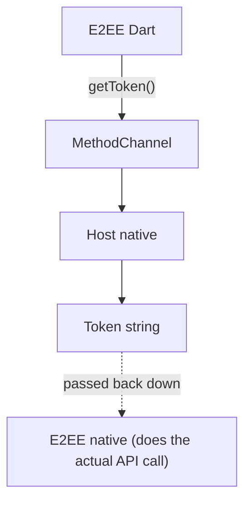
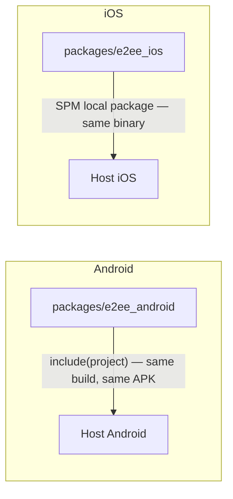
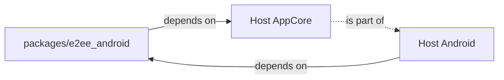
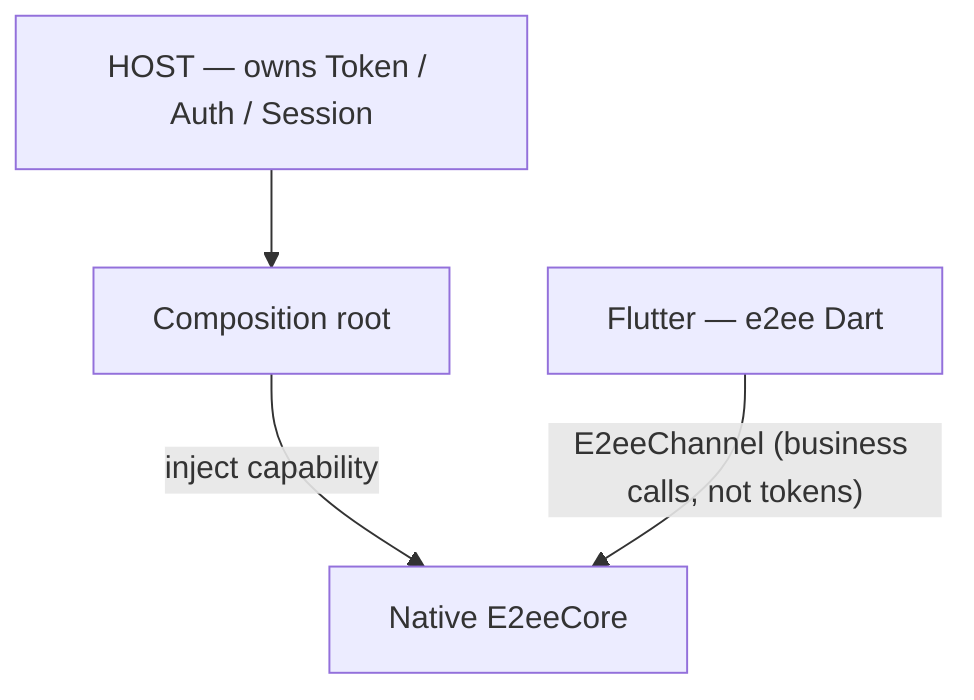
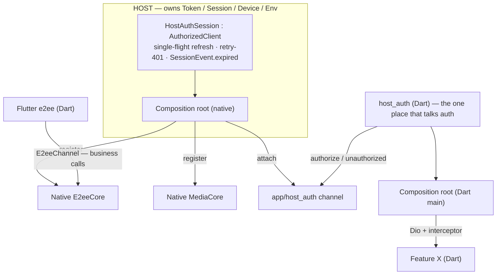
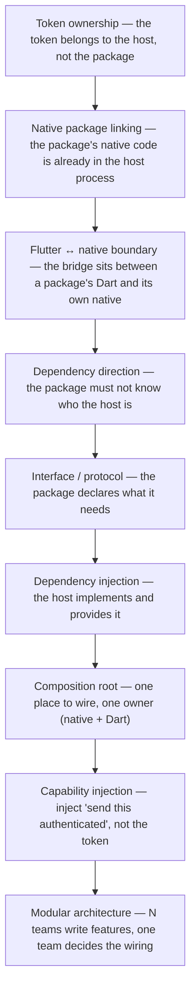

Our app used to be almost entirely Flutter. Then, for the usual reasons — performance, OS SDKs, a growing native team — it started moving down to native: the host app is now plain Android and iOS, and features are split into packages, one per team. Each package has three parts: Dart, Android, iOS.

```
One mobile app
│
├── Host App
│   ├── Native Android
│   └── Native iOS
│       └── owns Token / Session / Device / Environment ...
│
└── packages/**
    ├── e2ee
    │   ├── e2ee/           ← Dart
    │   ├── e2ee_android/   ← Kotlin
    │   └── e2ee_ios/       ← Swift
    ├── media
    │   └── ...
    └── feature_x
        └── ...
```

One day the E2EE team needs to call an API to upload a prekey bundle. The API wants a Bearer token. The token belongs to the host — the host is the thing that logged in, stores the session, knows the device id, knows which environment it's running against.

**E2EE needs to call an API. The token lives in the host. How does it get it?**

The token is only the first thing that makes the problem visible. Right behind it come device id, environment (staging/prod), feature flags, analytics, logging. The real question is: **how does code that lives in a package use capabilities and state that belong to the host?**

> [!TIP]
> **The package should never get the token.** Point the dependency from host to package — the package declares an interface for what it needs, the host implements it at one composition root — and inject a _capability_ ("send this request, authenticated") rather than a _value_ (the token string). Do that and shared refresh, retry and logout stop being N teams' problem and become one team's.

This post walks from the most naive version of the question to the answer we stopped at, and it will argue that the question in the title is asked in the wrong place. Assumptions throughout: the native host owns the session; packages live in a monorepo with their native parts included as source; E2EE and Media do networking in native, while Feature X calls REST from Dart with `dio`. If you're mid-migration and a Flutter shell still owns auth, there's a note at the end for you.

## Table of contents

## The Four Answers That Show Up in the Group Chat

When the E2EE team asked, four directions were proposed within five minutes:

```
Dart calls a MethodChannel to fetch the token?

              or

The E2EE native package calls the host's native code?

              or

E2EE just imports AppCore?

              or

The host injects a dependency into E2EE?
```

They sound like four ways of doing the same thing. They differ in one fundamental respect: **who depends on whom**. Take them one at a time.

## The Easy Answer: Dart Asks Native Over a MethodChannel

Because the package "is Flutter", the reflex is to let Dart ask native for the token:



The diagram shows the round trip: Dart in the E2EE package calls a MethodChannel, the host answers with the token string, and Dart then hands that string back down to the E2EE package's own native code, which is where the API call actually happens.

```dart
// packages/e2ee/e2ee/lib/src/host_token.dart
final _channel = MethodChannel('app/e2ee/token');

Future<String> getToken() async =>
    (await _channel.invokeMethod<String>('getToken'))!;
```

```kotlin
// Host Android
MethodChannel(messenger, "app/e2ee/token").setMethodCallHandler { call, result ->
    if (call.method == "getToken") result.success(sessionStore.accessToken)
}
```

It works. Three weeks later you meet three problems.

**One — the token takes a pointless detour.** E2EE encrypts and sends at the native layer (Kotlin/Swift, because that's where the fast crypto and the keystore are). The token is pulled from native up to Dart, then handed back down to the same package's native code to make the call. Two bridge crossings for a value that never needed to leave native.

**Two — N packages means N channels and N refresh strategies.** Media needs a token too, so it opens `app/media/token`. Feature X opens `app/feature_x/token`. Each team writes its own retry-on-401, decides for itself when to call refresh. Three teams, three understandings of the session lifecycle.

**Three — the token string is everywhere.** In the Dart heap of three packages, in someone's accidental log line, in a crash report. Whoever wants to change how tokens are stored (say, moving to keystore-backed storage) has three places to fix.

Note what the problem is _not_: MethodChannel is not slow. For a handful of calls per session, bridge cost is irrelevant. The problem is **ownership**: the token belongs to the host, and this design makes every package go fetch it and manage it.

## Reveal 1: E2EE's Native Code Is Already Inside the Host Process

This is the part it took us a beat to see, because our heads were still in "package = the thing on the other side of the bridge".

In a monorepo, the native part of a package is included straight into the host:

```kotlin
// Host Android — settings.gradle.kts
include(":e2ee_android")
project(":e2ee_android").projectDir = file("../packages/e2ee/e2ee_android")

// app/build.gradle.kts
dependencies {
    implementation(project(":e2ee_android"))
}
```

```swift
// Host iOS — Package.swift (or "Add Local Package" in Xcode)
dependencies: [
    .package(name: "E2eeCore", path: "../packages/e2ee/e2ee_ios"),
]
```



Both halves of the diagram say the same thing: on Android the package's Kotlin module is a Gradle subproject of the host build and ends up in the same APK; on iOS the package's Swift code is a local Swift package linked into the same binary. There is no bridge between them.

Which means this line in the host:

```kotlin
// Host Android
E2eeCore.register(...)
```

```swift
// Host iOS
E2eeCore.initialize(...)
```

is a **direct native call**. No Flutter in between. No channel. `E2eeCore` is an ordinary Kotlin/Swift class the host links and calls like any library.

That changes the question. Native E2EE and the host stand in the same process, on the same classpath. They don't need a bridge to talk. The bridge exists only between **E2EE's Dart** and **E2EE's native**.

And one small detail worth holding on to: `E2eeChannel` — the MethodChannel that E2EE's Dart side uses to call E2EE's native side — who registers it with the `FlutterEngine`? In add-to-app, the host creates the engine. So **the host attaches the channel**. Remember that; it comes back when we get to the composition root.

So if native E2EE and the host are already neighbours, why not just have `E2eeCore` call `AppCore.session.token` directly?

## So Should E2EE Import AppCore?

```kotlin
// packages/e2ee/e2ee_android
import com.example.appcore.AppCore   // ← this

object E2eeCore {
    suspend fun uploadPrekeys(bundle: PrekeyBundle) {
        val token = AppCore.session.accessToken
        api.post("/e2ee/prekeys", bundle, bearer = token)
    }
}
```

It compiles, it runs, and it draws a dependency arrow in this direction:



Read the arrows: the package depends on the host's AppCore, the host depends on the package, and AppCore is part of the host — a cycle. With one team the cycle is annoying. With many teams it's a slow-motion disaster:

- The package can't build on its own. Running E2EE's unit tests means pulling in AppCore, which means pulling in the host.
- Every time AppCore changes its API (`session.accessToken` becomes `session.current().token`), N packages break at once — and the people fixing them are N other teams, not the team that made the change.
- The package can't be reused in a second app, a sample app, or a test harness.

The fix is to **flip the arrow**: the package doesn't know who the host is. The package only declares _what it needs_, as an interface/protocol that lives inside the package. The host is the one that implements it.

```kotlin
// packages/e2ee/e2ee_android/src/main/kotlin/com/example/e2ee/HostCapabilities.kt
interface AuthorizedClient {
    suspend fun execute(request: ApiRequest): ApiResponse
}

interface DeviceInfo {
    val deviceId: String
}

object E2eeCore {
    private lateinit var client: AuthorizedClient
    private lateinit var device: DeviceInfo

    fun register(client: AuthorizedClient, device: DeviceInfo) {
        this.client = client
        this.device = device
    }

    suspend fun uploadPrekeys(bundle: PrekeyBundle) =
        client.execute(ApiRequest.post("/e2ee/prekeys", bundle))
}
```

```swift
// packages/e2ee/e2ee_ios/Sources/E2eeCore/HostCapabilities.swift
public protocol AuthorizedClient {
    func execute(_ request: ApiRequest) async throws -> ApiResponse
}

public enum E2eeCore {
    static var client: AuthorizedClient!
    public static func initialize(client: AuthorizedClient, device: DeviceInfo) { ... }
}
```

Now the arrow points one way only: the host depends on the package, and the host _implements_ the package's `AuthorizedClient`. The place the host does that is the **composition root** — the one spot in the app that knows how everything is wired together. On Android that's `Application.onCreate`; on iOS, `AppDelegate` (or your host's DI graph if you use Hilt or Swinject — this post is about where the wiring stands, not which framework holds it).

```kotlin
// Host Android — Application.kt
class HostApp : Application() {
    lateinit var session: HostAuthSession

    override fun onCreate() {
        super.onCreate()
        session = HostAuthSession(TokenStore(this), AuthApi(env))

        // Native packages receive capabilities directly
        E2eeCore.register(client = session, device = AndroidDeviceInfo(this))
        MediaCore.register(client = session)

        // The host creates the Flutter engine → the host attaches each package's Dart-side channel
        val engine = FlutterEngine(this).apply {
            dartExecutor.executeDartEntrypoint(DartEntrypoint.createDefault())
        }
        E2eeChannel.attach(engine.dartExecutor.binaryMessenger, E2eeCore)
        MediaChannel.attach(engine.dartExecutor.binaryMessenger, MediaCore)
        FlutterEngineCache.getInstance().put("main", engine)
    }
}
```

This is "the host injects a dependency into E2EE" — the fourth answer from the group chat. It was never one of four equal options. It's the only one that keeps the dependency direction right.

A follow-up question that always comes: should `AuthorizedClient` live in each package, or in one shared package? Both are defensible; it depends what you're optimising for. Each package declaring its own interface gives total independence, at the cost of the host writing an adapter per package. A thin `host_contracts` package (interfaces only, no implementation, owned by the platform team) is DRY-er, and three teams share one definition. We chose `host_contracts` — and we keep it _interfaces only_, because the day it grows an implementation is the day it becomes a second AppCore.

## Reveal 2: Flutter Doesn't Necessarily Need the Token

Back to the title: "How does a Flutter module get a token from the native host?"

For E2EE, the answer is: **it doesn't**. E2EE's Dart side only needs to call E2EE's native side:

```dart
// packages/e2ee/e2ee/lib/e2ee.dart
class E2ee {
  static const _ch = MethodChannel('app/e2ee');

  static Future<void> uploadPrekeys(PrekeyBundle b) =>
      _ch.invokeMethod('uploadPrekeys', b.toJson());
}
```

The native handler for that channel calls `E2eeCore.uploadPrekeys`, and `E2eeCore` has had an `AuthorizedClient` since the host registered it. The token never went up to Dart, and never crossed a channel.



The diagram shows the shape we've reached: the host owns the session and, at its composition root, injects a capability into the native `E2eeCore`; Flutter's E2EE code talks to that native core over a channel that carries business calls, never a token.

Here I have to be honest, because "Flutter doesn't need the token" is only true when the package does its networking in native. **Feature X isn't like that.** Feature X is a pure-Dart screen that calls REST with `dio`, and there is no reason to push its networking down to native just because of a token.

So how does Feature X get the token? Same principle: **Feature X doesn't get the token either. Feature X receives an HTTP client that is already authorised.**

The platform team owns a Dart package, `host_auth`. It provides a `dio` interceptor, and that interceptor is **the one place** in the entire Dart codebase that talks to native about auth — over **exactly one channel**:

```dart
// packages/host_auth/lib/host_auth.dart  (owned by the platform team)
class HostAuthInterceptor extends Interceptor {
  static const _ch = MethodChannel('app/host_auth');

  @override
  Future<void> onRequest(RequestOptions o, RequestInterceptorHandler h) async {
    final headers = await _ch.invokeMapMethod<String, String>('authorize');
    o.headers.addAll(headers!);
    o.extra['authUsed'] = headers['Authorization'];
    h.next(o);
  }

  @override
  Future<void> onError(DioException e, ErrorInterceptorHandler h) async {
    if (e.response?.statusCode != 401) return h.next(e);
    // Don't refresh here. Tell native "this token just got a 401"; native decides.
    await _ch.invokeMethod('unauthorized', {'stale': e.requestOptions.extra['authUsed']});
    h.resolve(await _retry(e.requestOptions));   // re-send; onRequest authorises again
  }
}
```

The Dart-side composition root — the Flutter module's `main()` — plugs the interceptor into one `Dio` and hands it to features through whatever DI you already use:

```dart
// flutter_module/lib/main.dart
void main() {
  final dio = Dio()..interceptors.add(HostAuthInterceptor());
  runApp(AppRoot(dio: dio));   // Feature X receives Dio via constructor / provider
}
```

Feature X depends on `Dio` (or on its own small `ApiClient` interface if you want it cleaner). It does **not** import `host_auth`, doesn't know there's a channel, doesn't know what a token is.

So there are **two composition roots** — `Application`/`AppDelegate` on the native side and `main()` on the Dart side — but **one owner**: the platform team. That's the crux. Many teams write features; one team decides how capabilities are wired.

One unavoidable truth: if Dart makes the HTTP call, the token _is_ in Dart process memory at the moment the request goes out. What you control is not whether it's there but that **only one place (the `host_auth` interceptor) ever touches it**, and no feature has a handle to reach it. If you want to go further, push `execute(request)` itself down to native over the channel — doable, but heavy, and you lose everything `dio` gives you; we didn't take that road for pure-UI features.

## Reveal 3: What Gets Injected Is Not a Token

Twice now we've said "inject a capability", and twice the thing was named `AuthorizedClient`, not `TokenProvider`. That isn't naming taste. It's where the second half of the original problem gets solved: **one refresh mechanism shared by everyone**.

Suppose you inject this instead:

```kotlin
interface TokenProvider {
    suspend fun accessToken(): String
}
```

Reasonable, small, everyone understands it. And it forces every package to answer these questions on its own: what happens on 401? Where does refresh get called? Who stores the result? What if another request arrives while a refresh is in flight?

Picture the app reopening after a night away, access token expired. In the first 200 ms, E2EE syncs prekeys, Media fetches an upload URL, Feature X loads the feed. Three requests, three 401s, three parallel refresh calls. If the server rotates refresh tokens (common), the first refresh succeeds and invalidates the old refresh token; the second and third use exactly that old refresh token → the server rejects them → some package concludes "the session is broken" → the user is dumped on the login screen having done nothing wrong. It's a bug that is very hard to reproduce, and no team can see that it was theirs.

The cure is not "every team, remember to single-flight". The cure is **don't give packages the token in the first place**. The package receives a capability one level up: _"send this request for me, authenticated."_ All of refresh, retry and contention lives in the host, written once.

```kotlin
// Host Android — the only implementation of AuthorizedClient
class HostAuthSession(
    private val store: TokenStore,
    private val authApi: AuthApi,
    private val http: HttpClient,
) : AuthorizedClient {

    private val refreshLock = Mutex()
    private val _events = MutableSharedFlow<SessionEvent>()
    val events: SharedFlow<SessionEvent> = _events

    override suspend fun execute(request: ApiRequest): ApiResponse {
        val used = store.accessToken()
        val first = http.send(request.withBearer(used))
        if (first.code != 401) return first

        refreshIfStale(used)
        return http.send(request.withBearer(store.accessToken()))  // retry exactly once
    }

    private suspend fun refreshIfStale(stale: String) = refreshLock.withLock {
        if (store.accessToken() != stale) return          // someone already refreshed
        val fresh = authApi.refresh(store.refreshToken())
            ?: run { _events.emit(SessionEvent.Expired); throw SessionExpired() }
        store.save(fresh)
    }
}
```

The important part is two lines: `withLock`, so only one refresh runs at a time, and `if (store.accessToken() != stale) return`, so the requests queued behind the lock _don't_ refresh again but use the fresh token. Three concurrent 401s → one refresh → three successful retries.

On iOS an `actor` gives you serialisation for free, but you still need the same "stale check + one in-flight task" logic:

```swift
actor HostAuthSession: AuthorizedClient {
    private var inflight: Task<Void, Error>?

    func execute(_ request: ApiRequest) async throws -> ApiResponse {
        let used = store.accessToken
        let first = try await http.send(request.withBearer(used))
        guard first.status == 401 else { return first }
        try await refreshIfStale(used)
        return try await http.send(request.withBearer(store.accessToken))
    }

    private func refreshIfStale(_ stale: String) async throws {
        if store.accessToken != stale { return }
        if let task = inflight { return try await task.value }
        let task = Task { defer { inflight = nil }
            guard let fresh = try await authApi.refresh(store.refreshToken) else {
                events.send(.expired); throw SessionExpired()
            }
            store.save(fresh)
        }
        inflight = task
        try await task.value
    }
}
```

And `SessionEvent.Expired` handles the last thing a `TokenProvider` can never do: **logout that propagates**. When a refresh truly fails, the host emits one event; the Flutter shell listens to navigate to login, E2EE listens to stop syncing, Media listens to cancel uploads. No package decides "the session is broken" on its own — only one place knows that.

### The escape hatch, on purpose

Sometimes a package _genuinely_ needs the raw token: opening a websocket with hand-built headers, or a third-party SDK that insists on `setAuthToken(String)`. For those, the host offers a lower-level capability whose name says it's an exception:

```kotlin
interface RawTokenAccess {
    suspend fun current(): String
    val changes: Flow<String>      // so a websocket can reconnect with the new token after refresh
}
```

Our rule: using `RawTokenAccess` requires stating why in the PR. Not to make life hard, but so that every time someone reaches for the raw token, the team pauses for one second and asks "do we actually need this?"

### Dart follows the same rule

Look back at `HostAuthInterceptor`: on 401 it does **not** call refresh. It calls `unauthorized(stale)` — telling native this token was just rejected — and retries. Native runs exactly the `refreshIfStale` above. So even with two `FlutterEngine`s, three isolates and ten Dart packages, there is still **one** place that refreshes, one `Mutex`, one source of truth about the session. Dart doesn't cache the token, doesn't run a pre-expiry timer, has no session logic at all.

## The Whole Picture



Reading top to bottom: the host owns the session and implements `AuthorizedClient` once, with single-flight refresh, one retry on 401 and an expiry event; at its native composition root it registers that capability into the native cores of E2EE and Media and attaches the single `host_auth` channel; Flutter's E2EE code reaches its native core over a business channel; and on the Dart side, `host_auth` is the only code that talks to that auth channel, feeding a configured `Dio` to features from the Dart composition root.

And the ladder this post climbed, one rung at a time:



The ladder runs from the concrete fact (who owns the token) through what that implies about linking, boundaries and dependency direction, to the design moves it forces — interfaces, injection, a single composition root — and ends at the organisational payoff: many teams writing features against contracts that one team owns.

## Where the Original Question Went Wrong

"How does a Flutter module get a token from the native host?" is wrong in three words.

**"Flutter"** — the thing that needs the capability isn't Flutter, it's the _package_. A package has Dart and native, and its native half is already standing inside the host.

**"get"** — the package shouldn't go and get anything. The package declares a need; the host delivers. The direction of that arrow decides whether your app still builds once you have ten teams.

**"token"** — what the package needs isn't a token, it's the ability to make authenticated API calls. The token is an implementation detail of that ability, and refresh, rotation and logout are the things that travel with that detail — they belong in one place.

Next time a package needs something from the host (device id, environment, feature flag, analytics), the checklist we use:

1. **What is the capability, really?** Not "needs a token" but "needs to call the API authenticated". Not "needs the environment string" but "needs to know the base URL".
2. **Who owns it?** If it's the host, the package has no logic about it.
3. **The interface lives in the package** (or in an interfaces-only `host_contracts`). The package builds and tests against a fake.
4. **The host implements it at the composition root** — native and Dart, one owner.
5. **Don't let sensitive state cross the boundary** when a higher-level capability can be injected instead.

## Frequently Asked Questions

**Isn't a MethodChannel round trip too slow for this anyway?**
No — and that's deliberately not the argument. A few auth calls per session cost nothing measurable. If you optimise the design around bridge latency you'll land on "cache the token in Dart", which is precisely the ownership mistake. The reason not to pass the token is who owns refresh, not how many microseconds a channel costs.

**Where should the `AuthorizedClient` interface live — every package, or one shared package?**
Either works; pick based on what you're optimising. Per-package interfaces maximise independence at the cost of one adapter per package in the host. A shared, interfaces-only `host_contracts` package is DRY-er and gives every team the same vocabulary. Whichever you choose, the rule that matters is _no implementation in the contracts package_ — that's how it stays a contract and doesn't become AppCore v2.

**What if a Flutter shell still owns auth during migration?**
Then the arrow flips for now: Dart owns the session, native packages declare `AuthorizedClient` in Kotlin/Swift, and the implementation they receive is an adapter that calls back up to Dart over a channel. It looks backwards, but the principle is identical: whoever owns it implements it, whoever needs it declares an interface, and only one place refreshes. The day the native host takes over the session, you swap the implementation at the composition root; the interface inside the package doesn't change a line.

**Does this apply to Pigeon-generated channels too?**
Yes. Pigeon changes _how_ the channel is typed, not _who_ owns what crosses it. A typed `getToken()` is still a package fetching a value the host owns; a typed `authorize()` behind a `host_auth` package is still one owner. Use Pigeon for the type safety, keep the direction.

## Stop Asking Where the Token Is

The question everyone asks is "how does my Flutter module get the token?" — and the honest answer is that a module that has to ask is already wired the wrong way round. Once the native half of the package turns out to be a plain library inside the host, the whole problem collapses into a dependency-direction problem, and dependency-direction problems have one known solution: the thing that needs declares, the thing that owns implements, and one composition root does the wiring.

Get that right and the token stops being interesting. What's left is the part that actually bites at scale — one refresh, one retry policy, one logout signal, shared by ten teams who never had to agree on any of it, because none of them ever held the token.

That's the whole reason to get something as small as a token right.

_Next in this series: [Half Flutter, Half Native: Who Owns Navigation Mid-Migration?](/posts/half-flutter-half-native-who-owns-navigation-mid-migration/) — the same ownership question, asked of the back stack. Then the same dependency-direction question asked of the data layer — should the database live in Flutter or in a native core? What TDLib, Postbox and MSYS suggest about where a mobile app's data layer belongs, and what it costs to put it on the wrong side._
