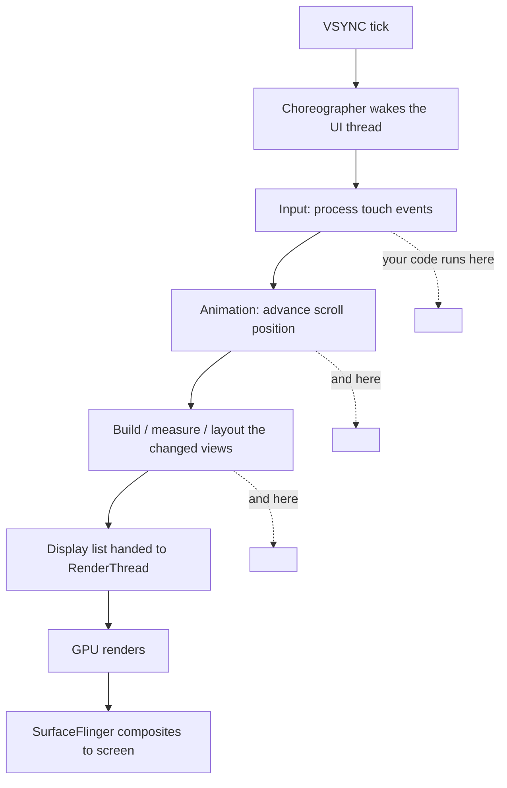
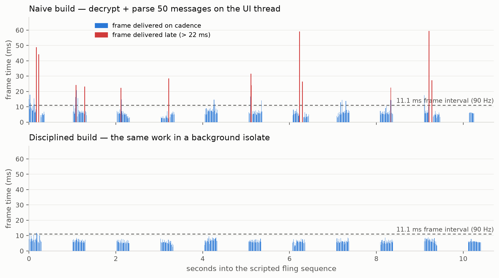
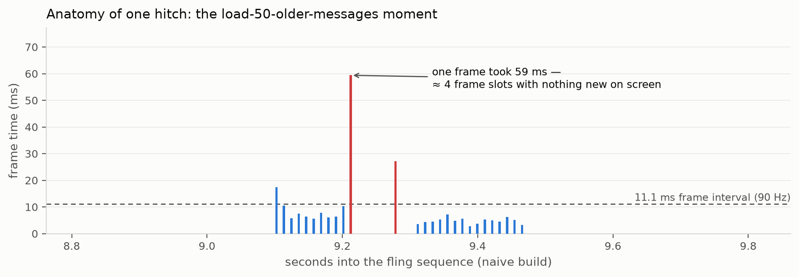

I spent weeks making my chat app's messages _load_ fast. Cache layer, cursor pagination, prefetch on scroll, decryption pulled off the hot path — the works. Payloads that used to take half a second now arrive in double-digit milliseconds. I was proud of those numbers.

Then I flicked my thumb through the message history, and the list hiccuped anyway.

That hiccup sent me down the rabbit hole this post climbs back out of. Loading is a _data_ problem; smoothness is a _rendering_ problem — and I had spent weeks solving the first while the second was the one my thumb could feel. Here is the whole article in one sentence:

> [!TIP]
> **A fast response and a smooth scroll are two different budgets.** Data latency is measured in hundreds of milliseconds, once per request. A frame gets ~16.7ms (11.1ms on the 90Hz phone in this post) — and it gets judged 90 times per second, the entire time a finger is moving.

## Table of contents

## Fast Data, Stuttering Pixels: Two Different Problems

When my optimized messages still stuttered, my first instinct was to blame the network layer harder. But the network is one segment of a longer pipeline:

```
server → network → parse → decrypt → state update → build/layout → raster → display
```

Everything I had optimized lives in the first half. Everything my thumb was feeling lives in the second — and the second half runs on the device, mostly on one thread, under a deadline.

The deeper difference is _when you pay_. Latency is episodic: you pay it once per request, and a spinner can absorb it. Rendering is continuous: while a finger is down, the app owes the screen a completely new picture 60–120 times per second, and there is no spinner for a late frame. Optimizing the episodic cost did nothing for the continuous one.

## Your Screen Is a Flipbook

A frame is one complete picture of your UI. Motion on a screen is a flipbook: draw a picture, swap it, draw the next. Film gets away with 24 pictures per second because each photograph carries natural motion blur; a UI renders razor-sharp frames with no blur to smooth the transitions, so it needs 60 or more per second before the eye reads the sequence as motion instead of stutter.

Scrolling is the most frame-hungry thing an app does. A tap changes one widget; a fling changes _everything_ — every frame during the scroll has a different content offset, so every frame is a genuinely new picture. That's why an app can feel perfectly fine on every screen and fall apart the moment you scroll: scrolling is where the flipbook runs at full speed.

So who draws these pictures, and how long do they get?

## The 16.7ms Contract (11.1ms on My Phone)

At 60Hz, the display shows a new picture every 1000 ÷ 60 ≈ 16.7 milliseconds. That's not a target — it's a contract with a penalty clause. Android's [rendering vitals](https://developer.android.com/topic/performance/vitals/render) spell it out: "To achieve 60 fps, your app must render frames in under 16ms. If you overrun this window by 1ms, Choreographer drops the frame entirely."

Miss by one millisecond and you don't get a slightly-late frame — you get _no_ frame. The previous picture stays on screen for another full interval, and the motion your eye was tracking stumbles.

The budget shrinks as displays get faster:

| Display | Budget per frame |
| ------- | ---------------- |
| 60 Hz   | 16.7 ms          |
| 90 Hz   | 11.1 ms          |
| 120 Hz  | 8.3 ms           |

One honest note before any of my numbers below: my test phone (OPPO Reno14 5G) runs a 90Hz panel, so its real budget is **11.1ms** — and because the panel switches refresh rates dynamically, my measurement harness logs vsync timestamps and confirms the actual cadence during every run (it held ~91Hz). I'll say which threshold applies every time a number appears; 16.7ms remains the industry convention.

Notice the irony: the high-refresh display your phone's marketing brags about makes the engineering problem _harder_. A 120Hz panel is a promise your code has to keep every 8.3ms.

## From Finger to Pixel: The Pipeline Nobody Shows You

Here is what actually happens between your finger moving and pixels changing, one frame at a time — Android's version, with the other frameworks' names in the table below:



The diagram traces one frame: the display's VSYNC signal starts the clock, [Choreographer](https://developer.android.com/topic/performance/vitals/render) coordinates the work, the UI thread processes input and builds the frame, then hands a display list to the RenderThread, which drives the GPU. Everything from input to layout runs on one thread — and that thread must finish its share well inside the frame budget, every frame.

Cross-platform frameworks rename the parts but keep the shape:

|                | UI work runs on                                                                                                                                             | Pixels produced by      |
| -------------- | ----------------------------------------------------------------------------------------------------------------------------------------------------------- | ----------------------- |
| Android native | main thread (Choreographer phases)                                                                                                                          | RenderThread → GPU      |
| Flutter        | UI thread running Dart ([merged with the platform thread since 3.29](https://docs.flutter.dev/resources/architectural-overview))                            | raster thread → GPU     |
| React Native   | JS thread computes, then the UI thread — the ["only thread that can manipulate host views"](https://reactnative.dev/architecture/threading-model) — applies | platform renderer → GPU |

Different names, same chokepoint: **every framework has exactly one thread that must be free at the moment a frame is due.** Remember that sentence; the whole article turns on it.

## When a Frame Is Late, Your Eye Files the Bug

Android's vitals give the failure modes official names: slow frames are ["UI frames that take between 16ms and 700ms to render"](https://developer.android.com/topic/performance/vitals/render), frozen frames are "UI frames that take longer than 700ms to render." Past that lives [ANR territory](https://developer.android.com/topic/performance/vitals/anr) — five seconds of blocked input and the system offers to kill your app.

But jank has a texture that averages hide. One late frame among ninety is invisible. A _cluster_ of late frames right when the user is mid-fling is what people describe as "laggy" — the eye is tracking smooth motion, the motion stalls for three or four intervals, then jumps to catch up.

Readers of [the first post in this series](/posts/is-the-framework-really-why-your-app-is-slow) may remember an inconvenient detail: in my naive-vs-disciplined feed experiment, scroll jank was the one metric discipline _barely moved_ — 0.5% vs 0.0% janky frames, a near-tie, even though the naive build wasted a gigabyte of memory. A 2025 upper-mid phone simply absorbed an image feed's rendering load.

I now think that near-tie was the most instructive number in the whole experiment, because of _what the workload wasn't doing_: nothing ever landed on the UI thread mid-fling. A chat thread is a different animal. Scroll back through history and somewhere near the top of the loaded messages, the app must fetch, decrypt, and parse fifty older messages — _while the fling is still animating_. That collision is this article's experiment. First, the last piece of theory — the one that fooled me personally.

## The 100ms Illusion

I came to mobile with a web habit: **100ms = instant**. That number is real and well-sourced. Google's [RAIL model](https://web.dev/articles/rail) says to "Complete a transition initiated by user input within 100 ms, so users feel like interactions are instantaneous." [Nielsen's response-time limits](https://www.nngroup.com/articles/response-times-3-important-limits/) — unchanged since the 1960s — put 0.1 seconds as the threshold where a system feels like it's reacting instantaneously.

So my chat app's ~80ms message loads were "instant," and I mentally filed the performance work as done. Here's the trap: **100ms is a budget for a response — tap, then feedback. It is not a budget you may spend during motion.** During a fling the budget is per-frame. Do the arithmetic that I didn't do:

- 100ms ÷ 16.7ms ≈ **6 refresh intervals** at 60Hz
- 100ms ÷ 11.1ms ≈ **9 refresh intervals** on my 90Hz phone

An "instant" 100ms of work, executed on the UI thread mid-fling, freezes the flipbook for six to nine pages. Instant by the response clock; a visible, name-able stutter by the frame clock.

And the real frame budget is smaller than the theoretical one. Facebook's iOS team measured it while [rebuilding News Feed scrolling in 2015](https://engineering.fb.com/2015/06/25/ios/delivering-high-scroll-performance/): after the OS takes its share of each interval, the app typically has "only 8 to 10 ms of main thread processing" before it drops a frame — not the full 16.6ms. Two clocks, then: ~100ms for responses, single-digit milliseconds for anything that touches the UI thread during motion. My app passed the first clock and failed the second — and only the second one has no spinner.

## Back to My Chat Screen, This Time With Numbers

Theory says a chat history load landing mid-fling should jank in a way the image feed didn't. I extended the same public repo from post #1 — [mobile-perf-ab-demo](https://github.com/hkngoc/mobile-perf-ab-demo) — with a chat scenario to check: one Flutter codebase, two entrypoints, pixel-identical UI, identical total work.

The scenario: a group-chat thread in a reversed list. Flinging back through history crosses a trigger that loads **50 older messages** — and each message is stored encrypted, the way an E2EE app's local store works, so a load means base64-decode → real AES-256-CBC decrypt → JSON parse → model map, fifty times. Payloads have the weight of a real chat: mixed text lengths, replies, reactions, and ~30% of messages carrying an 8KB inline link-preview thumbnail. No artificial sleeps, no sabotage — the deterministic corpus generator and both variants are in the repo.

| Concern                         | Naive build                                                             | Disciplined build                                                                           |
| ------------------------------- | ----------------------------------------------------------------------- | ------------------------------------------------------------------------------------------- |
| Page decrypt + parse (50 msgs)  | Synchronously on the UI isolate, inside the scroll callback — mid-fling | The exact same function, in a [`compute()` isolate](https://docs.flutter.dev/perf/isolates) |
| State insert                    | One 50-item `setState`                                                  | Two chunks across frames                                                                    |
| List                            | `ListView.builder`, no extent                                           | `ListView.builder` + `itemExtent`                                                           |
| Avatars (3000px assets at 36px) | Full-resolution decode                                                  | `cacheWidth` sized to display density                                                       |

**Methodology** (same as post #1): release builds, Flutter 3.29.3 with Impeller, OPPO Reno14 5G / Android 16 / 90Hz — measured cadence ~91Hz, so the budget is **11.1ms**. Frame timings self-reported via Flutter's [`FrameTiming` API](https://api.flutter.dev/flutter/dart-ui/FrameTiming-class.html) (Android's `gfxinfo` can't see Flutter frames), identical scripted fling sequence crossing the load trigger 7–8 times per run (the per-page work is identical; the naive build's stalls slightly change how far each fling travels, so naive runs typically crossed it once more), **10 runs per variant**, alternating A/B to spread thermal effects. Raw logs are in the repo. Unlike post #1, no workload escalation was needed — the first realistic corpus produced the gap.

| Metric, median of 10 runs (range)          | Naive                           | Disciplined                    |
| ------------------------------------------ | ------------------------------- | ------------------------------ |
| UI thread blocked per load                 | **36.5ms** (25–93)              | ~0 (work in isolate)           |
| Janky frames, build or raster > 11.1ms     | **6.3%** (4.2–7.2)              | **0.0%** (0.0–0.7)             |
| Frames delivered late (totalSpan > 22.2ms) | 4.6% — ~26 missed intervals/run | **0.0%** — zero in all 10 runs |
| Worst frame (totalSpan)                    | **58.5ms** (46.2–95.9)          | 13.1ms (11.5–19.8)             |
| Frame wait on busy UI thread, p99          | 35.9ms                          | 2.2ms                          |

This is the collision the theory predicted. Here is what it looks like, frame by frame, in a representative run of each build:



Every red spike in the naive timeline is a history load landing mid-fling. Zoom into one:



That is the anatomy of the stutter my thumb felt: the fling is animating at 90Hz, the decrypt+parse lands on the UI thread, and for ~4 frame slots the screen shows the same stale picture while the finger keeps moving. Then a jump, as the scroll position catches up at once.

Three readings, in the order they taught me:

1. **The naive build's loads were "fast."** 36.5ms median to decrypt and parse fifty encrypted messages is objectively quick — far inside my old 100ms "instant" budget. It janked anyway, because ~36ms on the UI thread mid-fling is three consecutive dropped 11.1ms frames. The 100ms illusion, measured.
2. **The disciplined build didn't miss a single interval in any run** — not because it does less work, but because the identical work runs on a `compute()` isolate while the UI thread keeps its appointments. Its worst frame across all ten runs was 19.8ms; the naive build's _median_ worst was 58.5.
3. **This is the near-tie's other half.** Post #1's image feed never put work on the UI thread mid-fling, so discipline couldn't show a scroll gap there. Give the UI thread a mid-fling job — the defining workload of a chat app — and the same phone that absorbed a gigabyte of image waste drops frames immediately. Jank isn't about how strong the device is; it's about what's on the one critical thread at the moment a frame is due.

## What the Big Chat Apps Actually Do

If keeping the UI thread free is the whole game, the apps that scroll through million-message histories should be obsessed with it. They are — though I'll be upfront about the evidence: **neither Telegram nor Instagram has published an engineering post on scroll rendering** (I looked). For Telegram, the strongest first-party evidence is its open-source Android client itself. So that's what I read.

**Telegram draws each message bubble by hand.** One message on screen is not a tree of nested layout views — it's a single cell, [`org.telegram.ui.Cells.ChatMessageCell`](https://github.com/DrKLO/Telegram/blob/master/TMessagesProj/src/main/java/org/telegram/ui/Cells/ChatMessageCell.java), a ~29,000-line class that renders text, media, reactions, and animations directly onto a `Canvas` with `Paint` and `StaticLayout` objects. (The code is GPL; I'm describing it, not copying it.) Twenty-nine thousand lines for one cell is a wild price — paid because measuring and laying out nested view trees is exactly the per-frame work that blows an 11ms budget on a fast scroll.

**Meta's Litho attacks the same chokepoint from the other side.** Their declarative Android UI framework — [open-sourced in 2017](https://engineering.fb.com/2017/04/18/android/open-sourcing-litho-a-declarative-ui-framework-for-android/) — moves "CPU-intensive measure and layout operations away from the main thread," renders complex views incrementally by "spreading the work across multiple frames," and reported "improvement in scroll performance of up to 35 percent." Async layout, incremental mount: scheduling, not magic. Two years earlier, the same team had already [split News Feed stories into multiple smaller ListView items](https://engineering.fb.com/2015/01/28/android/fast-rendering-news-feed-on-android/) — 17% fewer out-of-memory errors, 10% lower peak frame-render time — the humblest version of the same idea: never give the main thread a bigger unit of work than one frame can afford.

**Messenger's rewrite is the appetite, not the scroll evidence.** [Project LightSpeed](https://engineering.fb.com/2020/03/02/data-infrastructure/messenger/) made "Messenger... twice as fast to start" and "reduced the core codebase by 84 percent, shrinking it from more than 1.7M lines to 360,000," rebuilt around "SQLite as a universal system supporting all features." Honest framing: those are _startup and architecture_ numbers — Meta published no scroll metrics for it. I cite it for the direction of travel: less code between the data and the screen.

Reading these side by side, no shared trick emerges — a hand-drawn canvas cell, an async layout engine, a database-centric rebuild. What they share is the invariant every one of those bets protects, and it's this article's one-thread sentence again: **the main thread is free at the moment a frame is due.** That conclusion is mine, not theirs — but after measuring my own chat screen, I believe the invariant is the product, and every technique is just a way to buy it.

## Don't the Frameworks Handle This?

Partly — and knowing which part is exactly where post #1 and this post divide the world.

Every framework's rendering architecture works to get _its own_ work off the critical thread. Native Android splits frame production between the main thread and RenderThread. Flutter builds on its UI thread and rasterizes on a dedicated raster thread, and its [Impeller renderer](https://docs.flutter.dev/perf/impeller) "precompiles a smaller, simpler set of shaders at engine-build time" — eliminating the shader-compilation hitches that were Flutter's most infamous first-run jank. React Native's [Fabric renderer](https://reactnative.dev/architecture/fabric-renderer) runs its commit phase on a background thread and computes layout off the UI thread it must eventually touch.

What none of them can do is move _your_ work. My naive build janked inside a framework whose renderer is a marvel of pipelining — because the ~36ms of AES and JSON was mine, handed to the one thread no architecture can protect from its owner. The framework owns the pipeline; you own what you put on it.

Whether the framework is ever to blame for a slow app — and how to think about that debate with evidence — is a different question, and it's the one [the first post in this series](/posts/is-the-framework-really-why-your-app-is-slow) answers. Short version: hold the framework constant and vary the discipline, and the discipline dominates.

## Ask the Better Question, Again

Post #1 ended by asking teams to name, with numbers, where their app's first two seconds go. This post earns the sequel question.

"The app is laggy" is unanswerable — it points everywhere and nowhere. The frame pipeline gives you the answerable version: **which frame is slow, and why?** Which frame missed its deadline, and what was on the UI thread at that exact moment?

For my chat app the answer turned out to be embarrassingly specific: the frame due while fifty messages were being decrypted and parsed on the UI isolate, mid-fling — a job that was "instant" by the clock I was using and three dropped frames by the clock my thumb uses. Moving that one job to an isolate took the worst frame from 59ms to 13ms and the missed intervals to zero, on the same phone, in the same list.

Your app has its own version of that frame. Find it: turn on your framework's frame profiler, scroll your heaviest screen, and look at what the UI thread was doing when the tall bar appears. Don't ask why the app is slow. Ask which frame is slow — the answer fits in one profiler screenshot, and it's usually fixable in an afternoon.

_Next in this series: the case study post #1 promised — taking one real app from "feels slow" to measured, budgeted, and fixed._
