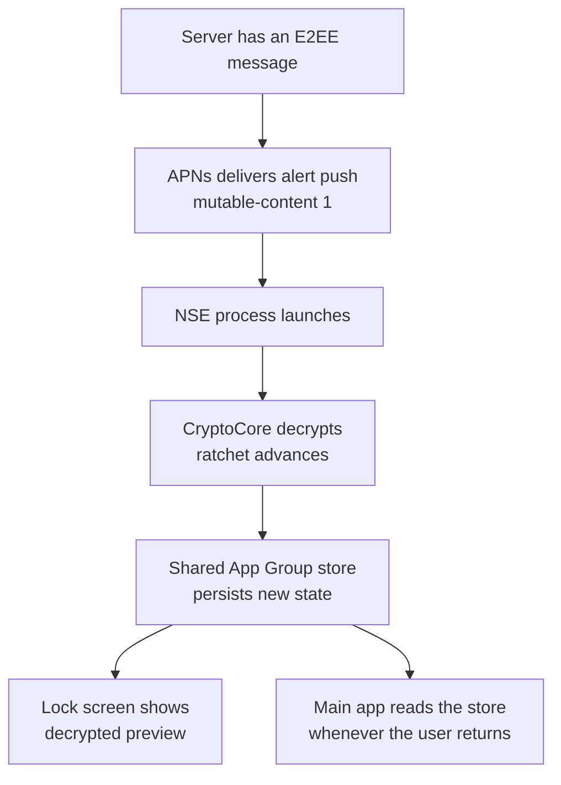
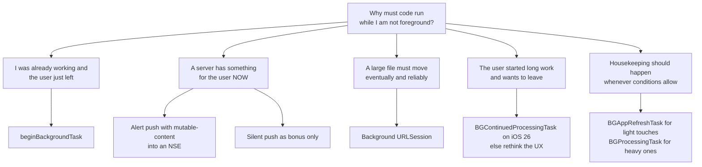

In [the last post](/posts/the-app-went-to-the-background-is-my-code-still-running/), I learned the hard rule: a background queue doesn't keep my process running — the app lifecycle decides whether any of my code runs at all.

Fine. So now the practical version of that problem. The user pressed Home three hours ago. The phone is in a pocket. My server has just accepted a fresh E2EE message for this device, and somewhere in my app bundle sits `CryptoCore` — the Rust library whose whole purpose is to decrypt that message and advance the session state. The app is suspended. Nobody is going to tap the icon just to help me out.

Apple's documentation offers not one answer but a small crowd of them: `beginBackgroundTask`, the `BGTaskScheduler` pair (`BGAppRefreshTask`, `BGProcessingTask`), background `URLSession`, silent push, PushKit, the Notification Service Extension. Every tutorial covers one of them. Almost none of them tells you which one to *hire*.

> [!TIP]
> "Which background API should I use?" is the wrong question, because no single mechanism does the whole job. Each one exists for exactly one kind of work, and iOS has already decided which of them is allowed to handle an incoming message: **a user-visible push processed by a Notification Service Extension**. The useful skill is knowing what job each of the other five actually holds.

## Table of contents

## The Job Description

Let me write down what "deliver my message" really requires, because the requirements are what disqualify most of the candidates:

```text
1. Wake up WITHOUT the user doing anything
2. Wake up PROMPTLY — seconds, not "sometime tonight"
3. Run real code — CryptoCore, not just UI
4. Write to the database — the ratchet state must advance and persist
5. Do all of this RELIABLY, thousands of times a day, on real devices
```

Requirement 4 is the one that makes this an E2EE problem and not just a chat problem. A [Double Ratchet session](https://signal.org/docs/specifications/doubleratchet/) is living state — root keys, chain keys, counters. Decrypting a message *changes* it, and the change must be persisted or future messages stop decrypting. (Why messengers work this way is [its own series](/posts/how-do-messengers-really-encrypt-your-messages/).)

And every candidate faces the same interview panel. Apple's WWDC 2020 session [Background execution demystified](https://developer.apple.com/videos/play/wwdc2020/10063) lays out seven factors that gate *all* discretionary background runtime: rate limiting, battery and Low Power Mode, how often the user actually opens your app, whether the app is still in the app switcher, the Background App Refresh toggle, system-wide budgets, and thermal state. Force-quit the app from the switcher and scheduled background execution simply stops.

Hold those five requirements and seven interviewers in mind. The auditions go quickly.

## Candidate 1: beginBackgroundTask — the Escort, Not the Alarm

The oldest name on the list, and the most misread. [`beginBackgroundTask(expirationHandler:)`](https://developer.apple.com/documentation/uikit/uiapplication/beginbackgroundtask(expirationhandler:)) does not wake anything. It only works when your process is *already running*: it asks iOS to delay suspension a little while you finish work that's in flight, and hands you an expiration handler as the final warning.

How long is "a little"? Approximately 30 seconds — Apple deliberately doesn't promise a number, and it has varied across OS versions and system conditions. Design for "less than I hoped," not for a constant.

So it fails the delivery job at requirement 1: it can't start anything. But notice what it *is* perfect for. The question that opened the previous post — *what if the user presses Home exactly while `persist session` is running?* — is answered by this API. Wrap the in-flight decrypt-and-persist in a background task, and the write gets escorted safely to the door instead of being cut off mid-transaction.

```text
beginBackgroundTask ─┐
   decrypt           │  the escort walks
   persist ratchet   │  existing work out
   endBackgroundTask ┘  it never rings the doorbell
```

**Verdict: hired — as the escort for work already in progress. Rejected for delivery.**

## Candidate 2: BGAppRefreshTask — a Lottery Ticket

[`BGAppRefreshTask`](https://developer.apple.com/documentation/backgroundtasks/bgapprefreshtask) sounds like the answer: "give my app short runtime in the background to refresh content." You submit a request, and iOS wakes your app… when it predicts the user is about to need it.

That word *predicts* is the whole story. There is no guaranteed timing — the system schedules runs from your app's usage pattern, and any of the seven factors can veto them: Background App Refresh toggled off, Low Power Mode, an app the user rarely opens, exhausted budgets. An app that was force-quit doesn't run at all.

Apple's own guidance has only hardened. The WWDC 2025 session [Finish tasks in the background](https://developer.apple.com/videos/play/wwdc2025/227/) — the current reference for the whole BGTaskScheduler family — points time-sensitive updates away from refresh tasks and toward push. The scheduler is for *freshness*, the vague kind: the feed is a bit newer whenever the user happens to return.

For a message that must reach a lock screen in seconds, a mechanism whose honest latency is "minutes to days, possibly never" isn't a candidate. It's a lottery ticket.

**Verdict: rejected for delivery. Useful as an opportunistic catch-up sync when the ticket happens to win.**

## Candidate 3: BGProcessingTask — the Night Crew

[`BGProcessingTask`](https://developer.apple.com/documentation/backgroundtasks/bgprocessingtask) is the scheduler's other half: minutes of runtime for deliberately heavy work, with the option to require external power and network. In practice that means the system prefers to run it while the phone charges on a nightstand — and can still cancel it at any point.

Nothing about that is a delivery mechanism, and it isn't trying to be. But an E2EE core genuinely needs a night crew: compacting the database, expiring old sessions, cleaning up the skipped-message keys the ratchet accumulates. Work that must happen *eventually*, on the system's terms.

**Verdict: hired — for maintenance. Never asked about delivery.**

### The New Hire in iOS 26: BGContinuedProcessingTask

iOS 26 added a third member to the family, and it's worth knowing precisely because it does NOT change the delivery answer. [`BGContinuedProcessingTask`](https://developer.apple.com/documentation/backgroundtasks/bgcontinuedprocessingtask) lets work the **user explicitly started in the foreground** — an export, a large upload, a migration — keep running after they leave the app, with a system-drawn progress indicator the user can watch and cancel. [WWDC 2025's session](https://developer.apple.com/videos/play/wwdc2025/227/) treats it as the headline addition.

There's no documented wall-clock limit; the contract is visibility — the task lives on user consent and reported progress, and a task that stops reporting progress gets expired. That contract is exactly why it can't deliver messages: it requires the user to start the work while looking at your app. An incoming message is the opposite situation — the user is precisely the person *not* present.

For the E2EE app it's still a welcome hire: "Export my chat history" or a multi-minute initial device sync no longer dies when the user checks their email mid-way.

**Verdict: hired — for user-initiated long work. Structurally incapable of delivery.**

## Candidate 4: Background URLSession — the Freight Courier

A [background `URLSession`](https://developer.apple.com/documentation/Foundation/downloading-files-in-the-background) is the only candidate that genuinely outlives your process. The transfer is handed to a system daemon; your app can be suspended or terminated while bytes keep moving, and iOS relaunches the app in the background to deliver the delegate callbacks when the transfer finishes — provided you recreate the session with [the same identifier](https://developer.apple.com/documentation/foundation/urlsessionconfiguration/background(withidentifier:)). Mark it `isDiscretionary` and the system will even wait for Wi-Fi and power on your behalf.

Impressive — and still not delivery. The daemon moves *files*; your code runs only at transfer milestones. Nothing about a background session wakes your app because a *message exists*. It answers "how do I move 40 MB reliably?", not "how do I learn there's something to move?"

Which tells you its real seat in a messenger: attachments. The video someone sent lands via background transfer, on the system's schedule, surviving whatever happens to the app in between.

**Verdict: hired — as the freight courier for media. Rejected for delivery.**

## Candidate 5: Silent Push — a Telegram With No Promise

This is the candidate everyone hires first and fires angriest. A [background update notification](https://developer.apple.com/documentation/usernotifications/pushing-background-updates-to-your-app) — `content-available: 1`, no alert, no sound — looks like the dream: the *server* pokes the device, iOS wakes the app briefly, the app fetches and processes. Delivery, solved?

Read the fine print in that same document. Background pushes must be sent at APNs priority 5 — the low, power-friendly tier — and the system treats them as advisory: it may throttle them, coalesce several into one wake-up, or not deliver them at all, depending on device conditions. Force-quit the app and they stop entirely.

How many actually arrive? Apple publishes no quota. In practice developers report a handful of wake-ups per hour at best — and zero is a legal outcome. The [community's collected scar tissue](https://mohsinkhan845.medium.com/silent-push-notifications-in-ios-opportunities-not-guarantees-2f18f645b5d5) all reduces to one sentence: silent push is an *opportunity*, not a guarantee.

Now hold that against requirement 5. A message system that "usually, mostly" delivers is a broken message system. ([Choosing the channel that carries realtime events](/posts/my-app-needs-realtime-websocket-mqtt-sse-or-push/) is a decision I've mapped before — the reliability of each leg matters more than its glamour.)

**Verdict: rejected as the primary channel. Kept as a free bonus: when a silent push does land, pre-warm caches, sync read receipts — anything you'd be happy to have happen *sometimes*.**

## Candidate 6: PushKit — the Door Apple Closed

Old hands will interject here: "messengers used to have a guaranteed wake-up — VoIP push." True. [PushKit](https://developer.apple.com/documentation/pushkit/responding-to-voip-notifications-from-pushkit) delivers high-priority pushes that launch your app immediately, no throttling budget, built for incoming calls. For years, apps quietly used it as a privileged data channel: every "message arrived" was a fake VoIP push, and the app woke instantly.

iOS 13 ended the party. Since then, an app built with the iOS 13 SDK **must report an incoming call to CallKit** when it receives a VoIP push — and apps that repeatedly fail to do so stop receiving VoIP pushes and can be terminated. The [migration scramble across the VoIP ecosystem](https://www.linphone.org/en/news/ios-13-important-changes-for-voip-im-apps/) in 2019–2020 is well documented; messengers that had leaned on the loophole had to rebuild their delivery path.

So PushKit remains exactly what it says on the label: if the message *is* a call, it's the right door. If it isn't, the door has a camera now.

**Verdict: rejected — unless you're literally ringing the user.**

### And No, the Always-On Modes Are Not Your Door

The [`UIBackgroundModes` list](https://developer.apple.com/documentation/bundleresources/information-property-list/uibackgroundmodes) includes capabilities that keep apps running for their *own* activity — audio playback, navigation-grade location, Bluetooth accessories. Each keeps the process alive strictly while performing that activity, visibly to the user. Playing silent audio to keep a chat app warm is the kind of trick that ends in App Review rejection and battery-shaming, not in reliable delivery. I'm not auditioning them.

## The Winner Is an Alert Push Carrying a Work Order

Here's the reframe that makes the whole board make sense: stop trying to *silently wake the app*, and let the notification itself be the work order.

Send a normal, user-visible push with `mutable-content: 1`, and iOS launches your [Notification Service Extension](https://developer.apple.com/documentation/usernotifications/unnotificationserviceextension) — a separate, tiny process from [the post where I first fought it](/posts/the-app-links-cryptocore-fine-so-why-cant-the-notification-extension-call-it/) — and hands it the payload *before anything is shown*. Alert pushes aren't subject to the silent-push budget game: for every one that APNs delivers, your extension runs. Inside those seconds, the NSE can call `CryptoCore`, decrypt, advance the ratchet, persist to the shared store, and rewrite the notification so the lock screen shows real content instead of ciphertext.



Reading the diagram: the main app never wakes for delivery at all. The push launches the *extension*; the extension does the cryptographic work and writes the result into the App Group store; the lock screen gets a decrypted preview; and the main app, whenever the user actually opens it, finds the messages already sitting in the database.

This is not my invention — it's the industry's convergence point. Signal ships a dedicated [`SignalNSE` target](https://github.com/signalapp/Signal-iOS/blob/main/SignalNSE/NotificationService.swift) that processes incoming messages on push, and [never puts plaintext in the push itself](https://github.com/signalapp/Signal-iOS/issues/5720) — content is produced on the device. Telegram ships [an open-source NotificationService](https://github.com/TelegramMessenger/Telegram-iOS/blob/master/Telegram/NotificationService/Sources/NotificationService.swift). WhatsApp is closed source, so treat this as the industry-standard reading rather than documentation, but the [publicly described pattern](https://blog.fouadraheb.com/posts/service-extension-notifications/) is the same shape: the NSE receives, decrypts, stores, and acknowledges.

Now the price tag, because the winner charges rent:

- **A hard deadline.** The extension gets roughly 30 seconds; when time runs out, `serviceExtensionTimeWillExpire` fires as [a last chance](https://developer.apple.com/library/archive/documentation/NetworkingInternet/Conceptual/RemoteNotificationsPG/ModifyingNotifications.html) before the system shows whatever you've got.
- **A tiny room.** The commonly cited memory guidance is around 24 MB, and observed ceilings [vary widely by device and iOS version](https://developer.apple.com/forums/thread/64634) — Apple documents no number. Measure on your devices; don't architect against folklore.
- **A graceful failure mode you must design.** Miss the deadline and the user sees the unmodified payload — which for E2EE means a deliberately generic "new message" placeholder, not the content. That's a feature: the fallback is boring, not broken.

**Verdict: hired for delivery — the only candidate that runs per delivered message, by design.**

## Winning Opens a Back Door

Notice what hiring the NSE quietly did: it made the ratchet a **multi-process** data structure.

The extension decrypts message 2 while the main app sits suspended holding session state from message 1 in memory. Two executables, one evolving cryptographic state, meeting only at [a shared database](/posts/two-frameworks-need-sqlcipher-so-does-the-extension-how-many-copies-does-the-iphone-end-up-with/) in an App Group container. Apple's own guidance for that arrangement is [SQLite with WAL and careful coordination](https://developer.apple.com/library/archive/technotes/tn2408/_index.html) — and the ways it goes wrong are not hypothetical:

- Signal discovered that an **encrypted** SQLCipher database in an App Group tripped iOS's suspension check on locked files, producing `0xdead10cc` terminations — [the crash code for holding a file lock into suspension](https://developer.apple.com/forums/thread/655225). They built [a public demonstration repo](https://github.com/signalapp/SQLCipherVsSharedData) and fixed it by contributing the `cipher_plaintext_header_size` PRAGMA [upstream to SQLCipher](https://github.com/sqlcipher/sqlcipher/issues/255): leave the header readable so the kernel-visible file looks normal, keep the contents encrypted.
- Matrix's Rust SDK tracks an issue where [Olm sessions wedge](https://github.com/matrix-org/matrix-rust-sdk/issues/3110) when the NSE and the app both advance crypto state and their views diverge — sessions get stuck and messages stop decrypting. Cross-process ratchet coherence is a real, still-actively-painful problem, not a theoretical one.

I'm stopping here on purpose. Two processes advancing one ratchet — who owns the state, who re-reads when, and what "atomic" even means across suspensions — deserves its own post, and it's the next one in this series: *Two Processes, One Ratchet: Crypto State in an App Group*.

## The Staffing Chart

Six auditions later, nobody was useless — everybody was useful for exactly one thing:

| Tool | The job it holds in an E2EE messenger | If you gave it the delivery job instead |
|---|---|---|
| `beginBackgroundTask` | Escort in-flight decrypt/persist safely past a Home press | Can't start anything — it only extends what's running |
| `BGAppRefreshTask` | Opportunistic catch-up sync | Latency of minutes-to-never; vetoed by seven system factors |
| `BGProcessingTask` | Night-crew maintenance: compaction, key cleanup | Waits for a charger while your user waits for a text |
| `BGContinuedProcessingTask` (iOS 26) | User-started long work: export, initial sync | Requires the user present at start — delivery's opposite |
| Background `URLSession` | Freight courier for attachments | Moves bytes on its schedule; doesn't know a message exists |
| Silent push | Free bonus wake-ups: pre-warm, receipts | "Usually, mostly" delivery — a broken promise at scale |
| PushKit | Actual incoming calls | iOS 13 requires a CallKit call report per push |
| **Alert push + NSE** | **Delivery: decrypt, persist, present — per message** | — |

## Which Tool Do I Reach For?

The staffing chart generalizes past E2EE. The deciding question is never "which API is strongest" — it's *who initiates the work, and when must it run*:



Reading the tree: start from the *trigger*, not the API. Work you were already doing gets an escort. Work a server wants seen now travels inside a visible push and runs in the extension — with silent push strictly as a sometimes-bonus. Bulk bytes go to the transfer daemon. User-started marathons get the new iOS 26 continuation task. And everything that merely *should happen eventually* belongs to the scheduler pair, on the system's terms.

If your case isn't on the tree — periodic location, audio, accessories — you're not in general-purpose background execution anymore; you're in a dedicated background mode with its own contract.

## FAQ

### Can I guarantee a push notification will wake my iOS app?

No. Silent pushes (`content-available: 1`) are [explicitly best-effort](https://developer.apple.com/documentation/usernotifications/pushing-background-updates-to-your-app): the system may throttle, coalesce, or drop them, and a force-quit app doesn't receive them at all. The dependable pattern inverts the goal: send a *visible* push with `mutable-content: 1` and do the work in a Notification Service Extension, which runs for every alert push APNs delivers. PushKit guarantees a wake-up only for [real calls reported to CallKit](https://developer.apple.com/documentation/pushkit/responding-to-voip-notifications-from-pushkit).

### How much time does beginBackgroundTask actually give me?

[Approximately 30 seconds](https://developer.apple.com/documentation/uikit/uiapplication/beginbackgroundtask(expirationhandler:)) — Apple intentionally documents no exact figure, and it varies by OS version and system state. Treat it as "enough to finish a write, not enough to start a job": wrap the in-flight work, end the task promptly, and put real cleanup in the expiration handler because sometimes that's all you'll get.

### Why is my BGAppRefreshTask not firing?

Usually nothing is broken — the scheduler is [discretionary by design](https://developer.apple.com/documentation/backgroundtasks/bgapprefreshtask). Runs are predicted from how often the user opens your app, then filtered by the [seven factors from WWDC 2020](https://developer.apple.com/videos/play/wwdc2020/10063): Background App Refresh toggled off, Low Power Mode, budgets, thermal state, and a force-quit kills scheduling entirely. If the update is time-sensitive, Apple's own guidance is to use push instead.

### BGAppRefreshTask vs BGProcessingTask — which one?

Split by weight and conditions. [`BGAppRefreshTask`](https://developer.apple.com/documentation/backgroundtasks/bgapprefreshtask) is for short freshness touches timed to predicted app opens. [`BGProcessingTask`](https://developer.apple.com/documentation/backgroundtasks/bgprocessingtask) is for minutes-long heavy work and can require external power and network — in practice, the overnight-charging window. Rule of thumb: if you'd apologize for doing it on battery, it's a processing task.

### Should a chat app fetch messages with silent push or BGTaskScheduler?

Neither, as the primary path. Silent push is throttled and droppable; the scheduler's latency is minutes-to-days. Production E2EE messengers — [Signal's NSE](https://github.com/signalapp/Signal-iOS/blob/main/SignalNSE/NotificationService.swift), [Telegram's](https://github.com/TelegramMessenger/Telegram-iOS/blob/master/Telegram/NotificationService/Sources/NotificationService.swift) — deliver through visible pushes processed by a Notification Service Extension, and keep silent push and the scheduler as opportunistic catch-up.

### How long can a Notification Service Extension run, and with how much memory?

You get on the order of 30 seconds, then [`serviceExtensionTimeWillExpire`](https://developer.apple.com/library/archive/documentation/NetworkingInternet/Conceptual/RemoteNotificationsPG/ModifyingNotifications.html) fires as a final chance before the system presents what it has. Memory is undocumented; the commonly cited guidance is ~24 MB, with [observed limits varying by device and iOS version](https://developer.apple.com/forums/thread/64634). Keep the extension minimal: decrypt the one message, persist, rewrite the notification — defer attachments to a background transfer.

### Does a background URLSession download survive the app being killed?

If the *system* terminates your suspended app, yes — [the daemon keeps transferring](https://developer.apple.com/documentation/Foundation/downloading-files-in-the-background) and relaunches your app for the delegate callbacks, as long as you recreate the session with the same identifier. If the *user* force-quits from the app switcher, iOS reads that as "stop this app" and won't relaunch it for transfer events until the user returns.

### Can I use VoIP pushes to sync data for a messaging app?

Not anymore. Since iOS 13, receiving a PushKit VoIP push [obligates you to report an incoming call to CallKit](https://developer.apple.com/documentation/pushkit/responding-to-voip-notifications-from-pushkit); apps that repeatedly don't are cut off from VoIP pushes and can be terminated. The [2019–2020 migration wave](https://www.linphone.org/en/news/ios-13-important-changes-for-voip-im-apps/) exists precisely because messengers had used VoIP push as a covert data channel. Use it if — and only if — the phone should ring.

## Where the Original Question Went Wrong

I walked in asking:

> **"Which background API delivers my message?"**

The question assumed I was hiring one generalist. iOS doesn't offer generalists — it staffs a team of narrow specialists, and it assigned the delivery seat years ago: a visible push, processed by a Notification Service Extension, everything else in supporting roles.

The better question, the one the staffing chart answers:

> **For each thing my E2EE core must do — finish a write, receive a message, move a file, clean a database — who initiates it, and when must it run?**

Answer that per task and the six APIs stop competing. They click into a system — the same system Signal, Telegram, and (by every public account) WhatsApp converged on independently.

And that system has a crack running through it: two processes now advance one ratchet. That's where this series goes next.

## References

**Apple documentation and WWDC**

- [Background execution demystified — WWDC20 session 10063](https://developer.apple.com/videos/play/wwdc2020/10063)
- [Finish tasks in the background — WWDC25 session 227](https://developer.apple.com/videos/play/wwdc2025/227/)
- [beginBackgroundTask(expirationHandler:) — UIApplication](https://developer.apple.com/documentation/uikit/uiapplication/beginbackgroundtask(expirationhandler:))
- [BGAppRefreshTask — Apple Developer Documentation](https://developer.apple.com/documentation/backgroundtasks/bgapprefreshtask)
- [BGProcessingTask — Apple Developer Documentation](https://developer.apple.com/documentation/backgroundtasks/bgprocessingtask)
- [BGContinuedProcessingTask — Apple Developer Documentation](https://developer.apple.com/documentation/backgroundtasks/bgcontinuedprocessingtask)
- [Downloading files in the background — Apple Developer Documentation](https://developer.apple.com/documentation/Foundation/downloading-files-in-the-background)
- [URLSessionConfiguration.background(withIdentifier:) — Apple Developer Documentation](https://developer.apple.com/documentation/foundation/urlsessionconfiguration/background(withidentifier:))
- [Pushing background updates to your app — Apple Developer Documentation](https://developer.apple.com/documentation/usernotifications/pushing-background-updates-to-your-app)
- [UNNotificationServiceExtension — Apple Developer Documentation](https://developer.apple.com/documentation/usernotifications/unnotificationserviceextension)
- [Modifying and presenting notifications — Apple Developer Documentation (archive)](https://developer.apple.com/library/archive/documentation/NetworkingInternet/Conceptual/RemoteNotificationsPG/ModifyingNotifications.html)
- [Responding to VoIP notifications from PushKit — Apple Developer Documentation](https://developer.apple.com/documentation/pushkit/responding-to-voip-notifications-from-pushkit)
- [UIBackgroundModes — Information Property List](https://developer.apple.com/documentation/bundleresources/information-property-list/uibackgroundmodes)
- [Accessing shared data from an app extension — Technical Note TN2408](https://developer.apple.com/library/archive/technotes/tn2408/_index.html)
- [File locks and suspension (0xdead10cc) — Apple Developer Forums](https://developer.apple.com/forums/thread/655225)
- [Notification Service Extension memory reports — Apple Developer Forums](https://developer.apple.com/forums/thread/64634)

**Production messengers**

- [SignalNSE/NotificationService.swift — Signal-iOS](https://github.com/signalapp/Signal-iOS/blob/main/SignalNSE/NotificationService.swift)
- [No plaintext in pushes — Signal-iOS issue #5720](https://github.com/signalapp/Signal-iOS/issues/5720)
- [SQLCipherVsSharedData — Signal's App Group / SQLCipher demonstration](https://github.com/signalapp/SQLCipherVsSharedData)
- [Encrypted databases in shared containers — SQLCipher issue #255](https://github.com/sqlcipher/sqlcipher/issues/255)
- [NotificationService — Telegram-iOS](https://github.com/TelegramMessenger/Telegram-iOS/blob/master/Telegram/NotificationService/Sources/NotificationService.swift)
- [Olm sessions can wedge across processes — matrix-rust-sdk issue #3110](https://github.com/matrix-org/matrix-rust-sdk/issues/3110)
- [The Double Ratchet Algorithm — Signal specifications](https://signal.org/docs/specifications/doubleratchet/)

**Ecosystem and community**

- [iOS 13: important changes for VoIP and IM apps — Linphone](https://www.linphone.org/en/news/ios-13-important-changes-for-voip-im-apps/)
- [VoIP push and iOS 13 enforcement discussion — Apple Developer Forums](https://developer.apple.com/forums/thread/121088)
- [Notification Service Extension in practice — Fouad Raheb](https://blog.fouadraheb.com/posts/service-extension-notifications/)
- [Silent push notifications: opportunities, not guarantees — Mohsin Khan](https://mohsinkhan845.medium.com/silent-push-notifications-in-ios-opportunities-not-guarantees-2f18f645b5d5)
