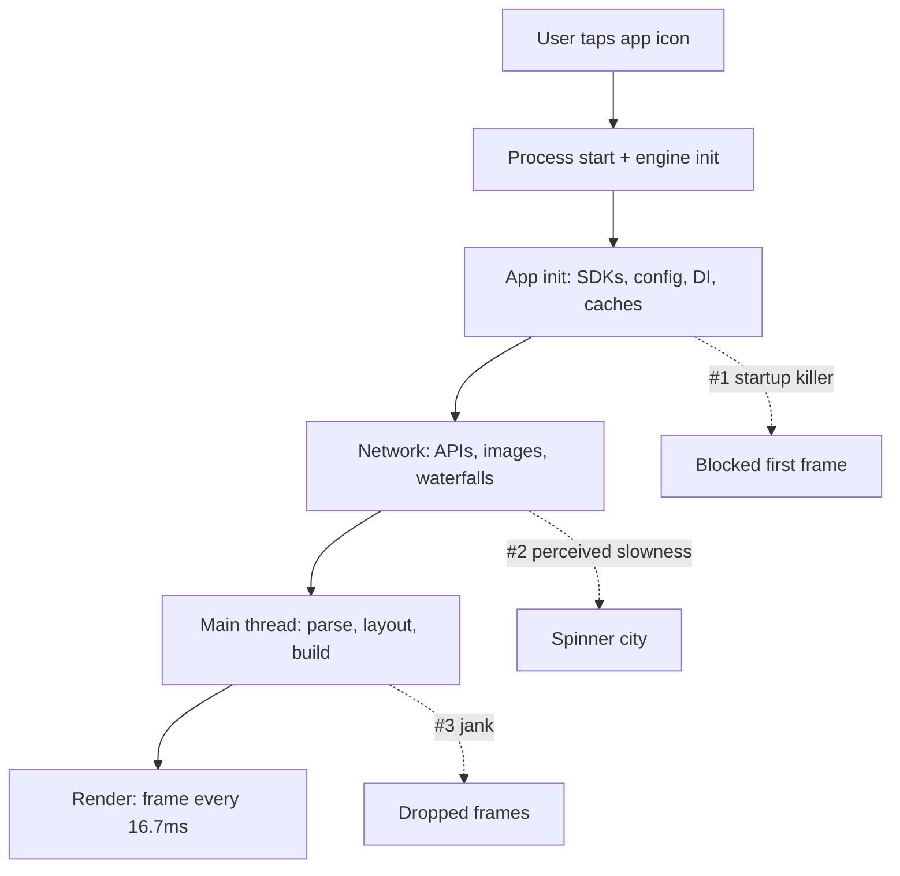
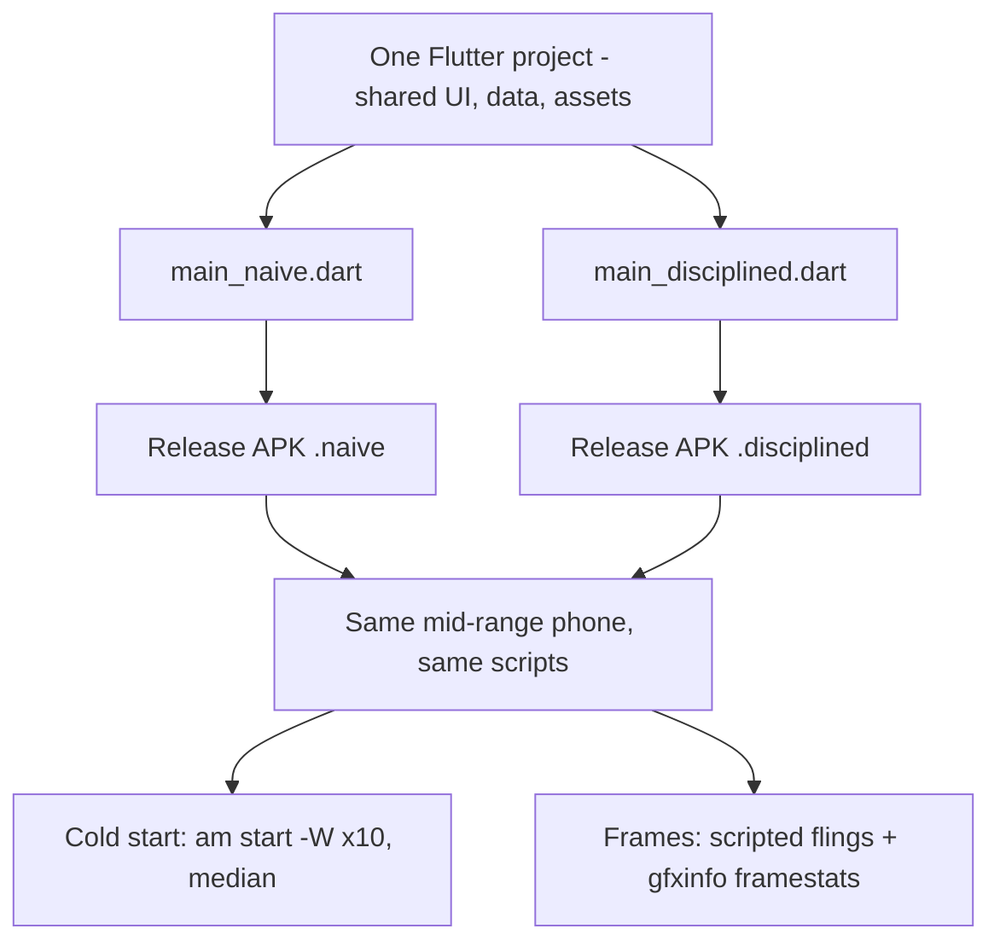

Every mobile team has had this argument. The app feels sluggish, someone opens the profiler for five minutes, and then the verdict lands: _"It's because we went with Flutter."_ Or React Native. Or — rarer, but it happens — _"we should have gone cross-platform, native is holding us back."_

Here is the whole article in one sentence:

> [!TIP]
> **The framework is the easiest suspect and rarely the culprit.** Apps are slow because of undisciplined startup work, main-thread abuse, network waterfalls, and SDK bloat — engineering discipline, not framework choice.

That's a strong claim, so this post does three things: it walks through what big engineering teams found when their apps were slow (spoiler: almost never the framework), it gives the framework its fair trial for the times it _was_ guilty, and it ends with an experiment you can reproduce — the same Flutter app built twice, measured on a real mid-range Android phone.

## Table of contents

## Where the "Cross-Platform = Slow" Instinct Comes From

The instinct isn't stupid. It has a birthday.

In September 2012, Mark Zuckerberg told the TechCrunch Disrupt audience that betting on HTML5 for Facebook's mobile app had been [their biggest mistake on mobile](https://techcrunch.com/2012/09/11/mark-zuckerberg-our-biggest-mistake-with-mobile-was-betting-too-much-on-html5). He was right — in 2012. The mobile web stack of that era genuinely could not deliver a smooth feed; Facebook rewrote the app natively and it got dramatically better. An entire generation of engineers learned the lesson: _the platform layer can betray you._

The problem is that the lesson outlived the facts by about a decade. The tools that replaced that era's WebViews are different animals — and even their real historical weaknesses have been fixed in ways we'll get to (with dates: [October 2024](https://reactnative.dev/blog/2024/10/23/release-0.76-new-architecture) and [December 2024](https://flutter.dev/blog/whats-new-in-flutter-3-27) are load-bearing). Which means any benchmark or horror story you read should come stamped with a year. Most don't.

So instead of intuition, let's look at what actually happened when serious teams had slow apps.

## Exhibit A: Native Apps That Were Slow

If the framework were the root cause of slowness, fully native apps would be fast. They are not automatically fast.

**Snapchat's Android app was pure native — and it was famously bad.** Snap's engineering team wrote a post whose title is its own thesis: ["Don't Rewrite Your App, Unless You Have To"](https://eng.snap.com/dont-rewrite-your-app-unless-you-have-to). When they finally did rebuild it (still native — no framework change), the rearchitecture cut slow cold starts and ANR rates by 60%, frozen frames by 45%, and APK size by 25MB. TechCrunch [reported](https://techcrunch.com/2019/04/23/snapchat-android) a 6% increase in people on low-end devices sending Snaps within the first week of the rollout. Same language, same platform, same "native performance" — the difference was architecture.

**Notion's Android app was slow for years** — not because of cross-platform frameworks in general, but because it was a WebView wrapper. Their fix was migrating surface by surface to native, and [their own numbers](https://www.notion.com/blog/notion-on-android-is-now-more-than-twice-as-fast-to-launch) are striking: a 3x improvement in perceived startup for the Home tab, search loading more than 80% faster, and the app launching more than twice as quickly. The instructive part: users experienced the slowness as "Notion is slow," not "WebViews are slow." Nobody files a bug against the rendering layer.

Notice what nobody said in either case: _"Kotlin is slow."_ When a native app is slow, we blame the app. When a Flutter app is slow, we blame Flutter. That asymmetry is the whole disease.

## Exhibit B: Cross-Platform Apps That Are Fast

The reverse test: if the framework imposed a meaningful ceiling, no cross-platform app could feel native-class. Several do, and they documented how.

**Discord's iOS app runs on React Native** — not a toy app, a performance-sensitive chat client with huge payloads. Their engineering post ["How Discord Achieves Native iOS Performance with React Native"](https://discord.com/blog/how-discord-achieves-native-ios-performance-with-react-native) reads like a masterclass in profiling, not framework fights: message parsing went from 500ms to 30ms on an iPhone XS (1000ms to 90ms on an iPhone 6S) by restructuring how payloads were processed; an emoji-picker lockup dropped from 2s to 500ms; a custom image loader took per-image cost from 50ms to 0.3ms; RAM bundles cut average loading time by 3500ms on an iPhone 6. Result: a consistent 60 FPS across supported devices — on the framework everyone "knows" is slow.

**Shopify went all-in on React Native and published a five-year retrospective** with production numbers: [sub-500ms (P75) screen loads and more than 99.9% crash-free sessions](https://shopify.engineering/five-years-of-react-native-at-shopify) in their merchant app.

And Flutter runs real money in production: [Google Pay chose Flutter](https://developers.googleblog.com/google-pay-picks-flutter-to-drive-its-global-product-development/) for its global product development; the Brazilian digital bank Nubank [reports](https://building.nubank.com/scaling-with-flutter/) Flutter PRs merging in 9.9 minutes on average against a 70.45-minute overall platform average; [BMW built the My BMW App on Flutter](https://www.press.bmwgroup.com/middle-east/article/detail/T0328872EN/the-my-bmw-app:-new-features-and-tech-insights-for-march-2021?language=en) with a ~300-person Flutter/Dart organization; eBay Motors shipped with [98.3% of code shared](https://flutter.dev/showcase/ebay) between platforms.

### The golden data point

The single most damning number for framework blame comes from _inside_ one framework. Shopify's FlashList — a drop-in replacement for React Native's stock FlatList — delivered [almost 7.5x better JS-thread FPS](https://shopify.engineering/instant-performance-upgrade-flatlist-flashlist) on a mid-range Moto G in a max-speed scroll test. Same framework, same app, same screen: 7.5x, from swapping how the list recycles views.

Hold that against any Flutter-vs-native benchmark you've seen. The gap _between_ frameworks in honest tests is a fraction of the gap _within_ one framework between a naive list and a disciplined one. If your list implementation can cost you 7.5x, your framework choice is not your bottleneck.

## So What Actually Makes Apps Slow?

Follow the tap. Between a user's finger and the pixels, there is a pipeline — and the framework owns surprisingly little of it.

The diagram traces a tap from process start through init, network, and main-thread work to rendering — and marks where real apps actually lose their time: blocked init, network waterfalls, and main-thread abuse.

### Startup is dominated by init, not rendering

When teams measure cold start honestly, the framework's share is small and the app's own initialization is the monster:

- **Firebase** (whose SDKs start inside millions of apps) published how they [cut their own SDK's startup impact by more than 35%](https://firebase.blog/posts/2022/03/how-firebase-performance-monitoring-optimized-app-startup-time/) — by lazy initialization, deferring non-urgent components, and delaying remote-config fetches. The fix for SDK cost is scheduling, and the SDK vendor says so.
- **DoorDash** [cut iOS app launch time by 60%](https://careersatdoordash.com/blog/how-we-reduced-our-ios-app-launch-time-by-60/) without touching any framework: one change alone — replacing hash-based command identification with type-based identification — bought 29% faster launch. Language-runtime details of their own code, not the platform.
- **Zomato**, serving a market full of mid-range Android devices, removed legacy SDKs for a [21.74% startup improvement (4.873s → 3.813s)](https://developer.android.com/stories/apps/zomato), and separately reported [over 20% startup improvement from Baseline Profiles](https://www.zomato.com/blog/how-we-improved-our-android-app-startup-time-by-over-20-with-baseline-profile). Outcome: about 20% more customers actually landing on a fully loaded page. Deleting SDKs — the least glamorous fix in mobile — moved a business metric.
- **Lyft's** driver app [started 15–20% slower than comparable apps](https://developer.android.com/stories/apps/lyft); measuring time-to-first-drawn-frame and cleaning up init (removing unneeded network calls, moving work off the critical path) produced a 21% average startup reduction and 5% more driver sessions.
- **Uber** [breaks cold start into](https://www.uber.com/us/en/blog/measuring-performance-for-ios-apps-at-uber-scale/) process creation, app initialization, network calls, and the first render pass. Rendering — the only component where framework choice plausibly enters — is one of four, sharing the bill with init and network.

### The frame budget doesn't care about your framework

Rendering is a physics problem: at 60Hz you get ~16.7ms per frame. Android's official vitals draw the lines — a frame between [16ms and 700ms is "slow," over 700ms is "frozen"](https://developer.android.com/topic/performance/vitals/render), and startup counts as excessive at [≥5s cold, ≥2s warm, ≥1.5s hot](https://developer.android.com/topic/performance/vitals/launch-time). Miss the window by 1ms and the frame drops.

Every framework — SwiftUI, Jetpack Compose, Flutter, React Native — can hit 16.7ms comfortably on modern hardware, and every one of them will blow it if you decode a 1500-pixel image for a 64-pixel thumbnail on the UI thread. The budget is the same; the question is what your code spends it on.

| What users say | What it usually is | Who proved it |
| --- | --- | --- |
| "It takes forever to open" | Synchronous SDK/config init before first frame | [Firebase](https://firebase.blog/posts/2022/03/how-firebase-performance-monitoring-optimized-app-startup-time/), [Zomato](https://developer.android.com/stories/apps/zomato), [DoorDash](https://careersatdoordash.com/blog/how-we-reduced-our-ios-app-launch-time-by-60/) |
| "It's laggy when I scroll" | Non-recycled lists, oversized image decodes, main-thread parsing | [Shopify FlashList](https://shopify.engineering/instant-performance-upgrade-flatlist-flashlist), [Discord](https://discord.com/blog/how-discord-achieves-native-ios-performance-with-react-native) |
| "Everything is a spinner" | Network waterfalls, no caching, backend latency | [Uber's cold-start anatomy](https://www.uber.com/us/en/blog/measuring-performance-for-ios-apps-at-uber-scale/), [Lyft](https://developer.android.com/stories/apps/lyft) |
| "It got slow after the update" | New SDKs riding along in the release | [Zomato's SDK removal](https://developer.android.com/stories/apps/zomato) |

Read the middle column again: not one entry is "chose the wrong framework." These are the defects that survive framework migrations — which is exactly why rewrites so often disappoint.

## The Honest Column: When the Framework WAS Guilty

This is not a "frameworks never matter" article, and pretending the frameworks were always innocent would be the same lazy thinking in reverse. Both major cross-platform frameworks shipped real, measurable performance flaws — and both fixed them. Dates matter here.

**Flutter's shader-compilation jank was real.** With the Skia renderer, shaders could compile during the first run of an animation, producing visible stutter precisely when the user was watching. The fix is architectural: [Impeller precompiles all shaders at engine-build time](https://docs.flutter.dev/perf/impeller), and as of Flutter 3.27 it is [the default renderer on iOS and on modern Android (API 29+)](https://flutter.dev/blog/whats-new-in-flutter-3-27) — December 2024.

**React Native's old bridge tax was real.** Every value crossing between JavaScript and native paid JSON serialization both ways. One developer's measurement in [a React Native GitHub issue](https://github.com/facebook/react-native/issues/31771) put an array of 16,000 integers at roughly 25–26ms to cross the bridge on a 2018 Xiaomi Mi 8 (maintainers couldn't reproduce it universally — treat it as an illustration of the cost class, not a constant). Meta's answer was a rewrite of the internals — JSI, Fabric, TurboModules — that became [the default in React Native 0.76](https://reactnative.dev/blog/2024/10/23/release-0.76-new-architecture) in October 2024. Before that, Meta had already concluded that [the JavaScript engine itself was a significant factor in startup performance and download size](https://engineering.fb.com/2019/07/12/android/hermes/) and built Hermes to replace it, with substantial TTI, memory, and app-size gains in their published benchmarks.

Two consequences follow. First, the "framework tax" arguments you remember were often true _when you first heard them_ — and are stale now. Any Flutter benchmark predating Impeller-by-default or any React Native benchmark predating the New Architecture describes software that no longer ships. Second, notice the shape of both fixes: the frameworks were slow **for the same reasons apps are slow** — doing expensive work (shader compilation, serialization) on the hot path — and got fast the same way apps do: by moving work off it.

### The most misquoted post in mobile

Every framework debate eventually cites it: _"Even Airbnb abandoned React Native."_ Read [what Airbnb actually wrote](https://medium.com/airbnb-engineering/sunsetting-react-native-1868ba28e30a) in 2018: they were "unable to meet our original goals" due to "technical and organizational challenges" — chief among them that instead of writing code once, they "wound up supporting code on three platforms instead of two," plus debugging pain across the JS/native boundary. Performance appears only in passing ("initialization and the async first render made meeting certain goals challenging"). Airbnb's post is an argument about _organizational fit_ — three codebases, split expertise, tooling maturity — routinely laundered into a claim about speed that its authors did not make.

## The Experiment: Same Framework, Two Apps

Industry evidence is good; your own numbers are better. So I built the thesis as an app you can run: **one Flutter project, two entrypoints, pixel-identical UI, identical total work** — a 500-item image feed with an animated header, a 2.3MB config blob, and JSON parsing. The only difference is discipline:

| Concern | Naive build | Disciplined build |
| --- | --- | --- |
| Startup init | Everything awaited sequentially before `runApp` | First frame ships immediately; init deferred and parallelized |
| 2.3MB config parse | Main isolate, before first frame | Background isolate, off the critical path |
| Feed JSON parse | Main isolate during first build | Background isolate |
| 500-item list | `ListView(children:)` — builds every row up front | `ListView.builder` + `itemExtent` — lazy |
| Images (1500px assets at 64px) | Full-resolution decode | `cacheWidth` sized to display density |
| Header animation | `setState` at the top of the tree every tick | `AnimatedBuilder` + `RepaintBoundary` |

Every "naive" choice is a pattern from real codebases — no artificial sleeps, no sabotage. The disciplined build does the _same total work_; it just schedules it off the user's critical path.

The diagram shows the experiment design: one shared codebase forks only at the entrypoint, both builds install side by side on the same device, and identical scripts measure cold start and frame stats for each. Both variants, the asset generator, and the measurement scripts are in the public repo: [mobile-perf-ab-demo](https://github.com/hkngoc/mobile-perf-ab-demo).

**Methodology:** release builds, installed side by side via product flavors on a real mid-range Android phone. Cold start measured as `am start -W` TTID across 10 runs per variant (force-stop plus settle time between runs), reported as median with spread. Scroll performance measured with an identical scripted fling sequence and `dumpsys gfxinfo framestats` — janky-frame percentage and p90/p99 frame times.

<!-- MEASUREMENT PENDING: fill from artifact-results.md; keep numbers byte-identical to that file -->

| Metric (median of 10) | Naive | Disciplined | Gap |
| --- | --- | --- | --- |
| Cold start (TTID) | _measuring_ | _measuring_ | — |
| Janky frames % | _measuring_ | _measuring_ | — |
| p90 / p99 frame time | _measuring_ | _measuring_ | — |

_Device disclosure, raw runs, and DevTools timeline captures will accompany the final numbers — including any workload adjustments made to keep the comparison honest._

Whatever the exact figures land at, the point of the exercise is its design: **the framework is held constant.** Any gap you see is the discipline tax — the cost of the patterns in the left column, which no framework migration would refund.

## The Mid-Range Reality Check

One more reason this matters here in Vietnam: the devices. Android holds [roughly 60% of Vietnam's mobile OS share](https://gs.statcounter.com/os-market-share/mobile/viet-nam) (StatCounter, mid-2026), and the volume segment is mid-range — the Galaxy A and Redmi class, not the flagships benchmarks are run on.

That changes the calculus in a specific way: on a device with a slower CPU, less RAM, and a 60Hz panel, _everything in this article gets amplified_. Zomato's numbers above came from exactly this class of market — their startup fixes produced [about a 30% improvement on low- and mid-range devices](https://developer.android.com/stories/apps/zomato), larger than the fleet average. A flagship absorbs your synchronous config parse; a mid-ranger puts it on screen as a two-second white void. The discipline tax is regressive — it taxes your poorest users hardest. That's also why the experiment above runs on a mid-range phone and not the newest thing money can buy.

## Frequently Asked Questions

**So framework choice never matters?**
It matters — at the margins and in specific dimensions: binary size floor, memory floor, access to brand-new platform APIs, hiring pool, tooling taste. What the evidence refuses to support is the everyday causal claim "our app is slow _because_ Flutter/RN." If you can't name where your first two seconds go, the framework debate is premature.

**Should I rewrite my slow app in native (or in a different framework)?**
Snap's engineering team — who had every reason to justify their rewrite — titled their post ["Don't Rewrite Your App, Unless You Have To"](https://eng.snap.com/dont-rewrite-your-app-unless-you-have-to). Profile first. If your bottlenecks are init, network, and main-thread work (they usually are), a rewrite ships the same bottlenecks in a new language, minus a year of feature work.

**Which benchmarks can I trust?**
Apply three stamps: a **date** (pre-2024 cross-platform benchmarks predate Impeller-by-default and the RN New Architecture — treat as history), a **device** (flagship-only results say little about the phones most users own), and a **methodology plus conflict-of-interest check** (agencies selling framework-migration services publish framework comparisons; engineering teams publishing their own production numbers have less reason to flatter a tool).

**What should I measure first in my own app?**
Cold start (TTID, then time-to-usable), frame stats during your heaviest scroll, and your startup init timeline — in that order. Android's [launch-time](https://developer.android.com/topic/performance/vitals/launch-time) and [rendering](https://developer.android.com/topic/performance/vitals/render) vitals give you the thresholds users feel. The how-to deserves its own article — that's where this series goes next.

## Ask the Better Question

Frameworks are the most visible choice a mobile team makes, which is exactly why they make such satisfying scapegoats — blaming a dependency is painless, blaming our own `main()` is not. But Snapchat was slow in native and Discord is fast on React Native, and between those two facts the comfortable story collapses.

So don't ask which framework is fastest. Ask this instead: **can your team name, with numbers, where your app spends its first two seconds?** If yes, you already know the framework isn't the problem. If no — that answer is the problem, and no rewrite will fix it.

_Next in this series: a case study — taking one real app from "feels slow" to measured, budgeted, and fixed._
