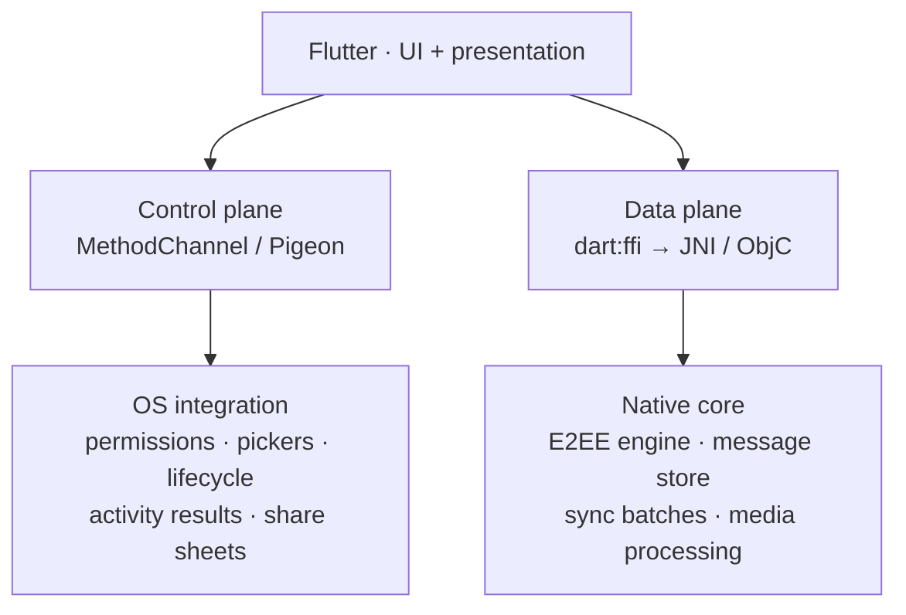
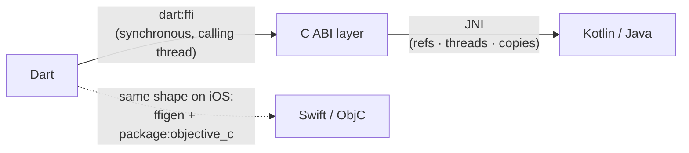

Picture the meeting. Your team is moving a production chat app — the same half-Flutter, half-native app this series has been following — further down into native: the E2EE engine, the message store, the sync pipeline all become a native core, and Flutter becomes a presentation layer. Someone says the thing that someone always says:

> "MethodChannel will be too slow for this. Let's build our own path: Dart → C → JNI → Kotlin. Like the big apps do."

Now you have to evaluate that pitch — or make it to your tech lead without getting laughed out of the room. It sounds right. It's also three claims in a trench coat: that MethodChannel is slow, that a direct path is meaningfully faster, and that serious teams already do this. One of those claims is measurable, one is mostly myth, and one turned out to be truer than I expected — with scars attached.

> [!TIP]
> **Crossing the boundary fewer times matters more than crossing it faster.** The right architecture is not "replace MethodChannel with JNI" but a split: a **control plane** on channels (lifecycle, permissions, OS APIs — low frequency) and a **data plane** on `dart:ffi`/JNI (high-frequency, bulk-data, CPU-bound domain operations). The ecosystem — Google included — is actively moving this way, but the Java side is still experimental with open crash bugs. So: prototype the fast path with `jnigen` on a handful of batch-shaped domain APIs, benchmark against your real workload, and let the numbers make the pitch.

## Table of contents

## What a Channel Call Actually Costs

A `MethodChannel` call is a small pipeline, not a function call. Per the [official platform channels documentation](https://docs.flutter.dev/platform-integration/platform-channels), your Dart arguments are encoded by `StandardMessageCodec` into a binary message, handed to the engine, delivered to the platform side, decoded into Kotlin types (`HashMap`, `ArrayList`, `ByteArray`…), handled — and the response makes the same trip back. Two codec passes and a thread hop per call, and the handler runs on the platform's main thread unless you explicitly opt into a [background `TaskQueue`](https://docs.flutter.dev/platform-integration/platform-channels#channels-and-platform-threading).

How expensive is that really? The best public data is from the Flutter team itself: Aaron Clarke's 2021 post on [improving platform channel performance](https://blog.flutter.dev/improving-platform-channel-performance-in-flutter). After eliminating redundant copies in the channel path, the team measured roughly **42% faster** 1 MB binary transfers on iOS, **15% faster** on Android in automated tests (up to **52%** in a local test using the direct binary codec) — and for a 14 KB structured payload through `StandardMessageCodec`, only about **5%**. That last number is the interesting one: for small structured messages, the copies weren't the cost. The encode/decode work was.

Two honest conclusions follow:

1. **For low-frequency calls, channels are fine.** `getBatteryLevel()`, opening a picker, requesting a permission — a few calls per second of small payloads is not a bottleneck. Flutter's own performance docs give [exactly one hard rule](https://docs.flutter.dev/perf/isolates): act when large computations cause measurable UI jank. There is no official "calls per second" threshold beyond that.
2. **The cost that remains is structural.** Serialization and thread-hopping scale with *frequency × payload*. A chat app processing a sync batch — decrypt, persist, update thread, update receipts, per message, thousands of times — pays the codec tax on every crossing.

One more thing to get out of the way: [Pigeon](https://pub.dev/packages/pigeon) does not change this math. Pigeon generates type-safe bindings, which kills a whole class of `String`-keyed casting bugs — but it runs over the same `StandardMessageCodec`, with runtime cost equivalent to a well-written manual channel. Pigeon is about safety, not speed.

## The Myth of the 500x Speedup

Search this topic and you'll find blog posts claiming FFI is "420x" or "500x" faster than MethodChannel. I went looking for the methodology behind those numbers. There isn't one — no published code, no environment, no baseline you can reproduce. In fact, I could not find *any* credible public MethodChannel-vs-FFI benchmark with a visible methodology, from any source. The only rigorous public numbers about channel cost are the Flutter team's own before/after percentages above — which measure channel optimization, not a channel-vs-FFI comparison.

That's not a detail. If you pitch this migration to your lead with "FFI is 500x faster," you are pitching a number nobody can defend. The honest pitch is different: *the per-call overhead is real, unmeasured for our workload, and multiplied by our call frequency — so let's measure it on our workload.* We'll come back to exactly how.

## Who Actually Ships This

This is the part that surprised me. The idea of bypassing channels is not a fringe hack — it's the direction the platform itself is moving. But every production story comes with scars.

### Google is building the same thing

Dart's native interop stack now lives in one repo, [`dart-lang/native`](https://github.com/dart-lang/native): `dart:ffi` + `ffigen` for C, `package:objective_c` + `ffigen` for iOS, and `package:jni` + `jnigen` for Java/Kotlin. The [jnigen README](https://github.com/dart-lang/native/blob/main/pkgs/jnigen/README.md) describes exactly the architecture from the meeting pitch: *"The Dart bindings call the C bindings, which in-turn call the Java functions through JNI."* You don't have to invent the bridge; Google is generating it.

In May 2025, Flutter published ["Flutter's path towards seamless interop"](https://flutter.dev/blog/flutters-path-towards-seamless-interop), quoting Michael Thompson at #FlutterInProduction: *"We're investing a lot in a new approach for this, which we call direct native interop."* The stated motivations mirror the meeting pitch, too: channels are async-only, string-encoded, error-prone, and tedious for large API surfaces even with Pigeon.

And it's not just talk — you can watch the migration happening in the open, unfinished:

- Pigeon is growing an FFI/JNI backend ([flutter/packages#11352](https://github.com/flutter/packages/pull/11352), tracking issue [flutter/flutter#182230](https://github.com/flutter/flutter/issues/182230)), with `shared_preferences` as the working example ([flutter/packages#12329](https://github.com/flutter/packages/pull/12329)). Both PRs were still open as of late August 2026 — and the [Pigeon native-interop PR](https://github.com/flutter/packages/pull/11352) itself lists, under "What's Out of Scope," a *known performance regression when transferring complex classes with many fields compared to MethodChannel Pigeon*. Google's own migration admits direct interop is not a free win.
- [dart.dev still labels Java interop](https://dart.dev/interop/java-interop) *"experimental, and in active development."*

### The plugin that shipped it — and bled

`path_provider` is the cautionary tale worth telling your lead, because it's short and it actually happened:

- The iOS/macOS implementation [converted to FFI](https://github.com/flutter/packages/pull/9762) in `path_provider_foundation` 2.5.0 on 20 November 2025. A day later it [crashed in release mode on physical iOS devices](https://github.com/flutter/flutter/issues/178915) (`Couldn't resolve native function 'DOBJC_initializeApi'`); the release was retracted and [reverted](https://github.com/flutter/packages/pull/10517) five days after it shipped, then [re-released](https://github.com/flutter/packages/pull/10722) in January 2026 once the toolchain issues were fixed. It ships FFI today.
- The Android implementation [moved to JNI](https://github.com/flutter/packages/pull/9770) in April 2026 — the sibling PR, opened the same week in August 2025, took eight months to land — and promptly met R8: within days, [apps were stuck at startup](https://github.com/flutter/flutter/issues/184750) with a release-mode `ClassNotFoundException`, and the [fix](https://github.com/flutter/packages/pull/11467) names the cause outright: it *"avoids reliance on `PathUtils` not being removed by R8."* Code shrinkers can't see reflection-style class lookups from native code; JNI-reachable classes need keep rules. (More reports of the same class of failure: [dart-lang/native#2621](https://github.com/dart-lang/native/issues/2621), [#3280](https://github.com/dart-lang/native/issues/3280).)

Both migrations survived. Both broke *only in release mode* first — the mode you demo least and ship most.

### Third parties in production

**Sentry** moved its Android integration to `package:jni` in [February 2025](https://github.com/getsentry/sentry-dart/pull/2670) and has been paying the maintenance bill in public ever since: PRs to [release JNI refs](https://github.com/getsentry/sentry-dart/pull/3712), [avoid JNI callbacks for scope sync](https://github.com/getsentry/sentry-dart/pull/3676), and [move JNI work off the main isolate](https://github.com/getsentry/sentry-dart/pull/3713). That PR list is a preview of the exact problems the rest of this post covers.

**Nutrient** (formerly PSPDFKit) published the best first-party case study I found: [three generations of Flutter bindings](https://www.nutrient.io/blog/nutrient-flutter-bindings-architecture/) — hand-written MethodChannel in 2019, Pigeon in November 2024, and direct FFI/JNI bindings shipped as beta in February 2026 and *recommended* since July 2026. Their stated reason goes beyond speed: *"Pigeon models flat data and method calls, not the inheritance hierarchies our native SDKs are actually built from."* Expressiveness, not just latency.

**The E2EE precedent** is closest to the chat-app scenario: [flutter_vodozemac](https://pub.dev/packages/flutter_vodozemac), by the verified publisher famedly.com (the team behind the FluffyChat Matrix messenger), runs Matrix's Olm/Megolm cryptography through a Rust core bridged with `flutter_rust_bridge` — which is `dart:ffi` underneath. A production chat app already ratchets its crypto over FFI, today.

And the quiet giants: your Flutter database has been doing this all along. [Realm](https://github.com/realm/realm-dart), [ObjectBox](https://github.com/objectbox/objectbox-dart), [Isar](https://github.com/isar/isar), and [sqlite3](https://github.com/simolus3/sqlite3.dart) (which powers drift's `NativeDatabase`) all talk to native engines over `dart:ffi`, not channels — "lightweight yet convenient bindings to SQLite by using dart:ffi," as sqlite3's own description puts it. High-frequency, data-heavy, native-owned state: exactly the profile.

Two honesty notes before you put logos on a slide. First, a claim you'll find in the wild — "several 3rd party SDKs using jnigen (e.g. Sentry)" — traces to [one developer's comment in a crash report](https://github.com/dart-lang/native/issues/3244), not to any audited list. Second, I found **no public evidence** that big-name Flutter apps (Google Pay, BMW, Nubank…) bypass channels this way — they're closed-source, so absence of evidence isn't evidence of absence, but don't claim them. (Also: [signalapp/libsignal](https://github.com/signalapp/libsignal) ships Java, Swift, Node and Rust bindings — no official Dart. Every "libsignal for Dart" package is community-made. An early attempt at generalized channel-free interop, [DartNative](https://github.com/dart-native/dart_native), pitched itself as liberating you from *"redundant glue code and low performance of Flutter Channel"* — and hasn't seen a commit since May 2024. The idea was right; a maintained generator is what makes it viable now.)

### The industry parallel

If the pattern sounds familiar, it's because React Native just lived it. RN's New Architecture [removed the asynchronous bridge entirely](https://reactnative.dev/architecture/landing-page) in favor of JSI — *"with a memory reference, you can directly invoke methods without serialization costs."* Their motivating example is a camera pipeline pushing ~30 MB frames — roughly 2 GB/s, a volume the docs contrast directly against the serialization costs of the old bridge. Same disease, same cure, different framework. Flutter's channel/codec is architecturally RN's old bridge; `dart:ffi` + JNI is architecturally JSI.

## Which Calls Deserve the Fast Path

So the fast path is real, shipping, and painful. The question your lead will actually ask: *which calls go where?*



A workable heuristic:

```text
                  frequency × serialization cost × payload size
fast-path value ≈ ─────────────────────────────────────────────
                   implementation + lifetime complexity
```

Applied to the chat app:

| API | Route | Why |
|---|---|---|
| `processIncomingBatch(envelopes)` | FFI/JNI | High frequency × payload × CPU — the ideal case |
| `decrypt(ciphertext)` / `encrypt(message)` | FFI/JNI | Hot loop, binary payloads, native-owned crypto state |
| Timeline query / batch DB write | FFI/JNI | Native-owned state, already FFI-shaped (see the DB packages above) |
| `getBatteryLevel()` | Channel | A few calls per minute; codec cost is noise |
| Permission request, picker, share sheet | Channel | Lifecycle + callbacks + platform UI |
| Activity/ViewController navigation | Channel | UI lifecycle owns this |
| Third-party SDK callbacks (auth, billing) | Usually channel | Callback + lifecycle complexity dominates |

Two design rules matter more than the routing table:

**Export capabilities, not objects.** Don't hand Dart a `Session` object with `.decrypt()`, `.save()`, `.rotate()` — that creates distributed object lifetimes across two garbage collectors (the exact trap the reference-management section below is about). Expose `processIncomingEnvelope(envelope) → summary`, and let native own the session, the transaction, the locks, and the lifetime. Flutter owns UI state and user intent.

**Batch beats bridge.** If handling one incoming message crosses the boundary twelve times — get session, decrypt, save session, insert message, update thread, update unread… — then swapping the channel for JNI turns twelve expensive calls into twelve cheaper calls. The real win is *one* call: `processIncomingBatch` crosses once, does parse → decrypt → persist → commit natively, and returns a summary. Crossing fewer times matters more than crossing faster — which is also why the strongest precedents (databases, crypto cores, PDF engines) are all *engines behind a coarse API*, not remote-controlled object graphs.

## What Each Bridge Layer Demands

Here's the knowledge tax. The fast path stacks four technologies, and each has non-negotiable rules. This section is the due-diligence part of the pitch — what your team must actually know.



### dart:ffi — synchronous means synchronous

An FFI call runs **on the calling thread**, synchronously. `dart:ffi` is not async, not a coroutine, not an isolate: a 40 ms native `decrypt()` called from your main isolate freezes your UI for 40 ms. If the work is heavy, either call it from a worker isolate ([`Isolate.run`](https://docs.flutter.dev/perf/isolates)) or design the native side async (submit work, complete via callback). And blocking inside FFI has a subtler failure mode: the Dart VM caps concurrent mutator threads per isolate group, so several isolates parked inside blocking FFI calls can starve the VM — a real, still-open issue ([dart-lang/sdk#51261](https://github.com/dart-lang/sdk/issues/51261)).

Related traps: [`isLeaf: true`](https://api.dart.dev/dart-ffi/Native/isLeaf.html) calls are a genuine invocation-overhead optimization but are required to be *small, short-running, non-blocking* — a blocking leaf call can stall GC for the whole isolate group, so "leaf = safe for slow calls" is exactly backwards. Native-to-Dart callbacks go through [`NativeCallable.listener`](https://api.flutter.dev/flutter/dart-ffi/NativeCallable/NativeCallable.listener.html), which only supports `void` returns and delivers asynchronously to the creating isolate. Native memory needs explicit ownership: `Arena`/`using` for scoped allocation, [`NativeFinalizer`](https://api.dart.dev/dart-ffi/NativeFinalizer-class.html) to tie native resources to Dart GC — and a leak here is invisible to the Dart memory profiler, because it lives on the native heap.

### JNI — a reference and threading discipline

The [Android JNI tips page](https://developer.android.com/training/articles/perf-jni) is mandatory reading; the compressed version:

- **Three reference kinds.** Local refs die when the native frame returns and live in a bounded table on older Androids — loops that create refs without `DeleteLocalRef` overflow it. Global refs survive until explicitly deleted: forget, and you leak JVM objects from native code.
- **Threads must attach.** A native thread touching the JVM must `AttachCurrentThread` first (non-trivially expensive — attach once, not per call) and *must* detach before exit or it leaks.
- **Arrays copy unless you fight it.** `Get<Type>ArrayRegion` copies; `DirectByteBuffer` is the zero-copy path, with the counterintuitive cost that *Java-side* access to a direct buffer can be slower than a plain `byte[]`. Zero-copy is a trade, not a freebie.
- **Exceptions don't cross.** With a pending Java exception, most JNI calls are illegal; C++ exceptions must never cross the boundary. Get the protocol wrong and you get aborts like [dart-lang/native#772](https://github.com/dart-lang/native/issues/772) — an app crash from an exception thrown through generated bindings.
- **`FindClass` lies on native threads.** Threads without a Java frame resolve classes with the system classloader and can't see your app's classes; cache class refs in `JNI_OnLoad`.

`jnigen` generates the plumbing for most of this — that's precisely why you use it instead of hand-writing a hundred `GetMethodID` calls. But generated plumbing doesn't repeal the rules; it moves them, as the next section shows.

### package:jni / jnigen — generated, not garbage-collected-for-free

Three things from the official docs that your design must absorb:

1. **Every Java object Dart holds is a JNI global reference**, wrapped with a `NativeFinalizer` so Dart GC eventually releases it — and the [lifecycle doc](https://github.com/dart-lang/native/blob/main/pkgs/jnigen/doc/lifecycle.md) notes a limit of **approximately 50,000 global references** per process, warning that unchecked usage patterns can exceed it and crash the application. Finalization is GC-timed, not deterministic: a loop materializing thousands of `JObject`s can hit the ceiling before GC ever runs. The doc's own advice is the architecture from the previous section: keep the cross-language interface sparse, `release()` explicitly in loops, use `Arena` scoping. "Export capabilities, not objects" isn't a style preference — it's how you stay under a reference budget.
2. **Calls run on the calling thread** ([threading doc](https://github.com/dart-lang/native/blob/main/pkgs/jnigen/doc/threading.md)) — same rule as raw FFI — and callbacks have a documented deadlock: a Java worker thread invokes a Dart callback that must run on the platform thread, while the platform thread is blocked `join()`ing that worker. The prescribed fix, async listener callbacks, again only works for `void` returns.
3. **It is not done hardening.** [`jni` 1.0.1](https://pub.dev/packages/jni/changelog) fixed *"memory leaks and deadlocks that can happen in callbacks, if the target isolate is shut down"* — and two SIGABRT crash reports filed in March 2026 are still open on the "JNI/JNIgen GA" milestone as of late August 2026 ([#3244](https://github.com/dart-lang/native/issues/3244): isolate scheduling conflict when an app returns from background with a long-running foreground service; [#3254](https://github.com/dart-lang/native/issues/3254): "Callback invoked after it has been deleted"). Both live where callback lifecycle meets isolate lifecycle. Design accordingly: prefer Dart→native calls over native→Dart callbacks, especially in apps with background services.

### iOS — the same shape, different seams

The mirror path on iOS is [`ffigen` + `package:objective_c`](https://dart.dev/interop/objective-c-interop): ffigen parses Objective-C headers via LLVM (Swift APIs export an ObjC-compatible header first), and Dart wrappers retain/release ObjC objects automatically — ARC playing the role JNI global refs + `NativeFinalizer` play on Android. The constraints rhyme, too: a block created from a Dart function is bound to its creating isolate; cross-thread delivery needs `.listener` variants that — for the third time in this stack — only support `void` returns; and Apple's own APIs *"don't make any guarantees about which thread a callback will run on."* (Fair warning: I found nothing on the ObjC side equivalent to the open `jni` crash reports above — which means the seams look quieter, not that they are.) When one constraint shows up three times (`NativeCallable.listener`, jnigen async callbacks, ObjC block listeners), it's not an implementation detail. It's the architecture telling you: **results flow Dart→native synchronously; events flow native→Dart as fire-and-forget notifications.** Design your API contract around that and every layer gets simpler.

This is the same endgame the [Rust-core post](/posts/the-rust-core-is-done-so-how-do-kotlin-and-swift-actually-call-it/) reached from the native side: a symmetric architecture where Dart calls one domain interface, backed by `dart:ffi → JNI → Kotlin` on Android and `dart:ffi → ObjC interop → Swift` on iOS — instead of two hand-maintained channel dialects.

## The Memory-Copy Chain

The subtlest trap deserves its own section, because it can silently delete the entire performance win. A `Uint8List` of ciphertext traveling Dart → C → Kotlin touches **three memory worlds** — Dart's GC heap, the malloc heap, and the JVM's GC heap. (This table is my synthesis of the per-layer docs above, not a single quotable source.)

| Hop | Naive route | Copies? | Zero-copy option | What zero-copy costs you |
|---|---|---|---|---|
| Dart `Uint8List` → C `uint8_t*` | allocate + copy | 1 copy | `Pointer.asTypedList` view over native memory | Dart view must never outlive the native buffer — use-after-free is a process crash, not an exception |
| C `uint8_t*` → JVM `byte[]` | `NewByteArray` + `SetByteArrayRegion` | 1 copy | `NewDirectByteBuffer` over the same native memory | Three owners (Dart GC, malloc, JVM GC) must agree, by hand, on who frees and when |
| `jbyteArray` → Kotlin `ByteArray` | same JVM world | 0 | — | — |

Naively "replacing the slow channel with fast JNI" for a large payload can mean **two mandatory copies plus manual ownership at every hop** — while `MethodChannel` would have copied it too, but with memory safety included. The escape hatch isn't cleverer buffer sharing; it's the same principle as everything above: pass bulk data across the boundary once, in batch, into an engine that owns it — don't stream fine-grained buffers back and forth.

## The Pitch: A Three-API Spike

So here's what I'd actually bring to the tech lead — not a migration, a spike with numbers:

**Proposal.** Keep every existing channel. Build a fast-path prototype with `jnigen` (not hand-rolled JNI — the generator exists precisely so we don't maintain plumbing) for exactly three batch-shaped domain APIs on the native core: `processIncomingMessage`, `processIncomingBatch`, `loadTimeline`.

**Measurement.** Replay a real captured workload — say, 1,000 incoming messages on a cold session — through three implementations:

- **A:** MethodChannel/Pigeon × 1,000 calls
- **B:** JNI × 1,000 calls (same granularity, faster bridge)
- **C:** JNI × 1 call (`processIncomingBatch(1000)`)

Record latency, CPU, Dart/JVM allocations, GC pauses, and copies. A vs B isolates what the *bridge* is worth; B vs C isolates what *batching* is worth. My prediction, given everything above: **C ≫ B > A** — and if that holds, the biggest lesson isn't "JNI beats MethodChannel," it's that API shape dominates bridge choice, in which case even a channel-based `processIncomingBatch` (option "C-on-channels") deserves a row in the table.

**Go/no-go.** Adopt the fast path for the data plane only if C beats the best channel variant by a margin that matters on target devices *and* the prototype survives release-mode builds (R8 keep rules), a background/foreground cycle (the open SIGABRT class), and a reference-count audit under a large-batch soak. Control plane stays on channels regardless — nothing in this research suggests moving lifecycle and OS integration off them.

That's a pitch that survives hostile questions: it names its evidence, its costs, its kill criteria — and it doesn't contain the number 500.

## Sources

Graded: primary sources first; community/secondary material flagged.

**Primary — official docs & first-party engineering**

- [Platform channels](https://docs.flutter.dev/platform-integration/platform-channels) · [Isolates guidance](https://docs.flutter.dev/perf/isolates) — docs.flutter.dev
- [Improving platform channel performance](https://blog.flutter.dev/improving-platform-channel-performance-in-flutter) — Flutter engine team, 2021 (the only public channel-cost numbers with methodology)
- [Flutter's path towards seamless interop](https://flutter.dev/blog/flutters-path-towards-seamless-interop) — flutter.dev, May 2025
- [dart-lang/native](https://github.com/dart-lang/native) — [jnigen README](https://github.com/dart-lang/native/blob/main/pkgs/jnigen/README.md) · [threading](https://github.com/dart-lang/native/blob/main/pkgs/jnigen/doc/threading.md) · [lifecycle](https://github.com/dart-lang/native/blob/main/pkgs/jnigen/doc/lifecycle.md) · [jni changelog](https://pub.dev/packages/jni/changelog)
- [Java interop (experimental)](https://dart.dev/interop/java-interop) · [Objective-C/Swift interop](https://dart.dev/interop/objective-c-interop) — dart.dev
- [Android JNI tips](https://developer.android.com/training/articles/perf-jni) — developer.android.com
- Pigeon FFI/JNI work: [flutter/packages#11352](https://github.com/flutter/packages/pull/11352) · [#12329](https://github.com/flutter/packages/pull/12329) · [flutter/flutter#182230](https://github.com/flutter/flutter/issues/182230)
- path_provider migrations: [#9762](https://github.com/flutter/packages/pull/9762) · [#9770](https://github.com/flutter/packages/pull/9770) · [#10517](https://github.com/flutter/packages/pull/10517) · [#10722](https://github.com/flutter/packages/pull/10722) · [#11467](https://github.com/flutter/packages/pull/11467) · crashes [flutter/flutter#178915](https://github.com/flutter/flutter/issues/178915) · [#184750](https://github.com/flutter/flutter/issues/184750)
- Dart API references: [Pigeon](https://pub.dev/packages/pigeon) · [`isLeaf`](https://api.dart.dev/dart-ffi/Native/isLeaf.html) · [`NativeCallable.listener`](https://api.flutter.dev/flutter/dart-ffi/NativeCallable/NativeCallable.listener.html) · [`NativeFinalizer`](https://api.dart.dev/dart-ffi/NativeFinalizer-class.html)
- Open crash/issue evidence: [dart-lang/native#3244](https://github.com/dart-lang/native/issues/3244) · [#3254](https://github.com/dart-lang/native/issues/3254) · [#2621](https://github.com/dart-lang/native/issues/2621) · [#3280](https://github.com/dart-lang/native/issues/3280) · [#772](https://github.com/dart-lang/native/issues/772) · [dart-lang/sdk#51261](https://github.com/dart-lang/sdk/issues/51261)
- [Sentry JNI adoption](https://github.com/getsentry/sentry-dart/pull/2670) and follow-ups [#3676](https://github.com/getsentry/sentry-dart/pull/3676) · [#3712](https://github.com/getsentry/sentry-dart/pull/3712) · [#3713](https://github.com/getsentry/sentry-dart/pull/3713)
- [Nutrient Flutter bindings architecture](https://www.nutrient.io/blog/nutrient-flutter-bindings-architecture/) — first-party case study
- [React Native New Architecture](https://reactnative.dev/architecture/landing-page) — reactnative.dev
- FFI-based packages (verified via their own repos/pubspecs): [realm-dart](https://github.com/realm/realm-dart) · [objectbox-dart](https://github.com/objectbox/objectbox-dart) · [isar](https://github.com/isar/isar) · [sqlite3.dart](https://github.com/simolus3/sqlite3.dart) · [flutter_vodozemac](https://pub.dev/packages/flutter_vodozemac)

**Secondary / flagged in text**

- "Several 3rd party SDKs using jnigen" — a developer's comment inside [dart-lang/native#3244](https://github.com/dart-lang/native/issues/3244); anecdote, not an audited list
- [DartNative](https://github.com/dart-native/dart_native) — cited as an abandoned early attempt (no commits since May 2024)
- The "420x/500x faster than MethodChannel" figures circulating on personal blogs — cited here only as an example of numbers *without* verifiable methodology

_The field-note framing throughout ("a production chat app") describes the same anonymized app as the rest of this series; internal details are deliberately omitted._
