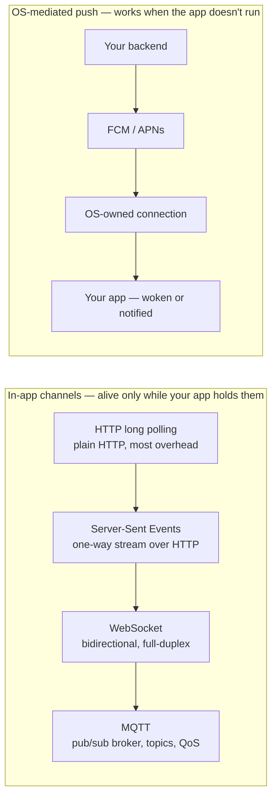
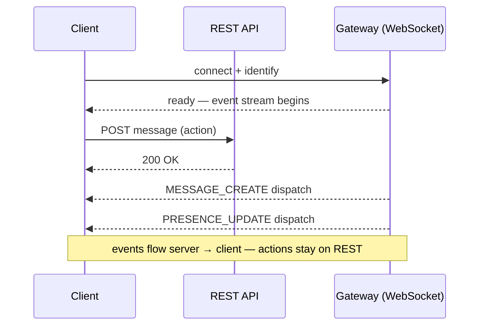
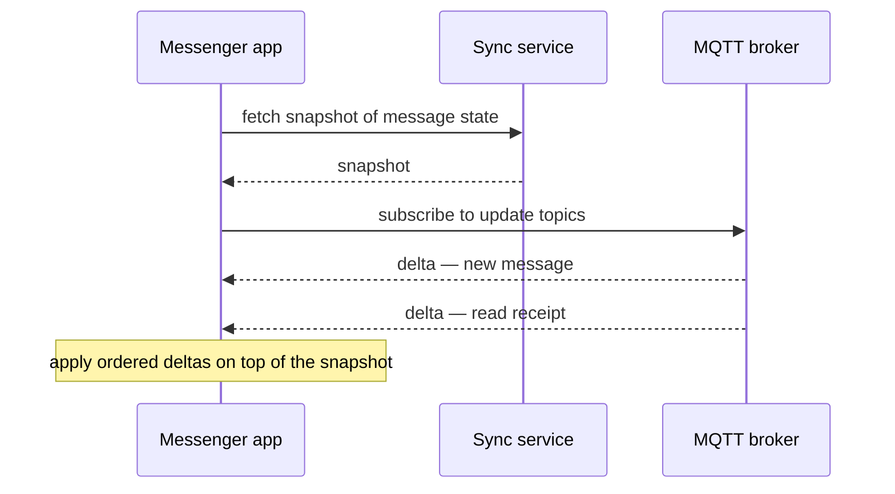
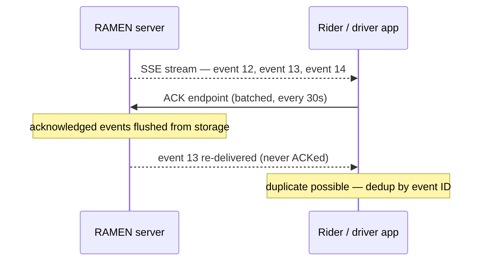
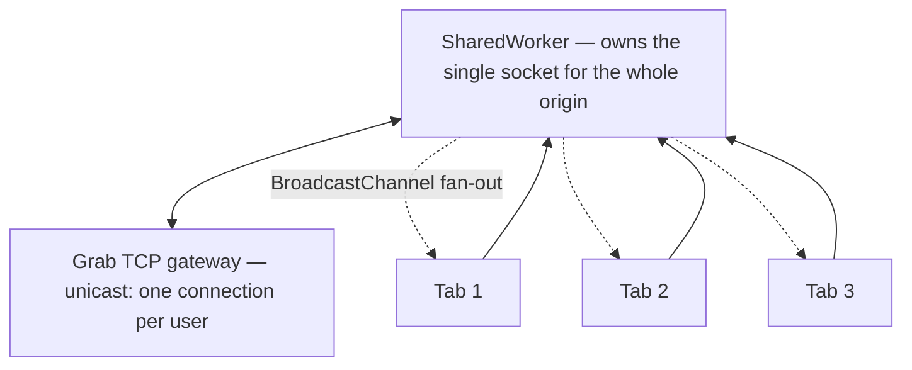
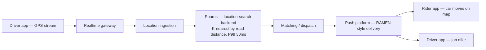
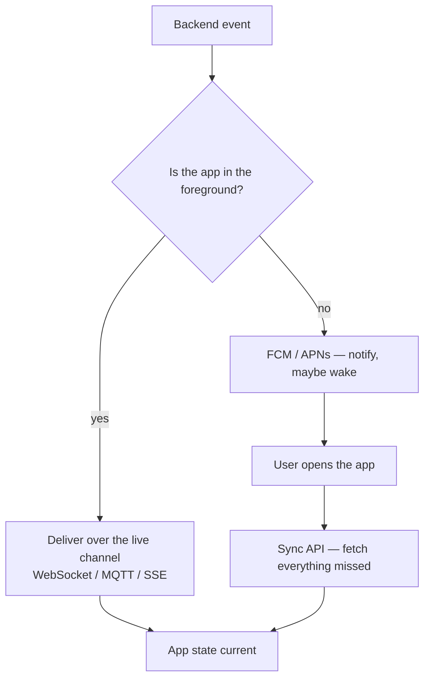
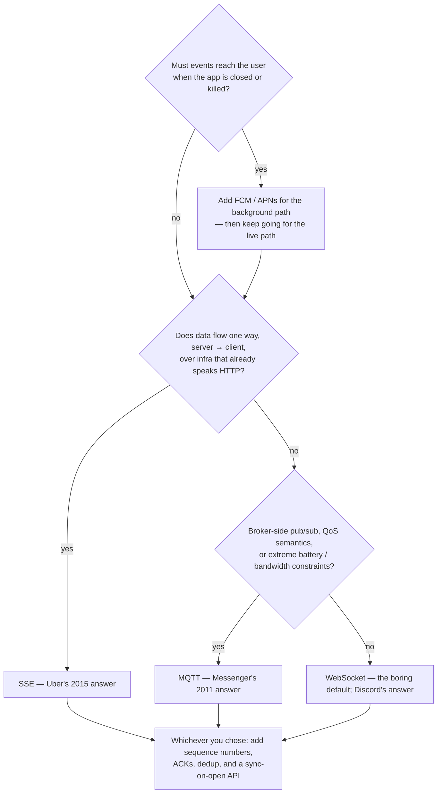

Every app hits this moment. A message should appear on the other phone _now_. An order status should flip from "preparing" to "on its way" without anyone pulling to refresh. A driver's car should glide across the map, not teleport every ten seconds.

The first implementation is always the same: poll. Call the API every five seconds and re-render. It works in the demo. Then the numbers come in: five-second staleness feels broken for chat, the battery drains from waking the radio all day, and the backend spends most of its CPU answering "anything new?" with "no." Poll faster and every one of those costs gets worse. Polling doesn't have a tuning problem — it has a direction problem: the client is asking when the server is the one who knows.

So you go looking for a real channel, and find four candidates staring back: **WebSocket**, **MQTT**, **SSE**, and **push notifications** — plus a comment section full of people certain that each one is the only correct answer. Here is the whole article in one sentence:

> [!TIP]
> **Don't choose a channel for speed — all four are fast enough. Choose for your events' semantics** — latency budget, frequency, direction, loss tolerance, and whether the app is even running — **and expect the channel to be the smallest part of your realtime architecture.** That's not my opinion; it's what Messenger, Discord, Uber and Grab's own engineering posts show, receipts included.

## Table of contents

## How Realtime Is Your Realtime?

"My app needs realtime" describes at least four different problems. Compare four events:

- **A chat message.** Bursty, bidirectional, and every single one must arrive — a lost message is a broken product. Sub-second delivery is the bar: Facebook's 2011 Messenger team measured success as [phone-to-phone delivery in "hundreds of milliseconds, rather than multiple seconds"](https://engineering.fb.com/2011/08/12/android/building-facebook-messenger/).
- **A driver's location.** A continuous stream, several updates per second, one direction. Losing one update is _fine_ — the next one supersedes it in a heartbeat. Latest-wins, not deliver-everything.
- **A dashboard metric or price tick.** One-way, periodic, tolerates a second of lag. Nobody's product breaks because a graph updated 800 ms late.
- **"Your order is ready."** Rare, but it must land _even if the app was killed hours ago_. Delivery matters more than latency — and the app being closed changes everything about how it can be delivered.

Same word — "realtime" — four different contracts. Before touching a protocol, pin your events down against seven factors:

| Factor | The question | Chat message | Driver location | Dashboard tick | Order-ready alert |
| --- | --- | --- | --- | --- | --- |
| Latency budget | How stale is broken? | < 1 s | ~1 s | seconds | minutes OK |
| Frequency | How often do events fire? | bursty | continuous | periodic | rare |
| Direction | Who sends? | both ways | client → server | server → client | server → client |
| Loss tolerance | Can an event be dropped? | never | yes, latest wins | mostly | never |
| Ordering | Do events need sequence? | strict | latest wins | latest wins | n/a |
| App state | Must it arrive in background? | notify, sync later | foreground only | foreground only | **yes, always** |
| Fan-out | One recipient or thousands? | few | one (the rider) | few | one |

Two rows do most of the deciding. **Loss tolerance** tells you how much delivery machinery you'll build no matter which channel you pick. **App state** tells you whether an in-app channel can even do the job — because, as we'll see, when the app leaves the foreground, every socket you own is living on borrowed time.

## The Option Spectrum — and Why Push Is a Different Animal

The four options aren't four flavors of the same thing. Three of them — long polling's successor SSE, WebSocket, MQTT — are **in-app channels**: your code opens them, your code keeps them alive, and they die with your process. They differ mainly in how much protocol you take on. Push — FCM on Android, APNs on iOS — is something else entirely: a **store-and-forward service operated by the OS vendor**, delivering through a connection the operating system owns, whether or not your app is running.



Reading the top rail left to right: each step buys more capability and costs more protocol to operate. Long polling is barely more than repeated HTTP. SSE adds a persistent one-way stream while staying ordinary HTTP. WebSocket upgrades to a full-duplex socket you speak both ways. MQTT adds a broker in the middle — topics, subscriptions, and three quality-of-service levels. The bottom rail never merges with the top one: push isn't a faster socket, it's a different delivery contract, and the mistake of treating it as "WebSocket for when the app is closed" produces apps that miss critical events silently.

Now the case studies — one company per channel, each from their own engineering blog, each ending in the same plot twist.

## WebSocket: Discord and the Decade of Living With It

WebSocket is the default answer for interactive realtime, and for good reason: one TCP connection, full-duplex, binary or text frames, supported everywhere. Discord has run its entire event firehose over WebSocket — the Gateway — for a decade.

The first thing worth copying is what Discord _doesn't_ send over the socket. Actions — sending a message, joining a server — go over plain REST. The Gateway is for the other direction: the server dispatching events to clients. Request/response stays on HTTP where it gets retries, status codes and caching for free; the socket does the one thing HTTP can't — server-initiated delivery.



The sequence shows the hybrid: the client performs actions through ordinary HTTP requests, while a single long-lived Gateway connection carries every event the server needs to push — new messages, presence changes, typing indicators — to that client.

The second lesson is what WebSocket _doesn't give you_. It's a transport: ordered frames while the connection lives, and nothing else. No acknowledgment that the app processed an event, no memory of what you missed while disconnected, no dedup, no resume. Discord had to build session resume, event sequence numbers, and reconnect handling as their own protocol on top.

And the third lesson is where a WebSocket system's wins come from once it works. In [September 2024, Discord published how they cut Gateway traffic by 40%](https://discord.com/blog/how-discord-reduced-websocket-traffic-by-40-percent) — and none of it involved replacing the socket. They swapped compression from zlib to Zstandard, validating it with a dark launch — compressing a small percentage of production traffic with both algorithms simultaneously before shipping any client change. And they attacked _what_ they sent: passive sessions had been receiving complete snapshots of server state; sending only delta changes cut that stream from 35.61% to 4.73% of Gateway bandwidth — roughly a 20% cluster-wide reduction on its own. Compression plus deltas produced the headline 40%.

A decade in, the socket was never the problem. The payloads were. Hold that thought — it's about to become a pattern.

## MQTT: Messenger and the Sync Protocol That Was the Actual Product

MQTT is a publish/subscribe protocol from 1999, built for telemetry over awful links: a central broker, hierarchical topics, tiny packet headers, and three delivery levels (QoS 0/1/2 — at-most-once, at-least-once, exactly-once-per-connection). You don't call an MQTT server; you subscribe to topics and the broker pushes.

Facebook reached for it in 2011 for exactly the reason it exists. Messenger's pull-based delivery took seconds; they needed a persistent connection that a phone could afford to hold. [Lucy Zhang's engineering post](https://engineering.fb.com/2011/08/12/android/building-facebook-messenger/) explains the pick: "MQTT is specifically designed for applications like sending telemetry data to and from space probes, so it is designed to use bandwidth and batteries sparingly." The payoff was the number quoted earlier: "By maintaining an MQTT connection and routing messages through our chat pipeline, we were able to often achieve phone-to-phone delivery in the hundreds of milliseconds, rather than multiple seconds."

Notice what that is: a transport win. Seconds to sub-second by replacing pull with a held-open connection. But the more instructive Messenger post came three years later, and it isn't about the broker at all.

By 2014, Messenger's problem wasn't latency — it was that a phone's view of your inbox kept drifting from the server's, and reconciling by re-fetching over HTTPS+JSON was expensive and error-prone. [The 2014 mobile-first infrastructure post](https://engineering.fb.com/2014/10/09/production-engineering/building-mobile-first-infrastructure-for-messenger/) describes the fix: "the client retrieves an initial snapshot of their messages...and then subscribes to delta updates, which are immediately pushed to the app through MQTT." A synchronization protocol: snapshot once, then ordered deltas forever, with the wire format moved to Thrift for good measure.



The diagram is the 2014 architecture: the app bootstraps from a snapshot, then the broker pushes every subsequent change as a delta, and the client's job is to apply them in order — never to re-download state it already has.

The results Meta published were a "40% reduction in non-media data usage through a new synchronization protocol" and "roughly a 20% decrease in the number of people who experience errors when trying to send a message" — plus Thrift cutting payload size on the wire by roughly 50%. Read those numbers again: the data win came from the _synchronization protocol_, and the reliability win — fewer failed sends — came from the same discipline. MQTT was three years old inside Messenger by then; the broker didn't change. What changed was the contract above it.

If snapshot-plus-ordered-deltas sounds familiar, it should — it's the same shape Telegram formalizes with `pts` counters and `getDifference`, which [I dissected in a previous post](/posts/telegram-doesnt-load-your-chat-history-so-why-do-thousands-of-messages-appear-instantly). Two rival messengers, same conclusion: **the sync protocol, not the channel, is the product.**

## SSE: Uber and the Case for Less Protocol

Server-Sent Events is the modest option: a long-lived HTTP response that streams `text/event-stream` data one way, server to client. It's plain HTTP — every proxy, load balancer and mobile stack already understands it — and the browser's `EventSource` even auto-reconnects, resuming from the last event ID. The limitation is structural: the server talks, the client doesn't (it makes ordinary HTTP requests when it has something to say).

That modesty is exactly why Uber chose it. Their realtime push platform — **RAMEN** (Realtime Asynchronous MEssaging Network) — carries continuous updates to riders, drivers, eaters and restaurants; the system grew to hold more than 1.5 million concurrent connections, pushing over 250,000 messages per second. [The RAMEN engineering post](https://www.uber.com/us/en/blog/real-time-push-platform/) records the 2015 protocol shoot-out plainly: "For an application protocol in 2015, our options were to utilize HTTP/1.1 with long polling, Web Sockets or finally Server-Sent events (SSE)." And the verdict: "Based on the various considerations like security, support in mobile SDKs, and binary size impact, we settled on using SSE." The reason it beat the flashier options: "Its simplicity and operability on the already supported HTTP + JSON API stack at Uber made it our choice at that time."

Read the criteria list twice, because no benchmark appears in it. Security review surface. Mobile SDK maturity. App binary size. Fit with infrastructure they already operated. Uber picked the channel the way you'd pick a dependency, not the way you'd pick a race car.

Then came the plot twist you can now predict. SSE is fire-and-forget — the server has no idea what the client actually received. Uber's apps needed better: "To provide at-least-once guarantees mentioned before, there was a need for acknowledgments and retries to be built into a delivery protocol on top of the application protocol." So they built one — clients batch acknowledgments to a separate endpoint every 30 seconds, and the server retries what was never acknowledged.



The sequence shows the reliability layer living entirely above the transport: events stream down over SSE, acknowledgments flow back over ordinary HTTP, unacknowledged events get re-sent — which is precisely why the client must deduplicate. At-least-once means duplicates are a feature of the design, not a bug.

Third case study, third company, same architecture: **pick a boring transport, build delivery semantics on top.**

## Grab: The Connection Model Is an Architecture Assumption

Grab's realtime backbone is a persistent TCP gateway. [Their engineering post on building web chat](https://engineering.grab.com/how-we-built-our-in-house-chat-platform-for-the-web) (June 2020) describes it directly: "Our TCP gateway takes care of processing all the incoming messages, authenticating, and routing them to the respective services." And it encodes a design decision worth noticing: "Our TCP connections are unicast, which means there is only one active connection possible per user at any point in time."

One user, one connection. On mobile that's not a constraint — it's reality; a phone runs one instance of the app. The assumption held for years, invisibly, until Grab brought chat to the web — where one user is _n_ browser tabs, each opening its own socket. Under unicast, every new tab's connection kills the previous tab's: older tabs silently disconnect and miss messages. Nothing was buggy; an architectural assumption had simply met a platform that violated it.

Grab's fix is a nice piece of browser arcana: a **SharedWorker** — one script instance shared across all tabs of an origin — owns the single socket, and the **BroadcastChannel** API fans messages out to every tab. One connection as the gateway demands; every tab still hears everything.



The diagram shows the repaired model: tabs never touch the network themselves — they talk to the SharedWorker, which multiplexes them over the one unicast connection and broadcasts every inbound message back to all tabs at once.

Grab is candid about the trade-off: SharedWorker's browser support is far from universal, which was acceptable because the solution targeted internal portals where users run Chrome. That honesty strengthens the lesson rather than weakening it — even the fix has an environmental assumption baked in, and the team knew to write it down this time. **Your connection model — one per user? per device? per tab? — is an architecture decision, and it will leak the day a new platform violates it.**

## The Socket Is Only the Edge

Here's a question that exposes how small the channel really is: when you watch your driver's car move across the map, what did it take to produce that dot?

The driver's phone streams GPS over its channel — that part, you now know. But the backend receiving those points has to _do_ something with them: keep a live index of every moving driver in the fleet, answer "which drivers are near this pickup point?", and answer it by _road distance_, because a driver across the river 200 meters away is ten minutes out. Then matching logic picks a driver, and the decision flows back down channels to two different apps.

Grab published the system that does the middle part: [**Pharos**](https://engineering.grab.com/pharos-searching-nearby-drivers-on-road-network-at-scale) (December 2020), a distributed in-memory location-search backend — not a realtime channel, and that's the point. Pharos does K-nearest-driver search by actual routing distance, keeps driver positions in Adaptive Radix Tree indices, snaps coordinates to the road network, and serves this in production at P99 latencies of 10 ms for a driver position update and 50 ms for a nearby-drivers query. On the Uber side of the same industry, RAMEN plays the delivery role at the scale quoted earlier — continuous updates flowing to every rider, driver, eater and restaurant in the marketplace.



Follow the diagram left to right: the channel appears exactly twice — at the far edges, ferrying GPS points in and decisions out. Everything in the middle — ingestion, the location index, matching — is where the ride-hailing engineering actually lives, and none of it cares whether the edges speak WebSocket, MQTT or SSE.

That's the proportion to internalize. The channel debate covers the first and last centimeters of the pipeline. If the middle doesn't exist, no protocol choice will save the product; if the middle is solid, several protocol choices would have worked.

## The Part Nobody Blogs About First: Failure Modes

Every case study above eventually built the same four defenses. They're the actual day-two work of realtime, so they deserve their own section — because your channel will spend a shocking fraction of its life broken.

**Networks switch.** A phone walks out of Wi-Fi range and hops to cellular; the old TCP connection doesn't say goodbye — it just stops. Your client needs to detect death (timeouts on expected traffic), not wait to be told.

**Connections die silently.** Half-open TCP is the norm, not the exception: the server thinks the client is there, the client thinks the server is there, and both are wrong. That's why every serious protocol heartbeats — WebSocket ping/pong frames, MQTT's keep-alive packets — and why servers reap connections that miss them. A connection that hasn't proven itself alive recently is dead.

**Reconnects come in storms.** When your gateway restarts or a region blips, every disconnected client notices at roughly the same moment — and a naive client reconnects immediately:

```text
outage ends at t=0

naive:      ||||||||||||        every client reconnects at t=0 —
            ^                   the herd hits the server at its weakest moment,
                                it buckles, disconnects everyone... repeat

backoff     |  |   |    |   |   each client waits 1s, 2s, 4s, 8s...
+ jitter:     |  |    |    |    ...from a random point in each window,
                                spreading the herd across time
```

Exponential backoff spreads retries out; the jitter — randomizing within each wait window — is what stops thousands of clients from backing off in perfect synchrony and arriving in waves. Both, always.

**Duplicates are guaranteed.** The moment you add retries — and you will, that's what at-least-once means — the same event will sometimes arrive twice, like RAMEN re-delivering an unACKed event. The channel can't fix this; the consumer must be idempotent: dedup by event ID, or make applying an event twice harmless. Uber's design accepts duplicates on purpose; so should yours.

None of this appears in a hello-world tutorial for any of the four channels. All of it appears in production for every one of them.

## Scale Breaks Autoscaling, and Backgrounding Breaks Everything

Two more realities, and then we can actually choose.

**Long-lived connections change the economics of scale.** A stateless HTTP fleet scales by adding pods behind a load balancer — requests are milliseconds long and land anywhere. A connection fleet is different: every socket is state — session, subscriptions, presence — pinned to one machine for minutes or hours. Discord says it flatly in the 2024 post: "due to the nature of gateway connections being long-lived, traditional autoscaling methods don't work well for our workload." You can't drain a million sockets because CPU crossed a threshold — reconnecting them _is_ the load (see: storms, above). Which explains Discord's actual strategy: if you can't elastically scale the connection count, cut the cost per connection — deltas instead of snapshots, zstd instead of zlib.

**And on mobile, your connection doesn't even own its lifetime.** [Apple's background-execution documentation](https://developer.apple.com/documentation/xcode/configuring-background-execution-modes) is unambiguous: backgrounded apps get suspended — code stops executing, and ordinary TCP sockets don't survive it outside a short list of special entitlements. Android is just as blunt: in Doze mode, [the docs state](https://developer.android.com/training/monitoring-device-state/doze-standby), network access is suspended entirely — and the same page tells you what to do about it: "If your app requires messaging integration with a backend service, we strongly recommend you use FCM if possible, rather than maintaining your own persistent network connection." High-priority FCM messages can wake the app with a brief window of network access. On iOS the same role belongs to APNs — [FCM itself rides APNs there](https://firebase.google.com/docs/cloud-messaging/ios/receive-messages) — with one caveat straight from Firebase's docs: "Apple platforms don't guarantee the delivery of background notifications, so this mechanism shouldn't be relied upon for critical tasks."

Put those two paragraphs together and the design falls out by elimination. Your in-app channel is a foreground creature. Push can reach a backgrounded phone but is a wake-up signal with no delivery guarantee, not a data pipe. Neither covers everything — so production apps run a **triad**:



The flow reads top to bottom: foregrounded apps get events over the live channel; backgrounded apps get a push that notifies the user and may wake the app; and — the part teams forget — on every app open, a sync API reconciles everything that happened in between, because neither the socket (dead) nor push (not guaranteed) was a complete record. Messenger's snapshot+delta, Telegram's `getDifference`, Uber's ACK-and-retry: every system in this post is, at bottom, an implementation of that third leg.

## The Decision, Made Honest

Everything above compresses into one table and one tree.

| | Direction | Protocol surface | Background? | Delivery guarantees built in | Proven by |
| --- | --- | --- | --- | --- | --- |
| **WebSocket** | both ways | socket + your own event protocol | no — dies with the app | none — ordered frames while connected | [Discord](https://discord.com/blog/how-discord-reduced-websocket-traffic-by-40-percent): a decade of Gateway operation |
| **MQTT** | both ways (pub/sub) | broker to operate, topics, QoS | no — same fate | QoS 0/1/2 per connection; persistence varies by broker | [Messenger](https://engineering.fb.com/2011/08/12/android/building-facebook-messenger/): sub-second delivery on phone budgets |
| **SSE** | server → client only | plain HTTP; auto-reconnect in spec | no — same fate | none — Uber built ACKs on top | [Uber RAMEN](https://www.uber.com/us/en/blog/real-time-push-platform/): 250K+ msgs/sec across 1.5M+ connections |
| **Push (FCM/APNs)** | server → user | none — OS owns the channel | **yes — its entire reason to exist** | best-effort; [background delivery not guaranteed on iOS](https://firebase.google.com/docs/cloud-messaging/ios/receive-messages) | [Android's own docs](https://developer.android.com/training/monitoring-device-state/doze-standby) recommend it over your own connection |

And the tree — noting that the first question isn't about protocol at all:



The tree asks three questions in order — background delivery first (that's a push question, not a protocol question), then direction of flow, then whether you genuinely need a broker's pub/sub and QoS semantics — and lands everyone else on WebSocket. Its most important node is the last one, which every path flows into regardless of the channel chosen.

Since this series will lean on my opinions as much as the evidence, here's where I actually stand:

**For most mobile apps in 2026, the default is WebSocket in the foreground, FCM/APNs for background wake-up, and a sync/gap-recovery API behind both.** It's the boring stack: no broker to operate, libraries everywhere, and every failure mode documented by teams who hit it first. MQTT earns its seat only when its specific machinery — broker-side pub/sub, QoS levels, extreme bandwidth and battery thrift — maps to a real constraint you have, which mostly means IoT fleets or Messenger-scale message volume. And SSE is the most underrated pick on the board: if your data genuinely flows one way and you already run an HTTP/JSON stack, Uber's 2015 reasoning is still sound in 2026 — less protocol, fewer moving parts, same result.

The most expensive mistake I see isn't picking the "wrong" channel — it's shipping any channel with no sequence numbers, no ACK story, no dedup, and discovering in production that the sync protocol was the actual product. That discovery has a price tag: Messenger's answer to it cut non-media data usage by 40% and the share of people hitting send errors by roughly 20% — numbers that came from the protocol above the transport, not from the transport.

And one piece of team-size honesty: if you can't staff on-call for a persistent-connection fleet, don't build one. At-least-once delivery over managed push plus pull-on-open covers a surprising share of apps whose spec says "realtime" — and it fails soft, loud, and cheap.

## Frequently Asked Questions

**Is MQTT overkill for a chat app?**
Usually, yes. Messenger's 2011 numbers prove MQTT works brilliantly for chat — but their 2014 post proves the wins that mattered came from the sync protocol above it, which you'd have to build regardless. Unless broker-side fan-out, QoS semantics, or extreme battery budgets are demonstrably your constraint, a WebSocket plus your own sequence/ACK layer reaches the same place with one less distributed system to operate.

**Can I skip all this with Firebase Realtime Database or a managed realtime service?**
For a lot of apps — genuinely yes. A managed realtime layer is someone selling you the triad from this post pre-built: connection management, reconnects, offline sync. You're trading for their data model, their pricing curve at scale, and vendor coupling in your app's most architectural layer. Fine trade for a small team; know you're making it.

**Do I need exactly-once delivery?**
You need exactly-once _processing_, and you get it by combining at-least-once delivery with idempotent handling — dedup by event ID. That's precisely Uber's design: SSE with ACKs and retries, duplicates accepted and filtered. Chasing exactly-once at the transport layer costs enormous complexity to solve a problem one `Set` of seen IDs solves at the edge.

**SSE or WebSocket for a web dashboard?**
Data flows one way on a dashboard, so SSE — it's plain HTTP through every proxy you already have, and reconnect-with-last-event-ID is in the spec instead of in your code. Move to WebSocket when the client genuinely talks back at event rates — collaborative editing, gaming, typing indicators — not because "WebSocket is more realtime." It isn't.

**Why not use push notifications for everything and skip the socket?**
Because push is a wake-up signal, not a data channel. On iOS, background delivery is explicitly not guaranteed — Firebase's docs say it "shouldn't be relied upon for critical tasks" — and platform rate limits and delays make it hopeless for high-frequency streams like locations or ticks. Use push for what only push can do — reaching a closed app — and pair it with a sync API so a missed push costs a bit of latency, never data.

## The Channel Was Never the Hard Part

Four companies, four different channels, one architecture. Discord runs WebSocket and spent 2024 engineering _what flows through it_. Messenger runs MQTT and its defining move was a sync protocol. Uber runs SSE and built at-least-once delivery above it. Grab runs raw TCP and its war story is about a connection-model assumption. Every team treated the channel as a commodity and spent their real engineering on the same list: connection lifecycle, ordering, acknowledgment, dedup, gap recovery, background strategy.

So choose your channel with the tree above — it's a solid decision worth an afternoon, not a month. Then budget the real work for the delivery architecture around it, because that's the part your users experience: not which protocol carried the message, but whether the message showed up, exactly once, in order, even after a tunnel.

If you want to see what a fully-grown version of that third leg looks like — a client that always knows what it has and fetches only what it's missing — I walked through Telegram's sync engine in [Telegram Doesn't Load Your Chat History. So Why Do Thousands of Messages Appear Instantly?](/posts/telegram-doesnt-load-your-chat-history-so-why-do-thousands-of-messages-appear-instantly) It's this post's other half: here, how events reach the app; there, how the app recovers the truth when they didn't.

_This post opens the Realtime series. Next: the delivery architecture itself — ordering, acknowledgments, and gap recovery, or: what "the sync protocol is the product" looks like in code._

## Sources

Every claim above was checked against these primary sources (as of August 2026):

- [Building Facebook Messenger — engineering.fb.com](https://engineering.fb.com/2011/08/12/android/building-facebook-messenger/) (Lucy Zhang, Aug 2011) — MQTT adoption, the space-probe design quote, and "hundreds of milliseconds, rather than multiple seconds."
- [Building Mobile-First Infrastructure for Messenger — engineering.fb.com](https://engineering.fb.com/2014/10/09/production-engineering/building-mobile-first-infrastructure-for-messenger/) (Oct 2014) — snapshot + MQTT delta sync, 40% non-media data reduction, ~20% fewer send-error users, Thrift −50% payload.
- [How Discord Reduced WebSocket Traffic by 40% — discord.com/blog](https://discord.com/blog/how-discord-reduced-websocket-traffic-by-40-percent) (Sep 2024) — passive-session deltas (35.61% → 4.73% of Gateway bandwidth, ~20% cluster-wide), zlib → zstd with dark launch, and the long-lived-connections autoscaling quote.
- [Uber's Real-Time Push Platform (RAMEN) — uber.com/blog](https://www.uber.com/us/en/blog/real-time-push-platform/) — the 2015 long-polling/WebSocket/SSE evaluation, why SSE won, at-least-once via ACK/retry, the 30-second ACK endpoint, and its 1.5M+ concurrent connections / 250K+ messages-per-second scale.
- [How We Built Our In-House Chat Platform for the Web — engineering.grab.com](https://engineering.grab.com/how-we-built-our-in-house-chat-platform-for-the-web) (Jun 2020) — the unicast TCP gateway, the multi-tab problem, and the SharedWorker + BroadcastChannel fix with its Chrome-only trade-off.
- [Pharos: Searching Nearby Drivers on Road Network at Scale — engineering.grab.com](https://engineering.grab.com/pharos-searching-nearby-drivers-on-road-network-at-scale) (Dec 2020) — K-nearest driver search by routing distance, ART indices, P99 10 ms updates / 50 ms queries.
- [Configuring Background Execution Modes — developer.apple.com](https://developer.apple.com/documentation/xcode/configuring-background-execution-modes) — iOS background suspension and the limits on persistent sockets.
- [Optimize for Doze and App Standby — developer.android.com](https://developer.android.com/training/monitoring-device-state/doze-standby) — Doze's network suspension and the recommendation to use FCM over your own persistent connection.
- [Receive Messages in an Apple App — firebase.google.com](https://firebase.google.com/docs/cloud-messaging/ios/receive-messages) — FCM delivery via APNs and the no-guarantee caveat for background notifications.
