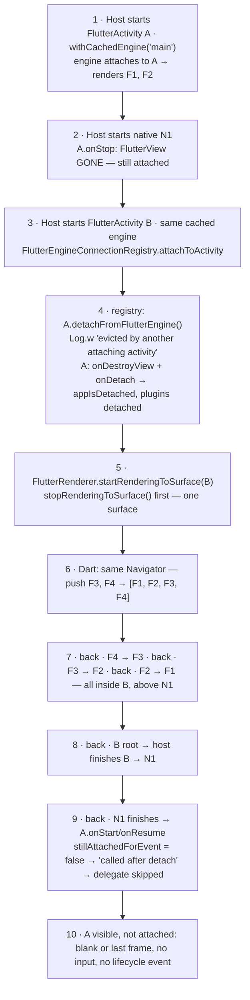
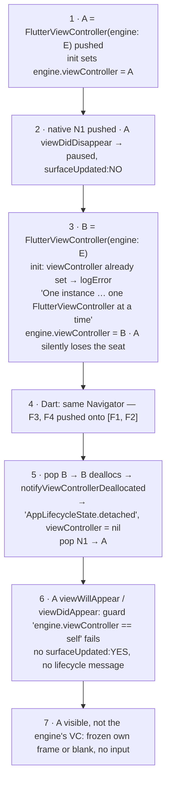
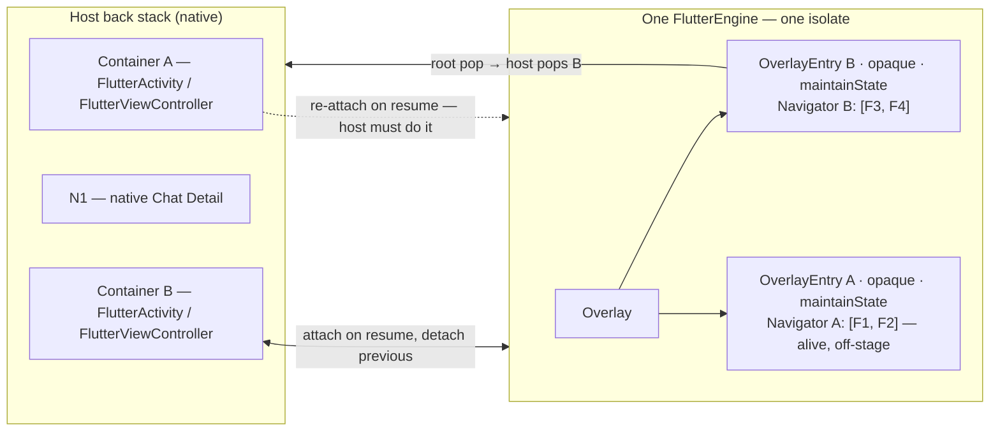
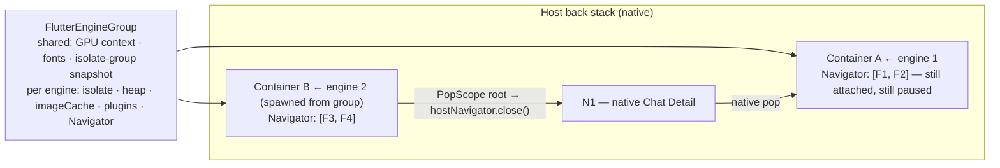
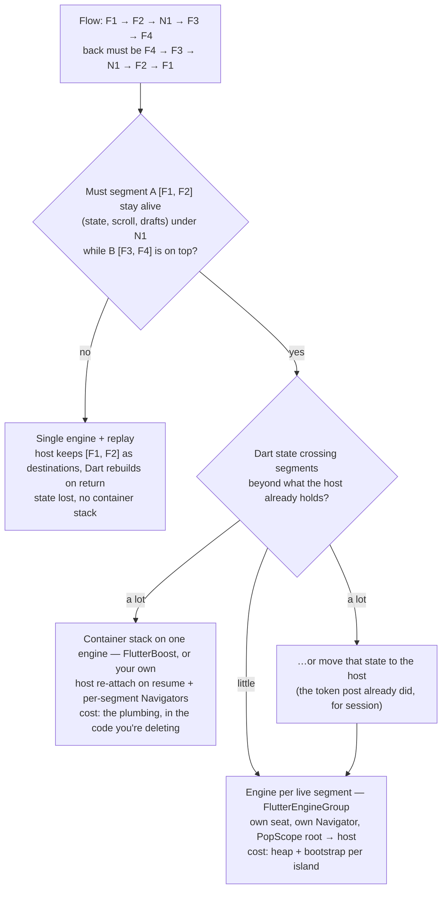

[The navigation post](/posts/half-flutter-half-native-who-owns-navigation-mid-migration/) ended with a decision I refused to fake: once the host owns the back stack, do we run **one** Flutter engine re-attached to every Flutter container (S1), or **one engine per Flutter island** from a `FlutterEngineGroup` (S2)? I listed criteria and moved on. This is the post that owes an answer — at least the half of it that can be answered by reading source instead of a stopwatch. The stopwatch half, the first-frame number for a cold island on our devices, is still a separate post.

Here is the flow that decides it. Same app, same screens, one step longer than last time:

```
Flutter Group Setting → Flutter Member List → NATIVE Chat Detail → Flutter User Profile → Flutter Profile Media
F1                   → F2                  → N1                 → F3                  → F4
                                              back must be F4 → F3 → N1 → F2 → F1
```

Two Flutter *segments*, `[F1, F2]` and `[F3, F4]`, with a native screen between them, and a back button that has to walk the whole thing in order — including into a Member List that still has its scroll position and its selection. The reflex answer is "one cached engine, both containers, done." It is five lines of code and it fails on the second back. Why it fails, and what it costs to make it not fail, is what settles S1 versus S2.

> [!TIP]
> On both platforms a `FlutterEngine` attaches to exactly **one** container at a time. So "one cached engine for both segments" is not the cheap default — it is the FlutterBoost architecture: the host re-attaches the engine on every resume, and Dart keeps a stack of per-segment `Navigator`s alive off-stage. Two engines from a `FlutterEngineGroup` buy back exactly those two things and charge an isolate boundary and a second bootstrap. Choose by whether a Flutter segment must stay alive under a native screen, and by how much Dart state crosses segments — not by how many features you have.

## Table of contents

## The Reflex Answer: One Cached Engine, Two Containers

The add-to-app docs make one engine look like the natural unit. On Android, "when using a cached `FlutterEngine`, that `FlutterEngine` outlives any `FlutterActivity` or `FlutterFragment` that displays it" ([docs](https://docs.flutter.dev/add-to-app/android/add-flutter-screen)). On iOS the recommendation is to pre-warm one long-lived engine because "your Flutter and Dart state will outlive one `FlutterViewController`" ([docs](https://docs.flutter.dev/add-to-app/ios/add-flutter-screen)). Dart state outlives containers; containers are cheap; so give the second segment a second container on the same engine:

```kotlin
// Container A — Group Setting, Member List
startActivity(FlutterActivity.withCachedEngine("main").build(this))
// … native Chat Detail in between …
// Container B — User Profile, Profile Media
startActivity(FlutterActivity.withCachedEngine("main").build(this))
```

```swift
let a = FlutterViewController(engine: engine, nibName: nil, bundle: nil)   // A
// … native Chat Detail in between …
let b = FlutterViewController(engine: engine, nibName: nil, bundle: nil)   // B
```

Push F3 and F4 inside B, tap back four times, and you expect F3, N1, F2, F1. What you get is F3, then F2 *inside container B, sitting on top of Chat Detail*, then F1, then Chat Detail — and one more back lands on a blank screen where Member List used to be. Two different things went wrong, and they are worth separating because only one of them is fixable by trying harder.

## Reveal 1: The Engine Has One Seat

The first thing is not a bug. It is a contract, and it is written down — just not on the page you read when you start.

**Android.** The Android embedding has an interface called [`ExclusiveAppComponent`](https://github.com/flutter/flutter/blob/4abfc5dcd07da2046780aa29d35837076932ef7f/engine/src/flutter/shell/platform/android/io/flutter/embedding/android/ExclusiveAppComponent.java#L9-L14), and its Javadoc says the whole thing: "An exclusive App Component's `detachFromFlutterEngine` is invoked when another App Component is becoming attached to the `FlutterEngine` this App Component is currently attached to." The enforcement is in [`FlutterEngineConnectionRegistry.attachToActivity`](https://github.com/flutter/flutter/blob/4abfc5dcd07da2046780aa29d35837076932ef7f/engine/src/flutter/shell/platform/android/io/flutter/embedding/engine/FlutterEngineConnectionRegistry.java#L316-L327): if an exclusive activity is already attached, it calls `detachFromFlutterEngine()` on it before attaching the new one. And [`FlutterActivity.detachFromFlutterEngine`](https://github.com/flutter/flutter/blob/4abfc5dcd07da2046780aa29d35837076932ef7f/engine/src/flutter/shell/platform/android/io/flutter/embedding/android/FlutterActivity.java#L898-L909) is not subtle about it:

```java
Log.w(TAG, "FlutterActivity " + this + " connection to the engine " + getFlutterEngine()
    + " evicted by another attaching activity");
if (delegate != null) {
  delegate.onDestroyView();
  delegate.onDetach();
}
```

So the moment container B attaches to `"main"`, container A — stopped, sitting under Chat Detail, holding Member List — is *evicted*. Its `FlutterView` is detached, its delegate's `onDetach` runs, Dart receives `AppLifecycleState.detached` for the whole engine, and every `ActivityAware` plugin gets `onDetachedFromActivity()`. The renderer only ever holds one surface anyway: [`FlutterRenderer.startRenderingToSurface`](https://github.com/flutter/flutter/blob/4abfc5dcd07da2046780aa29d35837076932ef7f/engine/src/flutter/shell/platform/android/io/flutter/embedding/engine/renderer/FlutterRenderer.java#L1142-L1150) calls `stopRenderingToSurface()` first unless it is only swapping surfaces. [`FlutterFragment`](https://github.com/flutter/flutter/blob/4abfc5dcd07da2046780aa29d35837076932ef7f/engine/src/flutter/shell/platform/android/io/flutter/embedding/android/FlutterFragment.java#L1203) logs the identical line, so a single-Activity host with two `FlutterFragment`s is in the same place.

The part that actually bites is what happens on the way *back*. When N1 finishes and A resumes, `FlutterActivity.onStart` and `onResume` first ask [`stillAttachedForEvent`](https://github.com/flutter/flutter/blob/4abfc5dcd07da2046780aa29d35837076932ef7f/engine/src/flutter/shell/platform/android/io/flutter/embedding/android/FlutterActivity.java#L1517-L1526); it sees `delegate.isAttached() == false`, logs `"… onStart called after detach."`, and skips the delegate. Nothing re-attaches. No surface, no lifecycle message, no input. A is an Activity with a `FlutterView` in it and no engine behind it.



Reading it top to bottom: steps 3–4 are the eviction, step 5 the one-surface rule, step 9 the missing re-attach. Step 7 is the second problem — the Navigator — and gets its own section. Everything here is in [`FlutterActivityAndFragmentDelegate`](https://github.com/flutter/flutter/blob/4abfc5dcd07da2046780aa29d35837076932ef7f/engine/src/flutter/shell/platform/android/io/flutter/embedding/android/FlutterActivityAndFragmentDelegate.java#L772-L821): `onDetach` sends `appIsDetached()` and sets `isAttached = false`; nothing later sets it back for the same Activity.

**iOS** says it in a header comment. [`FlutterEngine.h`](https://github.com/flutter/flutter/blob/4abfc5dcd07da2046780aa29d35837076932ef7f/engine/src/flutter/shell/platform/darwin/ios/framework/Headers/FlutterEngine.h#L313-L327): "A FlutterEngine can only have one `FlutterViewController` at a time. If there is already a `FlutterViewController` associated with this instance, this method will replace the engine's current viewController with the newly specified one." The property is `weak`. Creating `FlutterViewController(engine:)` for B sets it — and if A already holds it, [`initWithEngine:`](https://github.com/flutter/flutter/blob/4abfc5dcd07da2046780aa29d35837076932ef7f/engine/src/flutter/shell/platform/darwin/ios/framework/Source/FlutterViewController.mm#L190-L204) logs an error you may never read: "One instance of the FlutterEngine can only be attached to one FlutterViewController at a time. Set FlutterEngine.viewController to nil before attaching it to another FlutterViewController." Then it attaches B anyway. [`setViewController:`](https://github.com/flutter/flutter/blob/4abfc5dcd07da2046780aa29d35837076932ef7f/engine/src/flutter/shell/platform/darwin/ios/framework/Source/FlutterEngine.mm#L520-L541) hands the platform view, the text-input plugin and the dealloc observer to B; A is not told anything — it simply stops being the engine's view controller. Dart hears `AppLifecycleState.detached` later, when B is popped and deallocated ([`notifyViewControllerDeallocated`](https://github.com/flutter/flutter/blob/4abfc5dcd07da2046780aa29d35837076932ef7f/engine/src/flutter/shell/platform/darwin/ios/framework/Source/FlutterEngine.mm#L558-L570)), which also leaves the engine with no view controller at all.

And on the way back, every lifecycle method in [`FlutterViewController.mm`](https://github.com/flutter/flutter/blob/4abfc5dcd07da2046780aa29d35837076932ef7f/engine/src/flutter/shell/platform/darwin/ios/framework/Source/FlutterViewController.mm#L823-L862) — `viewWillAppear`, `viewDidAppear`, `viewWillDisappear`, `viewDidDisappear` — opens with `if (self.engine.viewController == self)`. A is no longer the engine's view controller — nobody is, once B is gone — so its `viewWillAppear` sends nothing and never calls `surfaceUpdated:YES`. Each view controller owns its own `FlutterView`, so A shows whatever its own layer last held before N1 covered it — a frozen Member List that takes no input — or nothing.



Same shape, one seat, no re-attach. The Android docs do gesture at this: developers who want "the same `FlutterEngine` between different `Activity`s and `Fragment`s … need to set up a method channel and explicitly instruct their Dart code to change `Navigator` routes" ([docs](https://docs.flutter.dev/add-to-app/android/add-flutter-screen)). Read that sentence again after the timelines. It is describing FlutterBoost.

## Reveal 2: Even Re-attached, the Navigator Is Wrong

Suppose you fix the seat. You override the eviction, you re-attach the engine to A in `onResume`, you set `engine.viewController = A` in `viewWillAppear`. You still have step 7.

The engine has one `Navigator`. Container B pushed F3 and F4 onto it, so the stack is `[F1, F2, F3, F4]`, and Flutter has no idea Chat Detail exists. Back from F3 pops to F2 — rendered in container B, above N1, with the native screen still on the host stack underneath. Back again pops to F1. Back again is the island root, so B tells the host to pop it, and *now* Chat Detail appears, above a Member List that has already been popped in Dart. Four backs gave F3, F2, F1, Chat Detail; the fifth gives a blank Member List. Order broken, history broken.

The one-engine design that works cannot use one Navigator. It needs one Navigator **per segment**, and the segments below the top one have to stay alive, off-stage, so that when the host pops B and re-attaches A, `[F1, F2]` is still there with its state. That is what "host owns the order, engine strategy lives below it" means in code, and it is exactly what [FlutterBoost](https://github.com/alibaba/flutter_boost) has been doing in production since Xianyu. Its Dart side, at the [pinned commit](https://github.com/alibaba/flutter_boost/tree/6df80cc1ea425cde1bac7d0265407977221061df): [`FlutterBoostApp`](https://github.com/alibaba/flutter_boost/blob/6df80cc1ea425cde1bac7d0265407977221061df/lib/src/flutter_boost_app.dart#L63) keeps `List<BoostContainer> _containers` and builds a single [`Overlay`](https://github.com/alibaba/flutter_boost/blob/6df80cc1ea425cde1bac7d0265407977221061df/lib/src/flutter_boost_app.dart#L156-L172); each container is a [`ContainerOverlayEntry`](https://github.com/alibaba/flutter_boost/blob/6df80cc1ea425cde1bac7d0265407977221061df/lib/src/container_overlay.dart#L28-L34) declared `opaque: true, maintainState: true` — the entry underneath is not painted but not disposed — and each [`BoostContainer`](https://github.com/alibaba/flutter_boost/blob/6df80cc1ea425cde1bac7d0265407977221061df/lib/src/boost_container.dart#L16-L48) owns its own `GlobalKey<NavigatorState>` and its own `Navigator`. Back at a container root goes to the host through `nativeRouterApi.popRoute`.



Reading it: the host owns the stack; there is one engine; the host re-attaches it to whichever Flutter container resumes; Dart keeps one Navigator per container as an opaque, state-keeping overlay entry. This is the honest version of the S1 row in [the last post's table](/posts/half-flutter-half-native-who-owns-navigation-mid-migration/#reveal-2-the-contract-doesnt-say-who-holds-the-stack), which I wrote as "flattened: each container shows one route." That is the degenerate case. The general case is one Navigator per segment, and it is the part that costs.

How much it costs is written into FlutterBoost's native side, and it is worth quoting because it is the price list for "single engine." On Android, [`FlutterBoostActivity`](https://github.com/alibaba/flutter_boost/blob/6df80cc1ea425cde1bac7d0265407977221061df/android/src/main/java/com/idlefish/flutterboost/containers/FlutterBoostActivity.java#L79-L86) neutralises the eviction by overriding it to nothing:

```java
@Override
public void detachFromFlutterEngine() {
    /**
     * TODO:// Override and do nothing to avoid destroying
     * FlutterView unexpectedly.
     */
    // … debug log only
}
```

It [takes over lifecycle dispatch](https://github.com/alibaba/flutter_boost/blob/6df80cc1ea425cde1bac7d0265407977221061df/android/src/main/java/com/idlefish/flutterboost/containers/FlutterBoostActivity.java#L88-L90) (`shouldDispatchAppLifecycleState()` returns `false`), and in [`onResume`](https://github.com/alibaba/flutter_boost/blob/6df80cc1ea425cde1bac7d0265407977221061df/android/src/main/java/com/idlefish/flutterboost/containers/FlutterBoostActivity.java#L114-L145) it detaches the previous top container and calls its own [`performAttach`](https://github.com/alibaba/flutter_boost/blob/6df80cc1ea425cde1bac7d0265407977221061df/android/src/main/java/com/idlefish/flutterboost/containers/FlutterBoostActivity.java#L180-L192) — `getActivityControlSurface().attachToActivity(...)` plus `flutterView.attachToFlutterEngine(...)`. And in `onPause` it hides the transition frame with [reflection into a private engine field](https://github.com/alibaba/flutter_boost/blob/6df80cc1ea425cde1bac7d0265407977221061df/android/src/main/java/com/idlefish/flutterboost/containers/FlutterBoostActivity.java#L215-L226):

```java
// Fix black screen when activity transition
private void setIsFlutterUiDisplayed(boolean isDisplayed) {
    try {
        FlutterRenderer flutterRenderer = getFlutterEngine().getRenderer();
        Field isDisplayingFlutterUiField = FlutterRenderer.class.getDeclaredField("isDisplayingFlutterUi");
        isDisplayingFlutterUiField.setAccessible(true);
        isDisplayingFlutterUiField.setBoolean(flutterRenderer, false);
        // …
    } catch (Exception e) {
        Log.e(TAG, "You *should* keep fields in io.flutter.embedding.engine.renderer.FlutterRenderer.");
        // …
    }
}
```

On iOS, [`FBFlutterViewContainer`](https://github.com/alibaba/flutter_boost/blob/6df80cc1ea425cde1bac7d0265407977221061df/ios/Classes/container/FBFlutterViewContainer.m#L246-L262) does the seat by hand — `if (ENGINE.viewController != self) ENGINE.viewController = self;` — in both `viewWillAppear` and `viewDidAppear`, steps around `FlutterViewController`'s own `viewWillAppear` through a category that calls `UIViewController`'s directly, and orders `surfaceUpdated:YES` after the show with a comment ([translated](https://github.com/alibaba/flutter_boost/blob/6df80cc1ea425cde1bac7d0265407977221061df/ios/Classes/container/FBFlutterViewContainer.m#L285-L307)) that names what a mis-ordered seat handoff looks like: update only after show, "otherwise it flickers; or on swipe-back the previous page shows the same content as the top page." Ordering `surfaceUpdated:` wrong with a platform view present is a [main-thread freeze](https://github.com/alibaba/flutter_boost/issues/1871). At the pinned commit the Dart root is still a `WillPopScope`, so Android predictive back is not in the picture yet.

None of that is a criticism of FlutterBoost. It is what "one engine, correct back" costs when you write it down: an eviction override, a resume re-attach on each platform, your own lifecycle dispatch, a black-frame workaround that depends on an engine private, and a Dart container manager. If Flutter is what you are growing, that plumbing amortises. We are shrinking Flutter — every line of it lives in the codebase we're deleting.

## Reveal 3: What Two Engines Buy, and What They Cost

Give each segment its own engine and both problems disappear at once. Container A keeps engine 1 — nobody evicts it, because B attaches engine 2. Each engine has its own root `Navigator`, so `[F1, F2]` and `[F3, F4]` are separate by construction, and back at an island root is the `PopScope` from the last post, unchanged:

```dart
PopScope(
  canPop: false,
  onPopInvokedWithResult: (didPop, _) {
    if (!didPop) hostNavigator.close(null);    // island root: hand back to the host
  },
  child: ...,
)
```



Reading it: nothing re-attaches because nothing was evicted; each engine keeps its seat; the host's only new job is a registry — segment id in, engine out — with a spawn on open, a destroy on close, and one spare kept warm. This is the topology the [multiple-Flutters page](https://docs.flutter.dev/add-to-app/multiple-flutters) recommends for exactly our shape, "a hybrid mixture of native -> Flutter -> native -> Flutter", and the [official sample](https://github.com/flutter/samples/tree/main/add_to_app/multiple_flutters) is the reference for the registry.

The rule that falls out: **one engine per live Flutter segment on the host stack.** Not one per feature, not one per screen — one per contiguous run of Flutter that has to survive under something native. `F → N → F` needs two; `F → N → F → N → F` needs three; a leaf that nothing sits under needs none of this.

Now the bill. A `FlutterEngineGroup` "share[s] resources which allows them to be created with less time co[st] and occupy less memory" than independent engines ([`FlutterEngineGroup.h`](https://github.com/flutter/flutter/blob/4abfc5dcd07da2046780aa29d35837076932ef7f/engine/src/flutter/shell/platform/darwin/ios/framework/Headers/FlutterEngineGroup.h#L45-L47)); the docs list what: GPU context, font metrics, the isolate-group snapshot ([docs](https://docs.flutter.dev/add-to-app/multiple-flutters)). The number everyone repeats — [Flutter 2.0](https://flutter.dev/blog/whats-new-in-flutter-2-0) "reduced the static memory cost of creating additional Flutter engines by ~99% to ~180kB per instance" — is exactly that: *static* engine cost. It is not your heap. What stays per engine:

| Per engine, not shared | Source |
| --- | --- |
| The Dart isolate and its heap — no shared singletons across segments | [multiple-flutters](https://docs.flutter.dev/add-to-app/multiple-flutters) · [#115533](https://github.com/flutter/flutter/issues/115533) |
| `PaintingBinding.imageCache` — one per isolate, no sharing | [#72033](https://github.com/flutter/flutter/issues/72033) (open) |
| Plugin registration — `GeneratedPluginRegistrant` runs per engine | [#78590](https://github.com/flutter/flutter/issues/78590) |
| `main()` — DI, theme, localisation, whatever your bootstrap does, once per island | this is where a cold island's first frame goes; unmeasured for us |
| The root `Navigator`, the lifecycle state, the platform-channel handlers | by construction |

And the track record, states checked 2026-08-16, because "official recommendation" is not the same as "always was smooth" — most of the crashes are history, what remains open is memory-shaped:

| Issue | State | What it is |
| --- | --- | --- |
| [#159718](https://github.com/flutter/flutter/issues/159718) | open | iOS freeze on scroll after a platform view, engines from one group |
| [#77621](https://github.com/flutter/flutter/issues/77621) | open | iOS: invisible `IOSurface`s of multiple engines not deallocated — the memory report [#156802](https://github.com/flutter/flutter/issues/156802) was closed as its duplicate |
| [#72033](https://github.com/flutter/flutter/issues/72033) | open | image cache per engine, no sharing |
| [#122364](https://github.com/flutter/flutter/issues/122364) · [#79335](https://github.com/flutter/flutter/issues/79335) | fixed 2023 · 2021 | Android / iOS crashes with engines spawned from a group |
| [#165372](https://github.com/flutter/flutter/issues/165372) | fixed 2025 | group + platform view: blank on iOS when switching engines |
| [#78590](https://github.com/flutter/flutter/issues/78590) | fixed 2021 | plugins not found in a second engine — the per-engine registration rule above |

The registry itself is small. Host-side, application scope:

```kotlin
object FlutterSegments {
  private val group by lazy { FlutterEngineGroup(app) }
  private var spare: FlutterEngine? = null
  fun open(segmentId: String): FlutterEngine {
    val e = spare ?: group.createAndRunEngine(app, DartEntrypoint.createDefault())
    spare = null
    FlutterEngineCache.getInstance().put(segmentId, e)   // FlutterActivity.withCachedEngine(segmentId)
    prewarm(); return e
  }
  fun close(segmentId: String) = FlutterEngineCache.getInstance().run { get(segmentId)?.destroy(); remove(segmentId) }
  private fun prewarm() { spare = group.createAndRunEngine(app, DartEntrypoint.createDefault()) }
}
```

```swift
final class FlutterSegments {
  private let group = FlutterEngineGroup(name: "segments", project: nil)
  private var live: [String: FlutterEngine] = [:]
  private var spare: FlutterEngine?
  func open(_ id: String) -> FlutterViewController {
    let e = spare ?? group.makeEngine(withEntrypoint: nil, libraryURI: nil)
    spare = nil; live[id] = e; prewarm()
    return FlutterViewController(engine: e, nibName: nil, bundle: nil)
  }
  func close(_ id: String) { live[id]?.viewController = nil; live[id] = nil }
  private func prewarm() { spare = group.makeEngine(withEntrypoint: nil, libraryURI: nil) }
}
```

One caveat the sketch hides: a pre-warmed spare has already run `main()`, so `initialRoute` is too late for it — the first destination goes in through the `HostRouter` → `AppNavigator.open` path from the last post, which is the path we wanted anyway. The plumbing "two engines" adds is those two files, and it lives on the side we're keeping.

## Four Ways to Hold Two Segments

There are two more options the "single or group" framing hides, and one of them is honest enough to list.

| | One engine, container stack | Engine per live segment | One engine + replay | N1 as a platform view (S3′) |
| --- | --- | --- | --- | --- |
| Eviction | must neutralise + re-attach on resume | none | must (finish A, relaunch A′) | n/a — one container |
| Navigator model | stack of Navigators, off-stage kept | one root Navigator per engine | one, rebuilt from destinations | one; N1 is a route |
| Segment A state | kept | kept | **lost** | kept |
| Plumbing we own | most, in Flutter | registry + `PopScope` root | medium | platform-view wrappers |
| Shared Dart state | free | via the host ([#115533](https://github.com/flutter/flutter/issues/115533)) | free | free |
| Rough edges | Boost [#1871](https://github.com/alibaba/flutter_boost/issues/1871), memory [#669](https://github.com/alibaba/flutter_boost/issues/669) / [#1457](https://github.com/alibaba/flutter_boost/issues/1457); predictive back gap | open [#159718](https://github.com/flutter/flutter/issues/159718) [#77621](https://github.com/flutter/flutter/issues/77621); fixed [#122364](https://github.com/flutter/flutter/issues/122364) [#79335](https://github.com/flutter/flutter/issues/79335) [#165372](https://github.com/flutter/flutter/issues/165372) | few | [#144499](https://github.com/flutter/flutter/issues/144499) open; [#148662](https://github.com/flutter/flutter/issues/148662) fixed |
| Fit for shrinking Flutter | poor | **good** | fine for leaf segments | poor — inverts the direction |

**Replay** is the cheap one nobody mentions: don't keep segment A alive at all. The host keeps `[F1, F2]` as a list of `AppDestination`s — the contract from the last post already makes every screen reconstructible — and when N1 pops, the host relaunches a fresh container and Dart rebuilds the two routes. Order is right; scroll position and unsaved input are gone. If your Flutter leftovers are leaf screens where losing state is invisible, this is the smallest correct answer, and it needs neither a container stack nor a second engine.

**S3′** keeps the Flutter shell as the stack owner and renders the native screen *inside* a Flutter route as a full-screen platform view. The Navigator stays the only stack, so back is trivially right. It is also the wrong direction for a migration to native — the shell never becomes native this way — and platform views carry their own caveats: the docs say to avoid them if you can ([Android](https://docs.flutter.dev/platform-integration/android/platform-views), [iOS](https://docs.flutter.dev/platform-integration/ios/platform-views)), the first-frame texture copy is skipped ([#144499](https://github.com/flutter/flutter/issues/144499), open), and Android 14 had a blank-on-resume that took a release to fix ([#148662](https://github.com/flutter/flutter/issues/148662)). A screen shaped like an Activity does not fit a host shaped like a View. Listed for completeness; not for us.

## The Decision, and Ours

The ChatGPT-shaped decision tree — "do the two Flutter worlds need to be independent?" — asks about the wrong noun. Repos and packages don't decide engine count. Two questions do:



Reading it: the first branch is about the *user* — does anything they did in segment A have to survive a trip through native? The second is about the *Dart heap* — how much would two isolates fail to share? Only after both do you get to say "engine group."

For us: Member List keeps a scroll offset and a selection, so the first answer is yes. The second answer is "little" — [the token post](/posts/how-does-a-flutter-module-get-a-token-from-the-native-host/) already moved session, device and environment to the host, and our features fetch their own data; there is no Dart-side database or shared cache today. So **we're going S2 — one engine per live segment, one spare pre-warmed — on two conditions**:

1. The first frame of a fresh island, measured on our low-end Android and one iPhone with the engine's own signals (`FlutterUiDisplayListener` on Android, `setFlutterViewDidRenderCallback:` on iOS), comes in under a threshold we set before we measure. That is the benchmark post, and it is the number this post does not have.
2. Nothing Dart-owned has to be shared across segments. That is true today; the data-layer post decides whether it stays true, and it now has one more constraint to respect.

What would flip us: if the leftover Flutter turns out to be leaf screens with no state worth keeping, replay is cheaper than either; if the data-layer post puts a database on the Dart side, the isolate boundary gets expensive and the container stack comes back on the table — as a dependency, not as something we write.

## What's Still Undecided for Us

- **The number.** Cold-island first frame is not measured; the threshold is not set. Everything above about "bootstrap per island" is mechanism, not observation.
- **iOS swipe-back inside islands** — the `interactivePopGestureRecognizer` conflict ([#64616](https://github.com/flutter/flutter/issues/64616)) — was closed in 2020 without a fix, and it is per container now.
- **Platform views inside islands** with a group had a blank bug on iOS ([#165372](https://github.com/flutter/flutter/issues/165372), fixed 2025) and still have an open freeze ([#159718](https://github.com/flutter/flutter/issues/159718)) — none of our Flutter leftovers use one today; that is luck, not design.
- **Nested Navigators and Android's system back** are still rough where a router adds a second Navigator ([#145159](https://github.com/flutter/flutter/issues/145159)); our islands are meant to have one root Navigator each, which is the shape that avoids it.
- **Pool policy.** One spare, always warm, is a guess. Whether it should be zero or two is a memory question the benchmark answers.

## Frequently Asked Questions

**Why not just adopt FlutterBoost, then?**
It is the container-stack option, production-tested. Two reasons we don't: it puts the stack in the Dart side we're deleting — the last post's argument — and its Android side [reaches into an engine private field](https://github.com/alibaba/flutter_boost/blob/6df80cc1ea425cde1bac7d0265407977221061df/android/src/main/java/com/idlefish/flutterboost/containers/FlutterBoostActivity.java#L215-L226) to hide the black frame, coupling you to engine internals on every upgrade. Right dependency when Flutter is what you're growing.

**Can I keep one engine and call `attachToActivity` / `setViewController` myself?**
Yes — that is exactly Boost's [`performAttach`](https://github.com/alibaba/flutter_boost/blob/6df80cc1ea425cde1bac7d0265407977221061df/android/src/main/java/com/idlefish/flutterboost/containers/FlutterBoostActivity.java#L180-L192) and [`attatchFlutterEngine`](https://github.com/alibaba/flutter_boost/blob/6df80cc1ea425cde1bac7d0265407977221061df/ios/Classes/container/FBFlutterViewContainer.m#L246-L250). Then you still need the segment stack in Dart, or back shows F2 above Chat Detail. The seat is half the problem.

**Does the group need engine A alive for engine B?**
No — shared resources persist while any engine in the group lives ([docs](https://docs.flutter.dev/add-to-app/multiple-flutters)). What keeping A alive buys is `[F1, F2]`'s state, which is the whole point of the flow.

**How many engines is too many?**
One per live segment on the host stack, plus the spare. The docs give no maximum; your device does — the image cache alone is per engine ([#72033](https://github.com/flutter/flutter/issues/72033)). Measure before you let the stack get deep.

**Are tabs segments?**
After the root swap, a Flutter tab is a segment like any other; before it, tabs are plain routes in the Flutter shell, as the last post said. cult.fit ran [one engine per tab](https://blog.cult.fit/posts/flutter) inside a native shell.

## Where the Original Question Went Wrong

"Single engine or engine group?" was the wrong axis. Two older, duller facts decide it: an engine has one seat, and a segment needs its own Navigator. Once you hold both, the options rename themselves. "Single engine" means *I will write the container stack — the eviction override, the resume re-attach, the off-stage Navigators — myself, or take FlutterBoost's.* "Engine group" means *I will pay a heap and a bootstrap per live segment and let the host keep a registry.* Neither is free. One of them keeps the cost on the side of the app we're keeping.

We chose to pay, on two conditions, and the next thing we owe is the number.

_Next in this series: the data-layer post — should the database live in Flutter or in a native core? What TDLib, Postbox and MSYS suggest about where a mobile app's data layer belongs, and what it costs to put it on the wrong side. It now carries one constraint from this post: whatever it decides, two Flutter segments must not need to share it. The first-frame number for a cold island comes after that, in its own post._

## References

**Docs**
- [Multiple Flutter screens or views](https://docs.flutter.dev/add-to-app/multiple-flutters) — `FlutterEngineGroup`, what is shared, the hybrid-stack sentence
- [Add a Flutter screen to an Android app](https://docs.flutter.dev/add-to-app/android/add-flutter-screen) · [Add a Flutter screen to an iOS app](https://docs.flutter.dev/add-to-app/ios/add-flutter-screen) · [Load sequence, performance, and memory](https://docs.flutter.dev/add-to-app/performance)
- [What's New in Flutter 2.0](https://flutter.dev/blog/whats-new-in-flutter-2-0) — "~180kB per instance"
- [Android platform views](https://docs.flutter.dev/platform-integration/android/platform-views) · [iOS platform views](https://docs.flutter.dev/platform-integration/ios/platform-views)
- [`FlutterEngineGroup` — Android javadoc](https://api.flutter.dev/javadoc/io/flutter/embedding/engine/FlutterEngineGroup.html) · [`FlutterEngine` — iOS embedder](https://api.flutter.dev/ios-embedder/interface_flutter_engine.html)

**Source — flutter/flutter at `4abfc5d`**
- Android: [`ExclusiveAppComponent.java`](https://github.com/flutter/flutter/blob/4abfc5dcd07da2046780aa29d35837076932ef7f/engine/src/flutter/shell/platform/android/io/flutter/embedding/android/ExclusiveAppComponent.java#L9-L14) · [`FlutterEngineConnectionRegistry.java`](https://github.com/flutter/flutter/blob/4abfc5dcd07da2046780aa29d35837076932ef7f/engine/src/flutter/shell/platform/android/io/flutter/embedding/engine/FlutterEngineConnectionRegistry.java#L316-L327) · [`FlutterActivity.java` — eviction](https://github.com/flutter/flutter/blob/4abfc5dcd07da2046780aa29d35837076932ef7f/engine/src/flutter/shell/platform/android/io/flutter/embedding/android/FlutterActivity.java#L898-L909) · [`stillAttachedForEvent`](https://github.com/flutter/flutter/blob/4abfc5dcd07da2046780aa29d35837076932ef7f/engine/src/flutter/shell/platform/android/io/flutter/embedding/android/FlutterActivity.java#L1517-L1526) · [`FlutterFragment.java`](https://github.com/flutter/flutter/blob/4abfc5dcd07da2046780aa29d35837076932ef7f/engine/src/flutter/shell/platform/android/io/flutter/embedding/android/FlutterFragment.java#L1203) · [`FlutterActivityAndFragmentDelegate.java` — `onDetach`](https://github.com/flutter/flutter/blob/4abfc5dcd07da2046780aa29d35837076932ef7f/engine/src/flutter/shell/platform/android/io/flutter/embedding/android/FlutterActivityAndFragmentDelegate.java#L772-L821) · [`FlutterRenderer.java`](https://github.com/flutter/flutter/blob/4abfc5dcd07da2046780aa29d35837076932ef7f/engine/src/flutter/shell/platform/android/io/flutter/embedding/engine/renderer/FlutterRenderer.java#L1142-L1150)
- iOS: [`FlutterEngine.h` — `viewController`](https://github.com/flutter/flutter/blob/4abfc5dcd07da2046780aa29d35837076932ef7f/engine/src/flutter/shell/platform/darwin/ios/framework/Headers/FlutterEngine.h#L313-L327) · [`FlutterViewController.mm` — `initWithEngine:`](https://github.com/flutter/flutter/blob/4abfc5dcd07da2046780aa29d35837076932ef7f/engine/src/flutter/shell/platform/darwin/ios/framework/Source/FlutterViewController.mm#L190-L204) · [lifecycle guards](https://github.com/flutter/flutter/blob/4abfc5dcd07da2046780aa29d35837076932ef7f/engine/src/flutter/shell/platform/darwin/ios/framework/Source/FlutterViewController.mm#L823-L862) · [`FlutterEngine.mm` — `notifyViewControllerDeallocated`](https://github.com/flutter/flutter/blob/4abfc5dcd07da2046780aa29d35837076932ef7f/engine/src/flutter/shell/platform/darwin/ios/framework/Source/FlutterEngine.mm#L558-L570) · [`FlutterEngineGroup.h`](https://github.com/flutter/flutter/blob/4abfc5dcd07da2046780aa29d35837076932ef7f/engine/src/flutter/shell/platform/darwin/ios/framework/Headers/FlutterEngineGroup.h#L45-L47)

**FlutterBoost — alibaba/flutter_boost at `6df80cc`**
- [`FlutterBoostActivity.java`](https://github.com/alibaba/flutter_boost/blob/6df80cc1ea425cde1bac7d0265407977221061df/android/src/main/java/com/idlefish/flutterboost/containers/FlutterBoostActivity.java) · [`FBFlutterViewContainer.m`](https://github.com/alibaba/flutter_boost/blob/6df80cc1ea425cde1bac7d0265407977221061df/ios/Classes/container/FBFlutterViewContainer.m) · [`flutter_boost_app.dart`](https://github.com/alibaba/flutter_boost/blob/6df80cc1ea425cde1bac7d0265407977221061df/lib/src/flutter_boost_app.dart) · [`container_overlay.dart`](https://github.com/alibaba/flutter_boost/blob/6df80cc1ea425cde1bac7d0265407977221061df/lib/src/container_overlay.dart) · [`boost_container.dart`](https://github.com/alibaba/flutter_boost/blob/6df80cc1ea425cde1bac7d0265407977221061df/lib/src/boost_container.dart)
- Issues: [#669](https://github.com/alibaba/flutter_boost/issues/669) · [#1457](https://github.com/alibaba/flutter_boost/issues/1457) · [#1871](https://github.com/alibaba/flutter_boost/issues/1871)

**Flutter issues**
- [#115533](https://github.com/flutter/flutter/issues/115533) data sync across engines · [#72033](https://github.com/flutter/flutter/issues/72033) image cache per engine · [#78590](https://github.com/flutter/flutter/issues/78590) plugins per engine
- [#159718](https://github.com/flutter/flutter/issues/159718) · [#77621](https://github.com/flutter/flutter/issues/77621) open; [#156802](https://github.com/flutter/flutter/issues/156802) · [#122364](https://github.com/flutter/flutter/issues/122364) · [#79335](https://github.com/flutter/flutter/issues/79335) · [#165372](https://github.com/flutter/flutter/issues/165372) closed — engine-group lifecycle and memory history
- [#144499](https://github.com/flutter/flutter/issues/144499) · [#148662](https://github.com/flutter/flutter/issues/148662) platform views · [#64616](https://github.com/flutter/flutter/issues/64616) swipe-back conflict · [#145159](https://github.com/flutter/flutter/issues/145159) nested Navigator + system back

**Samples & case studies**
- [flutter/samples — `add_to_app/multiple_flutters`](https://github.com/flutter/samples/tree/main/add_to_app/multiple_flutters) · [cult.fit — one engine per tab](https://blog.cult.fit/posts/flutter)

**Earlier in this series**
- [How Does a Flutter Module Get a Token from the Native Host?](/posts/how-does-a-flutter-module-get-a-token-from-the-native-host/) · [Half Flutter, Half Native: Who Owns Navigation Mid-Migration?](/posts/half-flutter-half-native-who-owns-navigation-mid-migration/)
