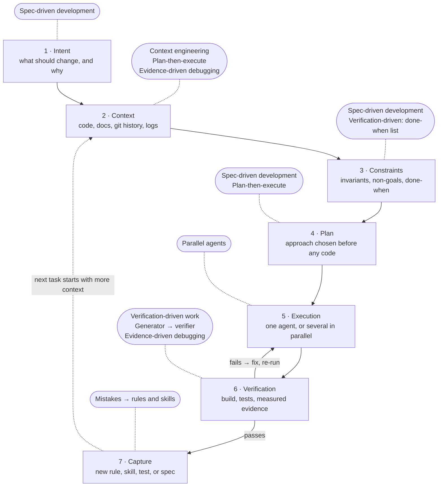

Two engineers, same coding agent, same model, same week. One gets a clean pull request that passes CI on the first try. The other gets a thousand-line diff that solves a slightly different problem than the one they asked for, and spends the afternoon reading it.

The usual explanation is "the first one writes better prompts." I believed that for about a year. Then I watched what the strong teams actually do, and the prompt is the least interesting part. What they changed is everything *around* the prompt: what the agent can see, what it is told never to touch, whether it plans before it edits, how it proves its work, and what happens to the lesson when it gets something wrong.

That is a different skill from prompt engineering, and it has a different shape. The [opener of this series](/posts/copilot-then-codex-then-claude-so-why-does-my-workflow-still-look-like-2022/) argued that better tools bolted onto a 2022 loop don't move delivery numbers; this post maps what the redesigned loop actually looks like.

> [!TIP]
> **As coding agents get stronger, a better prompt buys less and less. What still compounds is the workflow around the agent.** Spec-driven development, plan mode, `AGENTS.md`, test-first agents, reviewer agents, parallel agents — they are not competing trends. They are patches on different stages of the same seven-stage loop: intent → context → constraints → plan → execution → verification → capture. Once you see the loop, you can tell which stage your own workflow is missing.

## Table of contents

## Why "Better Prompts" Stopped Being the Lever

Three numbers frame the shift.

**The model stopped being the bottleneck.** In April 2026, Google's CEO said that [75% of all new code at Google is now AI-generated and approved by engineers](https://blog.google/innovation-and-ai/infrastructure-and-cloud/google-cloud/cloud-next-2026-sundar-pichai/), up from 50% the previous fall. Read the second half of that sentence carefully: *approved by engineers*. The interesting engineering is no longer in getting the code written; it is in the approval pipeline. Meanwhile OpenAI [stopped reporting SWE-bench Verified](https://openai.com/index/why-we-no-longer-evaluate-swe-bench-verified/) — the standard benchmark for "can the agent fix a real GitHub issue" — because it had saturated and leaked into training data: state-of-the-art progress had slowed to 74.9% → 80.9% over six months, and every frontier model they tested could reproduce the original human-written fix.

**Tool access alone does not make you faster.** METR ran a [randomized trial in mid-2025](https://metr.org/blog/2025-07-10-early-2025-ai-experienced-os-dev-study/): sixteen experienced open-source developers, 246 real tasks in their own repositories, AI allowed or not allowed per task. Developers were **19% slower** with AI — while believing, even afterwards, that they had been about 20% faster. METR is careful about what this does not prove (small sample, early-2025 tools, not a claim about all developers). But note what the study did *not* control for: a workflow. Developers were handed a tool and left to use it however they liked.

**Speed without control breaks things.** The [DORA 2025 report](https://cloud.google.com/blog/products/ai-machine-learning/announcing-the-2025-dora-report) found AI adoption now correlates with higher throughput — and still correlates *negatively* with delivery stability. Their explanation: "AI accelerates software development, but that acceleration can expose weaknesses downstream. Without robust control systems, like strong automated testing, mature version control practices, and fast feedback loops, an increase in change volume leads to instability." Their conclusion is almost the thesis of this post: "The greatest return comes not from the AI tools themselves, but from a strategic focus on the quality of internal platforms, the clarity of workflows, and the alignment of teams."

So the question moved. It used to be *can the AI write this?* Now it is *how do humans organize context, constraints, feedback and verification so the AI's output can be trusted?* Every practice below is one team's answer to a piece of that question.

## The Eight Practices

Each section follows the same pattern: the naive version, the structured version, the specific failure the structure prevents, and who is doing it at scale.

### 1. Spec-driven development — turn intent into artifacts

**Spec-driven development (SDD)** means writing what the agent should build as a checkable document *before* it writes code.

The naive flow is `human → prompt → AI → code`. Spec-driven development inserts intermediate artifacts:

```text
Intent → Spec → Clarification → Plan → Tasks → Implementation → Verification
```

The important part is not that these are Markdown files. It is that each step removes one *kind* of uncertainty. Take a real-shaped request:

```text
"Move notification decryption from the cross-platform layer to native."
```

Hand that sentence straight to an agent and its search space — the set of ways it could interpret and solve the task — is enormous. It has to guess the requirements, design the architecture, and implement, all at once. Split it into requirements → current architecture → invariants (the things that must stay true) → non-goals (what is explicitly out of scope) → acceptance criteria → plan → tasks, and the agent is doing one job per step.

GitHub built a toolkit around exactly this. [Spec Kit](https://github.com/github/spec-kit) walks through `constitution → specify → clarify → plan → tasks → analyze → implement → checklist`, and the [launch post](https://github.blog/ai-and-ml/generative-ai/spec-driven-development-with-ai-get-started-with-a-new-open-source-toolkit/) names the failure it targets: a vague prompt forces the model "to guess at potentially thousands of unstated requirements." Its best line: "We treat coding agents like search engines when we should be treating them more like literal-minded pair programmers." Amazon's [Kiro](https://kiro.dev/docs/specs/) bakes the same idea into an IDE — every feature produces `requirements.md`, `design.md`, and `tasks.md`, each with an approval gate before the next.

**Is SDD just TDD with extra steps?** No. Test-driven development specifies behavior at the level of a function; a spec specifies intent at the level of a change — including what *not* to do. You can, and should, use both: the spec's acceptance criteria are where the tests come from.

### 2. Plan, then execute — separate reasoning from editing

The simplest high-return pattern:

```text
Don't modify code.
Investigate: current implementation, call graph, ownership, invariants,
possible solutions, risks. Produce a plan first.
```

Then, after a human reads it: `Implement the approved plan.`

This differs from SDD in emphasis. SDD asks *what should the system do?* Plan-first asks *given this codebase, how do we change it safely?* For a large existing codebase (a **brownfield** project — one with history and constraints, as opposed to a blank slate), plan-first often returns more than a full spec process, because most of the risk is in the existing code, not in the requirements.

Here is the striking thing: four vendors independently turned this into a *permission state* rather than a prompting convention. Claude Code's [plan mode](https://code.claude.com/docs/en/best-practices) is a read-only mode in its recommended `explore → plan → implement → commit` loop, with the rationale "Letting Claude jump straight to coding can produce code that solves the wrong problem." Gemini CLI's [Plan Mode](https://github.com/google-gemini/gemini-cli/blob/main/docs/cli/plan-mode.md) enforces read-only access through a policy file (`plan.toml`) — the agent *cannot* write outside a plans directory. [Cline](https://docs.cline.bot/features/plan-and-act) ships Plan and Act as two separate modes. Cursor's [Plan Mode](https://cursor.com/blog/plan-mode) post says "Most new features at Cursor now begin with Agent writing a plan. We've seen this significantly improve the code generated." Google's [Jules](https://jules.google/docs/) will not touch code until you approve its plan.

When a guardrail moves from "a thing you type" to "a thing the tool enforces," that is the tell that the industry has decided it matters.

One calibration note from Anthropic's own guidance: "If you could describe the diff in one sentence, skip the plan." Planning has a cost; spend it where the solution is not obvious.

### 3. Context engineering — the prompt is not the context

**Context engineering** is deciding what the model can *see* — files, docs, history, tools — rather than what you *type*. Anthropic's [definition](https://www.anthropic.com/engineering/effective-context-engineering-for-ai-agents): "the set of strategies for curating and maintaining the optimal set of tokens (information) during LLM inference, including all the other information that may land there outside of the prompts."

For a coding agent, the prompt is a small slice of what it works from:

```text
prompt + repository + architecture docs + tests + git history
       + logs + the issue + project rules + previous decisions
```

Instead of writing a thousand words of "please make sure the encryption layer…", you let the repository carry it:

```text
AGENTS.md
docs/
  e2ee/
    architecture.md
    invariants.md
    storage.md
```

The agent reads these when it needs them. Three vendors converged on the same mechanism for the always-on layer: Anthropic's `CLAUDE.md`, the cross-vendor [`AGENTS.md`](https://agents.md/) standard (created by OpenAI Codex, Amp, Google Jules, Cursor and Factory, now under the Linux Foundation), and Google's `GEMINI.md` — all hierarchical, all loaded automatically, all layered from global → repo → directory. GitHub analyzed [over 2,500 `agents.md` files](https://github.blog/ai-and-ml/github-copilot/how-to-write-a-great-agents-md-lessons-from-over-2500-repositories/) and found the good ones cover six things: commands, testing, project structure, code style, git workflow, and boundaries — and that "You are a helpful coding assistant" does nothing while "never modifies source code" does a lot.

**`AGENTS.md` vs `CLAUDE.md`:** same idea, different readers. `CLAUDE.md` is read by Claude Code; `AGENTS.md` is the vendor-neutral file read by Codex, Cursor, Copilot, Gemini CLI, Jules and others. Many repos keep `CLAUDE.md` as a one-line pointer to `AGENTS.md`.

The strongest evidence that context beats prompt polish comes from Airbnb. Migrating [~3,500 test files from Enzyme to React Testing Library](https://airbnb.tech/infrastructure/accelerating-large-scale-test-migration-with-llms/), estimated at 1.5 years of manual work, took six weeks. The author's conclusion, verbatim: "the main success driver we saw was choosing the *right* related files (finding nearby files, good example files from the same project, filtering the dependencies for files that were relevant to the component, etc.), rather than getting the prompt engineering perfect."

Spotify's background agent Honk learned the same lesson from the failure side. Their [context-engineering post](https://engineering.atspotify.com/2025/11/context-engineering-background-coding-agents-part-2) names two anti-patterns — "overly generic prompts expecting telepathy" and "overly specific prompts falling apart unexpectedly" — and lands on large, version-controlled prompts built from concrete code examples, explicit preconditions for when *not* to act, and test-based descriptions of the end state. Their later summary is blunter: "When Claude has a lot of other code to look at, and that code looks roughly consistent, Claude will do a better job."

There is also a budget. Anthropic's context post calls the failure mode **context rot** — recall degrades as the window fills — and says context "must be treated as a finite resource with diminishing marginal returns." Which is why the next pattern exists: loading things on demand (Anthropic's [Skills](https://claude.com/blog/skills) load "only the minimal information and files needed" when relevant) instead of front-loading everything.

### 4. Verification-driven work — give the agent a "done when" list

Weak instruction: `Implement this feature.`

Strong instruction:

```text
Implement this feature.

Done when:
- unit and integration tests pass
- no new lint violations
- benchmark does not regress more than 5%
- the release build contains exactly these ABIs
- the existing public API is unchanged
```

The agent now has an **objective function** — a concrete thing to optimize, rather than a vibe. It no longer has to ask "is this right?"; it can measure.

Anthropic's best-practices doc puts the alternative plainly: "Claude stops when the work looks done. Without a check it can run, 'looks done' is the only signal available, and you become the verification loop." And: "Give Claude a check it can run: tests, a build, a screenshot to compare. It's the difference between a session you watch and one you walk away from."

At scale this turns into *filters*, and the cleanest example is Meta's [TestGen-LLM](https://arxiv.org/abs/2402.09171). The model proposes extensions to existing unit-test classes; a candidate survives only if it (1) builds, (2) passes reliably, and (3) measurably raises coverage. In their Instagram and Facebook trials, 75% of generated tests built, 57% passed reliably, 25% improved coverage — and of those survivors, 73% were accepted by engineers into production. The paper's stated purpose for the filters: "eliminating problems due to LLM hallucination." Nobody reviewed a test that had not already proven itself.

Stripe's [Minions](https://stripe.dev/blog/minions-stripes-one-shot-end-to-end-coding-agents) — homegrown agents that produce "over a thousand pull requests merged each week" with no human-written code — interleave the agent loop with deterministic steps so that "they'll always complete Stripe-required steps like linters." The checks are tiered by cost: a local check that "takes less than five seconds," then "at most two rounds of CI," then mandatory human review. "A typical minion run starts in a Slack message and ends in a pull request which passes CI and is ready for human review, with no interaction in between."

Atlassian's most extreme case: a principal engineer had agents build [Fireworks](https://www.atlassian.com/blog/rovo/rovo-dev-platform-driven-development), a Firecracker micro-VM orchestrator on Kubernetes, in four weeks. The loop was: agent writes end-to-end tests, deploys to an isolated dev shard on a real cluster, runs them, iterates until green. The engineer validated black-box — submit a job, check the 100 ms boot time, check state survives migration — rather than reading every diff. His summary: "The test suite is the primary proof that things work."

This is what DORA meant by "control systems." Verification is the stage that converts speed into something you can ship.

### 5. Evidence-driven debugging — observation is not a root cause

Don't ask `Fix this bug.` Ask for an investigation:

```text
Evidence → timeline → hypotheses → rank them → evidence for/against each
→ reproduce → root cause → fix → regression test
```

The rule that matters: **observation ≠ hypothesis ≠ root cause.** Agents — and people — jump from "I see suspicious code" to "this is the cause." A workflow that forces the agent to *falsify* its hypotheses (try to prove each one wrong with a real check) is very different from pasting a stack trace into a chat window and asking "what's wrong?"

I have less vendor documentation for this one; it is mostly practice. Anthropic's [long-running agents post](https://anthropic.com/engineering/effective-harnesses-for-long-running-agents) reports the failure mode it guards against: without explicit prompting, the agent "would fail [to] recognize that the feature didn't work end-to-end" — it trusted its own change instead of the evidence. My own version of this is the reason I wrote [a whole post about not debugging with `print()`](/posts/still-debugging-flutter-with-print/): the tooling that gives *you* structured evidence instead of log walls is the same tooling that gives an agent something to reason over.

### 6. Generator → verifier — a second context whose job is to break it

```text
Context 1: design or implement the solution.
Context 2: find assumptions that, if false, invalidate it.
```

The second agent is not asked "review whether this is okay." It is asked to falsify. Changing only the objective changes the review entirely, because an agent grading its own work has the same blind spots that produced the work.

Anthropic recommends exactly this as an "adversarial review step": "A reviewer running in a fresh subagent context sees only the diff and the criteria you give it, not the reasoning that produced the change, so it evaluates the result on its own terms." Their [Building Effective Agents](https://www.anthropic.com/engineering/building-effective-agents) taxonomy names it the evaluator–optimizer pattern. Spotify's Honk runs an LLM judge whose job is scope — did the change stay inside what was asked. Google [uses ML on the other side of the same loop](https://research.google/blog/resolving-code-review-comments-with-ml/): a model that turns human reviewer comments into proposed edits, which addressed 52% of comments offline and reached over 70% author acceptance after UX work.

### 7. Parallel agents — exploration that used to be too expensive

Before agents, no one could reasonably say:

```text
Engineer A → investigate the architecture
Engineer B → read the git history
Engineer C → audit the tests
Engineer D → check the upstream implementation
Engineer E → attempt a reproduction
```

Agents change that economics. A migration becomes a fan-out — one agent per platform impact, one for API feasibility, one for test and CI impact — followed by a synthesis and a plan. This is not "AI helps me code faster." It is *AI lets me explore branches I previously could not afford to look at.*

The infrastructure has caught up. Anthropic's guidance recommends **worktrees** (a second working copy of the same repo on its own branch, so two agents cannot collide on one file) for parallel sessions. Stripe pre-warms isolated devboxes that spin up in ten seconds. Spotify runs Honk sessions as Kubernetes pods so it can schedule many concurrently; Airbnb ran its migration pipeline across hundreds of files at once. Atlassian's engineer: "If your agents are idle, you're leaving productivity on the table."

Two cautions from the vendors themselves. OpenAI's [agent-building guide](https://cdn.openai.com/business-guides-and-resources/a-practical-guide-to-building-agents.pdf) says to "maximize a single agent's capabilities first" and split only when prompts branch heavily or tool sets exceed what one agent selects reliably. And parallel work only pays off when file ownership is clear — two agents editing one file is slower than one.

### 8. Mistakes → rules and skills — don't fix the bug, fix the workflow

Suppose the agent did something wrong because it did not know:

```text
The notification extension must never mutate encryption account state.
```

The usual loop is `AI wrong → developer fixes → done`. The better loop:

```text
AI wrong → why? → missing knowledge? constraint? test? tool?
        → capture it → AGENTS.md / skill / test / spec / CI rule
```

Next time, the agent reads the project knowledge and does not repeat the mistake. This is the stage that makes everything else compound.

GitHub's 2,500-repo analysis says it directly: "start simple, test it, and add detail when your agent makes mistakes"; the best agent files "grow through iteration, not upfront planning." Anthropic's long-running harness keeps a `claude-progress.txt` and a feature list precisely because "Each new session begins with no memory of what came before." Skills package a repeatable procedure so no session has to re-learn it. [SpecDD](https://specdd.ai/) goes furthest: small `.sdd` spec files "that live beside the code … they describe," so the spec is an operational artifact, not a planning document you discard.

Honesty note: across every vendor doc I read, **capture is the least mature stage.** Most guidance stops at "commit" or "open a PR." Only Anthropic's harness (progress log) and SpecDD treat learning as a first-class step. That is a gap, and probably where the next round of tooling goes.

## One Loop, Seven Stages

Put the eight practices side by side and they stop looking like eight trends. They are patches on different stages of one loop:



The rounded boxes are the practices; the squares are the stages they patch. Two arrows matter more than the rest: verification looping back into execution (the agent fixes its own failures against a real check), and capture looping back into context (the next task starts smarter than this one did).

Which practice solves which stage, with who does it:

| Stage | What it removes | Practice | Seen at |
| --- | --- | --- | --- |
| 1 · Intent | Ambiguity about *what* | Spec-driven development | GitHub Spec Kit, Kiro |
| 2 · Context | The agent not knowing what you know | Context engineering; plan-first research; evidence gathering | `AGENTS.md` / `CLAUDE.md` / `GEMINI.md`, Airbnb, Spotify |
| 3 · Constraints | Solutions that are "correct" but forbidden | SDD constitution and non-goals; the done-when list | Spec Kit, Kiro gates, Anthropic |
| 4 · Plan | Committing to an approach by accident | Plan mode as a permission state | Claude Code, Gemini CLI, Cursor, Cline, Jules |
| 5 · Execution | Serial exploration you cannot afford | Parallel agents in isolated environments | Stripe devboxes, Spotify pods, worktrees |
| 6 · Verification | "Looks done" as the only signal | Filters, tiered checks, adversarial review | Meta TestGen-LLM, Stripe, Atlassian, Anthropic |
| 7 · Capture | Repeating last week's mistake | Rules, skills, progress logs, co-located specs | GitHub 2,500 repos, Anthropic harness, SpecDD |

The way to use the table: find the failure you keep having, read across to the stage, and add *that* practice. A team whose agent keeps solving the wrong problem does not need a reviewer agent; it needs a spec. A team whose agent keeps shipping code that "looks done" does not need a better prompt; it needs a check it can run.

## What This Changes About Being Good at AI

The stronger the model, the less a clever prompt separates you from anyone else with the same model. Being good at AI-assisted engineering is turning into a different list of questions:

```text
How do I give the agent the right context?
How do I reduce ambiguity before it starts?
How do I decompose the problem?
What can run in parallel?
How can the agent verify its own work?
What must remain human-reviewed?
How do I turn today's mistake into tomorrow's rule?
```

None of those is a prompt. They are workflow design. Seen this way, spec-driven development, plan mode, context files, test-first agents, reviewer agents and skills are all attempts at one underlying problem: **turning a model that is very capable, short on context, prone to drift and not ultimately accountable into an engineering system whose output is predictable, checkable and reusable.**

## Where I Land, and What I Haven't Measured

I run a version of this loop in my own repositories: a short rules file, a brainstorm gate that forces intent, constraints and non-goals into writing before anything else, plan mode for anything I cannot describe in one sentence, and a reviewer agent that only sees the diff. It works noticeably better than my first year of "just ask nicely." But I want to be precise about what I have *not* shown:

- **I have no controlled measurement of my own workflow.** The numbers above are other people's. METR's result should make everyone suspicious of felt speed-ups, including mine. A before/after on real tasks in my own codebase is the obvious next post.
- **Spotify's caveat applies to every case study here.** Their gains sat on top of years of platform standardization — consistent stacks, a software catalog, golden-state linting — and they report agent performance is "measurably worse" in fragmented codebases. A workflow is not a substitute for a codebase the agent can navigate.
- **The human is still the accountable party.** Every big-tech case above ends in human review. Google's 75% is "approved by engineers." Stripe's thousand PRs a week are human-reviewed. Atlassian's engineer did not read every line, but he owned the outcome. Nothing in this post moves accountability to the agent; it moves *verification* earlier so the human's review is worth more.
- **Capture is under-tooled.** If you find a workflow that makes "turn this mistake into a rule" automatic rather than disciplined, I want to read about it.

The next posts in this series take single stages of the loop and go deep: how to write a spec an agent cannot misread, what a verification harness looks like for a mobile codebase, and measuring the loop on my own work.

## Sources

Graded: primary = the company's or vendor's own doc, blog or paper; secondary = third-party reporting, flagged in the text.

**Vendor guidance (primary)**

- [Claude Code: best practices](https://code.claude.com/docs/en/best-practices) — explore/plan/implement/commit, verification, adversarial review, worktrees
- [Anthropic — Effective context engineering for AI agents](https://www.anthropic.com/engineering/effective-context-engineering-for-ai-agents) (2025-09)
- [Anthropic — Effective harnesses for long-running agents](https://anthropic.com/engineering/effective-harnesses-for-long-running-agents) (2025-11)
- [Anthropic — Building effective agents](https://www.anthropic.com/engineering/building-effective-agents) (2024-12) · [Agent Skills](https://claude.com/blog/skills) (2025-10)
- [OpenAI — A practical guide to building agents](https://cdn.openai.com/business-guides-and-resources/a-practical-guide-to-building-agents.pdf) · [OpenAI — Why SWE-bench Verified no longer measures frontier coding capabilities](https://openai.com/index/why-we-no-longer-evaluate-swe-bench-verified/)
- [GitHub — Spec Kit](https://github.com/github/spec-kit) · [Spec-driven development with AI](https://github.blog/ai-and-ml/generative-ai/spec-driven-development-with-ai-get-started-with-a-new-open-source-toolkit/) (2025-09) · [How to write a great agents.md: lessons from over 2,500 repositories](https://github.blog/ai-and-ml/github-copilot/how-to-write-a-great-agents-md-lessons-from-over-2500-repositories/)
- [AGENTS.md standard](https://agents.md/) · [Gemini CLI Plan Mode](https://github.com/google-gemini/gemini-cli/blob/main/docs/cli/plan-mode.md) · [Jules docs](https://jules.google/docs/) · [Kiro specs](https://kiro.dev/docs/specs/) · [Cursor Plan Mode](https://cursor.com/blog/plan-mode) (2025-10) · [Cline Plan & Act](https://docs.cline.bot/features/plan-and-act) · [SpecDD](https://specdd.ai/) (community project)

**Production case studies (primary)**

- [Google Cloud Next 2026 — Sundar Pichai](https://blog.google/innovation-and-ai/infrastructure-and-cloud/google-cloud/cloud-next-2026-sundar-pichai/) (2026-04) · [Google — Resolving code review comments with ML](https://research.google/blog/resolving-code-review-comments-with-ml/) (2023-05) · [Google — Migrating code at scale with LLMs](https://arxiv.org/abs/2504.09691) (2025-04)
- [Meta — TestGen-LLM: Automated unit test improvement using LLMs](https://arxiv.org/abs/2402.09171) (FSE 2024)
- [Airbnb — Accelerating large-scale test migration with LLMs](https://airbnb.tech/infrastructure/accelerating-large-scale-test-migration-with-llms/)
- [Stripe — Minions: one-shot, end-to-end coding agents](https://stripe.dev/blog/minions-stripes-one-shot-end-to-end-coding-agents) (2026-02)
- [Spotify — Background coding agents: context engineering (Honk, part 2)](https://engineering.atspotify.com/2025/11/context-engineering-background-coding-agents-part-2) (2025-11) · [Feedback loops (part 3)](https://engineering.atspotify.com/2025/12/feedback-loops-background-coding-agents-part-3) (2025-12) · [Coding is no longer the constraint](https://engineering.atspotify.com/2026/6/code-with-claude-coding-is-no-longer-the-constraint) (2026-06)
- [Atlassian — Rovo Dev driven development: how we built a platform in 4 weeks](https://www.atlassian.com/blog/rovo/rovo-dev-platform-driven-development) (2026-04)
- [AWS — Accelerate application upgrades with Amazon Q Developer agent for code transformation](https://aws.amazon.com/blogs/devops/accelerate-application-upgrades-with-amazon-q-developer-agent-for-code-transformation/) (2024-10) — build-and-test-on-target loop before human review

**Independent evidence (primary)**

- [METR — Measuring the impact of early-2025 AI on experienced open-source developer productivity](https://metr.org/blog/2025-07-10-early-2025-ai-experienced-os-dev-study/) (2025-07)
- [DORA — State of AI-assisted software development 2025](https://dora.dev/research/2025/dora-report/) (2025-09) · [Google Cloud announcement with the quoted findings](https://cloud.google.com/blog/products/ai-machine-learning/announcing-the-2025-dora-report)
