I've been doing mobile development for years, and I recently caught myself in a loop I'd stopped noticing:

**Bug → open Logcat → search → add `print()` → rebuild → stare at a wall of log → guess.**

Here's what that looks like on a real screen. A chat screen opens and fires five requests — threads, profile, E2EE devices, send, fetch. In Logcat, those five requests are interleaved with Bloc transitions, Firebase chatter, lifecycle events, database logs, and analytics pings. Want to know if the send actually went out? Search for the URL. Want the request body? Different log line, further up. The response? Further down, if logging was even enabled for it. Lose focus for a second and you've scrolled past the one request you cared about. So you add another `print()`, rebuild, reproduce, and search again.

I did this for years while a better answer sat one command away — and I'm not alone: as one Flutter writer put it, ["most developers barely scratch the surface of Flutter's Dart DevTools"](https://levelup.gitconnected.com/7-dart-devtools-features-every-flutter-developer-should-use-daily-22659e04230d).

> [!TIP]
> **Debugging is an evidence problem.** Logs are one evidence source, but we use them for every question out of habit — while almost every debugging question has a dedicated tool that answers it faster and more precisely. And the habit now costs double, because an AI assistant reasoning over your bug needs good evidence even more than you do.

This post is the toolbox I wish I'd internalized years ago — every claim checked against the official docs, every DevTools screen shown with an official screenshot so you can see what it gives you before you ever open it.

## Table of contents

## Every Question Already Has a Tool

The failure mode isn't using logs. It's using logs as the answer to *every* question:

```text
Was the API actually called?      → search the log
What was in the request body?     → search the log
What did the server return?       → search the log
Why did this widget rebuild?      → add print()
Where does the jank come from?    → stare at the log...?
What's leaking memory?            → the log has no idea
```

Flip it around and ask: *what do I actually need to observe?*

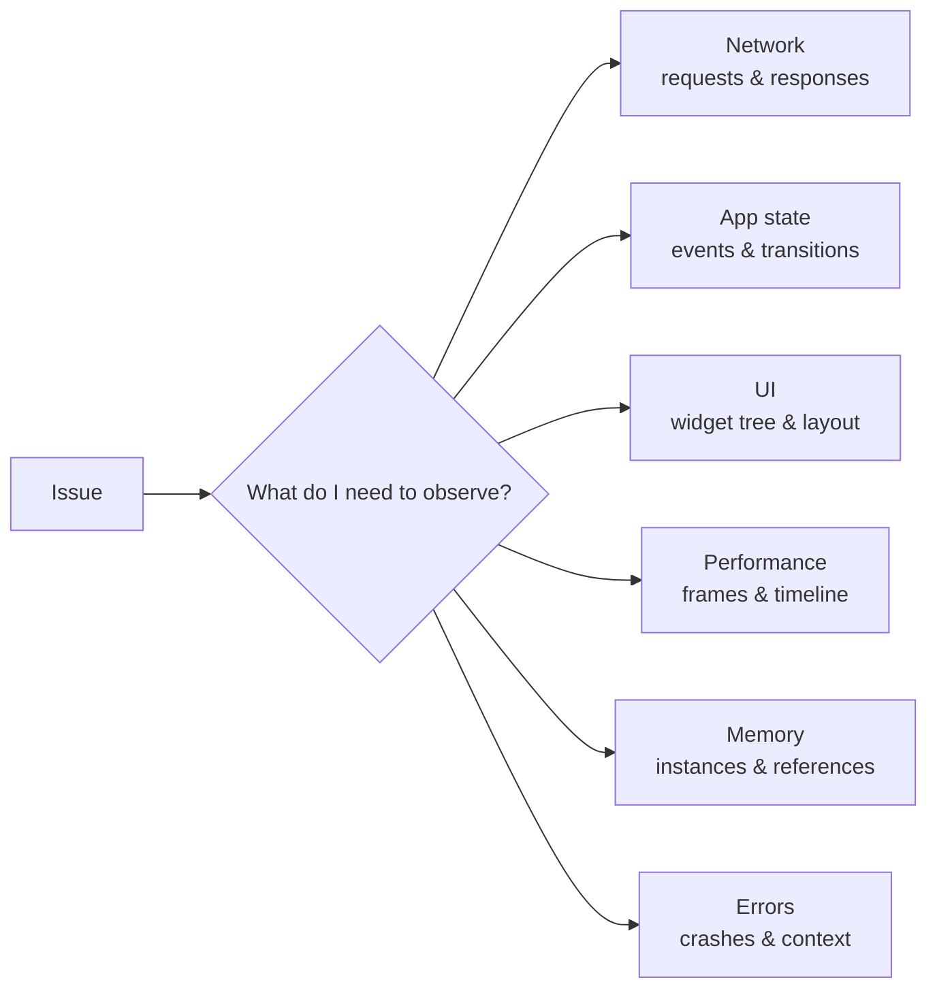

Each of those axes has a dedicated surface, and most of them live in one place — [Flutter DevTools](https://docs.flutter.dev/tools/devtools), a dashboard attached to your running app over the Dart VM Service. Launch it with `dart devtools` or from your IDE; it runs in a plain browser tab. The win isn't the browser — it's **information density**: instead of one interleaved text stream, each kind of evidence gets its own structured view.

| I want to know… | Open first |
| --- | --- |
| Which API was just called, with what body and response? | Network |
| What is the WebSocket sending? | Network |
| Which widget produced this UI, and why does it have that padding? | Inspector |
| Why does scrolling stutter? | Performance (profile mode) |
| Which objects never get released? | Memory |
| What is the app logging or throwing right now? | Logging |
| Why doesn't this deep link open? | Deep Links |
| Why does it crash only on users' phones? | Crashlytics |

Logs don't disappear from this table. They get demoted — from *the debugging workflow* to *one data source in it*.

## Network: Stop Printing Responses

This is the switch that paid off most for me.

The [Network view](https://docs.flutter.dev/tools/devtools/network) records HTTP, HTTPS, and WebSocket traffic from `dart:io` and from the `dio` package — plus anything logged through `http_profile`, which covers `cupertino_http`, `cronet_http`, and `ok_http`. The reflex objection — *"but I use Dio, with interceptors that log everything"* — is exactly backwards: Dio traffic is already captured, structured, without a single interceptor `print`.

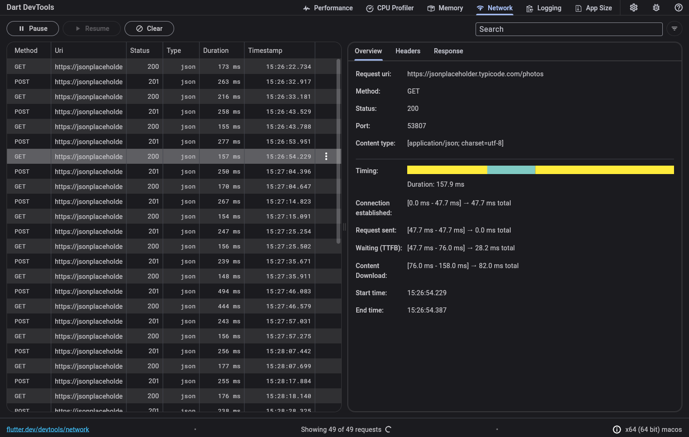

Every request is a row. Click one and you get request headers, request body, response, status, and a connection-level timing breakdown — the things you'd otherwise reconstruct from four scattered log lines.

And you don't scroll to find things — you *query* them:

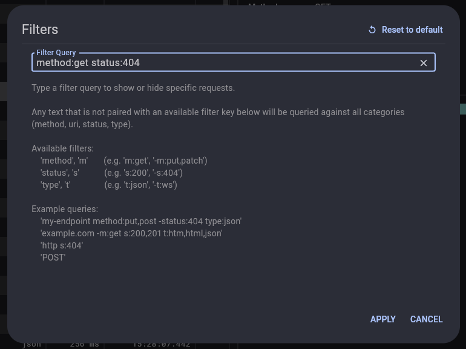

The [filter syntax](https://docs.flutter.dev/tools/devtools/network) takes `method`/`m`, `status`/`s`, and `type`/`t` keys, so triage looks like:

```text
m:post s:500        every POST that blew up
my-endpoint m:get   just the calls I'm chasing
-s:200              everything that didn't succeed
```

That's the difference between *searching a log for information* and *querying the information directly* — and in a debugging session, that difference compounds on every single question you ask.

One trick worth knowing: some requests fire so early that by the time DevTools is open, they're history. Flutter has a first-class answer:

```bash
flutter run --start-paused
```

The app starts frozen before the first frame; open DevTools → Network, confirm it's recording, resume — and [startup traffic is captured too](https://docs.flutter.dev/tools/devtools/network).

## UI Bugs: The Inspector Reads the Tree So You Don't

You know this moment: `RenderFlex overflowed by 24 pixels`, or just "why is there padding here?" — followed by twenty minutes of reading nested widget code, mentally rebuilding a tree the framework already has in memory.

The [Flutter Inspector](https://docs.flutter.dev/tools/devtools/inspector) inverts it. Turn on **Select Widget Mode**, tap the widget on the device, and you land on its node: the real layout as measured on the device — sizes and padding included — every property, and which ancestor put that padding there.

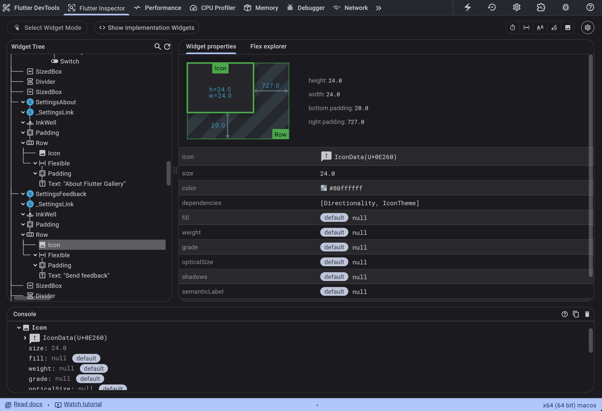

The inspector also ships visual debug toggles that answer whole categories of questions on sight:

**Highlight Repaints** draws a border that cycles colors every time a widget repaints. Suspect that one spinner is repainting your whole screen? Don't reason about it — look:

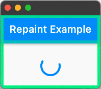

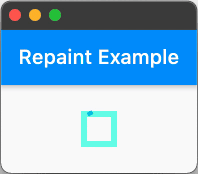

**Highlight Oversized Images** flags any image decoded at a much larger size than it's displayed — a silent memory tax — by inverting and flipping it so you can't miss it:


The docs' own example message says it plainly: `dash.png has a display size of 213×392 but a decode size of 2130×392`, with the fix being [`cacheWidth`/`cacheHeight`](https://docs.flutter.dev/tools/devtools/inspector) on the image. There's also **Show Guidelines** (render boxes, alignments, padding, baselines) and **Slow Animations** (runs animations at 20% speed — `timeDilation = 5.0` — so you can actually see what's wrong with them).

None of this is exotic. It's sitting in a toolbar, waiting, while we read widget trees by eye.

## Jank: Measure First, Optimize Second

The log-first habit has a performance-flavored cousin — optimization by folklore:

```text
List stutters?
→ sprinkle const

still stutters?
→ add RepaintBoundary somewhere

still stutters?
→ cache more things

still stutters?
→ "Flutter is just slow"
```

Every step is a guess. The [Performance view](https://docs.flutter.dev/tools/devtools/performance) replaces the guessing with a frames chart: one bar pair per frame (UI thread + raster thread), red when the frame blew its budget.

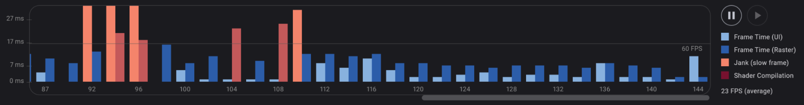

Click a red frame and the Timeline shows what that frame actually spent its time on — build, layout, paint, compositing, plus HTTP and GC events, per thread. You can even add your own spans with `dart:developer`'s [`Timeline` and `TimelineTask`](https://docs.flutter.dev/tools/devtools/performance), so *your* pipeline stages show up next to the framework's:

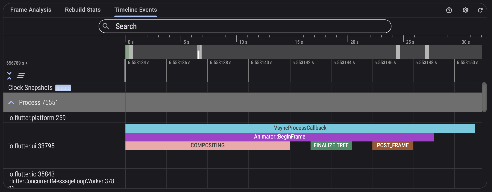

One rule the docs are emphatic about, and experience seconds: **profile on a profile build** (`flutter run --profile`). Debug-mode frame times [aren't representative of release performance](https://docs.flutter.dev/tools/devtools/performance) — I've watched people optimize debug-build jank that didn't exist in release.

I've written about what's on the other side of this door — [whether the framework is ever the real culprit](/posts/is-the-framework-really-why-your-app-is-slow) and [a frame-by-frame hunt through a stuttering chat list](/posts/i-made-messages-load-fast-so-why-does-scrolling-still-stutter). Both posts exist because of the same principle this section is about: *measure first, optimize second.*

## Memory: Logs Can't Answer Liveness

A screen gets opened and closed twenty times and memory climbs each round. The log reflex:

```dart
print("dispose called");
```

That proves `dispose()` ran. It says nothing about the questions that matter:

- Is the object still alive after GC?
- *Who* is still holding a reference to it?
- How many instances exist?

Those are exactly the questions the [Memory view](https://docs.flutter.dev/tools/devtools/memory) is built for. The workflow that replaces the guessing:

```text
take snapshot A
   ↓ run the flow a few times
   ↓ force GC
take snapshot B
   ↓ diff
which classes have new instances that were never released?
   ↓ retaining path
who is holding them?
```

In the official example below, one diff answers everything at once: 2,763 new instances of a class, only 307 released — and beneath it, the shortest retaining path naming exactly which chain of references keeps the rest alive:

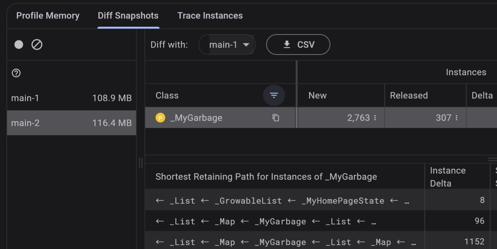

The retaining path is the part logs fundamentally cannot give you: the actual chain of references from a GC root to your leaked object. Once you see `_MyHomePageState → _GrowableList → _MyGarbage`, the fix is usually obvious. Before you see it, the leak is a rumor.

## Deep Links Have Their Own Debugger Now

Deep links are the canonical example of debugging at the wrong layer. The link doesn't open, so we descend into the mines:

```text
adb shell am start ...
logcat
AndroidManifest.xml
assetlinks.json
Info.plist
apple-app-site-association
```

DevTools now has a [Deep Links validator](https://docs.flutter.dev/tools/devtools/deep-links) — covering both Android and iOS as of Flutter 3.27 — that checks the whole chain, from your website's association files to your app's manifest configuration, and tells you which layer is broken:

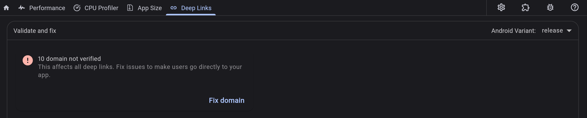

You still need to understand App Links and Universal Links. But the tool's job is to point at the failing layer *first*, so your understanding gets applied where it's needed instead of everywhere at once.

## Production Bugs: Evidence You Can't Attach a Debugger To

Everything above assumes you can reproduce the bug on your machine. Production disagrees:

```text
User:      "The app is broken."
Developer: "Broken how?"
User:      "I press send and nothing happens."
```

No DevTools, no debugger, no Logcat. This is a different evidence problem, and the answer is making the app carry its own context into every crash report. With [Firebase Crashlytics](https://firebase.google.com/docs/crashlytics/flutter/customize-crash-reports), that's three mechanisms:

```dart
// Key state that should ride along with any crash (max 64 keys, 1 kB each)
FirebaseCrashlytics.instance.setCustomKey('route', 'e2ee');
FirebaseCrashlytics.instance.setCustomKey('peer_device_count', 0);

// Story so far (64 kB rolling buffer per session)
FirebaseCrashlytics.instance.log('capability_resolved: ready');
```

The third mechanism is **breadcrumbs** — automatically captured `screen_view` and custom analytics events leading up to a crash, non-fatal, or ANR. One honest gotcha the docs are clear about: breadcrumbs [require Google Analytics](https://firebase.google.com/docs/crashlytics/flutter/customize-crash-reports) to be enabled in your Firebase project, with the Analytics SDK in the app. Without it you get stack traces but no story.

The difference in practice — a raw production crash says:

```text
Null check operator used on a null value
```

The same crash with keys, logs, and breadcrumbs says:

```text
screen_view: ThreadScreen (thread 123)
tapped: send
route = e2ee
peer_device_count = 0
log: session creation failed
→ crash
```

The stack trace answers *where it died*. The context answers *what happened before it died* — which is usually where the actual bug is. (Sentry offers an equivalent toolkit if Firebase isn't your stack; this series sticks with Crashlytics.)

## The AI Angle: Structured Evidence Beats Log Dumps

Here's where this stops being a tooling tour and becomes, I think, the actual point.

Debugging tooling was designed for a pipeline that looked like `application → human`. It increasingly looks like `application → tools → AI → human`. And that changes what "good evidence" means.

Paste 2,000 lines of Logcat into an AI assistant and watch where its effort goes: filtering noise, reconstructing a timeline, correlating requests with responses, inferring state — burning its context window on *reconstructing information the application already had in structured form*. Then compare what reasoning starts from when the evidence arrives structured:

```text
Request:   POST /messages
Status:    409
Body:      {"error": "device_not_registered"}

State before:  E2eeCapability.ready
State after:   SendState.failed

Last events:
  capability_resolved
  encrypt_started
  session_missing
  send_failed
```

Both a human and a model can start reasoning near the root cause instead of near the noise floor. That's also why *how you log* matters as much as *where you look*: `print("send failed :(")` forces every reader — human or AI — to guess context, while a structured event carries it:

```text
event=message_send_failed
thread_id=123  message_id=456
route=e2ee  stage=encrypt
reason=session_missing  attempt=2
```

This schema is lifted from my own messenger's send flow — the same system my [E2EE](/series/e2ee/) and [message-systems](/series/message-systems/) posts dissect. The [Logging view](https://docs.flutter.dev/tools/devtools/logging) will happily aggregate these events alongside framework events, GC, and stderr — but the win was never the viewer. It's that the evidence became machine-readable.

And Flutter is leaning into exactly this direction, officially. The SDK now ships a [Dart and Flutter MCP server](https://docs.flutter.dev/ai/mcp-server) (Dart 3.9+, one command: `dart mcp-server`) that gives MCP-capable AI assistants — Claude Code, Cursor, Gemini CLI, Copilot in VS Code (Dart Code extension v3.116+), Codex CLI, among others — direct access to the toolchain: analyze and fix errors, resolve symbols, search pub.dev, manage dependencies, run tests, **introspect and interact with a running app** (take screenshots, tap, enter text, scroll), and hot reload. It's [explicitly experimental](https://docs.flutter.dev/ai/mcp-server) and "likely to evolve quickly" — but the shape of the thing is unmistakable. As one early write-up [put it](https://startdebugging.net/2026/05/dart-flutter-mcp-server-claude-code-cursor/), the old ritual — run the app, open DevTools, copy the DTD connection URI, paste it into a prompt and pray — just became automatic discovery.

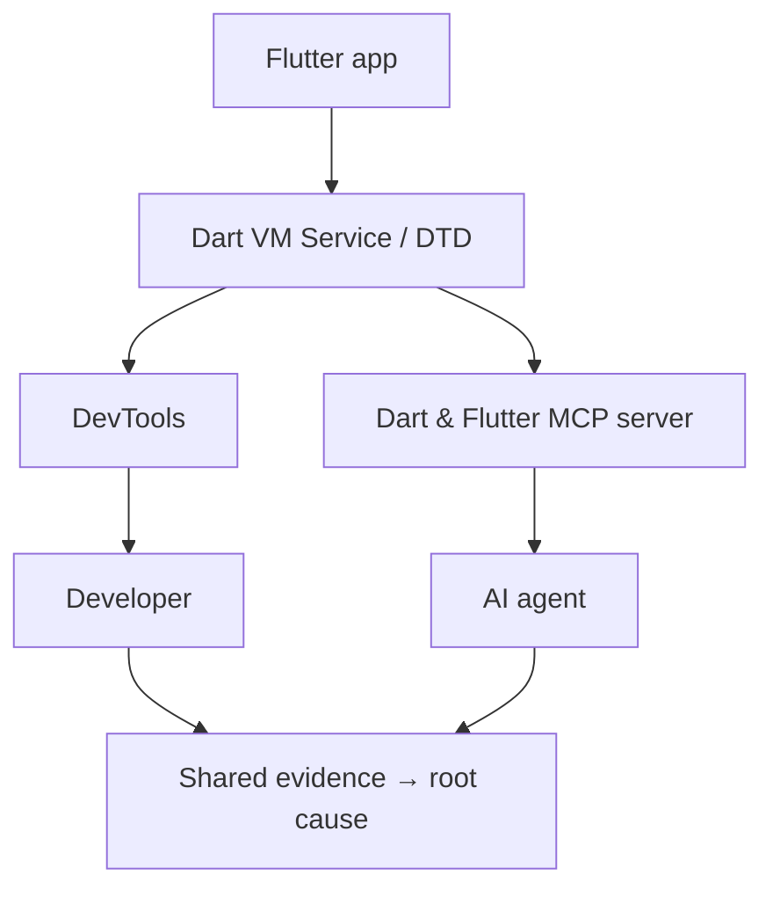

The ecosystem is following: [package-provided DevTools extensions](https://docs.flutter.dev/tools/devtools/extensions) mean your dependencies can ship their own debugging tab (`provider` and `shared_preferences` already do), and community packages like [`riverpod_devtools`](https://pub.dev/packages/riverpod_devtools) — community-built, not official — already expose live provider state, the dependency graph, and event logs to AI tools via an optional bundled MCP server. Domain-specific state, served to the same two consumers: you, and your agent.

The question to internalize isn't "how much log should I give the AI?" It's: **what evidence can I hand over that's more structured than a log dump?**

## The Checklist

Here's the whole post as a decision procedure — the workflow I'm holding myself to now:

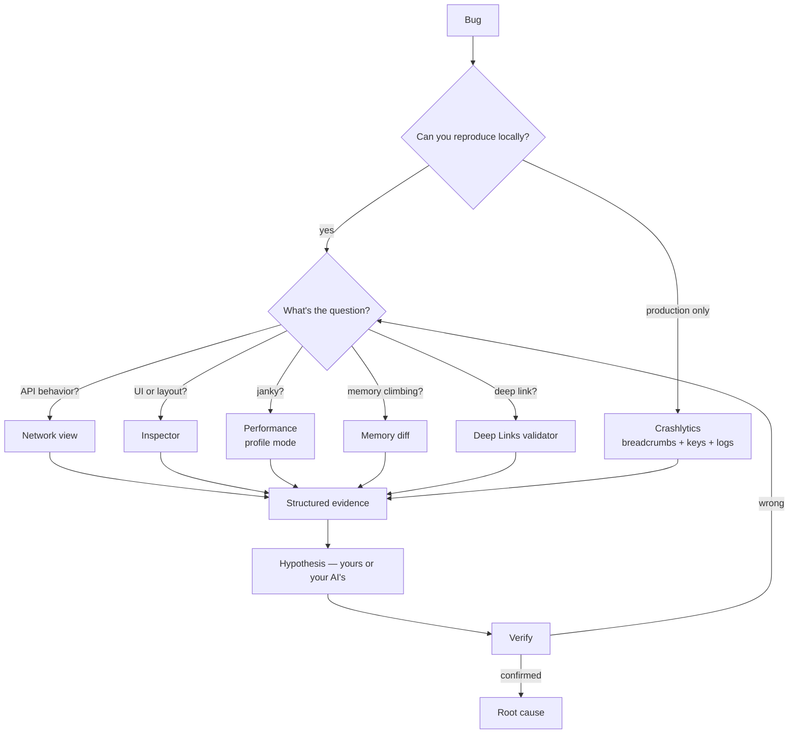

Or as a list to run through before the next bug sends you to Logcat:

- **API misbehaving?** → Network view. Query it (`m:post s:500`), don't scroll for it.
- **UI or layout wrong?** → Inspector. Select the widget on the device; check the toggles before checking the code.
- **Scroll or animation janky?** → Performance view, on a **profile build**.
- **Memory climbing?** → Memory view. Snapshot, reproduce, GC, diff, retaining path.
- **Deep link dead?** → Deep Links validator. Find the failing layer first.
- **Crash only in production?** → Crashlytics with custom keys, logs, and breadcrumbs already wired in.
- **Still lost?** → Now logs, breakpoints, and source-diving earn their turn — aimed at a narrowed target instead of the whole app.

The goal was never "stop reading logs." It's: **stop using log-grepping to answer questions a dedicated tool answers precisely in ten seconds.** The gap between a developer who debugs fast and one who debugs slow is often not framework knowledge — it's who gets the right evidence faster. AI joining the workflow doesn't change that rule. It raises the stakes on it.

_This post opens the Mobile Debugging series. Next: the same toolbox question asked of native Android — Network Inspector, Layout Inspector, Perfetto, `adb` — then iOS, production observability, and AI-native debugging on its own terms._

## Sources

Every claim above was checked against these sources (as of August 2026):

- [Network view — docs.flutter.dev](https://docs.flutter.dev/tools/devtools/network) — capture scope (`dart:io`, `dio`, and `http_profile`-logged clients such as `cupertino_http`, `cronet_http`, `ok_http`; WebSocket included), filter syntax, and the `--start-paused` startup-capture recipe.
- [Flutter Inspector — docs.flutter.dev](https://docs.flutter.dev/tools/devtools/inspector) — select widget mode, guidelines, Highlight Repaints/`RepaintBoundary`, Highlight Oversized Images and the `cacheWidth`/`cacheHeight` fix, slow animations.
- [Performance view — docs.flutter.dev](https://docs.flutter.dev/tools/devtools/performance) — frames chart, timeline events, custom `Timeline`/`TimelineTask` spans, and the profile-mode warning.
- [Memory view — docs.flutter.dev](https://docs.flutter.dev/tools/devtools/memory) — profile/diff/trace tabs, retaining paths, shallow vs retained size.
- [Logging view — docs.flutter.dev](https://docs.flutter.dev/tools/devtools/logging) — aggregated runtime, framework, and app-level events.
- [Deep Links validator — docs.flutter.dev](https://docs.flutter.dev/tools/devtools/deep-links) — Android + iOS validation of website and app configuration.
- [Dart and Flutter MCP server — docs.flutter.dev](https://docs.flutter.dev/ai/mcp-server) — capabilities, supported clients, Dart 3.9+ requirement, experimental status.
- [DevTools extensions — docs.flutter.dev](https://docs.flutter.dev/tools/devtools/extensions) — package-provided DevTools tabs.
- [Customize crash reports — firebase.google.com](https://firebase.google.com/docs/crashlytics/flutter/customize-crash-reports) — `setCustomKey` (64 pairs / 1 kB), `log` (64 kB rolling), breadcrumbs and their Google Analytics requirement.
- [7 Dart DevTools Features Every Flutter Developer Should Use Daily — Level Up Coding](https://levelup.gitconnected.com/7-dart-devtools-features-every-flutter-developer-should-use-daily-22659e04230d) (Nikhith Sunil, Jul 2025) — the underuse observation.
- [The Dart and Flutter MCP server — startdebugging.net](https://startdebugging.net/2026/05/dart-flutter-mcp-server-claude-code-cursor/) (Marius Bughiu, May 2026) — MCP setup with Claude Code and Cursor, the DTD-URI ritual.
- [riverpod_devtools — pub.dev](https://pub.dev/packages/riverpod_devtools) — community DevTools extension with MCP-exposed provider state.

_DevTools screenshots from the official [Flutter documentation](https://docs.flutter.dev/tools/devtools), © the Flutter authors, licensed under [CC BY 4.0](https://creativecommons.org/licenses/by/4.0/); the Deep Link Validator screenshot is cropped._
