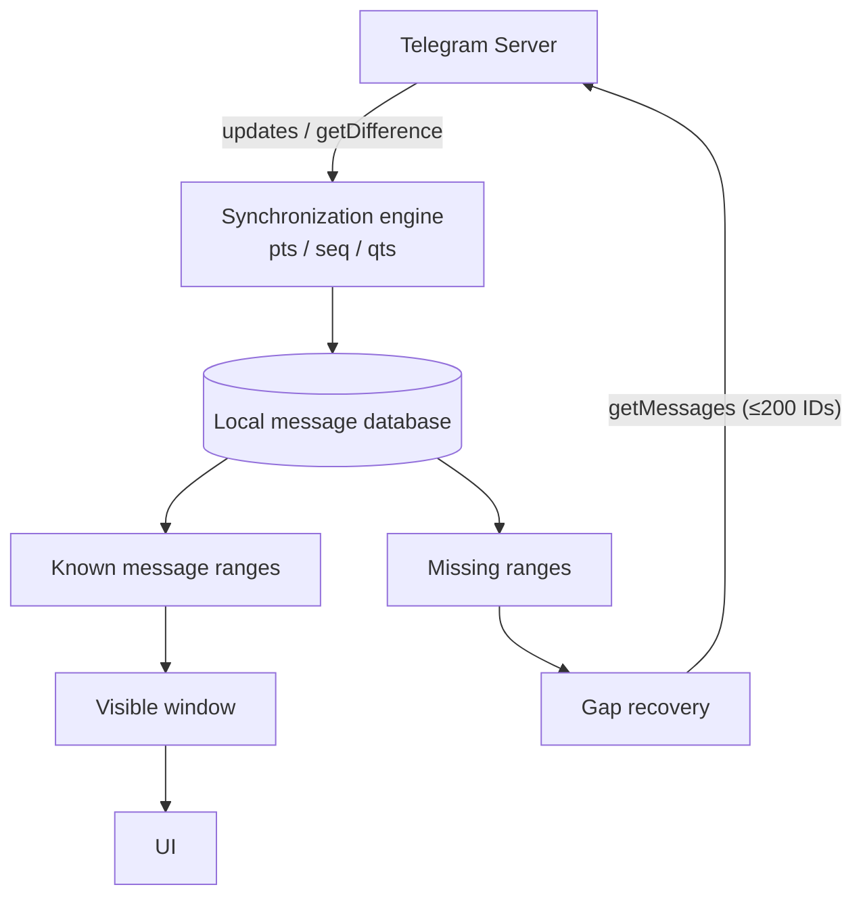

A conversation can live for years. Tens of thousands of messages, photos, videos, replies, edits, deletes.

Yet when you open Telegram, it never feels like the app is doing:

**request server → wait for response → parse JSON → write database → build UI.**

The most recent messages appear almost immediately. Scroll up, and history keeps materializing. Lose your connection, and you can still read most of what you've already seen.

The more interesting puzzle hides in a harder situation:

> The app goes offline for an hour and misses 237 changes.
> When it comes back online, how does Telegram know _exactly_ what it missed — without re-downloading the conversation?

That question is where Telegram's message architecture actually earns its reputation, and it's what this post digs into.

> [!TIP]
> **Telegram didn't just build an API to fetch messages.** It built an engine where the client always knows what it has, knows what it's missing, and fetches only the missing part. Every claim below is checked against Telegram's own documentation — sources at the end.

## Table of contents

## How Fast Is Telegram, Really?

I'm going to resist the temptation to open with a number like "Telegram opens a chat in 50 ms."

Telegram publishes no official benchmark for `open chat → first message rendered` on any device, and I'm not going to invent one. But there's stronger evidence than a benchmark: the shape of the API itself.

Telegram describes TDLib — the engine inside official and third-party clients — as:

- "Fully-asynchronous. Requests to TDLib don't block each other or anything else";
- handling "all network implementation details, encryption and local data storage";
- "Consistent. TDLib guarantees that all updates will be delivered in the right order";
- "Reliable. TDLib remains stable on slow and unreliable Internet connections."

For throughput, the TDLib README states that in the Telegram Bot API, each TDLib instance handles **more than 40,000 active bots simultaneously**. (This number keeps growing — older versions of the same page said 18,000, then 24,000, then 37,000 — so treat it as an order of magnitude, not a spec.) It isn't a chat-open benchmark, but it tells you the engine underneath was built for serious throughput.

The most telling detail, though, is a single parameter. TDLib's history API exposes:

```text
getChatHistory(..., only_local = true)
```

The documentation is explicit: pass `only_local = true` "to get only messages that are available **without sending network requests**", and the call is an offline method.

That's the real evidence behind the "instant" feeling:

> Telegram doesn't have to ask the server before it has something to render.

## The First Mistake: Treating "Load Messages" as an API Call

A straightforward implementation imagines this:

```text
User opens thread
      ↓
GET /messages?threadId=123
      ↓
Wait network
      ↓
Parse response
      ↓
Render messages
```

This architecture has one fundamental problem:

**network latency sits directly on the UI's critical path.**

If the API takes 300 ms, the user waits 300 ms. If it takes a second, the user waits a second. If you're offline:

```text
loading...
```

Telegram's model decouples the two:

```text
             ┌── Local Message Database ──→ UI
             │
User opens chat
             │
             └── Sync Engine ──→ Server
                       ↓
                  update local DB
```

The UI and the network are no longer a serial pipeline. That's the first step to understanding everything else.

## The Local Database Isn't Just a Cache

The common framing is:

```text
Server = source of truth
Local DB = cache
```

For a good message engine, a more useful mental model is:

```text
Server
   ↓
Synchronization engine
   ↓
Local message store
   ↓
UI
```

The UI reads what the client **already knows**. The network's job is to move what the client knows closer to the server's latest state.

TDLib owns both halves — network and local storage — and `getChatHistory` having an `only_local` mode means "render from what we have" is a first-class operation, not a hack.

That produces the UX property everything else in this post builds on:

**time-to-message is no longer the same thing as network latency.**

## Telegram Doesn't Load 10,000 Messages

Say a conversation holds:

```text
1
2
3
...
99,998
99,999
100,000
```

The user opens it. The UI needs only a small window near the end of history:

```text
99,951
...
99,999
100,000
```

TDLib's `getChatHistory` requests history starting from a `from_message_id`, with an `offset`, and a `limit` that "can't be greater than 100" per call. The docs even note that "the number of returned messages is chosen by TDLib and can be smaller than the specified limit" — the engine reserves the right to return less when that's the faster answer.

So instead of:

```text
load EVERYTHING
```

you get:

```text
load WHAT THE USER NEEDS
```

That's the first principle:

> **History size and initial rendering cost must be decoupled.**

Whether a conversation has 100 or 100,000 messages says nothing about how many messages the UI must materialize.

## Message IDs Are a Natural Cursor

Telegram's history API isn't built on:

```text
page=1
page=2
page=3
```

It anchors pagination to a message:

```text
from_message_id
offset
limit
```

Say the window currently holds:

```text
10000
9999
9998
...
9951
```

When the user scrolls up, the next request anchors at `from_message_id = 9951` and fetches the older window.

This matters because chat history is not a static dataset. While the user scrolls:

```text
a new message arrives
a message gets deleted
a message gets edited
```

Page-number pagination shifts under your feet. ID-anchored history is far more stable, because the question becomes:

> "Give me the messages around this ID."

instead of:

> "Give me page 7 of a dataset that just changed."

## The Real Problem Starts When You Go Offline

If Telegram were just a local database plus cursor pagination, the architecture wouldn't be that special. The real problem shows up offline.

Suppose the client's last known state is:

```text
pts = 12500
```

Then it loses the connection. Meanwhile the server keeps absorbing:

```text
+ message
+ message
+ edit
+ delete
+ message
...
```

On reconnect, a naïve implementation fetches the latest messages and then guesses:

```text
Which messages am I missing?
Were there edits?
Were there deletes?
Did anything happen that I never saw?
```

Telegram has a much better mechanism.

## pts, qts, seq: The Client Knows Where It Stands

Telegram's update protocol maintains explicit synchronization state — sequence counters named `pts`, `qts`, and `seq`. Each event that touches a message box increments the counter, so the counter _is_ the position in the event stream.

The apply rule in the documentation is precise. Every update carries the new `pts` and a `pts_count` (how many events it represents), and the client checks:

```text
local_pts + pts_count == pts   →  apply the update
local_pts + pts_count  > pts   →  already applied — ignore it
local_pts + pts_count  < pts   →  there's a gap — some updates are missing
```

Notice what the middle branch buys you for free: **deduplication**. If the server delivers the same update twice, the arithmetic says "already applied" and the client drops it. The same three-line rule handles ordering, dedup, and gap detection.

So when the client sits at `local_pts = 104` and receives an update requiring `pts = 107`, it doesn't _suspect_ something is missing. It **knows** updates 105 and 106 are missing. Telegram's documentation calls this a **gap** in `seq / pts / qts`.

One more nuance worth knowing: `pts` is not one global number. Each channel and supergroup has its **own** `pts` sequence, separate from the common state for private chats and small groups. Sync state is a set of counters, not a single high-water mark.

## Detecting the Gap Is Half the Battle: getDifference

When synchronization is lost, Telegram provides:

```text
updates.getDifference
```

and, for channels:

```text
updates.getChannelDifference
```

The idea is simple. The client says:

```text
I know everything up to pts = 12500.
```

The server's current state is `12737`. The client doesn't ask "give me the latest 1000 messages." It asks for the **difference** since the state it already has.

The documentation is prescriptive about when: "On startup, _only_ `updates.getDifference` should be called, to fetch updates received while the client was offline" — and again whenever a gap is detected in `seq / pts / qts`.

Channels get an extra trick. Clients don't call `updates.getChannelDifference` for every channel at startup. Instead, the server sends `updateChannelTooLong` — effectively saying _"too many updates happened in this channel; come fetch the difference yourself"_ — and the client syncs that one channel on demand. The server actively helps the client decide **when** syncing is worth it.

The mental model becomes:

```text
Known state
12500
   │
   │  missing changes
   ▼
12737
```

instead of:

```text
?????????????????
refetch everything
?????????????????
```

This might be the single most important idea in Telegram's message synchronization.

## Why Telegram Waits Half a Second Before Syncing

There's a lovely detail in the documentation. When a gap is detected, it says "it may be useful to wait up to 0.5 seconds in this situation, as the missing updates may have been simply reordered by the server, and may arrive shortly after, filling the gap."

Why? Because a "gap" is sometimes just reordering:

```text
received 103
received 105

"Missing 104!"
```

…and a few milliseconds later:

```text
received 104
```

Calling `getDifference()` immediately would burn a round-trip on a problem that was about to solve itself. Telegram gives late updates a small grace window; only if the gap survives 0.5 seconds does the client start gap recovery.

A tiny optimization carrying a big philosophy:

> **Don't spend network solving a problem that might disappear on its own.**

## Known Ranges: The Client Tracks What It Has, Not Just What It Sees

This is the part I find most underrated.

Telegram's documentation says clients with a message database should track the **ranges of message IDs they know**. Picture a local DB holding:

```text
1 ─────── 100

              GAP

150 ─────────────── 300
```

The client never needs to ask the server "do I have everything?" It can answer locally:

```text
known range: 1..100
missing:     101..149
known range: 150..300
```

When the user scrolls to a boundary — message 100, with the next known message at 150 — the engine knows the exact range to fill. The docs even describe the mechanics: fill old history gaps with `messages.getMessages` or `channels.getMessages`, **up to 200 IDs per call**, then merge the results back into the message database. They go as far as suggesting a **segment tree** as the data structure for tracking known ranges — implementation advice you rarely see in protocol documentation.

That's the mental-model upgrade:

```text
"Have I loaded page 4?"
```

is much weaker than:

```text
"What exact ranges of history do I know?"
```

## Why Opening a Chat Doesn't Re-Probe the Server

Suppose the local engine knows:

```text
messages:
950 ───────────────── 1000

known edge:
1000 = latest known state
```

When the user opens the thread:

```text
Local DB → 950...1000 → render immediately
```

The sync engine handles new changes independently. If the database knows a range is complete, the client doesn't have to keep asking:

```text
"Hey server, anything after 1000?"
```

The update state and the synchronization protocol already answer that question. This is where Telegram saves the network round-trips a naïve message engine pays on every single thread open.

## Deletes Must Not Break the Algorithm

Here's a fun failure mode:

```text
101
102
103
104
105
```

Message `103` gets deleted. A client looking only at its DB sees:

```text
101
102
104
105
```

and might conclude: "103 is missing → fetch it." But 103 isn't missing. It's **deleted**.

Telegram's answer: the range-filling APIs return placeholder `messageEmpty` constructors "for deleted or otherwise non-representable messages" — so the entire requested range is still fully described, hole included. And the specialization runs deeper: the docs warn that `messages.getHistory` **cannot** be used to fill gaps in channels and supergroups — you must use the channel-specific methods. Even "fetch me this range" needs the right tool for the right message box.

The principle:

**absence of data ≠ missing data.**

A message engine needs to distinguish:

```text
not loaded
deleted
unavailable
loaded
```

Otherwise it walks straight into the loop:

```text
detect gap → fetch → doesn't exist → detect gap → fetch → ...
```

## Putting It Together: A Message Window Engine

Assembled, the pieces look like this:



Opening a thread:

```text
DB → visible window → UI
```

Scrolling backward:

```text
DB → window reaches known boundary → fetch missing range → DB → extend window
```

Reconnecting:

```text
local pts → getDifference → missing updates → DB → UI observes new state
```

Three problems —

```text
open thread
scroll history
reconnect
```

— stop being three unrelated piles of API calls. They all revolve around one model:

> **Local state + visible window + known ranges + synchronization state.**

## An Architecture Story, Told Carefully

Telegram never published a timeline like "2015: open chat in 700 ms; 2020: 80 ms," so I won't invent one. But the architectural evolution is documented.

**Stage 1 — MTProto and cloud history.** Cloud-synchronized history was a core property from Telegram's foundation, not a later add-on.

**Stage 2 — update state becomes the contract.** `pts / seq / qts`, difference fetching, and gap recovery became an explicit part of the client–server contract. Today's documentation spells out exactly how startup, reconnect, reordered updates, and gaps must be handled.

**Stage 3 — TDLib packages the complexity.** Network, storage, ordering, synchronization, encryption — all folded into one reusable engine. App developers no longer hand-build this state machine; TDLib guarantees ordered updates, asynchronous execution, and local storage.

**Stage 4 — local-first becomes first-class API.** `getChatHistory(only_local=true)` in the public API contract means offline retrieval isn't a hack bolted onto the architecture. It _is_ the architecture.

## This Isn't an Ad for Telegram

One thing matters for this post's credibility: there is no evidence that "Telegram always loads messages fastest."

Users have reported periods of slow loading on Android and iOS, chats stuck on "Updating…", and media-cache misbehavior. So the honest claim is:

> **Telegram's message synchronization architecture has strong properties for fast, resilient UX**

— not:

> **Telegram never lags.**

Those are very different statements, and only the first one is defensible.

## What's Worth Copying Isn't SQLite

If the takeaway were "Telegram is fast because it uses SQLite," we'd have missed nearly the whole lesson. SQLite is one piece. What's worth studying is how the pieces interlock — and at least six principles fall out:

**1. Local-first rendering.** Keep the network off the critical path whenever local state is enough to render.

**2. Windowed history.** Never materialize a whole conversation to show a few dozen messages.

**3. ID-anchored pagination.** Anchor history to stable data, not page numbers.

**4. Explicit synchronization state.** The client must know where it stands — as a counter it can do arithmetic on, not a guess.

**5. Gap detection + gap recovery.** Never refetch history just to find out what you missed.

**6. Known ranges.** Don't just store messages. Store **which parts of history the client knows for certain it has.**

## The Questions That Actually Matter

When designing message loading, the first question is usually:

> "Which API do I call to get messages?"

Once the system is big enough, that question is too small. The real ones are:

```text
Which messages does the client know right now?

Which ranges does it know are complete?

Which window does the UI need at this moment?

Where are the gaps?

Is each gap caused by network, by deletion, or by never having loaded it?

What state is the client syncing toward?

How do we update local state without blocking the UI?

When is a network request actually necessary?
```

And that's why Telegram's architecture rewards study:

> **They didn't just build an API to download messages. They built an engine where the client always knows what it has, what it's missing — and downloads only the missing part.**

## Sources

Every protocol claim in this post was checked against these documents (as of August 2026):

- [TDLib — Telegram Database Library](https://core.telegram.org/tdlib) — engine description: fully-asynchronous, ordered updates, local storage, reliability on unstable connections.
- [TDLib `getChatHistory` reference](https://core.telegram.org/tdlib/docs/classtd_1_1td__api_1_1get_chat_history.html) — `from_message_id`, `offset`, `limit ≤ 100`, `only_local`, and the "can be smaller than the specified limit" note.
- [Working with Updates — core.telegram.org/api/updates](https://core.telegram.org/api/updates) — `pts / qts / seq` apply rules, gap detection, the 0.5-second wait, `updates.getDifference` / `updates.getChannelDifference`, `updateChannelTooLong`, known message ranges and segment trees, range filling with `messages.getMessages` / `channels.getMessages` (≤ 200 IDs), and `messageEmpty` placeholders.
- [tdlib/td README](https://github.com/tdlib/td/blob/master/README.md) — "each TDLib instance handles more than 40000 active bots simultaneously."
