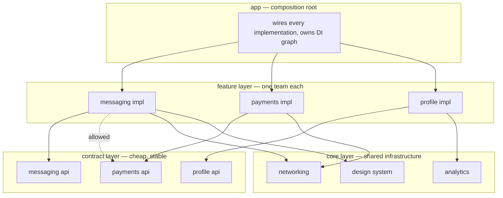

The last three posts in this series each stood at one boundary of the same hybrid app and answered one question two teams were arguing about: [who provides the auth token](/posts/how-does-a-flutter-module-get-a-token-from-the-native-host/) when the dependency arrow must not point at the host, [who owns the back stack](/posts/half-flutter-half-native-who-owns-navigation-mid-migration/) mid-migration, and [how many Flutter engines](/posts/one-flutter-engine-or-two-native-between-flutter-screens/) the answer costs. Those were boundary disputes. This post is about the map that decides where the boundaries are — because at some team count, the disputes stop being interesting and the *number of them* becomes the problem.

The concrete failure looks like this. The payments team renames a field in a result type that the messaging team happens to import, because two years ago importing it was the fastest way to show a "payment received" bubble in chat. The rename compiles in payments, breaks messaging, blocks the release train, and the fix is negotiated in a meeting between two teams that should not have needed to know each other's names. Multiply by ten teams and every pair of them, and the app has a change-amplification problem that no amount of code review fixes — because the review happens *after* the dependency already exists.

The organizations that run the biggest versions of this problem have published enough detail to reconstruct their answer. Grab's app holds [more than 1,000 modules](https://engineering.grab.com/app-modularisation-at-scale), and inside its payments group — 200+ modules — more than 95% of modules build in under 15 seconds. Reddit's clients are [about 2.5 million lines of code each, ~800 modules on Android, built by around 200 native engineers](https://newsletter.pragmaticengineer.com/p/building-reddits-ios-and-android). Spotify ships weekly from [120+ teams](https://engineering.atspotify.com/2023/10/switching-build-systems-seamlessly). None of them got there by being careful. They got there by making carelessness impossible in three specific places.

> [!TIP]
> The whole post in three rules. **One:** modules expose contracts and hide implementations — a feature's `api` is a separate build unit from its `impl`, other features may only see the `api`, and everything is wired in exactly one place, the app's composition root. **Two:** these rules live in CI as failing builds, not in review comments. **Three:** the Flutter module joins this graph behind a *native* facade with a versioned artifact and a Pigeon contract — the rest of the app never learns that one of its modules keeps a Dart VM inside.

## Table of contents

## The Graph You Are Actually Designing

Strip away the tooling and a modular app is a directed graph: nodes are build units, edges are "may depend on." Every organizational property you want — teams working in parallel, changes staying local, builds staying incremental — is a property of that graph. A feature-to-feature edge is precisely the payments-to-messaging incident above waiting to fire: it couples two teams' release schedules in exchange for saving one abstraction. The entire discipline below is about which edges are allowed to exist, and Google's [modularization guidance](https://developer.android.com/topic/modularization/patterns) and Grab's five-layer structure land on essentially the same shape:



Read the dotted edge carefully, because it is the entire trick: messaging is allowed to depend on payments' **api**, never on its impl. The next two sections are the two halves of making that real — designing the contract layer, and making violations fail the build.

## Rule 1: Contracts Are a Separate Build Unit From Implementations

On Android this is the **api/impl split**, and it is the pattern Google's own [Now in Android](https://github.com/android/nowinandroid/blob/main/docs/ModularizationLearningJourney.md) reference app demonstrates: every feature is two Gradle modules.

```
features/payments/
├── api/          # interfaces, navigation entries, result DTOs — no logic
│   └── PaymentsEntry.kt, PaymentResult.kt
└── impl/         # everything else — screens, state, repositories
    └── internal to the payments team
```

Three edge rules, and they are worth memorizing because every tool in the next section exists to enforce them:

1. A feature's `api` depends on **nothing** from other features — not their `api`, not their `impl`. It may use `core` types.
2. A feature's `impl` may depend on other features' `api` only.
3. Only `app` depends on `impl` modules — all of them, because it instantiates them.

The payoff is mechanical, not aesthetic. When payments rewrites its checkout flow inside `impl`, the messaging team's modules do not even *recompile*, because their only edge points at an `api` whose ABI did not change. Change-cost becomes proportional to how many consumers a **contract** has, not how many consumers an implementation has — and contracts, being small and boring, change rarely. That is where Grab's "95% of modules under 15s" and Reddit's independent team velocity actually come from; the build numbers are the visible symptom of edges that do not exist.

iOS has no Gradle to split, so the same boundary is drawn with protocols and package products — Tuist's [microfeatures layout](https://github.com/tuist/microfeatures-example) is the documented version: a feature ships an interface target (protocols, models) and an implementation target, and consumers import the former. The mechanism differs, the graph is identical.

Grab's variant deserves its own paragraph because it names the layer explicitly. In [their five-layer stack](https://engineering.grab.com/app-modularisation-at-scale) — core, shared library, feature, **kit**, app — kit modules exist so that, in their words, "a feature module did not directly depend on other feature modules so that they could be built in parallel." A kit is a feature's `api` promoted to a first-class citizen with its own name and owner: `topup-kit` is what wallet sees of top-up; the top-up feature itself is invisible. When the graph has 1,000 nodes, giving the contract layer its own vocabulary is what keeps it from being quietly eroded.

The last piece is where the dotted edges get resolved into objects: **exactly one place**, the app module. Feature impls register their implementations (Hilt multibinding on Android, a registration call per package on iOS); the app module is the only build unit that sees every `impl`, so it is the only place a wiring decision can live. The moment a feature starts constructing another feature's classes, you have re-created the import — just with extra steps. The [token post](/posts/how-does-a-flutter-module-get-a-token-from-the-native-host/) was this exact principle applied to one boundary: the module declares an interface for what it needs, the host injects the implementation, and the arrow points from host to module, never back.

## Rule 2: The Graph Lives in CI or It Doesn't Exist

Every team that has run this at scale says a version of the same sentence: the architecture in the wiki is fiction; the architecture is whatever the build allows. An edge rule that a hurried engineer *can* violate on a Friday **will** be violated, and once one feature-to-feature import ships, it becomes precedent.

So the rules from the previous section get encoded as builds that fail. On Android the current toolkit is [Konsist](https://github.com/LemonAppDev/konsist) for structural tests and [modules-graph-assert](https://github.com/jraska/modules-graph-assert) for whole-graph constraints:

```kotlin
// architecture-test/src/test/kotlin/DependencyRulesTest.kt
@Test
fun `a feature's impl package is internal to that feature`() {
    Konsist.scopeFromProject().files.assertFalse { file ->
        file.imports.any { import ->
            val feature = Regex("features\\.(\\w+)\\.impl")
                .find(import.name)?.groupValues?.get(1)
            feature != null && "features/$feature/" !in file.path
        }
    }
}
```

```groovy
// build.gradle — modules-graph-assert: any edge not on this list fails the build
moduleGraphAssert {
    allowed = [':app -> :features:.*', ':features:.*:impl -> :features:.*:api', ':.* -> :core:.*']
}
```

Two properties matter more than the tool choice. The check must run **before** the test suite — a graph violation should fail in seconds, not after twenty minutes of unit tests. And the failure message must name the rule and the location; "`:features:messaging:impl` may not depend on `:features:payments:impl` (allowed: `:features:*:api`)" converts an architecture debate into a compiler error, which is the entire point. On iOS the equivalent enforcement is coarser but real: SPM and Tuist target declarations *are* the graph, so an illegal import fails to resolve at all — the trick is refusing to add the convenient product dependency that would legalize it.

The build system itself is the second-order decision, and the honest guidance is: it is a pain-threshold question, not an identity question. Gradle with remote build cache and a strict graph carried Grab and Reddit to their numbers. Spotify moved its iOS monorepo to Bazel and reported [CI feedback dropping from ~80 minutes to ~20, with 75th-percentile local builds around 30 seconds](https://engineering.atspotify.com/2023/10/switching-build-systems-seamlessly) — but that migration was an infrastructure program of its own: 2,000+ of their BUILD files had to be auto-generated to make it livable. Nothing in *this* post requires Bazel. The graph discipline is what produces incrementality; the build system decides how much of it you can cash in.

## Rule 3: The Flutter Boundary Must Be a Native Boundary

Now put a Flutter module into that graph, because that is where this series lives. The temptation is to treat "the Flutter part" as its own parallel world — its own repo per feature team, its own conventions, talking to native through a growing pile of ad-hoc channels. The platform itself vetoes the first half of that, and the graph rules from above veto the second.

The veto is a single sentence in the official docs' limitations list: ["Packing multiple Flutter libraries into an application isn't supported."](https://docs.flutter.dev/add-to-app) One host app gets **one** Flutter module. If three teams want three Flutter features, they are three entry points — three Dart entrypoint functions, or routes — inside one module, not three modules. Whatever internal package structure you build for those teams (and a melos workspace inside the module is a real answer), the host-facing surface is one build artifact. Runtime isolation between the features is a separate dial: engines spawned from one `FlutterEngineGroup` cost [~180kB of incremental memory each](https://docs.flutter.dev/add-to-app/multiple-flutters) because they share the GPU context, font metrics and isolate group snapshot — the independent-engine cost you may have heard horror numbers about applies to engines created *outside* a group. When one Flutter segment must survive under native screens with its state intact, [the engine post](/posts/one-flutter-engine-or-two-native-between-flutter-screens/) covers what that actually buys and breaks.

So the Flutter module cannot be organized like a fleet of native features. What it *can* be is one more node in the native graph — if you draw its boundary in the native world. Concretely, the wallet feature that happens to be Flutter gets a normal native feature module as its face:

```
features/wallet/
├── api/                        # WalletEntry — indistinguishable from any feature api
└── impl-flutter/               # the ONLY module that knows Flutter exists
    ├── WalletEntryImpl.kt      # implements api, launches the Flutter container
    ├── WalletEngineHolder.kt   # FlutterEngineGroup ownership, warm-up policy
    └── WalletHostApiImpl.kt    # implements the Pigeon host interface
```

```kotlin
// WalletEntryImpl.kt — the entire "Flutter-ness" of wallet, seen from outside
class WalletEntryImpl @Inject constructor(
    private val engines: WalletEngineHolder,
) : WalletEntry {
    override fun launch(context: Context, source: WalletSource): Intent =
        FlutterActivity
            .withCachedEngine(engines.engineFor(WalletRoute.Home, source))
            .build(context)
}
```

Messaging depends on `features/wallet/api`, calls `WalletEntry.launch`, and has no idea a Dart VM starts behind that call. Konsist does not need a special rule for Flutter; `io.flutter.*` imports are simply banned everywhere except `impl-flutter`, the same way `payments.impl` imports are banned everywhere except payments. If the wallet team someday rewrites the feature in Compose, the `api` does not change — which is the definition of the boundary being in the right place.

The contract between that facade and the Dart side is the second half, and it should be one generated artifact, not a folder of hand-rolled `MethodChannel` strings. A [Pigeon](https://pub.dev/documentation/pigeon/latest/) spec is the single source both teams compile against:

```dart
// pigeons/wallet_host.dart — owned jointly, changed deliberately
enum WalletExitReason { done, cancelled }

@HostApi()
abstract class WalletHostApi {
  String? sessionToken();
  void trackEvent(String name, Map<String?, Object?> params);
  void close(WalletExitReason reason);
}

@FlutterApi()
abstract class WalletFlutterApi {
  void onBalanceChanged(int cents);
}
```

Note which direction every arrow points. The Dart side declares what it *needs* (`sessionToken`, `trackEvent`) and the native facade implements it — the same inversion the [token post](/posts/how-does-a-flutter-module-get-a-token-from-the-native-host/) spent three thousand words earning at one boundary, now stamped across the whole seam by codegen. The Flutter module imports nothing from the host; the host implements interfaces the contract generated. And because generated code drifts, CI gets one more fail-fast job: regenerate Pigeon and `git diff --exit-code` — a contract change that skipped regeneration, or a hand-edit to generated code, fails in seconds with a diff that names the file.

## The Artifact Boundary: Who Needs the Flutter SDK?

Boundaries in the dependency graph settle who may call whom. The build boundary settles a blunter question: which of your two hundred engineers must install which toolchain. The wrong default — source integration, where the host build invokes the Flutter toolchain — quietly answers "everyone installs everything," and every native engineer now owns Flutter SDK version skew on their machine.

The current official path makes the better answer cheap: `flutter build aar` packages the module as a set of Maven artifacts for Android, and the [add-to-app docs' current iOS path](https://docs.flutter.dev/add-to-app) builds the module as a **Swift Package** for Xcode to consume. Both are ordinary versioned dependencies:

```
Flutter team CI                          Native host build
────────────────                         ─────────────────
flutter build aar          ──publish──►  com.yourapp:wallet-flutter:2.4.1
flutter build (swift pkg)  ──publish──►  WalletFlutter 2.4.1 (registry / repo)
```

The host's `settings.gradle` adds the registry; `features/wallet/impl-flutter` depends on `com.yourapp:wallet-flutter:2.4.1` like any library. A native engineer touching messaging never runs a Flutter command; a Flutter engineer iterating on wallet publishes a snapshot version, or flips their local checkout to source mode — the modes coexist. One honest asymmetry: the AAR route makes Android consumption fully SDK-free, while the current iOS Swift-package path still invokes the Flutter toolchain during the host build — full toolchain isolation on iOS means publishing prebuilt frameworks from CI instead, so decide per platform how far the isolation must go. The version number is not ceremony: it is the thing that lets the wallet team ship a fix while the host is frozen for release, and the thing the host pins when a Flutter upgrade needs to soak.

Which raises monorepo versus polyrepo, and the deciding variable is release coupling, not taste. If the Flutter module and the host always ship together, a monorepo (host + flutter module + the Pigeon spec in one tree) makes contract changes atomic — one PR updates the spec, both generated sides, and the wrapper. If the module has its own cadence or external consumers, split repos work *because* the artifact + Pigeon contract is the interface — but every breaking contract change now becomes a two-repo, two-team coordinated rollout. The artifact boundary is for toolchain isolation, not for organizational distance; keep the contract and both of its sides as close together as your release coupling allows.

## Ownership: Make the Org Chart Match the Graph

Everything above draws lines through code. Conway's law says those lines are fiction unless the org chart agrees, and the practical version at this scale is the *inverse* maneuver: decide the module graph first, then assign ownership so every node has exactly one team — enforced where the code actually changes, in `CODEOWNERS`:

```
features/payments/       @yourapp/payments-team
features/wallet/         @yourapp/wallet-flutter-team
features/wallet/impl-flutter/*HostApiImpl.kt  @yourapp/platform-team @yourapp/wallet-flutter-team
pigeons/                 @yourapp/platform-team @yourapp/wallet-flutter-team
core/                    @yourapp/platform-team
```

Two nodes need deliberate staffing, because both are shared bottlenecks by construction. `core` is every team's dependency, so an under-staffed core team becomes the queue every feature waits in — staff it as a real team with a name, not a rotating chore; Reddit went as far as branding its platform layer "Core Stack". And the Pigeon spec is the one file where two organizations meet, so it gets **two** required reviewers by rule: a contract change is a treaty amendment, not a refactor.

The change-management rules that make the treaty livable are short:

- **Additive by default.** Be precise about what "additive" buys with Pigeon: a new `@HostApi` method still generates a new interface member, so the facade must implement it before the artifact lands — but no existing signature moves, no call site changes, and the whole cost is one implementation written by the team that requested it, in the same PR wave. That is a minor version.
- **Breaking means major + coordinated.** Removing or re-typing a method bumps the artifact's major version, ships a migration note in the PR itself, and lands in the host only when the wrapper's owning team has the migration staged.
- **Budgets in CI, not in slide decks.** The Flutter module's artifact has a size budget the publish job enforces — measure the release artifact's delta against a stored baseline and fail on regression, the same way graph rules run before tests. The first engine's fixed cost was a decision the app made once; per-feature growth is a number each team owns.

## Where Each Level Stops Paying Rent

Honesty section. Everything above has a cost curve, and the published cases sit at its far end — 200+ engineers at Reddit and Spotify, 1,000+ modules at Grab. My read of the evidence, stated as opinion rather than citation:

- **Under ~20 engineers:** full api/impl for every feature is bureaucracy. Take the free subset — no feature-to-feature imports, one composition root, and the Flutter facade — because those cost almost nothing and are brutal to retrofit.
- **From a few teams up:** contract modules for the boundaries that are actually contested, graph rules in CI, artifact-based Flutter integration. This is the tier this post is really about.
- **Bazel-class build infrastructure:** only when P75 build pain persists *after* the graph is clean. A migration Spotify had to auto-generate two thousand build files to survive is not a weekend hardening task.

And two open edges, so nobody leaves thinking the map is finished. First, nobody has published a case of five-plus independently *isolated* Flutter experiences in one host — the one-module constraint plus `FlutterEngineGroup` is the supported envelope, and the community framework that pushed hardest on hybrid composition, Alibaba's FlutterBoost, [last shipped a release in mid-2024](https://github.com/alibaba/flutter_boost/releases): study it as an architecture lesson, don't adopt it as a dependency. Second, the two-implementations problem — the same core logic written once in Kotlin and once in Swift under one Pigeon contract — is exactly the pressure Kotlin Multiplatform is aimed at, and that trade deserves its own post rather than a paragraph.

The through-line of this series has been that every hybrid-app question becomes answerable the moment you name the owner and point the arrow correctly: the token flowed from host to module, the back stack got one owner, the engine count followed segment lifetime. This post is the same move played on the whole board at once. Ten teams do not need to like each other's code. They need a graph in which they cannot reach it.
