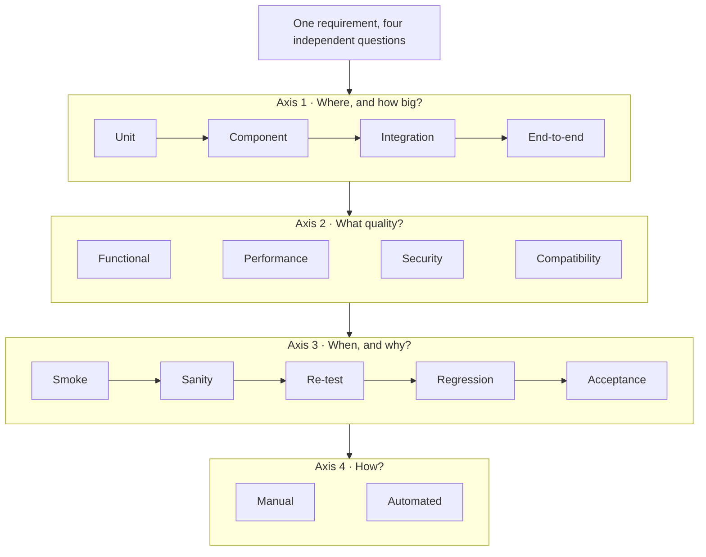
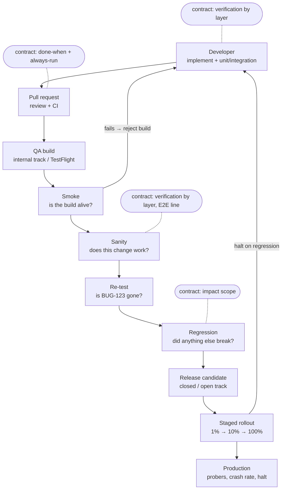
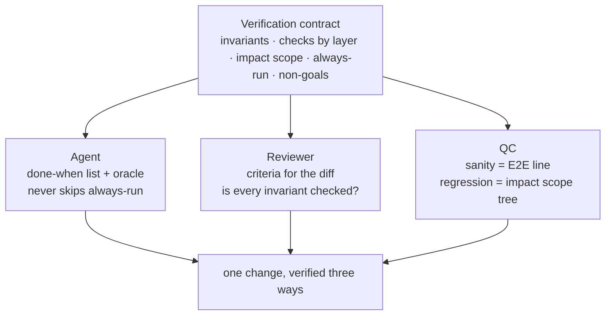

A coding agent finishes a change, runs the suite, and reports: all tests pass, CI green, ready for review. The reviewer agrees. Two days later the QA build comes back rejected. Nobody lied. The agent answered one question — *does the code do what the tests say?* — and QC answered a different one — *is this build safe to ship?* — and the two questions share almost no vocabulary.

I have spent most of my career on the developer side of that gap: messaging apps, end-to-end encryption, a lot of unit tests and a working relationship with QC that mostly consisted of answering "what did you touch?" in a Slack thread. It took a coding agent to make the gap visible, because an agent will happily optimize for the only signal you give it. Give it "tests pass" and you get exactly that — and then a build QC cannot accept.

The scenario I use throughout this post is constructed: an image message that arrives through a push notification and fails to decrypt when opened. The shape of the problem is not constructed — it is a shape that recurs in E2EE chat apps — but no detail below comes from a real incident. The [opener of this series](/posts/copilot-then-codex-then-claude-so-why-does-my-workflow-still-look-like-2022/) argued that AI moves the cost of software to verification; the [second post](/posts/prompt-engineering-got-you-here-so-why-doesnt-it-scale/) said the agent loop needs a "done when" list. This post is about the two things that list was missing — an *impact scope*, and a reader called QC — and what changes once it has them.

> [!TIP]
> **"Tests pass" is a claim about *scope*. "Release ready" is a claim about *purpose*.** They are two projections of the same requirement, and the artifact that links them — a verification contract: invariants, checks by layer, impact scope, always-run suites, non-goals — is the same artifact a coding agent needs as its oracle. Write it once, and the developer, the agent, the reviewer, and QC are checking the same thing.

## Table of contents

## Four Axes, Not One List

The reason developers and QC talk past each other is that "test" is one word for at least four independent questions:

- **Where, and how big?** Unit → component → integration → end-to-end. This is the developer's axis: how much of the system is under test at once.
- **What quality?** Functional correctness, performance, security, compatibility. Same code, different property.
- **When, and why?** Smoke, sanity, re-test, regression, acceptance. This is QC's axis: the *purpose* of running a suite at a given moment in a release.
- **How?** By hand, or automated.

These are not competing taxonomies. They are orthogonal, and the standards body that owns the vocabulary says so. The ISTQB Foundation syllabus, after defining four test types, states: "All the four above mentioned test types can be applied to all test levels, although the focus will be different at each level." Google arrived at the same conclusion from the other direction — its engineering book classifies tests by *size* (single process, single machine, anything) rather than by unit/integration, and explains why: "We make this distinction, as opposed to the more traditional 'unit' or 'integration,' because the most important qualities we want from our test suite are speed and determinism, regardless of the scope of the test." Martin Fowler named the failure mode back in 2012: "A common problem is that teams conflate the concepts of end-to-end tests, UI tests, and customer facing tests. These are all orthogonal characteristics."



Once the axes are separate, two confusions dissolve. A unit test *can* be a regression test — "unit" answers axis 1, "regression" answers axis 3, and the same file can hold both labels. And "automation" is not a level: you can automate a smoke suite, a unit suite, or a device-farm compatibility run, and none of that changes what the suite is *for*.

The standard itself shows how easily the axes get crossed. ISTQB defines acceptance testing as "A test level that focuses on determining whether to accept the system" — a scope word for what every developer treats as a purpose. It defines end-to-end testing as "A test type in which business processes are tested from start to finish under production-like circumstances," and smoke testing as "A test type to gain sufficient confidence that a test object is ready for planned testing" — two type words, one of which every developer treats as a scope. Same standard, three words developers file under "how big," two different axes. If the people who wrote the glossary do this, a developer and a QC engineer talking on a Friday afternoon will do it too.

## The Developer's Axis: Scope

The developer's instinct is the pyramid, and the instinct is right — as long as you remember what it is a pyramid *of*. Ham Vocke's summary on Fowler's site is two rules: "Write tests with different granularity" and "The more high-level you get the fewer tests you should have". The reasoning is a cost curve, not a rule. Unit tests run in milliseconds and fail in one place; end-to-end tests "are notoriously flaky and often fail for unexpected and unforeseeable reasons."

Google put numbers on the shape twice. The 2015 Testing Blog post: "As a good first guess, Google often suggests a 70/20/10 split: 70% unit tests, 20% integration tests, and 10% end-to-end tests." The 2020 engineering book: "around 80% of our tests being narrow-scoped unit tests … 15% medium-scoped integration tests … and 5% end-to-end tests." The ratio moved in five years; the axis did not, and the ratio was never the point. The point is what sits under the ratio. From Google's 2016 post on flaky tests: "Almost 16% of our tests have some level of flakiness associated with them! … more than 1 in 7 of the tests written by our world-class engineers occasionally fail in a way not caused by changes to the code or tests." Every step up the scope axis buys confidence with flakiness, and flakiness is the thing that teaches people to ignore red.

So the developer's question is not "is there a test?" It is:

> **What is the lowest layer that verifies this invariant with enough confidence?**

Vocke's two rules of thumb make it operational: "If a higher-level test spots an error and there's no lower-level test failing, you need to write a lower-level test." And its corollary: "Push your tests as far down the test pyramid as you can."

Run the constructed scenario through that question. The bug is "an image received via push notification fails to decrypt." Three layers, three different claims:

- **Unit — the decrypt routine.** Given a key and a ciphertext, does the routine produce the plaintext, and does it fail *loudly* on a wrong key? No disk, no network, no process boundary. Milliseconds.
- **Integration — key lookup + local store + decrypt, in a cold process.** The notification path runs in a different process from the app on both platforms, with its own memory budget and its own view of the key store. The unit test cannot see that. This is where the constructed bug actually lives: the decrypt routine is fine; the key it is handed in the cold process is not.
- **End-to-end — send an image from device A to device B while B is backgrounded, tap the notification, see the image.** The only test that checks what the user checks.

A from-scratch unit test for the first claim, in the shape I would want an agent to write:

```dart
test('wrong key fails closed and reports why', () {
  final decryptor = AttachmentDecryptor();
  final wrongKey = AttachmentKey.random();

  final result = decryptor.decrypt(sampleCiphertext, wrongKey);

  expect(result, isA<DecryptRejected>());
  expect((result as DecryptRejected).reason, DecryptRejectedReason.tagMismatch);
  expect(result.plaintext, isNull); // never a partial buffer on failure
});
```

Notice the third assertion. It is not about the happy path; it is about an invariant — *a failed decrypt never yields bytes*. That distinction is the whole of the "verify the verifier" section below.

## QC's Axis: Purpose

Now the other projection. QC does not organize tests by how much code they touch. QC organizes them by *why they are being run right now*, and the words for that are the ones developers most often misuse.

**Smoke.** ISTQB: "A test type to gain sufficient confidence that a test object is ready for planned testing." The question is *is this build alive enough to spend a day on?* App launches, login works, a conversation opens, a message sends and arrives. If login crashes, the smoke fails and the build is rejected — not because the feature is wrong, but because testing it would waste the day. ISTQB lists "all smoke tests have passed" as a typical *entry criterion* for a test level. Smoke is a gate, not a scope.

**Sanity.** There is no ISTQB entry for "sanity testing" — I checked the current glossary, all 1,123 terms, and the word does not appear in any term or definition. Google's engineering book uses "sanity checks" in the informal sense ("Larger tests act as sanity checks as the product develops"). My working definition, which matches how every QC team I have worked with uses it: *does this specific change work well enough to justify the wider testing that follows?* For the constructed bug: receive an E2EE image, tap the notification, it opens, restart the app, it still opens. Pass that, and QC commits the hours for regression. Fail it, and the build goes back with a one-line note.

**Re-test.** Also not an ISTQB term. The standardized name is *confirmation testing*: "A type of change-related testing performed after fixing a defect to confirm that a failure caused by that defect does not reoccur." Re-test answers exactly one question — *is BUG-123 gone?* — by running the steps that reproduced it.

**Regression.** ISTQB: "A type of change-related testing to detect whether defects have been introduced or uncovered in unchanged areas of the software." The word developers conflate with re-test is its opposite. Re-test asks whether the fix worked. Regression asks whether the fix broke something *else*. The syllabus is explicit that both are needed: "Regression testing confirms that no adverse consequences have been caused by a change, including a fix that has already been confirmation tested."

**Acceptance.** "A test level that focuses on determining whether to accept the system," with user acceptance testing as the sub-type "performed to determine if intended users accept the system." This is the product owner's suite, not QC's, and it is the only one on the axis that is allowed to say "the code is correct and we still do not want it."

**Release candidate, rollout, monitoring.** Google's definition: "A cohesive, deployable unit created by an automated process, assembled of code, configuration, and other dependencies that have passed the continuous build." On mobile the RC goes through store-side stages with their own vocabulary — Google Play's internal, closed, and open testing tracks, then a staged rollout where "your update reaches only a percentage of your users, which you can increase over time," with the halt as the safety valve: "If you discover an issue, you can halt a staged rollout to help minimize the number of users who experience the issue with your app." Apple's TestFlight plays the same role on iOS. And then production is itself a test environment. Google's CI chapter: "We should run the same suite of tests against production (sometimes called probers) that we did against the release candidate earlier on".



The rounded boxes are where the contract from the next section gets read. Two of them matter most. The sanity check *is* the contract's end-to-end line, executed by a person. And the regression scope is the thing QC has been asking developers for all along.

That question — **"what is the impact scope?"** — is the hinge of this whole post. When QC asks it, they are not making conversation. They are doing what the ISTQB syllabus prescribes: "It is advisable first to perform an impact analysis to recognize the extent of the regression testing. Impact analysis shows which parts of the software could be affected." The glossary definition of impact analysis is "The identification of all work products affected by a change, including an estimate of the resources needed to accomplish the change." QC cannot do that analysis. They did not make the change. The developer is the only person in the building who knows that the decrypt fix touched the shared attachment path, which means the regression tree is:

```text
notifications:  text · image · video
              × 1:1 · group
              × foreground · background · app killed
messaging:      receive · reply — attachments only; send path untouched
```

Every leaf of that tree is a QC test case. Every leaf is also a suite CI should not skip. Write it down once and both readers get it.

## One Contract, Three Consumers

Here is the artifact. It is a block of text in the pull request description — not a document, not a tool, five fields:

```text
Change: image messages received through a push notification fail to decrypt

Invariants (what must hold for every input):
  I1. An established E2EE conversation never falls back to plaintext.
  I2. Any attachment that decrypts in the foreground also decrypts when
      opened from a notification.
  I3. A decrypt failure is surfaced to the user; it is never silently dropped.

Verification by layer (one line per check, lowest layer that proves it):
  unit         decrypt routine — property test over random keys/payloads (I1)
  integration  key lookup + local store + decrypt in a cold process (I2)
  E2E          send image A→B with B backgrounded; notification opens image (I2, I3)

Impact scope (what QC regresses; what CI must not skip):
  notifications: text / image / video · 1:1 / group · foreground / background / killed
  messaging: receive / reply — attachments only; send path untouched

Always-run suites (excluded from any test selection): e2ee-invariants

Non-goals: key rotation unchanged; media upload unchanged
```

"Invariant" is my word; ISTQB's is *test condition* — "A testable aspect of a component or system that is intended to be tested" — and the syllabus describes the chain that goes from there: test analysis "answers the question 'what to test?'", test design "answers the question 'how to test?'" The contract is that chain written by the person who made the change, in the order QC would have derived it.

Three readers, three uses.

**The agent.** The previous post covered [why the agent needs a done-when list](/posts/prompt-engineering-got-you-here-so-why-doesnt-it-scale/#4-verification-driven-work--give-the-agent-a-done-when-list): without a check it can run, "looks done" is its only signal. The verification-by-layer field is that list. What the contract adds is the always-run line — the agent now knows which suite it may never skip, trim, or "temporarily" mark flaky — and the impact-scope field, which tells it what to re-run after touching the shared path. The rest is the oracle problem, and it deserves its own paragraph below.

**The reviewer.** Also [covered in #2](/posts/prompt-engineering-got-you-here-so-why-doesnt-it-scale/#6-generator--verifier--a-second-context-whose-job-is-to-break-it): a reviewer in a fresh context sees the diff and the criteria, not the reasoning. The contract *is* the criteria. A reviewer with the five fields asks concrete questions — is there a check for I3? does the diff touch anything outside the impact scope? — instead of "looks reasonable."

**QC.** This is the new reader. The sanity check is the E2E line, run by hand. The regression plan is the impact-scope tree, run as test cases. The non-goals — the same field [#2 put in the constraints stage](/posts/prompt-engineering-got-you-here-so-why-doesnt-it-scale/#one-loop-seven-stages) — tell QC what they are *not* expected to cover — key rotation stays out of scope even though it is adjacent — which is the difference between a two-hour regression and a two-day one. Nobody has to ask "what did you touch?" because the answer shipped with the change.



Now the oracle. Barr, Harman, McMinn, Shahbaz and Yoo's 2015 survey defines the problem: "Given an input for a system, the challenge of distinguishing the corresponding desired, correct behaviour from potentially incorrect behavior is called the 'test oracle problem'." Their observation about test generation is the one that matters for anyone whose agent just wrote forty tests: the advances in generating test *inputs* do not "address the issue of checking generated inputs with respect to expected behaviours — that is, providing an automated solution to the test oracle problem." An agent can generate inputs all day. It cannot generate the oracle, because the oracle is the specification, and the specification lives in the head of whoever made the change. The invariants field is the developer writing the oracle down. That is why the contract is not overhead on top of the agent's work; it is the input without which the agent's tests are checking nothing in particular.

## Trusting Generated Tests: Verify the Verifier

The opener of this series made the case for [invariants first, then generated tests](/posts/copilot-then-codex-then-claude-so-why-does-my-workflow-still-look-like-2022/#invariants-first-then-generated-tests). This section is about what to do once the tests exist, because a green suite written by the same model that wrote the code is evidence of consistency, not correctness.

The research on LLM test generation says this plainly. Bodicoat, Jahangirova and Terragni, in a 2026 preprint: "existing techniques primarily generate regression oracles that predicate on the implemented behavior of the class under test. They do not address the oracle problem: the challenge of distinguishing correct from incorrect program behavior." Cursor's own documentation for its agent review feature says the same thing in plain words: "Passing tests don't guarantee the code works correctly. It's possible the tests are checking the wrong behavior." A test that asserts *what the code currently does* will pass against the bug it was supposed to catch.

Two techniques turn "the tests pass" into "the tests would have failed."

**Mutation testing** grades the tests by breaking the code. Google's 2018 description: "Mutation testing assesses test suite efficacy by inserting small faults into programs and measuring the ability of the test suite to detect them." Flip a comparison, delete a branch, swap a constant; if the suite stays green, that mutant "lived," and the suite is decoration for that line. What makes the Google work relevant to generated tests is what they learned about *which* tests are worth having. Their 2021 paper describes tests that pin implementation details — "it is conceivable that these tests, if written and added, would even have a negative impact because their change-detector nature (specifically testing the current implementation rather than the specification) violates testing best practices and causes brittle tests and false alarms." *Change-detector tests* is the precise name for what an unguided agent produces. Google also found that the raw output of mutation analysis is mostly noise until you filter it: in the 2018 paper, "Using this developer feeback loop [sic], the reported usefulness of the surfaced results improved from 20% to 80%," in a system then "used by 6,000 engineers." Mutation results need curation exactly the way generated tests do.

For a Flutter codebase the honest version is less glamorous. There is no first-party Dart mutation tool; PIT and Stryker cover the JVM and JavaScript. What I do instead is cheap and manual: on a scratch branch, break the invariant on purpose — make `decrypt` return a partial buffer on auth failure, make the cold-process key lookup return the foreground key — and run the agent's suite. If it stays green, the suite is not testing the invariant, whatever its name says. Five minutes, and it catches the change-detector tests every time.

**Property-based testing** attacks from the other side: instead of grading examples, stop writing examples. John Hughes: "Property-based testing tools test software against a specification, rather than a set of examples." And the reason developers find it hard is not accidental — Hughes writes that the difficulty of identifying properties "is known as the oracle problem, and it is common to all approaches that use test case generation." That is the bridge. The invariants in the contract *are* the properties. I1 — never plaintext in an established conversation — is a property over every message. I3 — failure never yields bytes — is a property over every key/ciphertext pair. A property is an invariant with a generator attached:

```dart
test('decrypt never yields bytes on failure, for any key mismatch', () {
  final decryptor = AttachmentDecryptor();
  final rng = Random(20260829); // seeded: reproducible on failure

  for (var i = 0; i < 2000; i++) {
    final key = AttachmentKey.random(rng);
    final payload = bytesOf(rng, 1 + rng.nextInt(4096));
    final sealed = decryptor.encrypt(payload, key);
    final other = AttachmentKey.random(rng);

    expect(decryptor.decrypt(sealed, key).plaintext, payload);     // round trip
    expect(decryptor.decrypt(sealed, other).plaintext, isNull);   // I3
  }
});
```

Two thousand cases, two assertions, one invariant, and an agent can be told to write it *from the contract* rather than from the implementation. Hypothesis's documentation gives the recipe in one line: "Look for round-trip properties: encode/decode, serialize/deserialize, etc." Encryption is the canonical round trip.

Do not read this as "LLMs cannot write oracles." The TOGLL work from Hossain and Dwyer shows fine-tuned models producing oracles that "kill nearly 10 times more unique mutants" than the previous state of the art — but that pipeline is *graded with mutants*. LLM oracles work when you grade them; the grading is the part that was always the developer's job.

## Adaptive Depth: The Pipeline Is a Function of the Change

The instinct after all this is to run everything, always. It does not survive contact with a real pipeline, and it does not need to, because the contract carries the field that lets verification depth vary per change.

The principle has a name. ISTQB: "The test approach, in which test activities are selected, prioritized, and managed based on risk analysis and risk control, is called risk-based testing." Google's continuous-integration chapter turns it into a rule of thumb: "So, which tests should be run on presubmit? Our general rule of thumb is: only fast, reliable ones. You can accept some loss of coverage on presubmit, but that means you need to catch any issues that slip by on post-submit, and accept some number of rollbacks." Microsoft ships it as a checkbox — Test Impact Analysis "automatically selects only the subset of tests required to validate the code being committed" — and, tellingly, documents the fallback: for changes it cannot reason about, "it falls back to running all tests."

Meta went furthest. Their predictive test selection learns which tests to run from history rather than from the dependency graph, and the peer-reviewed result is that the strategy "reduces the total infrastructure cost of testing code changes by a factor of two, while guaranteeing that over 95% of individual test failures and over 99.9% of faulty changes are still reported back to developers". Their engineering blog adds the denominator: this while "running just a third of all tests that transitively depend on modified code". Read that clause carefully: a third of the *impacted* tests, not a third of all tests; on their mobile codebase, naive dependency selection alone would already exercise "as many as a quarter of all available tests" per change.

Now the uncomfortable arithmetic, which is mine and not the paper's: 95% of individual test failures reported means roughly one in twenty failing tests is *not* run. Meta's argument is that a faulty change usually breaks several tests, so the change is still caught — hence the 99.9%. For most code that trade is obviously right. For an E2EE invariant it is not a trade I would take, and this is where the contract's always-run field comes from. I have not found a published team that excludes security-critical suites from predictive selection; this is my inference from the paper's 95% figure. But the mechanism is the point: the developer, who knows which invariants are non-negotiable, marks them in the contract, and both CI and QC read the mark.

Two changes in the constructed scenario, same pipeline, different depth:

| | Copy change on the chat screen | Fix in the shared decrypt path |
| --- | --- | --- |
| Invariants touched | none | I1, I2, I3 |
| Presubmit | widget tests for that screen | unit + integration + `e2ee-invariants` |
| Impact scope | one screen, one locale | the whole notification × attachment tree |
| Sanity for QC | the screen renders the new string | E2E line: backgrounded receive, tap, open |
| Regression for QC | none beyond smoke | every leaf of the impact tree |
| Rollout | full | staged, watch decrypt-failure rate before widening |

Nothing about the pipeline changed between the two columns. What changed is the contract, and everyone downstream read it. That is what "not rigid" means in practice: not fewer gates, but gates whose depth is set by the change instead of by habit. Google's own word for the layered version of this is the right one to end on: continuous testing at every stage "serves as a reminder of the value in a 'defense in depth' approach to catching bugs — it isn't just one bit of technology or policy that we rely upon for quality and stability, it's many testing approaches combined."

## What the Agent Can Verify, Cannot Verify, and Needs From You

The vendors are unusually consistent about the shape of this. The `AGENTS.md` format describes the expectation that "the agent will attempt to execute relevant programmatic checks and fix failures before finishing the task." Claude Code's hooks exist to give "deterministic control: certain actions always happen rather than relying on the LLM to choose to run them." GitHub's coding agent works in an environment "where it can explore your code, make changes, execute automated tests and linters" — and then, by design, stops at a human gate: "By default, GitHub Actions workflows will not run automatically when Copilot pushes changes to a pull request." The people building these tools do not treat the agent's green as release-grade. Neither should the contract.

The developers using them agree. A 2025 field study of professional agent use (thirteen developers observed, ninety-nine surveyed) found that "no respondent indicated that agents are suitable for completely autonomous operation," and lists the verification strategies observed "such as manual UI testing, reading diffs, using debuggers, and running tests through CLI." One of the strategies on that list is a person tapping on a phone. On mobile that is not a failure of tooling; it is the compatibility axis, which no unit test reaches. Flutter's own documentation draws the curve in four rows — unit tests are "Low" confidence and "Quick," integration tests "Highest" confidence and "Slow" — and the device labs exist because even integration tests on one emulator say nothing about the phone in the user's pocket: Firebase Test Lab lets you "test your app on devices hosted in a Google data center," and AWS Device Farm runs "on real, physical phones and tablets."

Put together:

| The agent **can** verify | The agent **cannot** verify alone | What the developer **supplies** |
| --- | --- | --- |
| Logic against a stated invariant, at unit and integration scope | Behaviour across the device / OS matrix | The invariants — the oracle |
| Static analysis, types, build | Anything exploratory: "this feels wrong" on a real screen | Verification by layer — which check proves which invariant |
| That its diff stays inside the impact scope | Product intent — correct code the product owner still rejects | Impact scope — the regression tree, in QC's words |
| That the always-run suite is green | Production signals: crash rate, decrypt-failure rate, rollout halt | Always-run suites — what selection may never drop |
| That generated tests kill hand-made mutants | Whether the tests check the *right* behaviour | Non-goals — where the change stops |

Read the right-hand column again. Every item is a field of the contract. The agent's verification is only as good as the five things a person wrote down before it started.

## Where I Land, and What I Haven't Measured

I now write the contract before the agent writes code, and I paste it into the PR unchanged. The immediate effect was not on the agent; it was on the Slack thread with QC, which shortened to a link. The second effect was on the agent, which stopped "fixing" a failing always-run suite by loosening its assertions, because the contract told it that suite was not its to touch. The scratch-branch mutant check has caught change-detector tests more than once in sessions where I let the agent write tests before I wrote the invariants — which is the strongest argument I have for writing them first.

What I have not measured, and what would change my mind:

- **Whether the contract survives at team scale.** Mine is a habit, not a template that a dozen developers fill in under deadline. ISTQB's chain from test basis to test condition to test case is the same idea at organizational scale, and I have not run it that way.
- **Whether the always-run exclusion is worth its cost.** It is my inference from Meta's numbers, not their practice. A team with real selection data could tell me the price of exempting a suite, and I would like to know it.
- **Whether QC agrees.** The people whose vocabulary I borrowed for half this post have their own view of where the contract falls short. I expect "impact scope" to be the field they push back on first, because it is the one the developer is worst at estimating.

The next post in this series goes down a level: what a verification harness for a Flutter and native codebase actually looks like once the contract exists — which checks run where, and what the agent is allowed to do when one fails.

## Sources

Graded: primary = the standards body's, company's, or authors' own document; secondary = third-party reporting, flagged in the text.

**Standards and canonical references (primary)**

- [ISTQB Glossary](https://glossary.istqb.org/en_US/term/smoke-testing) — smoke testing; [confirmation testing](https://glossary.istqb.org/en_US/term/confirmation-testing); [regression testing](https://glossary.istqb.org/en_US/term/regression-testing); [acceptance testing](https://glossary.istqb.org/en_US/term/acceptance-testing); [test condition](https://glossary.istqb.org/en_US/term/test-condition); [impact analysis](https://glossary.istqb.org/en_US/term/impact-analysis) — current en_US term set checked 2026-08-29; no entry for "sanity testing" or "re-testing"
- [ISTQB CTFL Syllabus v4.0.1](https://istqb.org/wp-content/uploads/2024/11/ISTQB_CTFL_Syllabus_v4.0.1.pdf) (2024) — §2.2.2 test types across levels, §2.2.3 confirmation/regression and impact analysis, §5.1 entry criteria; risk-based testing wording from [CTFL v4.0 §5.2](https://istqb.org/certifications/certified-tester-foundation-level-ctfl-v4-0/) (2023)
- [Ham Vocke — The Practical Test Pyramid](https://martinfowler.com/articles/practical-test-pyramid.html) (2018) · [Martin Fowler — TestPyramid](https://martinfowler.com/bliki/TestPyramid.html) (2012)
- [Google Testing Blog — Just Say No to More End-to-End Tests](https://testing.googleblog.com/2015/04/just-say-no-to-more-end-to-end-tests.html) (2015) · [Flaky Tests at Google and How We Mitigate Them](https://testing.googleblog.com/2016/05/flaky-tests-at-google-and-how-we.html) (2016)
- [Software Engineering at Google — Ch. 11 Testing Overview](https://abseil.io/resources/swe-book/html/ch11.html) · [Ch. 23 Continuous Integration](https://abseil.io/resources/swe-book/html/ch23.html) (2020)

**Research papers (primary)**

- Barr, Harman, McMinn, Shahbaz, Yoo — [The Oracle Problem in Software Testing: A Survey](https://coinse.github.io/publications/pdfs/Barr2015qd.pdf), IEEE TSE 41(5), 2015, DOI 10.1109/TSE.2014.2372785 (authors' mirror)
- Bodicoat, Jahangirova, Terragni — [Understanding LLM-Driven Test Oracle Generation](https://arxiv.org/abs/2601.05542) (preprint, 2026)
- Hossain, Dwyer — [TOGLL: Correct and Strong Test Oracle Generation with LLMs](https://arxiv.org/abs/2405.03786) (2024)
- Petrović, Ivanković — [State of Mutation Testing at Google](https://storage.googleapis.com/gweb-research2023-media/pubtools/4203.pdf) (ICSE-SEIP 2018) · Petrović, Ivanković, Fraser, Just — [Practical Mutation Testing at Scale](https://arxiv.org/abs/2102.11378) (2021)
- Hughes — [How to Specify It!](https://research.chalmers.se/publication/517894/file/517894_Fulltext.pdf) (TFP 2019 / LNCS 2020) · Claessen, Hughes — [QuickCheck](https://www.cs.tufts.edu/~nr/cs257/archive/john-hughes/quick.pdf) (ICFP 2000) · [Hypothesis docs](https://hypothesis.readthedocs.io/en/latest/tutorial/introduction.html)
- Machalica, Samylkin, Porth, Chandra — [Predictive Test Selection](https://arxiv.org/abs/1810.05286) (ICSE-SEIP 2019) · [Engineering at Meta post](https://engineering.fb.com/2018/11/21/developer-tools/predictive-test-selection/) (2018)
- [Professional Software Developers Don't Vibe, They Control](https://arxiv.org/abs/2512.14012) (2025; field study N=13, survey N=99)

**Vendor and platform docs (primary)**

- [Microsoft — Test Impact Analysis, Azure Pipelines](https://learn.microsoft.com/en-us/azure/devops/pipelines/test/test-impact-analysis?view=azure-devops)
- [AGENTS.md](https://agents.md/) · [GitHub Copilot coding agent](https://docs.github.com/en/copilot/how-tos/use-copilot-agents/cloud-agent/use-cloud-agent-on-github) · [Claude Code hooks](https://code.claude.com/docs/en/hooks-guide) · [Cursor — agent review](https://cursor.com/docs/agent/review)
- [Flutter — Testing overview](https://docs.flutter.dev/testing/overview) · [Android — Fundamentals of testing](https://developer.android.com/training/testing/fundamentals)
- [Google Play — test tracks](https://support.google.com/googleplay/android-developer/answer/9845334?hl=en) · [staged rollouts](https://support.google.com/googleplay/android-developer/answer/6346149?hl=en) · [Apple TestFlight](https://developer.apple.com/testflight/)
- [Firebase Test Lab](https://firebase.google.com/docs/test-lab) · [AWS Device Farm](https://docs.aws.amazon.com/devicefarm/latest/developerguide/welcome.html) · [PIT](https://pitest.org/) · [Stryker](https://stryker-mutator.io/docs/)

**Series**

- [#1 — Copilot, Then Codex, Then Claude — So Why Does My Workflow Still Look Like 2022?](/posts/copilot-then-codex-then-claude-so-why-does-my-workflow-still-look-like-2022/) · [#2 — Prompt Engineering Got You Here. So Why Doesn't It Scale?](/posts/prompt-engineering-got-you-here-so-why-doesnt-it-scale/)
