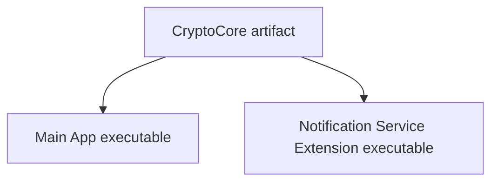
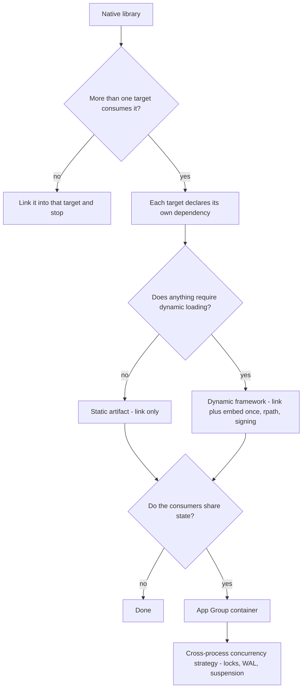

I have a native library called `CryptoCore` — Rust behind a C interface, holding the functions an end-to-end encrypted chat app lives on: `createAccount()`, `encrypt()`, `decrypt()`, `restoreSession()`. The name is fictional; the shape of the problem is not. The main app links it, calls it, ships it. Done — until the first push notification arrives.

An E2EE app cannot put plaintext in a push. What APNs delivers is a small encrypted blob — the payload budget is [4 KB](https://developer.apple.com/library/archive/documentation/NetworkingInternet/Conceptual/RemoteNotificationsPG/CommunicatingwithAPNs.html), and for us it is ciphertext. The thing that turns it into "Minh: see you at 7" before the user sees the banner is a **Notification Service Extension**: iOS hands it the payload, and the extension gets ["approximately 30 seconds to modify the notification content and call the content handler"](https://developer.apple.com/documentation/usernotifications/unnotificationserviceextension). To do that, it has to call `CryptoCore.decrypt()`.

So the question sounds tiny: *the app already uses CryptoCore — how does the extension use it too?* I expected a checkbox. What I found instead was the clearest lesson iOS ever taught me about how builds, linkers, and processes actually work.

> [!TIP]
> "Share the library" is not one problem. It is four, stacked: **ABI** (how Swift calls Rust at all), **packaging** (what artifact the Rust becomes), **linking** (which executables depend on it, and how), and **state** (where two processes get the same keys and sessions). Choose dynamic linking and there is a fifth: **runtime loading**. Every confusing Xcode error in this story is one of these layers answering a question I hadn't realized I was asking.

## Table of contents

## One .app, Two Executables

The first thing to unlearn is the picture of "my app" as one program. An Xcode project with a Notification Service Extension has two targets, and after the build they are still two programs. Apple's security guide is blunt about what an extension is: ["Extensions are special-purpose signed executable binaries packaged within an app"](https://support.apple.com/guide/security/supporting-extensions-secabd3504cd/web), and they "run in their own address space", talking to the rest of the system over IPC.

Inside the shipped bundle, that looks roughly like this — the [`PlugIns` directory](https://developer.apple.com/library/archive/documentation/CoreFoundation/Conceptual/CFBundles/BundleTypes/BundleTypes.html) is where loadable extras of an app live, and it is where Xcode puts the `.appex`:

```text
MyApp.app/
├─ MyApp                        ← executable #1
├─ Frameworks/
└─ PlugIns/
   └─ NotificationService.appex/
      └─ NotificationService    ← executable #2
```

Two executables means two dependency graphs. The extension does not inherit a single library from the app — not because Xcode is being difficult, but because there is no mechanism by which it could. A linker resolves symbols for *one output binary at a time*. The graph I actually need is this:



Both executables consume the same core, each through its own declared dependency. What I must *not* build is the tempting shortcut — extension calls into the app, app calls CryptoCore. The two processes don't share an address space, so there is nothing to "call into". The extension is not a feature of the app. It is a second, smaller program that happens to ship in the app's box.

That single fact answers the title question. The rest of this post is what it takes to act on it.

## "It Imports" Is Not "It Links"

In Swift I want to write `import CryptoCore` and move on. But an import statement is the *top* of a stack, and every layer under it has to hold:

```text
Swift source  →  Swift module  →  C header  →  C ABI  →  Rust machine code  →  linker  →  executable
```

Swift never calls Rust "directly". It calls a C-shaped symbol that the linker can resolve. On the Rust side, that boundary is built from two attributes the [Rustonomicon's FFI chapter](https://doc.rust-lang.org/nomicon/ffi.html) spells out: "The `no_mangle` attribute turns off Rust's name mangling, so that it has a well defined symbol to link to", and `extern "C"` makes the function follow the C calling convention.

```rust
#[unsafe(no_mangle)]
pub extern "C" fn crypto_decrypt(
    ciphertext: *const u8,
    len: usize,
    out: *mut u8,
) -> i32 {
    // ...
}
```

(Tools exist so you don't hand-maintain this boundary — [cbindgen](https://github.com/mozilla/cbindgen) generates the C headers from Rust, and [UniFFI](https://github.com/mozilla/uniffi-rs) generates Swift bindings outright — but the boundary itself is still a C ABI either way.)

Compiling that Rust for iOS is its own small pipeline. With `crate-type = ["staticlib"]`, cargo produces a `.a` archive — the Rust reference says this output type ["will create *.a files on Linux, macOS and Windows (MinGW)"](https://doc.rust-lang.org/reference/linkage.html) — and you build it once per target: [`aarch64-apple-ios` for devices, `aarch64-apple-ios-sim` and `x86_64-apple-ios` for simulators](https://doc.rust-lang.org/rustc/platform-support/apple-ios.html), each cross-compiled against the SDK Xcode provides.

Which raises the packaging question: several `.a` files, one per architecture and platform — what does Xcode consume? The current answer is an [XCFramework](https://developer.apple.com/documentation/xcode/creating-a-multi-platform-binary-framework-bundle): one distributable bundle holding a variant per platform, created with `xcodebuild -create-xcframework`, wrapping either a framework or a bare static library plus headers.

```text
CryptoCore.xcframework/
├─ ios-arm64/
│  └─ libcryptocore.a  +  headers
└─ ios-arm64_x86_64-simulator/
   └─ libcryptocore.a  +  headers
```

The reason this container exists at all: a classic `lipo` fat binary can hold each architecture only once, and Apple Silicon made "arm64 for device" and "arm64 for simulator" two different things that a fat binary cannot distinguish. An XCFramework keys variants by *platform*, not just architecture, so both arm64s coexist.

Three different kinds of "dependency" got untangled for me here. A **source dependency** (Xcode compiles the code into your target), a **module dependency** (the compiler can see the interface — this is what makes `import` succeed), and a **binary dependency** (the linker can resolve the symbols). `import CryptoCore` compiling proves only the second. The extension crashing or failing to build proves I never gave it the third.

## Static, Dynamic, and the Embed Checkbox

Both targets, then, need the XCFramework in their dependency list — Main App in *Frameworks, Libraries, and Embedded Content*, the extension in its own *Frameworks and Libraries*. Two link commands, two binaries, each resolving `_crypto_decrypt` for itself. And immediately Xcode asks a question that decides everything downstream: is the binary inside static or dynamic?

**Static** means the linker copies CryptoCore's machine code *into each executable*:

```text
MyApp                 [app code][CryptoCore code]
NotificationService   [extension code][CryptoCore code]
```

Both programs are self-contained. Nothing needs to be found at runtime. The cost is duplication — the core's code exists twice in the shipped bundle.

**Dynamic** means each executable stores only a *reference* — `@rpath/CryptoCore.framework/CryptoCore` — and the code has to exist somewhere in the bundle, exactly once, findable at launch. This is where two Xcode concepts that look like synonyms split apart:

- **Link** = the build-time edge: this executable depends on these symbols.
- **Embed** = the deploy-time act: copy the framework into the bundle so the *runtime loader* can find it.

A static library only needs link. In fact it *can* only be linked — Apple's [TN2435](https://developer.apple.com/library/archive/technotes/tn2435/_index.html) states it plainly: "Since the binary in these situations is a static library, apps cannot embed it in the app bundle." A dynamic framework needs both link *and* a correct embed, and getting only the first half produces the classic failure: the build passes, the app runs, and the extension dies at launch with `dyld: Library not loaded: @rpath/CryptoCore.framework/CryptoCore`.

The mechanism behind that crash is worth thirty seconds. `@rpath` is not a magic variable — it is a list of search paths physically embedded in each binary as `LC_RPATH` load commands. As an Apple engineer [explains on the developer forums](https://developer.apple.com/forums/thread/736728), "at runtime, dyld uses the runpath when searching for dynamic libraries whose load path begins with @rpath." The extension is its own binary in its own bundle directory, so its rpath entries must point out of the `.appex` and into the app's shared `Frameworks/` directory. Apple's supported layout for this is exactly one copy, embedded once: per TN2435, "the app target is responsible for embedding all frameworks, making them accessible to extensions." Misalign any link in that chain — framework embedded in the wrong bundle, rpath not covering it, signature mismatch — and you get a runtime crash out of a green build, because **with dynamic linking, build-time dependency and runtime dependency are two separate problems.**

So which one for CryptoCore?

```text
Static                                  Dynamic
+ no dyld lookup, no @rpath surface     + one copy of the code in the bundle
+ extension is self-contained           + Apple's TN2435-blessed sharing layout
+ fewer moving parts at launch          − embed + rpath + signing must all align
− code duplicated per executable        − extension gains a runtime dependency
```

For a small, hot, correctness-critical core consumed by exactly two executables, I take the duplication. The binary-size price is real but bounded; the dyld failure class simply disappears. (Apple's newer [mergeable libraries](https://developer.apple.com/documentation/xcode/configuring-your-project-to-use-mergeable-libraries) blur this line — dynamic in debug, static-like at launch in release — worth knowing, not needed here.) The honest general answer is a question: *how many executables consume this, how big is it, and does anything actually require runtime loading?*

## SPM, CocoaPods, and What They Don't Solve

Notice what has *not* appeared yet: a package manager. That's deliberate — the dependency graph exists whether or not a tool declares it for you.

With Swift Package Manager, the XCFramework rides in a [`binaryTarget`](https://docs.swift.org/package-manager/PackageDescription/PackageDescription.html) — "a binary target provides the path to a pre-built binary artifact for the target":

```swift
.binaryTarget(
    name: "CryptoCore",
    path: "CryptoCore.xcframework"
)
```

Then — and this is the part people miss — the package's product must be added to **both** targets. Adding a package to the *project* creates nothing; each target opts into the products it consumes. And a `binaryTarget` doesn't make anything static or dynamic. SPM ships whatever artifact you built; the linkage behavior was decided when the XCFramework was created, and the package manager's job is declaration, versioning, and distribution — not transformation.

CocoaPods draws the same graph with different syntax. Its Podfile scopes dependencies per [`target` block](https://guides.cocoapods.org/syntax/podfile.html), so you declare the pod for both:

```ruby
target 'MyApp' do
  pod 'CryptoCore'
end

target 'NotificationService' do
  pod 'CryptoCore'
end
```

Same core, two consumers, two declarations. Which is why "SPM or CocoaPods?" is the wrong first question. If the dependency graph is wrong, both tools will faithfully build you the wrong thing.

## A Swift Wrapper Earns Its Layer

I don't want `crypto_session_decrypt(ptr, len, out)` scattered through two codebases. Between the C ABI and the app code, one thin Swift layer pays for itself:

```swift
public final class CryptoEngine {
    private let session: OpaquePointer

    public func decrypt(_ payload: Data) throws -> Data {
        // call crypto_decrypt, map error codes to Swift errors,
        // own the buffer lifecycle on both sides of the FFI
    }
}
```

The point isn't prettier syntax. This layer is where FFI memory ownership, error-code mapping, serialization, and the threading contract live — decided once, tested once, leaked into neither consumer. The final code-sharing stack becomes: Rust → C ABI → Swift wrapper → App and Extension.

## Shared Code Is Not Shared State

Everything so far shares *code*. And for `decrypt()`, code is not enough. Decrypting a real message is not a pure function over ciphertext — it needs the account, the session, the keys, and (for a Signal-style protocol) ratchet state that *changes with every message*. The app has all of that in its storage. The extension is a separate process with a separate sandbox: same `decrypt()` function, no state to run it against.

That is a different problem with a different tool. An [App Group](https://developer.apple.com/documentation/foundation/filemanager/containerurl(forsecurityapplicationgroupidentifier:)) gives both processes a common container on disk — `containerURL(forSecurityApplicationGroupIdentifier:)` "returns the container directory associated with the specified security application group identifier". Put the crypto store there — say `group.com.example.chat/e2ee.sqlite` — and both processes can reach the same sessions. Note what App Groups do and don't do: they share *data*. They contribute nothing to linking. The full production picture is code shared down from one artifact, state shared across through one container:

```text
            CryptoCore (one artifact)
              ↓                ↓
         Main App         Extension
              ↘                ↙
        App Group container (one store)
```

Now the honest part. Two processes over one database is where this architecture stops being a packaging exercise and starts being a distributed-systems one — on an OS that is actively hostile to it.

The baseline mechanics are fine: SQLite in [WAL mode](https://www.sqlite.org/wal.html) allows concurrent access — "readers do not block writers and a writer does not block readers" — for processes on the same host, and [`busy_timeout`](https://www.sqlite.org/pragma.html#pragma_busy_timeout) makes a locked-out process retry instead of failing instantly. But iOS adds a rule desktop Unix never had: an app that gets *suspended* while holding a lock on a shared-container file is killed, with exception code `0xdead10cc`. An Apple engineer [describes the enforcement](https://developer.apple.com/forums/thread/655225): locks held through suspension can hang every other process waiting on them, and iOS 14 fixed the detection that used to let it slide. This is not theoretical:

- NetNewsWire's Brent Simmons [documented it precisely](https://inessential.com/2020/02/13/how_we_fixed_the_dreaded_0xdead10cc_cras.html): "iOS will always terminate the app… whenever your app or extension has an open file handle to a file in a shared container at suspension time." Their fix was radical — stop sharing the database entirely; the extension writes a plist the app reads later.
- Signal published a [whole test-case repo](https://github.com/signalapp/SQLCipherVsSharedData) showing that an always-open SQLCipher database in a shared container gets the app "terminated every time sent to background".
- Realm's tracker has the [same story](https://github.com/realm/realm-swift/issues/8017): locks held outside write transactions, extension opens the file, `0xdead10cc`.

And even with the file-level locking tamed, the *semantic* layer can wedge: matrix-rust-sdk — a Rust crypto core consumed by exactly the app-plus-NSE topology this post describes — tracked [Olm sessions wedging "when using multiple Clients (e.g with NSE process)"](https://github.com/matrix-org/matrix-rust-sdk/issues/3110), one process advancing a ratchet the other couldn't see. Two processes advancing one session is nothing like two processes reading one JSON file.

One more constraint shapes everything the extension does: it is small on purpose. Apple engineers have cited a limit of [~24 MB of memory for a Notification Service Extension (as of iOS 14)](https://developer.apple.com/forums/thread/67202) — guidance from the forums, not a published spec, so treat it as a design signal and measure on your devices. Between the memory ceiling, the ~30-second window, and `0xdead10cc`, the discipline is: open late, transact briefly, close early, hold nothing across suspension.

## The Architecture I'd Choose for CryptoCore

Stacking every decision:

```text
Rust core
  ↓  stable C ABI          (#[no_mangle] extern "C")
  ↓  static XCFramework    (device + simulator variants)
  ↓  SPM binaryTarget      (declared by BOTH targets)
  ↓  Swift wrapper         (FFI ownership, errors, threading)
  ↓
Main App        Notification Service Extension
  ↘                ↙
   App Group store   (short-lived, WAL, suspension-safe access)
```

This is not a universal recipe — it fits because the use case is a compact native core, exactly two executables, no need for runtime plugin loading, and state that genuinely must be shared. It is also not a hypothetical: Element X iOS is ["built with SwiftUI on top of matrix-rust-sdk"](https://github.com/element-hq/element-x-ios), consumes the Rust as an [XCFramework-backed Swift package](https://github.com/element-hq/matrix-rust-components-swift), and runs an [NSE built on the same core](https://github.com/element-hq/element-x-ios/pull/5054). Signal iOS ships a [SignalNSE target](https://github.com/signalapp/Signal-iOS) over [libsignal, whose implementations "are written in Rust"](https://github.com/signalapp/libsignal). The pattern is production-proven — including, as the issues above show, its sharp edges.

## The Decision Tree

For the next native library that needs to reach more than one Apple target:



Reading it in one breath: start from the executable boundary, not from the package manager. Count the consumers. Prefer static unless something forces dynamic loading, and if it does, budget for the embed/rpath/signing surface. Then treat shared state as its own project — because it is one.

## FAQ: The Six Misunderstandings

**"The main app already links the framework — why can't the extension call it?"**
Because they are two executables. Each binary needs its own valid dependency graph; the linker resolves symbols per output, never per project.

**"I added the package to the project — why won't the extension import it?"**
Adding a package to the *project* declares nothing. Each *target* must depend on the package product. The extension's target list is the one that counts.

**"`binaryTarget` means it's a dynamic framework, right?"**
No. `binaryTarget` only says the package consumes a prebuilt artifact. Static or dynamic is a property of the binary inside the XCFramework.

**"A framework is always dynamic, right?"**
No. Framework is a packaging structure — a folder layout. The Mach-O inside decides linkage. Static frameworks are common, and XCFrameworks wrap both kinds.

**"If both use the same framework, do they share memory?"**
No. They run in separate processes with separate address spaces. Shared code means the same instructions exist in both — every variable, cache, and session object is per-process.

**"So App Groups let the extension call CryptoCore?"**
No. App Groups share a *container* — files, state. The extension calls CryptoCore because its own executable links it. The two mechanisms solve different halves of this post.

## Where the Original Question Went Wrong

The question I started with — "how do I call the Rust library from the extension, like the app does?" — quietly assumed there was one program with two entry points. There are two programs. Once that's visible, the better question asks itself:

> **Whose dependency graph is CryptoCore in, how is it linked into each consumer, and where does its state live?**

Answer those three and the Xcode/SPM/CocoaPods layer stops being folklore — it's just the syntax for writing the graph down. And nothing here is Rust-specific. Swap CryptoCore for SQLCipher, OpenSSL, FFmpeg, a C++ engine, or an ML runtime: the moment a native core meets a second Apple target — an extension, a widget, a watch app — the same four layers appear in the same order. Draw the graph first. The build errors will start making sense before you finish.

---

*This opens the [iOS series](/series/ios/). The threads left hanging are deliberate: what static and dynamic linking each actually do under Xcode's build button, and what it takes for two processes to advance one ratchet without corrupting it — both are coming as their own posts.*

## References

**Apple platform**

- [Supporting extensions — Apple Platform Security](https://support.apple.com/guide/security/supporting-extensions-secabd3504cd/web)
- [UNNotificationServiceExtension — Apple Developer Documentation](https://developer.apple.com/documentation/usernotifications/unnotificationserviceextension)
- [TN2435: Embedding Frameworks In An App](https://developer.apple.com/library/archive/technotes/tn2435/_index.html)
- [Dynamic library standard setup (@rpath, LC_RPATH) — Apple Developer Forums](https://developer.apple.com/forums/thread/736728)
- [containerURL(forSecurityApplicationGroupIdentifier:) — FileManager](https://developer.apple.com/documentation/foundation/filemanager/containerurl(forsecurityapplicationgroupidentifier:))
- [Bundle structure (PlugIns) — Bundle Programming Guide](https://developer.apple.com/library/archive/documentation/CoreFoundation/Conceptual/CFBundles/BundleTypes/BundleTypes.html)
- [Creating a multi-platform binary framework bundle (XCFramework)](https://developer.apple.com/documentation/xcode/creating-a-multi-platform-binary-framework-bundle)
- [Configuring your project to use mergeable libraries](https://developer.apple.com/documentation/xcode/configuring-your-project-to-use-mergeable-libraries)
- [NSE memory limit discussion (Apple engineer) — Apple Developer Forums](https://developer.apple.com/forums/thread/67202)
- [File locks and suspension (0xdead10cc) — Apple Developer Forums](https://developer.apple.com/forums/thread/655225)
- [APNs payload size — Local and Remote Notification Programming Guide](https://developer.apple.com/library/archive/documentation/NetworkingInternet/Conceptual/RemoteNotificationsPG/CommunicatingwithAPNs.html)

**Rust toolchain**

- [Apple iOS targets — rustc platform support](https://doc.rust-lang.org/rustc/platform-support/apple-ios.html)
- [Linkage (staticlib) — The Rust Reference](https://doc.rust-lang.org/reference/linkage.html)
- [FFI — The Rustonomicon](https://doc.rust-lang.org/nomicon/ffi.html)
- [cbindgen](https://github.com/mozilla/cbindgen) · [UniFFI](https://github.com/mozilla/uniffi-rs)

**Package managers**

- [binaryTarget — Swift Package Manager PackageDescription](https://docs.swift.org/package-manager/PackageDescription/PackageDescription.html)
- [Podfile syntax (target blocks) — CocoaPods Guides](https://guides.cocoapods.org/syntax/podfile.html)
- [From fat frameworks to XCFrameworks (arm64 simulator) — Medium](https://medium.com/fusionui/from-fat-frameworks-to-xcframeworks-or-how-to-support-arm64-for-ios-simulators-a53f9f097f83)

**Real-world codebases and cross-process state**

- [element-x-ios](https://github.com/element-hq/element-x-ios) · [matrix-rust-components-swift](https://github.com/element-hq/matrix-rust-components-swift) · [NSE boot-detection PR](https://github.com/element-hq/element-x-ios/pull/5054)
- [Olm sessions wedge with NSE process — matrix-rust-sdk #3110](https://github.com/matrix-org/matrix-rust-sdk/issues/3110)
- [Signal-iOS (SignalNSE)](https://github.com/signalapp/Signal-iOS) · [libsignal](https://github.com/signalapp/libsignal) · [SQLCipherVsSharedData](https://github.com/signalapp/SQLCipherVsSharedData)
- [How we fixed the dreaded 0xdead10cc crashes — inessential (NetNewsWire)](https://inessential.com/2020/02/13/how_we_fixed_the_dreaded_0xdead10cc_cras.html)
- [Realm in app group hits 0xdead10cc — realm-swift #8017](https://github.com/realm/realm-swift/issues/8017)
- [Write-Ahead Logging — SQLite](https://www.sqlite.org/wal.html) · [PRAGMA busy_timeout — SQLite](https://www.sqlite.org/pragma.html#pragma_busy_timeout)
