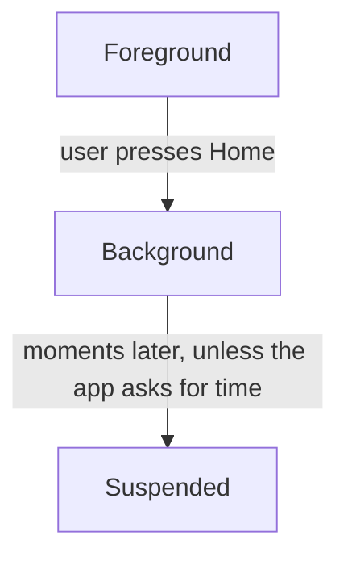
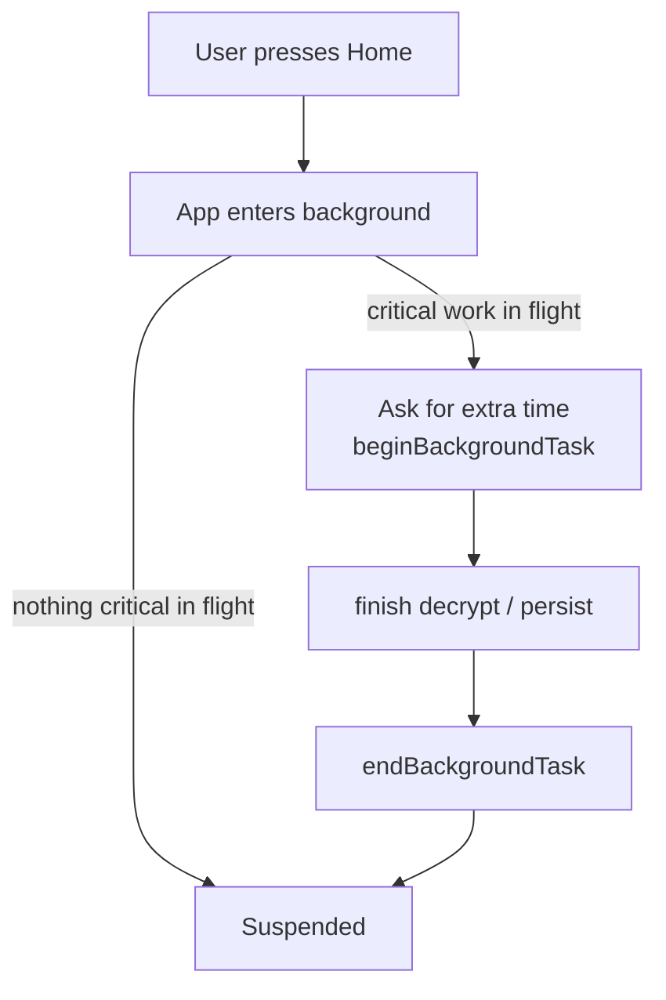
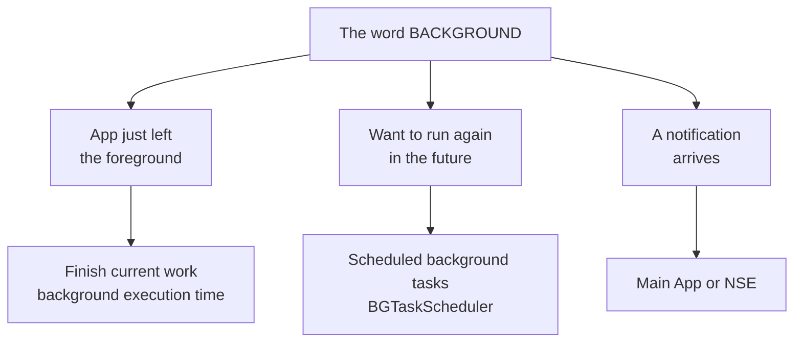

I have a native E2EE core called `CryptoCore` — Rust behind a C interface, the same fictional-but-real library from [the extension post](/posts/the-app-links-cryptocore-fine-so-why-cant-the-notification-extension-call-it/). Its day job is unremarkable:

```text
receive message
    ↓
decrypt
    ↓
update session
    ↓
persist session to SQLCipher
```

One day I ran into a question:

> What happens if the user presses Home exactly while `persist session` is running?

I started reading and hit a wall of terms:

```text
foreground
background
suspended
terminated

DispatchQueue
async
background thread

Background Task
BGTaskScheduler

Notification Service Extension
```

The problem is that knowing each term individually still doesn't answer the original question.

So let's put the APIs aside first.

> [!TIP]
> On iOS, the word "background" names at least three unrelated things: a **queue** your work runs on, a **state** your app is in, and a **family of mechanisms** for running code later. The one distinction this post exists for: **a background queue does not keep your process running — the app lifecycle decides whether any of your code runs at all.**

## Table of contents

## Imagine the App Is a Shop

While the user is using the app:

```text
┌───────────────────────────────┐
│           MY APP              │
│                               │
│  UI                           │
│  CryptoCore                   │
│  Database                     │
│  Network                      │
│                               │
│  CPU is letting us work       │
└───────────────────────────────┘

            FOREGROUND
```

The user presses Home.

The app doesn't necessarily die. It moves through phases:



And "moments" means moments. Unless the app explicitly asks for extra execution time, iOS suspends it [shortly after it enters the background](https://developer.apple.com/documentation/uikit/extending-your-app-s-background-execution-time) — think seconds, not minutes.

The most important point:

> **Background does not mean the app gets to keep running behind the scenes.**

This is the single biggest mindset shift when coming from Android.

## Suspended Is the State to Understand Cold

Picture it:

```text
FOREGROUND
──────────
The shop is open.

Staff work normally.


BACKGROUND
──────────
The customers have left.

iOS says:
"Prepare to close."


SUSPENDED
──────────
iOS freezes the shop.

Everything is still on the shelves,
but nobody is allowed to work.


TERMINATED
──────────
The shop is cleared out of memory.
```

Suspended is not terminated.

While suspended:

```text
memory may still be there
objects may still be there
the database connection may still be there

BUT

code does not keep running
the CPU does not keep draining your queues
```

And there is a second edge worth knowing early: under memory pressure, iOS [evicts suspended apps to reclaim memory](https://developer.apple.com/documentation/uikit/managing-your-app-s-life-cycle) — **with no callback**. No warning, no "about to terminate" hook runs. One moment the shop is frozen; the next it simply isn't there.

This pair — *frozen without notice, evicted without notice* — is the mental model everything else in this post builds on.

## Does a "Background Queue" Let Me Run in the Background?

This is one of the easiest confusions to fall into.

For example:

```swift
DispatchQueue.global().async {
    encrypt()
    database.persist()
}
```

We casually call this:

> running on a background queue.

But the word **background** here is not the same as **app background**. They are two completely different concepts.

```text
                  APP STATE

              Foreground
                  │
        ┌─────────┴─────────┐
        │                   │
   Main Queue         Worker Queue
        │                   │
     render()            encrypt()
                         persist()


                  ↓


              Suspended

        ┌─────────┴─────────┐
        │                   │
   Main Queue         Worker Queue
        ✕                   ✕
```

A queue only answers:

> Where does this work run, and in what order?

It does NOT answer:

> Will iOS let my process keep running at all?

Those are two different problems.

## A Queue Is Simpler Than Its Name

Imagine a bank counter.

There are jobs:

```text
A — decrypt message 1
B — update session
C — persist session
D — decrypt message 2
```

A **serial queue** is a single line of people:

```text
A → B → C → D
```

One job at a time.

This matters a lot when the E2EE session has state:

```text
session state = 100

decrypt message A
        ↓
session state = 101

persist
        ↓

decrypt message B
        ↓
session state = 102
```

If several places mutate the state at once:

```text
              ┌→ decrypt A → state 101
state 100 ────┤
              └→ decrypt B → state ???
```

concurrency problems begin.

So a queue helps control:

```text
who is allowed to touch the state
        +
in what order
```

But a queue **does not keep the app alive**.

## Back to the E2EE Core

Suppose the app is mid-flight:

```text
Message
   ↓
Decrypt
   ↓
Ratchet / session changes
   ↓
Persist to DB
```

And right then the user presses Home.

A dangerous design thinks:

```text
"No problem, I'm on a background queue."
```

No.

A background queue is not a permit for the process to keep running.

What we actually care about is this window:

```text
              decrypt
                 │
                 ▼
          session changed
                 │
                 ▼
             persist
                 │
                 ▼
              SAFE
```

We'd like iOS not to suspend the process in the middle of this critical stretch, if possible.

This is where **background execution time** becomes meaningful.

## How to Think About beginBackgroundTask

Don't memorize the API first.

Memorize the sentence:

> **"iOS, I have one short piece of work to finish before you suspend me."**

The mental model:



Two properties keep this honest. The time is **finite** — on modern iOS it's on the order of [about 30 seconds](https://developer.apple.com/videos/play/wwdc2020/10063/), and [`backgroundTimeRemaining`](https://developer.apple.com/documentation/uikit/uiapplication/backgroundtimeremaining) tells you how much is left. And iOS hands you an [**expiration handler**](https://developer.apple.com/documentation/uikit/extending-your-app-s-background-execution-time) — a knock on the door that says *time's up, clean up now*.

So this is not:

> "Let my app run in the background forever."

It's much closer to:

> "Let me finish what's in flight, then I'll sleep."

For E2EE, that difference is enormous.

## Don't Design E2EE on the Faith That You'll Always Have Enough Time

Suppose:

```text
decrypt
  ↓
update ratchet
  ↓
persist
```

A good design should not depend on the assumption:

```text
"iOS will surely let me finish."
```

Instead, ask:

```text
If the process vanishes at ANY point,
can the next launch recover?
```

That is the mindset that matters for E2EE.

For example:

```text
          ┌──────────────┐
          │ old session  │
          │ persisted    │
          └──────┬───────┘
                 │
              decrypt
                 │
                 ▼
          new session state
                 │
              persist
                 │
                 ▼
          ┌──────────────┐
          │ new session  │
          │ persisted    │
          └──────────────┘
```

We have to care about what happens if the app stops at each position. Remember the earlier point: eviction comes **with no callback**. The design has to assume the interruption — it cannot negotiate with it.

So the question is not only:

> How do I keep background time longer?

But also:

> How do I make an interruption unable to corrupt the state?

## Should I Close the Database When the App Goes to Background?

This is where it's tempting to land on an oversimplified rule:

```text
didEnterBackground
    ↓
closeDatabase()
```

But picture this:

```text
E2EE Queue
────────────────────────────

decrypt
   ↓
persist ────────────────┐
                        │
                        │ write in progress
                        │
App Lifecycle           │
────────────────────────┼────
                        │
didEnterBackground      │
   ↓                    │
closeDatabase() ────────┘
```

Now the lifecycle and the worker are fighting over the database.

The question is no longer:

> Close the DB or not?

It's:

> **Who owns the database, and who gets to decide when it closes?**

A better mental model:

```text
                 E2EE Worker
                      │
              ┌───────▼────────┐
              │ E2EE / DB owner│
              └───────┬────────┘
                      │
                   SQLCipher
```

The lifecycle may announce:

```text
"The app is about to sleep."
```

But it should not yank the database out from under an operation that's using it. (Holding a file lock *into* suspension has its own dedicated crash code on iOS — [`0xdead10cc`](https://developer.apple.com/forums/thread/655225) — which is a story of exactly this tug-of-war.)

## "Background Task" Is Not BGTaskScheduler

These two are also easy to conflate.

### I'm working, and the user just left

For example:

```text
encrypt
persist
cleanup
```

We want a little more time to finish what's already running.

This problem is shaped like:

```text
foreground work
      ↓
user leaves
      ↓
finish existing work
```

### I want iOS to wake the app later

For example:

```text
refresh data
maintenance
processing
```

That's a different problem:

```text
app is not running
      │
      │ sometime later
      ▼
iOS gives the app a chance to run
      ↓
do some work
```

That's the territory of mechanisms like [`BGTaskScheduler`](https://developer.apple.com/documentation/backgroundtasks/bgtaskscheduler).

These two should never be collapsed into one word:

> background.

## Push Notifications Create Yet Another Problem

Suppose the app is suspended.

The server sends a message.

We might picture:

```text
App
────────────
Suspended


Server
   │
   │ push
   ▼
iOS
```

We cannot simply assume:

```text
push
 ↓
main app wakes up
 ↓
E2EE runs freely
```

iOS has several distinct mechanisms here, each with its own limits. A user-visible alert push can be handed to a **Notification Service Extension** to modify; a silent [`content-available` background push](https://developer.apple.com/documentation/usernotifications/pushing-background-updates-to-your-app) *may* wake the main app briefly — at the system's discretion, not yours.

Which means for notifications, we can end up facing:

```text
Main App Process

and

Notification Service Extension Process
```

This is an important turning point.

## The Notification Service Extension Is Not the Main App

Imagine them as two rooms.

```text
┌──────────────────────┐
│      MAIN APP        │
│                      │
│ CryptoCore           │
│ DB                   │
│ UI                   │
└──────────┬───────────┘
           │
           │ shared storage
           │
┌──────────▼───────────┐
│ NOTIFICATION SERVICE │
│      EXTENSION       │
│                      │
│ CryptoCore           │
│ DB access            │
└──────────────────────┘
```

The NSE has [its own process and its own lifecycle](/posts/the-app-links-cryptocore-fine-so-why-cant-the-notification-extension-call-it/) — I've already been through what it takes just to make it *call* `CryptoCore`.

Which means the database problem gets interesting:

```text
Main App ──────┐
               ├──→ same E2EE database
NSE ───────────┘
```

Now it's no longer just:

```text
thread A vs thread B
```

It can be:

```text
PROCESS A vs PROCESS B
```

This is why [WAL](https://www.sqlite.org/wal.html), transactions, locking, busy timeouts, and database ownership start to matter. (Even *counting the copies* of SQLCipher across those targets turned out to be [its own story](/posts/two-frameworks-need-sqlcipher-so-does-the-extension-how-many-copies-does-the-iphone-end-up-with/).)

No need to learn them all yet. Just hold on to this:

> **A database used by multiple processes is a fundamentally different problem from a database used by multiple threads in one process.**

## A Map That's Enough for a Beginner

When you hear the word "background" on iOS, first ask which of these it is:



Then ask the follow-up questions:

```text
Where does the code run?
        ↓
Queue / Thread / Actor


Is the process allowed to run?
        ↓
App lifecycle / background execution


Who owns the state?
        ↓
E2EE worker / DB owner


What if we get killed?
        ↓
Transaction / persistence / recovery


Main App and NSE share the DB?
        ↓
Multi-process coordination
```

At this point, a lot of iOS terminology starts finding its own place.

## A Native E2EE Core Doesn't Automatically Become a "Background Service"

This may be the most important point if you're moving E2EE from Flutter/Dart down to Swift/Kotlin/Rust.

You can move the stack:

```text
Flutter
   ↓
Native E2EE Core
   ↓
Rust
   ↓
SQLCipher
```

But being native **grants no extra right to run in the background**.

iOS still owns the process lifetime.

Native gives you better control over:

```text
state ownership
queues
database
transactions
App / NSE integration
```

but it does not turn the E2EE core into an always-running daemon:

```text
             iOS
              │
       controls lifetime
              │
              ▼
      ┌───────────────┐
      │ App / NSE     │
      │ process       │
      └───────┬───────┘
              │
              ▼
        Native E2EE
              │
              ▼
            Rust
              │
              ▼
          SQLCipher
```

**The E2EE core lives inside a process that iOS permits to run.**

That's the mental model to keep.

## In the End, I Only Need Five Sentences

If you're new to iOS background, you don't need to memorize dozens of APIs yet.

Just be certain of five things:

**1. Background does not mean the app keeps running.**

The app can be suspended within moments.

**2. A background queue is not background execution.**

The queue decides *how work runs*.
The iOS lifecycle decides *whether the process runs at all*.

**3. Suspended is not terminated.**

Suspended may still hold memory, but no code runs — and eviction to terminated comes with no callback.

**4. Critical state must be designed to survive interruption.**

Don't build E2EE on the assumption that:

```text
encrypt/decrypt will surely finish.
```

**5. The main app and an extension are different processes.**

If both touch the E2EE database, the problem is no longer just "use a serial queue."

## Learn the APIs From the Mental Model, Not the Other Way Around

Once the map above is solid, *then* it's worth learning, in order:

```text
Level 1
App lifecycle
foreground → background → suspended → terminated

Level 2
Concurrency
main queue
serial queue
concurrent queue
async/await
actor

Level 3
Short background execution
beginBackgroundTask
expiration

Level 4
Scheduled background work
BGTaskScheduler

Level 5
Notifications
APNs
Notification Service Extension

Level 6
Persistence
transaction
WAL
locking
busy timeout

Level 7
E2EE architecture
state ownership
atomic persistence
interruption recovery
Main App ↔ NSE coordination
```

Don't learn Level 7 first and work backwards.

If Level 1 and Level 2 are solid, the E2EE problems behind them become much easier to understand.

## Where the Original Question Went

My original question was:

> **"If E2EE moves down to native, how do I make it run reliably in the background?"**

After understanding the iOS lifecycle, I'd change the question.

Not:

> How do I make E2EE always run?

But:

> **When iOS gives E2EE only a finite window to run, how do I make every encrypt, decrypt, and persist end in a safe state — even when the work gets cut off?**

That's the real problem.

And starting from that question, queues, background tasks, transactions, WAL, the NSE, and database ownership finally connect to each other.

## References

**App lifecycle and background execution**

- [Managing your app's life cycle — Apple Developer Documentation](https://developer.apple.com/documentation/uikit/managing-your-app-s-life-cycle)
- [Extending your app's background execution time — Apple Developer Documentation](https://developer.apple.com/documentation/uikit/extending-your-app-s-background-execution-time)
- [backgroundTimeRemaining — UIApplication](https://developer.apple.com/documentation/uikit/uiapplication/backgroundtimeremaining)
- [Background execution demystified — WWDC20 session 10063](https://developer.apple.com/videos/play/wwdc2020/10063/)
- [BGTaskScheduler — Apple Developer Documentation](https://developer.apple.com/documentation/backgroundtasks/bgtaskscheduler)

**Notifications**

- [Pushing background updates to your app — Apple Developer Documentation](https://developer.apple.com/documentation/usernotifications/pushing-background-updates-to-your-app)
- [UNNotificationServiceExtension — Apple Developer Documentation](https://developer.apple.com/documentation/usernotifications/unnotificationserviceextension)

**Databases under suspension**

- [File locks and suspension (0xdead10cc) — Apple Developer Forums](https://developer.apple.com/forums/thread/655225)
- [Write-Ahead Logging — SQLite](https://www.sqlite.org/wal.html)
- [PRAGMA busy_timeout — SQLite](https://www.sqlite.org/pragma.html#pragma_busy_timeout)
