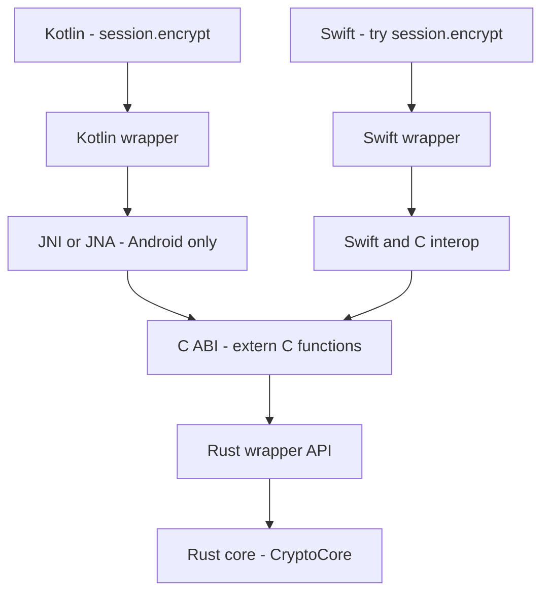
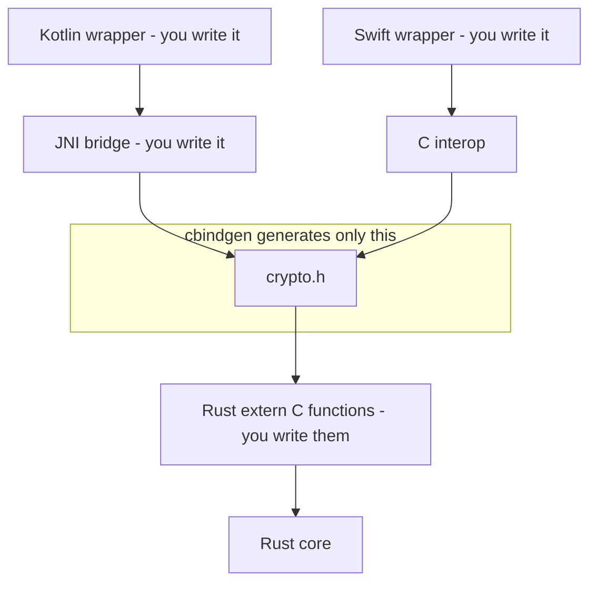
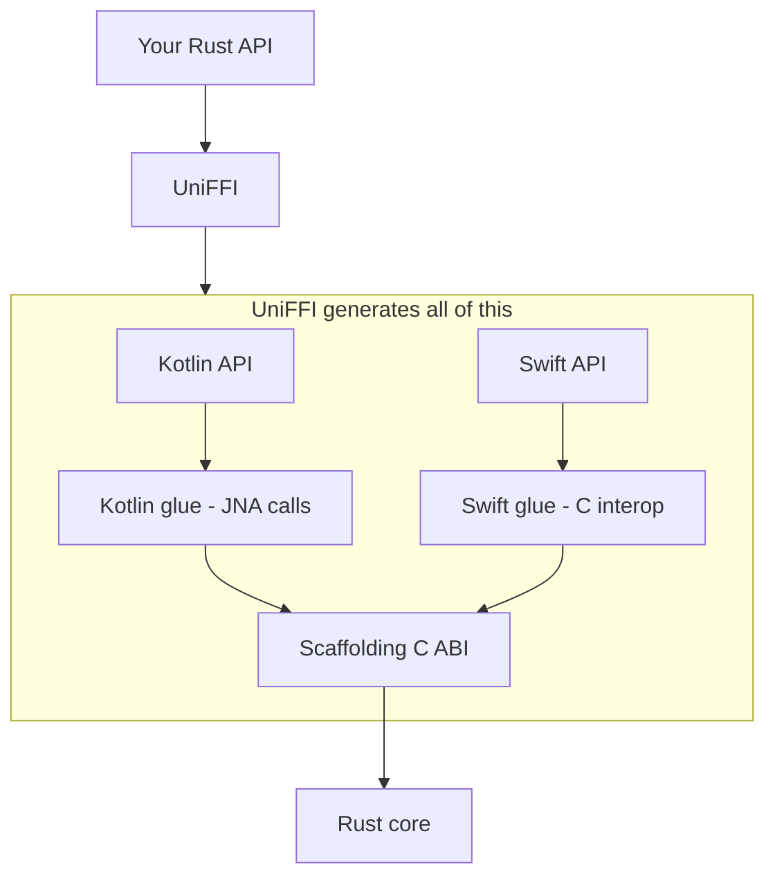
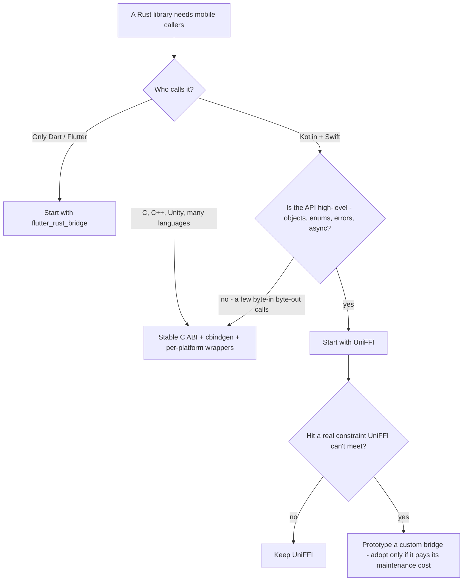

`CryptoCore` is finished. The Rust crate from [the extension post](/posts/the-app-links-cryptocore-fine-so-why-cant-the-notification-extension-call-it) — accounts, sessions, `encrypt()`, `decrypt()`, key management — compiles, passes its tests, and does exactly what an E2EE chat app needs. iOS links it. Now the Android app needs the same core, and both platforms need a real API, not a pile of C symbols.

"Just generate the bindings," said every search result. Then the same search results handed me this:

```text
UniFFI
cbindgen
bindgen
JNI
JNA
C FFI
swift-bridge
flutter_rust_bridge
```

I spent an evening trying to rank them, as if they were competing brands of the same product. That evening was wasted, and this post exists so yours isn't.

> [!TIP]
> UniFFI, cbindgen, JNI, and "raw FFI" are not four answers to one question. They sit at **different layers of the same bridge** between Kotlin/Swift and Rust. The real choice is not "which tool is best" but **"how much of the bridge do I want a tool to build, and how much do I want to own?"** Everything below is that one sentence, drawn out.

## Table of contents

## The Name Dump Is Not a Menu

Here is the whole bridge, once, before any tool gets named. A Kotlin or Swift call has to descend through every one of these layers to reach Rust:



This is the most important picture in the post. Every name from the search results lives *somewhere* on this diagram — as a layer, or as a generator that writes one or more layers for you. None of them replaces the diagram. Once each name is pinned to its spot, the "which one?" question mostly answers itself.

## FFI and the C ABI: The Riverbed

Rust's nice types — `Vec<u8>`, `Result<T, E>`, `&mut Session` — mean nothing to Swift or Kotlin. What nearly every language *can* understand is the C calling convention. So the universal move is to flatten the boundary into C-shaped functions:

```rust
#[no_mangle]
pub extern "C" fn crypto_encrypt(
    session: *mut Session,
    input: *const u8,
    input_len: usize,
    output: *mut ByteBuffer,
) -> i32 {
    // ...
}
```

That surface — plain functions, pointers, integers — is the **C ABI**. **FFI** (Foreign Function Interface) is the broader concept: any mechanism that lets one language call another, of which the C ABI is the overwhelmingly common form ([the Rustonomicon has a whole chapter on it](https://doc.rust-lang.org/nomicon/ffi.html)).

So "UniFFI or FFI?" is a malformed question — like asking "should I take the car, or the road?" Every tool in the name dump ultimately drives over this same C ABI. FFI is not an option on the menu. It is the riverbed the bridge stands in.

## JNI: Android's On-Ramp

One asymmetry matters before any generator enters the picture. Swift can import a C header and call C functions almost directly. Kotlin on Android cannot: code on the JVM reaches native libraries through [**JNI**, the Java Native Interface](https://developer.android.com/training/articles/perf-jni) — declare an `external fun`, load the `.so`, and provide native-side functions with JNI's exact naming and calling conventions.

```kotlin
class CryptoSession(private val nativeHandle: Long) {
    external fun encrypt(data: ByteArray): ByteArray
}
```

JNI is not a competitor to UniFFI or cbindgen. It is a *layer* — the on-ramp Android traffic must take to get onto the bridge at all. The open question is only ever: who writes that on-ramp, you or a generator? (There is a third possibility — route around JNI entirely — and one of the tools below takes it. Hold that thought.)

Multiply it out and the problem becomes visible. `CryptoCore` exposes accounts, inbound and outbound sessions, group sessions, one-time keys, signatures, serialization. Fifty-odd functions. Hand-writing the C ABI, the JNI layer, a Kotlin wrapper, and a Swift wrapper for each — then keeping all four in sync every time the Rust API moves — is not a chore. It is a second project.

## cbindgen: It Prints the Sign, Not the Bridge

[cbindgen](https://github.com/mozilla/cbindgen) has the most misleading position in the name dump, because its name sounds like "the thing that generates bindings." Here is what it actually covers:



cbindgen reads the `extern "C"` functions *you already wrote* in Rust and generates a matching C/C++ header. That's the whole job — and it's a genuinely valuable one, because the alternative is maintaining `crypto.h` by hand and discovering at runtime that it drifted from the Rust source. As Mozilla puts it: you *could* write the headers yourself, but ["it's not a particularly good use of your time"](https://github.com/mozilla/cbindgen).

What cbindgen does **not** produce: a Kotlin API, the JNI implementation, a Swift-friendly wrapper, object lifecycle management, `Result`-to-exception mapping, or any async bridging. Above the header, everything is still yours.

## bindgen: Same Name, Opposite Direction

One more naming trap and the map is complete. [bindgen](https://github.com/rust-lang/rust-bindgen) — no "c" prefix — solves the *reverse* problem: it reads existing C/C++ headers and generates Rust code so that **Rust can call C**.

```text
C/C++  ── bindgen ──▶  Rust        (Rust is the caller)
Rust   ── cbindgen ──▶ C header    (Rust is the callee)
```

If your task is putting a Rust core under a mobile app, bindgen is pointing the wrong way. It shows up in search results anyway, which is how it earns its place in the confusion.

## UniFFI: The Contractor

[UniFFI](https://github.com/mozilla/uniffi-rs) attacks the problem from the top. Instead of describing your C ABI, you describe your *Rust API* — with [proc-macros directly on the Rust code](https://mozilla.github.io/uniffi-rs/latest/proc_macro/index.html):

```rust
#[derive(uniffi::Object)]
pub struct Session { /* ... */ }

#[uniffi::export]
impl Session {
    pub fn encrypt(&self, plaintext: Vec<u8>) -> Result<Vec<u8>, CryptoError> {
        // ...
    }
}
```

From that, UniFFI generates the Kotlin API, the Swift API, the scaffolding C ABI under both, and the type conversions in between — strings, byte vectors, records, enums, `Option`, `Result`-to-exception mapping, object handles with lifecycle management, callbacks, even [async functions bridged to native futures](https://mozilla.github.io/uniffi-rs/latest/futures.html). Official targets are Kotlin, Swift, Python, and Ruby, with third-party generators for C#, Go, and more.



Put the two coverage diagrams side by side and the relationship is finally honest. With cbindgen you say: *"here is my C ABI, print the header."* With UniFFI you say: *"here is my Rust API, build me the bridge."* They are not rivals; they are a small tool and a large one standing on the same riverbed.

And here is the detail that broke my mental model twice: **UniFFI's Kotlin bindings contain no JNI code at all.** The generated Kotlin calls the C ABI through [JNA](https://github.com/java-native-access/jna) — Java Native Access, a library that invokes native functions dynamically, [required as a dependency of every UniFFI Kotlin build](https://mozilla.github.io/uniffi-rs/latest/kotlin/gradle.html). UniFFI's answer to "who writes the JNI on-ramp?" is *nobody* — it routes around JNI entirely. That choice is why you never touch an `external fun`, and it is also a real trade-off: JNA's dynamic dispatch costs more per call than compiled JNI, and the project has been [experimenting with alternative FFI strategies](https://github.com/mozilla/uniffi-rs/issues/2752) partly to work around JNA's stability and safety rough edges on Android. If someone's diagram shows UniFFI "generating the JNI layer," the diagram is wrong in a way that matters once you profile.

## One Table Before the Evidence

| Tool | What it actually does | Kotlin API | Swift API | Glue you still write |
| ---- | --------------------- | ---------- | --------- | -------------------- |
| Hand-written C FFI | You design and expose a C ABI | you write it | you write it | all of it |
| cbindgen | Generates C header from your `extern "C"` API | JNI + wrapper still yours | import C + wrapper yours | most of it |
| Hand-written JNI | Bridges JVM ↔ native, Android only | full control | doesn't apply | all of Android's |
| UniFFI | Generates Kotlin/Swift APIs + glue from Rust API | generated | generated | little |
| [flutter_rust_bridge](https://github.com/fzyzcjy/flutter_rust_bridge) | Generates Dart ↔ Rust bindings | not the target | not the target | little, for Flutter |
| bindgen | Generates Rust code to call C/C++ | — | — | wrong direction |

## The Better Question: What Should the Boundary Look Like?

"UniFFI or cbindgen?" is downstream of a design decision that deserves to come first: **at what level of abstraction should Kotlin and Swift see Rust?**

**Boundary shaped like an SDK.** Mobile code works with real objects — `account.createSession()`, `try session.encrypt(message)` — and Rust's enums, errors, and async functions surface as idiomatic Kotlin and Swift. Both platforms get the same semantics from one source of truth. This is the shape UniFFI is built for.

**Boundary shaped like an engine.** The surface is deliberately tiny and C-flavored: `e2ee_create`, `e2ee_encrypt`, `e2ee_destroy`, everything passing bytes, handles, and error codes. Each platform writes its own wrapper with full control over its shape. The C ABI itself becomes the stable contract — which also makes it consumable from C++, Unity, Go, or whatever shows up next year. This is where `cbindgen` plus hand-written wrappers earns its keep.

Neither shape is "correct." They are different answers to how much the boundary should promise — and the three biggest Rust-on-mobile deployments I know of split exactly along this line.

## Who Actually Ships What

### Firefox: UniFFI as policy

Mozilla's [Application Services](https://github.com/mozilla/application-services) is a collection of Rust components — sync, logins, search suggestions — shared across Firefox Desktop, Android, and iOS, with Kotlin and Swift bindings generated by UniFFI (which Mozilla built for exactly this). Their Android FAQ is unambiguous: [use UniFFI to expose Rust to Kotlin; hand-written bindings are the fallback only if UniFFI can't meet the need](https://mozilla.github.io/application-services/book/android-faqs.html). On iOS the pipeline lands close to home for this series: Rust builds into an XCFramework, ships [together with UniFFI-generated Swift sources as a Swift Package](https://mozilla.github.io/application-services/book/design/swift-package-manager.html), and Firefox iOS consumes it like any other dependency — with all the [how-many-copies-am-I-shipping questions](/posts/two-frameworks-need-sqlcipher-so-does-the-extension-how-many-copies-does-the-iphone-end-up-with) that consuming one native artifact from several targets brings.

### Element X: generated bindings can carry E2EE

For a crypto core, the sharper evidence is the [Matrix Rust SDK](https://github.com/matrix-org/matrix-rust-sdk). Element's next-generation clients — Element X on Android and iOS — run the Matrix protocol, sync, storage, *and end-to-end encryption* from one Rust SDK. The [Element X Android onboarding docs](https://github.com/element-hq/element-x-android/blob/develop/docs/_developer_onboarding.md) state it plainly: the Rust SDK is embedded via UniFFI and packaged as an AAR, with all cryptography (built on [vodozemac](https://github.com/matrix-org/vodozemac)) living on the Rust side. The iOS app wraps the [generated `uniffi::Object` instances behind its own Swift layer](https://github.com/element-hq/element-x-ios/blob/develop/AGENTS.md). This is the existence proof that matters: a stateful, session-heavy, production E2EE SDK — not a demo that adds two integers — living behind generated bindings.

### Signal: the custom bridge, and what it costs

Signal's [libsignal](https://github.com/signalapp/libsignal) is also a Rust core — and Signal did *not* put a generator on top. They built their own bridge layer: [`#[bridge_fn]` procedural macros](https://github.com/signalapp/libsignal/blob/main/rust/bridge/README.md) that generate three parallel glue surfaces from one Rust function — JNI for Java/Android, a C ABI for Swift, and a Node/Neon binding for TypeScript. cbindgen appears here too, in a supporting role: producing the function prototypes that the Java and Swift sides consume.

Why carry that weight? Their [coding guidelines](https://github.com/signalapp/libsignal/blob/main/CODING_GUIDELINES.md) give the answer: the priority order is ease of use and protection against misuse, then maintainability, then code size, then performance — and, critically, **"the bridging layer is not API."** The Java, Swift, and TypeScript libraries are the product. Each is allowed to be shaped for its own ecosystem rather than mirroring Rust. That's a deliberate trade: maximum control over three public APIs, paid for with a custom macro system, three glue surfaces, and the build infrastructure to sustain them — a real subsystem, owned forever.

Three production deployments, three positions on the same axis. Which is the actual lesson: **don't choose a binding strategy by the logo attached to it.** Firefox needed reusable components across many apps; Element X needed one high-level SDK on two platforms; Signal needed three hand-shaped public APIs and has the engineering budget to own a bridge. Same riverbed, different bridges.

## The Real Trade-Off: Automation vs Control

The lazy version — "UniFFI is easy, custom FFI is fast" — points decisions the wrong way. The honest axis is: generators buy **automation** (types, errors, lifecycle, async handled for you; API changes propagate by regeneration), hand-built bridges buy **control** (every byte crossing the boundary is yours to shape).

On performance specifically, the boundary's *shape* usually matters more than its implementation. If one call does real work — an `encryptBatch()` that serializes, hits the session store, runs the ratchet — the bridge overhead disappears into the noise regardless of tool. If the API forces a foreign call per tiny item, *every* FFI is slow, hand-written included. A chatty boundary is an API design bug, not a tooling bug; measure before blaming the generator (and remember the JNA caveat above if Android profiling does flag the bridge).

## What E2EE Adds to the Question

For `CryptoCore` there is a class of risk I weight far above per-call overhead — this is, after all, the machinery [real messengers hang their entire security story on](/posts/how-do-messengers-really-encrypt-your-messages): **who owns what, and for how long.** Crypto objects are long-lived and stateful — accounts, ratchet sessions, group sessions. A Kotlin reference outliving its Rust object is a use-after-free; the reverse is a leak; two threads advancing one ratchet is state corruption. UniFFI ships lifecycle machinery for this ([Kotlin object handles expose an explicit `close()`/`destroy()`](https://mozilla.github.io/uniffi-rs/latest/kotlin/lifetimes.html) because JVM finalizers can't be trusted); a hand-built bridge means designing those contracts yourself.

> [!TIP]
> Whatever generates the boundary, secrets still cross it. Before shipping, answer for your own bridge: how many times is a key or plaintext buffer copied? Who frees it, and when? Does anything convert a secret into a garbage-collected `String`? Can an error message or log line carry one out? (Signal's guidelines flatly [ban user data and keys from logs](https://github.com/signalapp/libsignal/blob/main/CODING_GUIDELINES.md).) That review is owed to *every* binding strategy — this deserves its own post.

One structural habit makes all of this smaller: **don't expose the whole Rust API.** Put a thin `crypto-mobile-api` crate between the core and the generator, exposing only what mobile needs. The internal crates stay free to change; the binding boundary becomes an anti-corruption layer instead of a mirror of your internals.

## The Decision Tree



A note on the Flutter branch, since this blog's [migration series](/posts/half-flutter-half-native-who-owns-navigation-mid-migration) lives half in that world: `flutter_rust_bridge` targets *Dart*. In an app that is mid-migration — Flutter screens on a native host — the Rust core should still bind at the native layer (UniFFI to Kotlin/Swift), with Flutter reaching it through the same platform channels it already uses for everything the host owns. Binding Rust to Dart directly in a hybrid app just builds a second bridge you'll have to demolish as screens go native.

And the Signal branch deserves its warning label: the custom bridge becomes rational only under stacked constraints — very large API, three-plus platforms, hard performance or code-size budgets, and public APIs that must be hand-shaped per ecosystem. That's "we are building a cross-language SDK platform," a different project than "Kotlin and Swift need to call our Rust." Start there without those constraints and you've bought Signal's maintenance bill without Signal's reasons.

## The Checklist I'd Run Tomorrow

- How many languages call this Rust, really — two, or someday five?
- Should Kotlin and Swift share one API model, or diverge per platform?
- How much state and object lifetime crosses the boundary?
- How many `Vec`/`String`/`Enum`/`Result`/async surfaces does the API have?
- Is call frequency high enough for bridge overhead to show up in a profile?
- Where do secrets live, and who zeroes them?
- What does a Rust panic become on the other side?
- How stable must the public ABI stay, and for how long?
- Does the team *want* to own JNI/C/Swift glue for years?

Mostly "shared mobile SDK" answers → start with UniFFI. Mostly "small stable native engine" → C ABI + cbindgen. Mostly "multi-platform SDK product with bespoke APIs" → now, and only now, price out a custom bridge.

For `CryptoCore` the answers point one way: two platforms, one semantics, a stateful object-heavy API, and every engineering hour better spent on session lifecycle and storage than on glue. So the plan is a small intentional `crypto-mobile-api` crate exposed through UniFFI — validated with a vertical slice first (restore account → create session → encrypt → serialize, exercised for big buffers, error paths, panics, threads, and restarts) before the other forty functions follow. Not because UniFFI always wins, but because owning thousands of lines of bridge code is a cost you should be *forced* into by a real constraint — never a default you drift into. Abstraction can always be lowered later; complexity bought early is rarely refunded.

_Next in this series: UniFFI says it generated the bindings — but what exactly is in them? From `cargo build` to `.so`, XCFramework, and AAR: what actually ships in the box._

## Sources

**Layer foundations**

- [FFI — The Rustonomicon](https://doc.rust-lang.org/nomicon/ffi.html)
- [JNI tips — Android Developers](https://developer.android.com/training/articles/perf-jni)
- [Java Native Access (JNA)](https://github.com/java-native-access/jna)

**Generators**

- [cbindgen](https://github.com/mozilla/cbindgen) · [bindgen](https://github.com/rust-lang/rust-bindgen)
- [UniFFI](https://github.com/mozilla/uniffi-rs) · [proc-macro interface](https://mozilla.github.io/uniffi-rs/latest/proc_macro/index.html) · [async support](https://mozilla.github.io/uniffi-rs/latest/futures.html)
- [UniFFI Kotlin: Gradle and the JNA dependency](https://mozilla.github.io/uniffi-rs/latest/kotlin/gradle.html) · [Kotlin lifetimes](https://mozilla.github.io/uniffi-rs/latest/kotlin/lifetimes.html) · [pointer-only FFI experiment — uniffi-rs #2752](https://github.com/mozilla/uniffi-rs/issues/2752)
- [flutter_rust_bridge](https://github.com/fzyzcjy/flutter_rust_bridge)

**Production deployments**

- [Mozilla Application Services](https://github.com/mozilla/application-services) · [Android FAQ: use UniFFI](https://mozilla.github.io/application-services/book/android-faqs.html) · [Swift Package design (XCFramework + generated Swift)](https://mozilla.github.io/application-services/book/design/swift-package-manager.html)
- [Matrix Rust SDK](https://github.com/matrix-org/matrix-rust-sdk) · [Element X Android developer onboarding](https://github.com/element-hq/element-x-android/blob/develop/docs/_developer_onboarding.md) · [Element X iOS SDK layer notes](https://github.com/element-hq/element-x-ios/blob/develop/AGENTS.md) · [vodozemac](https://github.com/matrix-org/vodozemac)
- [libsignal](https://github.com/signalapp/libsignal) · [bridge README](https://github.com/signalapp/libsignal/blob/main/rust/bridge/README.md) · [coding guidelines](https://github.com/signalapp/libsignal/blob/main/CODING_GUIDELINES.md)
