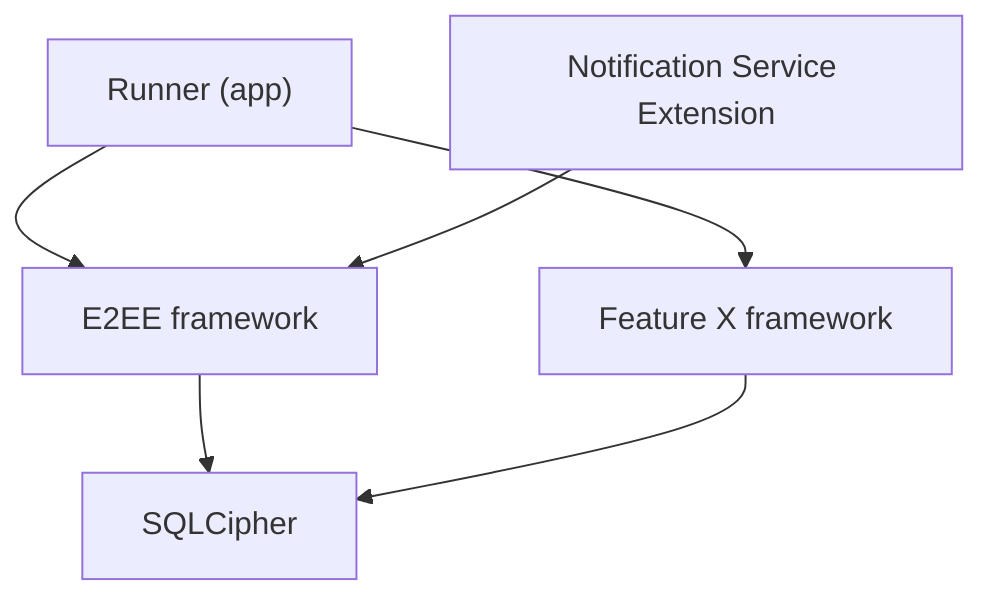
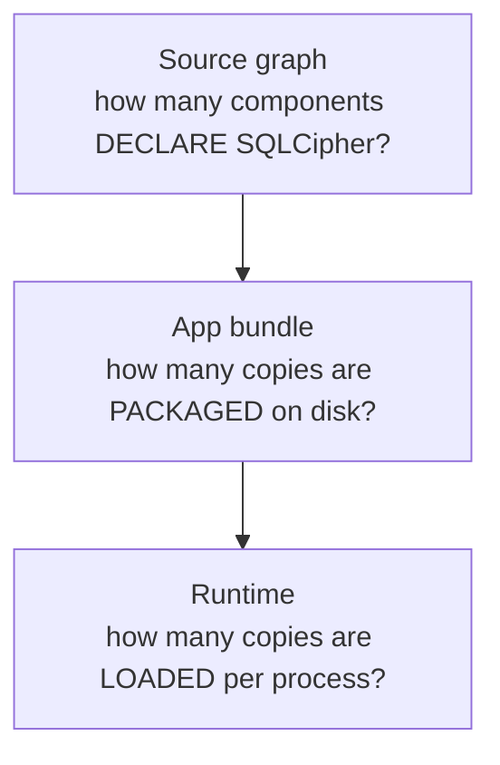
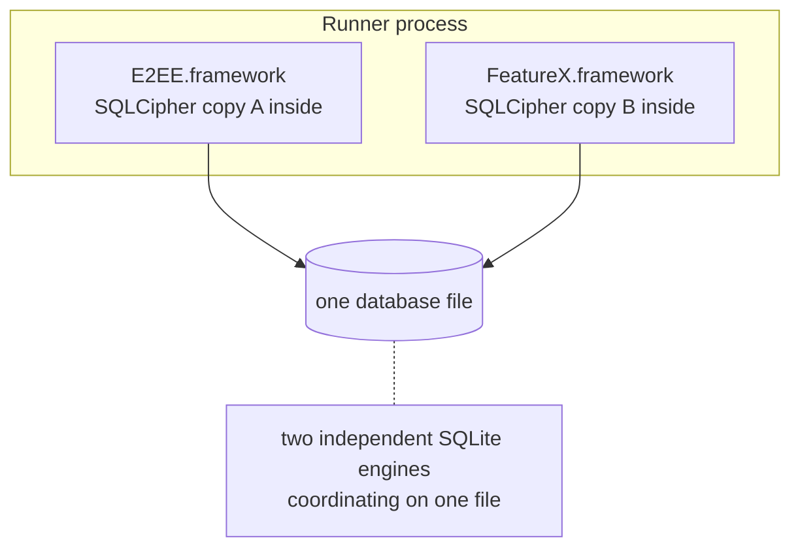
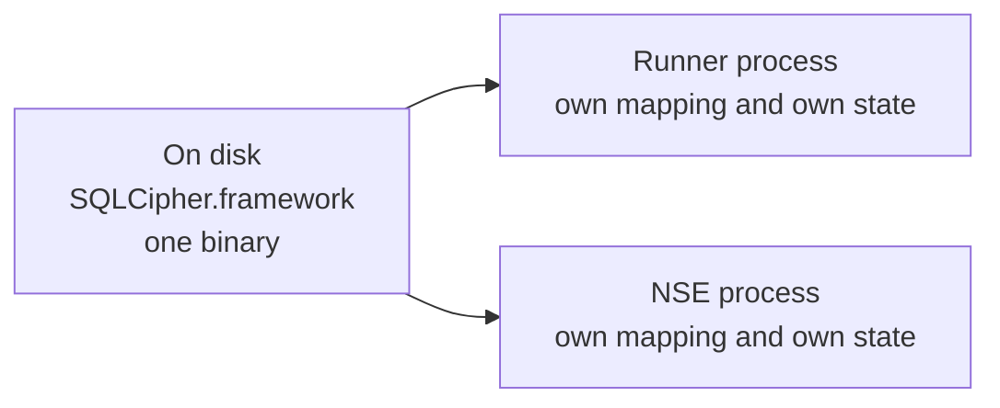
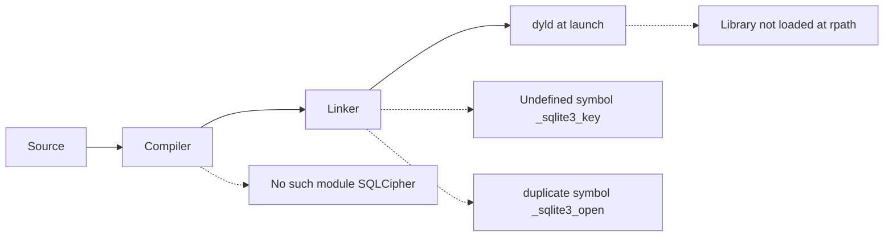

It started as a refactor that looked almost administrative. E2EE code was living inside the main app target — call it Runner — and I wanted it out, in its own framework, so that both the app and the Notification Service Extension could use it. E2EE keeps its sessions in an encrypted database, so the framework depends on SQLCipher. Simple enough:

```text
Runner
└── E2EE
    └── SQLCipher
```

Except E2EE isn't the only thing in the app that wants an encrypted database. There's another module — call it Feature X — that also uses SQLCipher. And the extension needs E2EE, because [decrypting a push payload is the whole reason it exists](/posts/the-app-links-cryptocore-fine-so-why-cant-the-notification-extension-call-it/). Suddenly the tidy line becomes a diamond:



Two frameworks each need SQLCipher. The app consumes both frameworks. The extension consumes one of them. And the question that stopped me was embarrassingly simple to ask:

> **How many copies of SQLCipher does the iPhone actually end up holding — and loading?**

In [the previous post](/posts/the-app-links-cryptocore-fine-so-why-cant-the-notification-extension-call-it/) I learned the fact this whole article stands on: an app and its extension are **two executables** — [separate signed programs in separate processes](https://developer.apple.com/library/archive/documentation/General/Conceptual/ExtensibilityPG/ExtensionOverview.html), each with its own dependency graph, each needing its own path to every library it calls. If that's new, read that post first; here I'm taking it as given. Because the diamond above only gets interesting *after* you accept it — and by the end of this post you'll be able to answer the "how many copies" question for any native library, not just SQLCipher.

> [!TIP]
> "How many SQLCipher?" is not one question. It is three: how many **declarations** in the source graph, how many **copies** in the shipped bundle, and how many **loaded** in each running process. The three numbers are often different — and every confusing linker story I know comes from answering one of them while believing you answered another.

## Table of contents

## "How Many?" Is Three Different Questions

Take the diamond at face value and try to count. Five arrows? Two consumers of SQLCipher? One library? The counting only works once you say *where* you're counting:



The **source graph** is what you write down: E2EE declares SQLCipher, Feature X declares SQLCipher. Two declarations — and that number is fine. Declarations are cheap, honest statements of need.

The **app bundle** is what the build produces: some number of physical copies of SQLCipher's machine code inside `MyApp.app`. This number is decided by the linker and your packaging choices, and it can be one, two, three — or a number that surprises you.

The **runtime** is what each process actually maps into memory. Runner is one process; the extension, when iOS spawns it, is another. Neither can borrow a library the other has loaded — each process maps its own images, and while the kernel may [share read-only code pages between processes at the physical-memory level](https://developer.apple.com/library/archive/documentation/DeveloperTools/Conceptual/DynamicLibraries/100-Articles/OverviewOfDynamicLibraries.html), every writable byte — SQLCipher's caches, its connection state, its globals — exists per process. "The app already loaded SQLCipher" says exactly nothing about what the extension has.

Same diamond, three layers, three potentially different numbers. The rest of this post walks the layers in order: who should *declare* the dependency, what the *static* and *dynamic* paths do to the bundle count, and how to *verify* what you actually shipped.

## Who Declares the Dependency?

Before any linker runs, someone has to write the arrows down. There are three ways to do it, and I've seen all three in production.

**Option 1: every framework vendors its own SQLCipher.** E2EE bundles a copy of the SQLCipher sources or a prebuilt binary; Feature X does the same. Each framework is self-contained, which feels responsible. The catch is that nothing forces the two copies to agree: E2EE pins 4.17, Feature X still carries 4.10, and when a security fix lands you get to find every hiding place by hand. This *version drift* is real — but notice precisely where it comes from: vendoring bypasses dependency resolution entirely. Inside a single package-manager graph, drift of this kind can't happen — Swift Package Manager [resolves each package to exactly one version for the whole graph](https://docs.swift.org/swiftpm/documentation/packagemanagerdocs/resolvingpackageversions/) — lockfile-based managers exist precisely to pin that single answer. Drift is a symptom of dependencies smuggled in *outside* the manifest.

**Option 2: the apps provide it.** Runner adds SQLCipher to its own target, NSE does too, and the frameworks just… assume the symbols will be there at link time. This looks clean in the project navigator, and it links. But E2EE's true dependency is now written down nowhere. The day someone adds E2EE to a new target — a widget, a share extension, a test bundle — the build greets them with:

```text
Undefined symbol: _sqlite3_key
```

and the fix lives in tribal knowledge: *"oh, you have to add SQLCipher yourself, it's in the README."* The framework's contract has leaked into its consumers.

**Option 3: declare locally, resolve globally.** Each component states what it itself needs — E2EE declares SQLCipher, Feature X declares SQLCipher, Runner declares E2EE and Feature X, NSE declares E2EE — and the package manager computes the closure. Nobody memorizes transitive needs; the graph in the diagram *is* the manifest. This is the shape I want, and it's the shape both SPM and CocoaPods are built to express.

One honesty note before leaning on SPM examples: SQLCipher itself ships officially [through CocoaPods](https://cocoapods.org/pods/SQLCipher) (or [built from source](http://www.sqlcipher.net/ios-tutorial)); official Swift Package Manager support [remains an open request](https://github.com/sqlcipher/sqlcipher/issues/371), so SPM setups today wrap a prebuilt binary themselves. Nothing in this post depends on the tool — the three layers exist under SPM, CocoaPods, and hand-managed Xcode projects alike. The declarations answer layer one. They say nothing yet about layers two and three — for that, the artifact's linkage decides.

## The Static Path: Copies Per Executable

Suppose SQLCipher enters the build as a static library. Static linking means the linker selects the needed object code out of the library and fuses it *into the executable it is currently producing*. Runner's build fuses SQLCipher into Runner. The extension's build fuses SQLCipher into the extension:

```text
MyApp.app/
├─ MyApp                        ← app code + SQLCipher code
└─ PlugIns/
   └─ NotificationService.appex/
      └─ NotificationService    ← extension code + SQLCipher code
```

Bundle count: **two copies**, one inside each executable. That is not a bug and no tool will complain — each executable is self-contained, launches without a runtime lookup, and Apple's own guidance notes that static linking [keeps launch cost down by giving dyld fewer dylibs to resolve](https://developer.apple.com/videos/play/wwdc2022/110362/). The price is exactly the duplication you can see in the tree.

This is also the right place to meet the linker error people usually blame on situations like the diamond — because it does *not* come from the diamond. `duplicate symbol` fires when **one link job** is handed two definitions of the same symbol. The classic recipe: Runner links SQLCipher directly, *and* links a static library that already has SQLCipher compiled into it. Now a single linker invocation sees [`_sqlite3_open` twice and refuses to choose](https://developer.apple.com/forums/thread/15451):

```text
duplicate symbol '_sqlite3_open' in:
    libSQLCipher.a(sqlite3.o)
    libE2EE.a(sqlite3.o)
```

Two *executables* each carrying a copy: fine, by design. One *executable* fed the same code twice: hard error. Keep that distinction — because the next case is the one that respects neither intuition.

## The Silent Duplication Trap

Now build E2EE and Feature X as **dynamic frameworks**, and let each one statically embed its own SQLCipher — the natural outcome of option 1 above, and an easy accident with prebuilt binaries. Runner loads both frameworks. What happens?

No link error. E2EE.framework was linked in its own job, Feature X in its own job — the two SQLCipher copies never meet a linker at the same time. No runtime warning either, at least not for a C library: Objective-C duplicate classes announce themselves in the console — the famous *"Class X is implemented in both…"* — but plain C symbols like `sqlite3_open` [trip no such alarm](https://developer.apple.com/forums/thread/775650). The reason is a Mach-O feature called the **two-level namespace**: each image records not just *which symbol* it needs but *which library* it expects to supply it. So [E2EE's calls bind to E2EE's embedded copy, and Feature X's calls bind to Feature X's](https://developer.apple.com/library/archive/documentation/MacOSX/Conceptual/BPFrameworks/Concepts/FrameworkBinding.html). Two complete SQLCiphers, one process, everything "working":



Read that diagram slowly, because the cost is not what I first assumed. The obvious cost is size and memory — the same machine code shipped and mapped twice. The real cost is **state**. Each copy of SQLCipher is a full, independent SQLite engine with its own globals, its own cache, its own view of file locks. SQLite's concurrency design — [its locking protocol](https://sqlite.org/lockingv3.html) and WAL mode — coordinates *connections* it knows how to see, and its old in-process coordination mechanism, [shared-cache mode, is explicitly discouraged as obsolete](https://sqlite.org/sharedcache.html). Two engines in one process opening the same database file is a configuration the library never promised to make safe. Best case you burn memory; worst case two engines make locking assumptions about each other that neither can observe, with a database file in the middle. If E2EE's sessions and Feature X's data ever live in the same store, this isn't a size problem — it's a corruption risk.

So the trap, precisely: **silent duplication is worse than the loud kind.** `duplicate symbol` at least stops the build and points at the collision. Two embedded copies inside two dynamic frameworks sail through CI, pass review, and ship — and nothing in the toolchain volunteers the number you actually needed: *how many SQLCiphers are in this process?*

(For completeness: Mach-O does have a coalescing mechanism — weak symbol definitions that dyld folds into one — but C libraries like SQLite [don't export weak symbols by default](https://developer.apple.com/forums/thread/775650), so nothing folds here.)

## The Dynamic Path: One Copy on Disk, Counted Twice at Runtime

The packaging answer to the trap is to make SQLCipher itself the shared artifact: one **dynamic framework**, embedded exactly once, that every consumer *references* instead of swallows. E2EE links against it, Feature X links against it, Runner embeds it, and the extension reaches the very same binary — Apple's [TN2435](https://developer.apple.com/library/archive/technotes/tn2435/_index.html) spells out the layout: the app target embeds all shared frameworks in `MyApp.app/Frameworks/`, and extensions link against them there rather than embedding their own.

```text
MyApp.app/
├─ MyApp
├─ Frameworks/
│  └─ SQLCipher.framework        ← the one copy on disk
└─ PlugIns/
   └─ NotificationService.appex/
      └─ NotificationService     ← references ../../Frameworks
```

Two mechanics from the previous post apply unchanged, so I'll compress them to a sentence each. The reference is written as `@rpath/SQLCipher.framework/SQLCipher`, and [`@rpath` is resolved at launch from the `LC_RPATH` search paths embedded in each executable](https://developer.apple.com/library/archive/documentation/DeveloperTools/Conceptual/DynamicLibraries/100-Articles/RunpathDependentLibraries.html) — the extension's rpath points out of its `.appex` into the app's `Frameworks/`. And a framework the extension links must be extension-safe — built with ["Require Only App-Extension-Safe API"](https://developer.apple.com/library/archive/documentation/General/Conceptual/ExtensibilityPG/ExtensionScenarios.html) so it can't drag in APIs extensions aren't allowed to touch.

Bundle count: **one**. But here is where the third layer earns its separate question. When Runner runs, dyld maps that framework into Runner's process. When a push arrives and iOS spawns the extension, dyld maps the same file *again*, into the extension's process. Two processes, two mappings, two sets of writable data. The kernel is smart about the read-only parts — [code pages backed by the same file can be shared physically](https://developer.apple.com/library/archive/documentation/DeveloperTools/Conceptual/DynamicLibraries/100-Articles/OverviewOfDynamicLibraries.html) — but nothing above the kernel is shared: not connections, not caches, not a single variable.



One more expectation to retire: this framework never joins the system's fast path. The dyld shared cache — the prelinked blob that makes system frameworks cheap — is [for OS libraries only; app-embedded frameworks are loaded from your bundle every time](https://forums.developer.apple.com/forums/thread/742758). Embedding once removes duplication. It does not make loading free, and it re-opens the failure class static linking never had: embed wrong, sign wrong, or point rpath wrong, and you trade duplicate code for a launch-time crash.

## Mergeable Libraries: Declaring Dynamic, Shipping Merged

Since Xcode 15 there's a middle path worth knowing about. Mark a dynamic framework as *mergeable*, and [the release build can merge its code directly into the binary that links it, while debug builds keep it as a normal dynamic framework](https://developer.apple.com/documentation/xcode/configuring-your-project-to-use-mergeable-libraries) — Apple's pitch in [WWDC23's "Meet mergeable libraries"](https://developer.apple.com/videos/play/wwdc2023/10268/) is exactly the tension this post keeps hitting: dynamic-framework modularity at development time, static-linking launch behavior in the shipped app.

For the diamond, what matters is which layer it changes. The *declarations* stay put — every component still states its own needs, which is the property worth protecting. The *bundle* answer changes: what would have shipped as `Frameworks/SQLCipher.framework` can end up folded into the consuming executables. What it does **not** do is absolve the graph: if you've already made the §5 mistake — two frameworks each embedding a private SQLCipher — merging faithfully merges both copies. Mergeable libraries are a packaging optimization over a *correct* graph, not a repair tool for a wrong one.

## Four Errors, Four Layers

With the three layers in hand, the error messages that used to feel interchangeable turn out to be a map. Each one names the stage that failed:



- **`No such module SQLCipher`** — the *compiler* [can't resolve the module for your `import`](https://developer.apple.com/forums/thread/775650). Nothing has been linked yet; fixing linker settings here is aimed at the wrong stage.
- **`Undefined symbol: _sqlite3_key`** — compilation succeeded, and now [the *linker* holds a reference no library on its command line defines](https://developer.apple.com/forums/thread/775650). Someone consumed a framework whose dependency was never declared — usually §3's option 2 coming home.
- **`duplicate symbol '_sqlite3_open'`** — the *linker* again, but drowning: [one link job, two definitions](https://developer.apple.com/forums/thread/15451). Trace how the same code entered this executable twice.
- **`dyld: Library not loaded: @rpath/...`** — the build was green; the *runtime loader* can't find the binary the executable references. Embedding, rpath, or signing — [the launch-time chain](https://developer.apple.com/library/archive/documentation/DeveloperTools/Conceptual/DynamicLibraries/100-Articles/RunpathDependentLibraries.html) — is broken.

One historical footnote belongs here. Older Xcode versions *did* raise an error when an app and its extension both consumed the same static SPM product; Xcode 11.4.1's release notes [removed that complaint](https://developer.apple.com/forums/thread/128806). What your binaries actually contain after the toolchain stopped talking about it is precisely the kind of question the next section answers — not from documentation, but from the artifact.

## The Verification Guide: Ask the Binaries

Everything above is a model, and models rot. The shipped bundle is the ground truth, and two command-line tools read it. Build the app, find the `.app` in DerivedData (or an exported archive), and interrogate every executable in it — the app binary, the extension binary, and each framework binary in `Frameworks/`.

**Step 1 — list each binary's dynamic dependencies.**

```bash
otool -L MyApp.app/MyApp
otool -L MyApp.app/PlugIns/NotificationService.appex/NotificationService
otool -L MyApp.app/Frameworks/E2EE.framework/E2EE
```

`otool -L` prints the libraries a Mach-O binary [declares it will load](https://developer.apple.com/forums/thread/775650) — its `LC_LOAD_DYLIB` entries. A line like `@rpath/SQLCipher.framework/SQLCipher` means *this binary expects to find SQLCipher at runtime*: a dynamic dependency. No SQLCipher line means either this binary doesn't use it — or it swallowed a copy. The next step tells those cases apart.

**Step 2 — check who actually contains the code.**

```bash
nm MyApp.app/MyApp | grep sqlite3_open
nm MyApp.app/Frameworks/E2EE.framework/E2EE | grep sqlite3_open
```

[`nm` lists a binary's symbol table](https://opensource.apple.com/source/cctools/cctools-921/man/nm.1.auto.html), and the one-letter flag is the verdict: `T` (or `t`) marks a symbol *defined in this binary* — the code physically lives here, statically fused. `U` marks it *undefined* — referenced, expected from one of the dylibs in step 1. A `T` in both E2EE and Feature X is §5's silent trap, caught in ten seconds.

**Step 3 — count across the bundle.** Run step 2 over every executable and framework binary in the `.app`. The number of images defining `sqlite3_open` **is** the bundle-layer answer — no folklore required.

**Step 4 — when dynamic, check the search paths.**

```bash
otool -l MyApp.app/PlugIns/NotificationService.appex/NotificationService | grep -A2 LC_RPATH
```

This prints the [`LC_RPATH` entries dyld will search](https://developer.apple.com/library/archive/documentation/DeveloperTools/Conceptual/DynamicLibraries/100-Articles/RunpathDependentLibraries.html) when expanding `@rpath`. For an extension sharing the app's frameworks, expect a path that climbs to the app bundle: `@executable_path/../../Frameworks`.

And that's the whole discipline. Layer one is read from manifests. Layer two is counted with `nm`. Layer three follows from layer two plus one fact — every process resolves its own images. The build system's opinions are now checkable claims.

## So — How Many Copies?

There was never one answer; there's a table. For the diamond at the top of this post:

| Packaging choice | Declarations | Copies in bundle | Loaded in Runner | Loaded in NSE |
| --- | --- | --- | --- | --- |
| Static, linked per executable | 2 (E2EE, Feature X) | 2 (app binary, appex binary) | 1 (fused) | 1 (fused) |
| Static, embedded inside two dynamic frameworks | 2 | 2 (one per framework) | **2 — the trap** | 1 |
| One shared dynamic framework | 2 | 1 (`Frameworks/`) | 1 | 1 |
| Mergeable, release build | 2 | merged into consumers | 1 | 1 |

Every row keeps the same two declarations — the source graph was never the problem. The bundle and runtime columns are where choices and accidents live, and only one row risks two engines fighting over one database file.

The rule I'm keeping, for SQLCipher and for whatever comes next — SQLite, OpenSSL, Protobuf, FFmpeg, a Rust core:

> **Declare locally. Reason globally. Verify at the executable.**

Each component writes down what it needs. The resolver — not folklore — computes the graph. And when you want the truth about duplication, you don't re-read the Podfile or the package manifest; you point `otool` and `nm` at the binaries, because the executable is where all three layers finally agree on a number.

The [previous post](/posts/the-app-links-cryptocore-fine-so-why-cant-the-notification-extension-call-it/) established the boundary this one counted across. Still open on the [series board](/series/ios/): what happens when those two processes must advance *one* shared crypto state — and the pipeline that turns a `cargo build` into an XCFramework worth linking at all.

## References

**Apple platform**

- [Understand How an App Extension Works — App Extension Programming Guide](https://developer.apple.com/library/archive/documentation/General/Conceptual/ExtensibilityPG/ExtensionOverview.html)
- [Handling Common Scenarios (extension-safe API, embedded frameworks) — App Extension Programming Guide](https://developer.apple.com/library/archive/documentation/General/Conceptual/ExtensibilityPG/ExtensionScenarios.html)
- [TN2435: Embedding Frameworks In An App](https://developer.apple.com/library/archive/technotes/tn2435/_index.html)
- [Configuring your project to use mergeable libraries](https://developer.apple.com/documentation/xcode/configuring-your-project-to-use-mergeable-libraries)
- [Meet mergeable libraries — WWDC23](https://developer.apple.com/videos/play/wwdc2023/10268/)
- [Link fast: Improve build and launch times — WWDC22](https://developer.apple.com/videos/play/wwdc2022/110362/)

**Linking and Mach-O**

- [Run-Path Dependent Libraries — Dynamic Library Programming Topics](https://developer.apple.com/library/archive/documentation/DeveloperTools/Conceptual/DynamicLibraries/100-Articles/RunpathDependentLibraries.html)
- [Overview of Dynamic Libraries — Dynamic Library Programming Topics](https://developer.apple.com/library/archive/documentation/DeveloperTools/Conceptual/DynamicLibraries/100-Articles/OverviewOfDynamicLibraries.html)
- [Frameworks and Binding (two-level namespace) — Framework Programming Guide](https://developer.apple.com/library/archive/documentation/MacOSX/Conceptual/BPFrameworks/Concepts/FrameworkBinding.html)
- [Understanding Mach-O Symbols — Apple Developer Forums](https://developer.apple.com/forums/thread/775650)
- [Duplicate symbol linker error — Apple Developer Forums](https://developer.apple.com/forums/thread/15451)
- [App-embedded frameworks and the dyld shared cache — Apple Developer Forums](https://forums.developer.apple.com/forums/thread/742758)
- [nm(1) man page — Apple cctools](https://opensource.apple.com/source/cctools/cctools-921/man/nm.1.auto.html)

**Package managers and SQLCipher**

- [Resolving and updating dependencies — Swift Package Manager](https://docs.swift.org/swiftpm/documentation/packagemanagerdocs/resolvingpackageversions/)
- [Static SPM product shared by app and extension (Xcode 11.4.1 change) — Apple Developer Forums](https://developer.apple.com/forums/thread/128806)
- [SQLCipher — CocoaPods](https://cocoapods.org/pods/SQLCipher)
- [SQLCipher iOS tutorial — Zetetic](http://www.sqlcipher.net/ios-tutorial)
- [Swift Package Manager support — sqlcipher/sqlcipher #371](https://github.com/sqlcipher/sqlcipher/issues/371)

**SQLite**

- [File Locking And Concurrency In SQLite Version 3](https://sqlite.org/lockingv3.html)
- [SQLite Shared-Cache Mode (discouraged)](https://sqlite.org/sharedcache.html)
