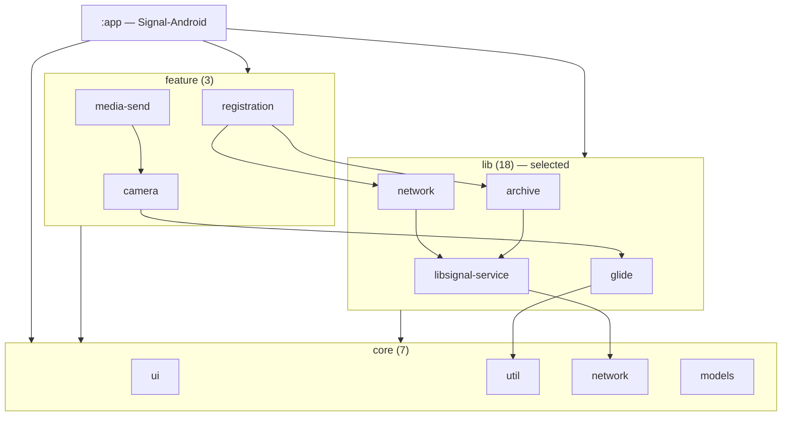
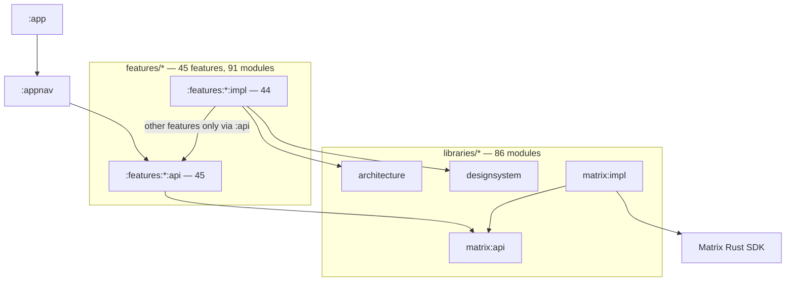
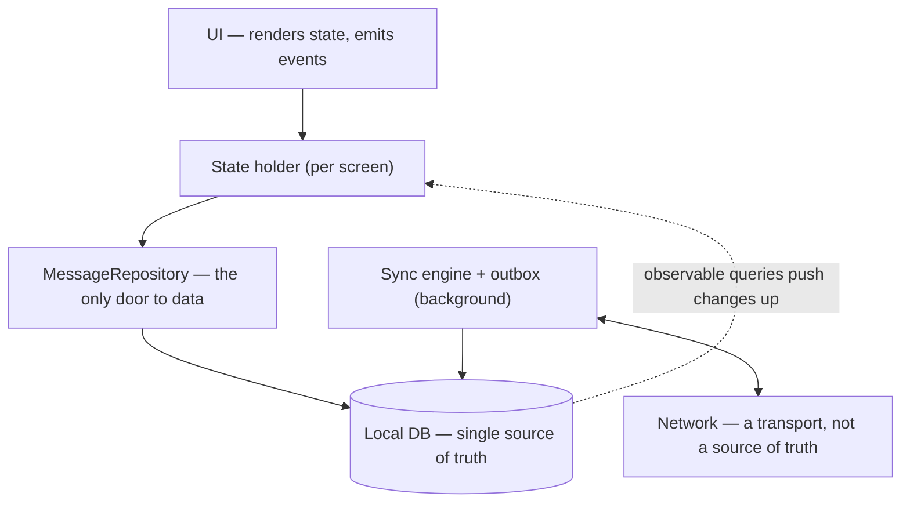

Every new mobile project starts the same way. Someone opens a fresh repo, pastes in [the concentric-circles diagram](https://blog.cleancoder.com/uncle-bob/2012/08/13/the-clean-architecture.html) — entities in the middle, use cases around them, adapters, frameworks — and creates the folders: `domain/`, `data/`, `presentation/`. The diagram feels like a survival kit. Layers in, longevity out.

Then you look at the apps that actually survived a decade at hundred-million-user scale, and the picture falls apart. Here is the whole article in one sentence:

> [!TIP]
> **Layers don't keep apps alive. Invariants do** — local database as the source of truth, unidirectional data flow, a repository between UI and data, feature isolation once the team is big enough — **and every layer beyond those must pay rent** by answering a pain you can name.

That's a strong claim, so this post does three things: it walks through what happened when big apps drowned (and what their teams deleted to save them), it gives the architecture debate its fair hearing — Google, Uncle Bob, and the scale-first camp all get quoted verbatim — and it ends with original evidence: module graphs I extracted myself from three open-source chat apps that serve hundreds of millions of users with one, twenty-nine, and one hundred ninety-seven modules respectively.

## Table of contents

## When Big Apps Hit the Wall

The most instructive architecture stories start with pain, not principles. Three apps, three different failure modes — none of them "not enough layers."

**Messenger drowned in its own abstractions.** Before its 2020 rewrite, the iOS app had grown to [more than 1.7 million lines of code and an app size greater than 130MB](https://engineering.fb.com/2020/03/02/data-infrastructure/messenger/) — with, among other things, **more than 40 different contact list screens**, each a separate implementation, and features that each talked to the server their own way. Nobody at Meta would say the app lacked structure. It had too much of it, and the structure wasn't paying rent.

**Snapchat's Android app was buried by feature accretion.** After years of hot growth, [so much work ran at startup that the app took 30–60 seconds to "settle down"](https://eng.snap.com/dont-rewrite-your-app-unless-you-have-to). Incremental fixes stopped working — in their words, "Progress was slow, and each step caused unintended side-effects, like deadlocks or corner case bugs," until optimization "felt like a game of tug of war, where freeing up resources to improve performance of one feature would necessarily hurt another." Features weren't isolated, so every improvement was another feature's regression.

**Duolingo was strangled by a single global state.** Their Android app's architecture relied on a monolithic single-source-of-truth object where [any update "could wind up initiating new view computations, even if the update was not relevant to what was being shown on screen"](https://blog.duolingo.com/duolingo-android-reboot-2021/). The 2021 outcome was drastic: "Our decision was to completely halt feature development, releases, and recruit all our Android developers (about 30) to work on the project." A feature freeze, across the whole team, because of one architectural decision made years earlier.

One more for scale calibration: when Uber rewrote its driver app, the codebase they were escaping measured [428,685 lines of code on Android and 720,273 on iOS, each built by roughly 200 engineers](https://www.uber.com/us/en/blog/driver-app-ribs-architecture/) — and the pain wasn't slowness, it was that 40+ sub-teams could no longer work in parallel without stepping on each other.

Notice what the failures have in common. Messenger had layers. Duolingo had a "single source of truth" — the pattern everyone recommends — applied at the wrong scope. Snapchat was fully native with years of investment. The missing ingredient in each case wasn't a missing layer from the diagram; it was a violated invariant: isolation, scoped state, disciplined data flow.

## What They Did: Delete Layers, Keep Invariants

**Messenger's Project LightSpeed is the centerpiece**, because it's the rare rewrite where the "after" numbers are public and audited by the authors: [from more than 1.7M lines to 360,000 — a deletion of 84% of the code — app size from >130MB to approximately 30MB, and an app twice as fast to start](https://engineering.fb.com/2020/03/02/data-infrastructure/messenger/), with over 100 engineers contributing (2020).

Read what they built *toward*, because it's not the concentric circles. SQLite became the single source of truth for everything, orchestrated by one shared C library (MSYS). The 40+ contact-list screens collapsed into **one dynamic template driven by the database**. The per-feature server protocols collapsed into a single "universal gateway between Messenger and all server features." Layers were deleted wholesale; what remained were invariants: one source of truth, one door to the server, one way to render a list.

**Snapchat rebuilt around isolation.** Their post-rewrite framing: "We started seeing our Android app as a mini OS, and our features as mini apps running inside of that OS" — features load on demand instead of eagerly competing at startup, state flows through observable queries ([SQLDelight, RxJava2, and their Deck navigation system](https://eng.snap.com/making-the-most-of-a-rewrite)). Results, from [the same team that titled its post "Don't Rewrite Your App, Unless You Have To"](https://eng.snap.com/dont-rewrite-your-app-unless-you-have-to): "We were able to reduce slow cold starts and ANR rates by 60%, frozen frames by 45%, and APK size by 25MB" (2019).

**Duolingo swapped one global state for scoped ones.** Two months of all-hands rebooting replaced the monolithic state object with a repository pattern and MVVM, and the metrics answered: ["We were able to improve our ANR rate by 41% and improve our frame rate metric by 28%"](https://blog.duolingo.com/duolingo-android-reboot-2021/), with Google's case study adding a [40% increase in scrolling speed](https://android-developers.googleblog.com/2021/08/android-app-excellence-duolingo.html) (2021).

**And Slack is the counterweight that keeps this honest: you don't have to rewrite.** Slack's iOS app started as [approximately 80,000 lines of Objective-C](https://slack.engineering/scaling-slacks-mobile-codebases-modernization/) in 2013; a decade later they modernized it in place — no big-bang rewrite — ending with 280 modules on iOS (81% of the code modularized) and 330 on Android (92%), local build times down approximately 50%, average CI time-to-merge down 64%, CI build stability up from 77% to 90%. Two opposite strategies — Messenger's teardown, Slack's refactor-in-place — arriving at the same destination: isolated modules around a disciplined data core.

There's a supporting pattern in the "less code" direction too: Airbnb built [MvRx (now Mavericks)](https://medium.com/airbnb-engineering/introducing-mvrx-android-on-autopilot-552bca86bd0a) precisely to stop every team hand-rolling its own state management, and estimated it "eliminates 50–75% of product code." Standardizing a layer is also a form of deleting layers — everyone's bespoke one.

## The Three Schools (and the Skeptics With Receipts)

If layers were a settled question, the people who maintain the platforms would agree. They don't.

**School one: Google, the pragmatists.** The official Android guidance — [rebuilt in December 2021](https://android-developers.googleblog.com/2021/12/rebuilding-our-guide-to-app-architecture.html), conspicuously without Clean Architecture language — is blunt about the layer everyone copies most reverently. From [the official domain-layer page](https://developer.android.com/topic/architecture/domain-layer): "The domain layer is an *optional* layer that sits between the UI layer and the data layer." And the warning, verbatim: "it forces you to add use cases even when they are just simple function calls to the data layer, which can add complexity for little benefit." Same posture on modularization — [Google's own guide](https://developer.android.com/topic/modularization) says "It doesn't always make sense to modularize your project... If you don't expect your project to grow beyond a certain threshold, the scalability and build time gains won't apply." Apple, for its part, famously refuses to bless any architecture at all: SwiftUI's guidance is two data-flow talks ([2019](https://developer.apple.com/videos/play/wwdc2019/226/), [2020](https://developer.apple.com/videos/play/wwdc2020/10040/)) and silence about MVVM, VIPER, or anything else.

**School two: the principled layerists.** Uncle Bob's original position is subtler than the cargo cult it spawned — [his 2011 essay](https://blog.cleancoder.com/uncle-bob/2011/09/30/Screaming-Architecture.html) argues "Frameworks are tools to be used, not architectures to be conformed to," and [the 2012 Clean Architecture post](https://blog.cleancoder.com/uncle-bob/2012/08/13/the-clean-architecture.html) sells the layers as what "allows you to use such frameworks as tools, rather than having to cram your system into their limited constraints." The core claim — keep your business logic independent of the framework — is an invariant, not a folder structure. It's the folder structure that got copied.

**School three: scale-first.** Square's Cash App team states its module rule in one line: ["By only one simple sentence we should be able to tell what a module is for"](https://code.cash.app/android-architecture-for-the-rocketship-part1-modularisation), with dependencies that go only "sideway or from top to bottom. Lower-level modules never depend on higher-level modules." Uber's RIBs existed so that [40+ sub-teams could ship in parallel](https://www.uber.com/us/en/blog/driver-app-ribs-architecture/) without coordinating. Spotify's [Bazel migration](https://engineering.atspotify.com/2023/10/switching-build-systems-seamlessly) — 200+ engineers, builds from 45+ minutes down to under 10 — is architecture as survival infrastructure, not as elegance. For this school, layers aren't about purity; they're about parallelism.

Then there are the skeptics worth more than any framework pitch, because they paid for their opinions with years:

- **Rod Schmidt ran The Composable Architecture (TCA) for three years** and [wrote the retrospective](https://rodschmidt.com/posts/composable-architecture-experience/) every architecture evaluation should include: the framework shipped "95 releases over the 3 years" he used it; "Our application reducer was so large, Xcode had problems scrolling through it"; deep state trees meant "we'd have stack overflow errors, and would have to increase the stack space allocated." His conclusion is measured, not bitter: "You might be more productive onboarding new developers... with MVVM or Clean Architecture."
- **Jake Wharton's complaint lands on the opposite target** — not layering, but the platform vendor's tooling: ["None of their stuff is built for inversion of control and their API design encourages layering violations."](https://newsletter.jorgecastillo.dev/p/effective-interviews-jake-wharton) The layers fail, in his telling, because the official APIs fight them.

Here's what all three schools and both skeptics agree on, and it's almost embarrassing how small it is: **state flows down, events flow up**. Google's Compose docs [define it as doctrine](https://developer.android.com/develop/ui/compose/architecture) ("A unidirectional data flow (UDF) is a design pattern where state flows down and events flow up"); Apple's data-flow talks teach the same shape; every Flutter state library converges on it. One retrospective covering [15 years of Android architectures](https://proandroiddev.com/15-years-of-android-app-architectures-a8cc7ca0fb4e) puts the pattern behind the convergence well: "sound architecture outlives frameworks." The frameworks change; the invariant stays.

## The Spectrum: Three Chat Apps, Measured by Hand

Industry blog posts are curated. Repos aren't. So instead of taking anyone's word for what architecture "at scale" requires, I cloned three open-source chat apps — all serving real users at enormous scale, all the same product category — and extracted their module graphs myself by parsing their Gradle files (snapshot **2026-08-13**; commits `45ab8f4` / `e3a7a9c` / `7c648b3`; compile-scope internal dependencies only, external libraries excluded; Android repos only — no iOS counterparts).

| | [Telegram](https://github.com/DrKLO/Telegram) | [Signal](https://github.com/signalapp/Signal-Android) | [Element X](https://github.com/element-hq/element-x-android) |
| --- | --- | --- | --- |
| Production Gradle modules | **1** (+5 thin app shells) | **29** (+17 demo/infra) | **197** (+61 test fixtures) |
| Internal dependency edges | ~0 | 78 | 1,185 |
| Java/Kotlin files | 3,031 (all Java) | — | — |
| Largest file | `ChatActivity.java`: **46,882 lines** | — | — |
| Feature isolation | none | partial | enforced by `api`/`impl` convention |
| Source of truth | SQLite behind an 18,575-line `MessagesStorage` class | `SignalDatabase` facade (SQLCipher) | Matrix Rust SDK, wrapped by exactly one module |

**Telegram is a monolith, and it works.** One code module. A chat screen of 46,882 lines in a single Java file, a 25,466-line `MessagesController`, all state behind one storage class. No `domain/`, no feature modules, no DI framework. Hundreds of millions of users. Before drawing the wrong lesson, hold on to this one: Telegram is **counterevidence against "layers are a requirement for success," not a recommendation**. It's what a small, senior, long-tenured core team can sustain — and what most teams cannot. The monolith isn't free; it's paid for in bus factor and in the onboarding cliff of a 47,000-line file.

**Signal modularized incrementally and imperfectly.** 29 production modules in a clean downward flow — app on top, three feature modules, 18 libraries, 7 core modules at the bottom:

My parse confirms the discipline is real: **zero core modules depend upward**. It also confirms it's pragmatic rather than pure — there's exactly one feature-to-feature dependency (`media-send → camera`), and most of the app still lives in the big `:app` module. Signal never rewrote; it has been extracting modules from a monolith for years, in the Slack style, and simply isn't done.

**Element X is the maximal end.** 197 non-test modules: 45 features split into `api`/`impl` pairs, 86 library modules, everything wired by a compile-time DI framework (Metro). The graph is too dense to print — 1,185 edges, dependency chains up to 12 deep — so here is the shape that matters:

Two findings from the parse worth their weight. First, the isolation convention **actually holds**: of 85 cross-feature dependencies, 83 target an `:api` module; I found exactly one `impl → impl` violation in the entire codebase (`home:impl → preferences:impl`). Second, the entire Matrix protocol — sync, crypto, storage — enters the app through **one module** (`libraries:matrix:impl` is the only module that touches the Rust SDK). That's the repository invariant enforced at the build-graph level: replace the SDK tomorrow and 195 modules wouldn't know.

Three chat apps, same product, same scale — one, twenty-nine, one hundred ninety-seven modules. If layers were a survival requirement, this spread couldn't exist. What actually varies with the module count isn't success; it's **team structure**. Telegram: small core team. Signal: mid-size team, modularizing as it grows. Element X: built module-first in the 2020s by an organization already maintaining an earlier Matrix client. **Layer count is a function of team size and product age — not a cause of survival.**

And what *doesn't* vary is the tell. All three keep a local database as the single source of truth with the UI reading from it, and all three isolate the network behind a sync layer. The invariants are universal; the layer counts aren't.

## Which Layers Earn Their Place

Run every layer from the standard diagram through the evidence above, and they sort into three piles:

| Layer | Verdict | The rent it pays (or didn't) |
| --- | --- | --- |
| Local DB as source of truth | **Survived — universal** | All five systems above: [LightSpeed's SQLite](https://engineering.fb.com/2020/03/02/data-infrastructure/messenger/), Signal's `SignalDatabase`, Element X's Rust SDK, [Snap's SQLDelight](https://eng.snap.com/making-the-most-of-a-rewrite), even Telegram's `MessagesStorage` |
| Unidirectional data flow | **Survived — every platform converged** | [Google doctrine](https://developer.android.com/develop/ui/compose/architecture), Apple's data-flow talks, Snap's observable rebuild |
| Repository (one door to data) | **Survived — consensus** | [Duolingo's reboot](https://blog.duolingo.com/duolingo-android-reboot-2021/), Google guidance, Element X's single SDK boundary |
| Dependency injection | Survived, tooling varies | Element X: compile-time DI across 197 modules; Signal: manual wiring; pick by team size, not fashion |
| ViewModel / state holder | Survived on Android; contested in SwiftUI | Google guidance on one side; [a named dissent](https://medium.com/@tcondon/mvvm-is-dead-in-modern-swiftui-8966d3793c8b) arguing SwiftUI views already are the view model |
| Feature isolation / modularization | **Survived — with a threshold** | [Google: don't, below a growth threshold](https://developer.android.com/topic/modularization); Slack/Uber/Spotify: mandatory above it; Telegram: skippable with a small permanent team |
| Domain layer / use cases | **Contested** | [Google: optional, "complexity for little benefit"](https://developer.android.com/topic/architecture/domain-layer) for simple calls; [Schmidt's TCA years](https://rodschmidt.com/posts/composable-architecture-experience/) show heavy formalism compounding |
| One global state object | **Died** | [Duolingo's feature freeze](https://blog.duolingo.com/duolingo-android-reboot-2021/) |
| Per-feature server protocols | **Died** | Messenger replaced them with [one universal gateway](https://engineering.fb.com/2020/03/02/data-infrastructure/messenger/) |
| Custom wrappers around OS facilities | **Died** | LightSpeed's deletion: shared logic moved into SQLite + one C library instead of per-feature infrastructure |
| Eager feature preloading | **Died** | [Snapchat's 30–60s startup](https://eng.snap.com/dont-rewrite-your-app-unless-you-have-to) → on-demand "mini apps" |

The pattern in the "died" pile: every one of them is a layer that **multiplied per feature** — per-feature protocols, per-feature preloads, per-feature wrappers, and a global object every feature wrote to. The pattern in the "survived" pile: each is a **constraint on how data moves**, not a folder. That's the difference between an invariant and a layer.

Layers also have a *when*, not just a *whether*:

| Team | Add | Skip (for now) |
| --- | --- | --- |
| Solo / MVP | Single module. Local DB as SSOT, UDF, a repository class per data type | Domain layer, modularization — [Google's own advice](https://developer.android.com/topic/modularization) |
| ~3–8 devs, product >6 months | DI wiring; extract `core`/`data`/`design` modules; contracts for the 1–2 features people collide on | Full api/impl splits everywhere |
| ~30 devs | Feature isolation with enforced contracts ([the Cash App one-sentence rule](https://code.cash.app/android-architecture-for-the-rocketship-part1-modularisation)); a build-infra owner | — |
| 100+ devs | Module graph mirrors the org chart; build-system investment ([Spotify's Bazel scale](https://engineering.atspotify.com/2023/10/switching-build-systems-seamlessly)); platform teams | — |

Each row adds a layer at the moment its pain arrives — merge conflicts, build times, team collisions — and not a commit earlier.

## The Worked Example: A Chat App

Chat is this series' running example because it's the hardest common case: high write rate, offline sends, sync conflicts, huge lists. Here's the architecture the evidence supports for a chat app built by a small team — every box answers a pain from this article:

The load-bearing decision is the one all three measured apps share: **the UI never talks to the network**. Screens render whatever the local database says, via observable queries; the network's job is to make the database more current, from the background. Sending a message is where this pays off — the outbox flow:

1. **Insert locally first.** The message goes into the DB with a `pending` state. This is the canonical offline-first move — in [Android's official wording](https://developer.android.com/topic/architecture/data-layer/offline-first): "Write to the local data source first, then queue the write to notify the network at the earliest opportunity."
2. **The UI updates instantly** — not because anyone notified it, but because it observes the table the message just landed in. Send latency is one DB write, regardless of network.
3. **The sync engine drains the outbox** in the background: send, receive the server's ID and timestamp, flip the row to `sent`. Retries with backoff on failure; a `failed` state with manual retry after that.
4. **Incoming messages take the same door** — the sync engine writes them to the DB, and every observing screen updates. One data path, both directions.

Count the layers: UI, state holder, repository, DB, sync engine. Five — and each one is there because a named app above bled without it: scoped state holders are Duolingo's fix, the repository door is Element X's SDK boundary, DB-as-truth is LightSpeed's centerpiece, the background sync engine is what Snapchat's startup lacked. What's *not* there also matters: no use-case layer (this app's operations are "simple function calls to the data layer" — Google's exact case against it), no api/impl module splits (that rent comes due at ~30 developers, not 3), no per-feature anything.

When the team grows, this architecture doesn't get replaced — it gets **partitioned**. The repository splits per domain (messages, contacts, media); features move behind contracts; the sync engine becomes a module with an api. That's the Signal trajectory, and it's why starting with invariants beats starting with layers: invariants scale by subdivision, layers scale by rewrite.

## Frequently Asked Questions

**So Clean Architecture is wrong?**
No — its core claim (keep business logic independent of frameworks; "frameworks are tools to be used, not architectures to be conformed to") is one of the invariants this article defends. What the evidence rejects is the ritual: copying the full layer stack into a three-person project *before any layer has a pain to answer*. Google's guidance says the quiet part [in official documentation](https://developer.android.com/topic/architecture/domain-layer): some layers "add complexity for little benefit."

**Is Telegram proof that architecture doesn't matter?**
It's proof that *module count* doesn't decide survival. Telegram still holds the invariants — one source of truth, an isolated network layer — inside one module. What its monolith costs is organizational: a 46,882-line chat screen is a formidable onboarding wall, and the structure only works with a small, stable, senior team. If that doesn't describe your team, Telegram's layout is not your blueprint.

**When exactly should I modularize?**
When a pain arrives that modules answer: build times hurting iteration, two teams colliding in the same files, a component you need to swap or open-source. [Google's threshold wording](https://developer.android.com/topic/modularization) is the honest default; Slack's numbers ([−50% build time, CI stability 77%→90%](https://slack.engineering/scaling-slacks-mobile-codebases-modernization/)) show what the payoff looks like when the threshold has genuinely been crossed.

**Does this apply to iOS/Flutter/React Native too?**
The invariants do — UDF and local-first data are platform-independent, and Apple's own [data-flow](https://developer.apple.com/videos/play/wwdc2019/226/) [guidance](https://developer.apple.com/videos/play/wwdc2020/10040/) teaches the same shape. The thresholds shift with tooling (module build economics differ per ecosystem), but no platform changes *when a layer is worth adding* — only how it's spelled.

## Don't Ask "Which Layers." Ask "Which Pain."

The question in this article's title is the one everyone asks, and it's subtly the wrong one. "What layers does my app need to survive years?" assumes layers cause survival. The evidence says the causality runs the other way: apps survive by holding a few invariants, and they add layers when — and only when — a specific pain starts paying that layer's salary. Messenger deleted layers to survive. Slack added them to survive. Both kept the same invariants.

So audit your architecture the way you'd audit spending: for every layer, name the pain that pays its rent. "The diagram said so" is not a pain. Build-time graphs, team collisions, a 47,000-line file you're afraid to touch — those are pains. If a layer answers one, keep it and enforce it like Element X enforces its api/impl rule. If it doesn't, it's not architecture — it's furniture.

_Next in this series: the layer every measured app agreed on — local storage. What should a mobile app actually use, and how Telegram, Messenger and Signal store millions of messages. Later in the series: a case study dissecting the layers of my own chat message engine, and a deep dive measuring change-cost by making the same change in a layered and a non-layered codebase._
