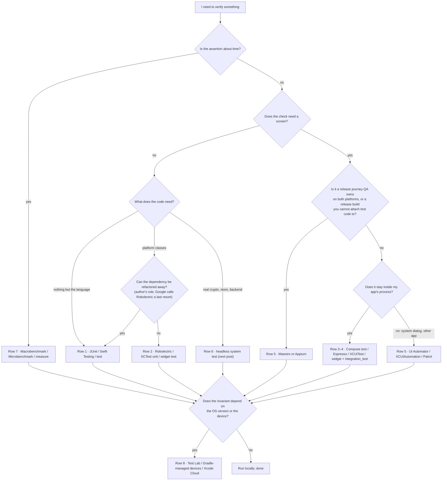

Four things I have needed to verify in one chat app, in one week:

1. A password shorter than eight characters keeps the **Login** button disabled.
2. When the app asks for notification permission, the system dialog appears and "Allow" gets tapped.
3. A cold start lands on the conversation list in under 500 ms on a mid-range phone.
4. Alice sends a message and Bob's device decrypts it to the same text — the app is end-to-end encrypted (E2EE, the padlock icon), so only the two phones ever hold the keys.

Every one of those is "a test". None of them is the same kind of test, and the tool that proves the first is useless for the second. Yet the question I hear from developers — and the question I used to ask — is always the platform one: *which framework do I use on Android, which on iOS?* Android has JUnit, Robolectric, Espresso, Compose testing, UI Automator, Macrobenchmark. iOS has XCTest, Swift Testing, XCUITest. Then Maestro, Appium, Detox, Patrol on top. That list is easy to memorise and impossible to decide with. Every name on it gets explained below; for now, notice only that it is a list of brands, not of decisions.

The [previous post in this series](/posts/the-agent-says-all-tests-pass-so-why-does-qc-still-reject-the-build/) argued that "test" is one word for four independent questions, and that a change should carry a verification contract whose middle column is *verification by layer* — one line per check, at the lowest layer that proves it. This post fills that column in for mobile. It is the map I wish I had been handed: tools placed by the boundary they verify, not by the logo on the phone.

> [!TIP]
> **A test tool is chosen by three questions, and the platform only decides the spelling.** *Which boundary am I verifying? How much realism does that invariant need — an invariant being a rule that must hold for every input? Do I have to leave my own process?* Answer those and the tool falls out — on Android, on iOS, in Flutter, or across all of them. The working rule that follows: stay inside your app's process until the invariant forces you out. The map that results is the "verification by layer" column of the verification contract from the previous post, and it is also what you hand a coding agent when you want tests you can trust.

## Table of contents

## Three Questions, One Map

Start with what is being verified, not with what is available.

**Which boundary?** The login example crosses several: a validator (pure logic), a view model (logic that touches platform classes), a screen (UI inside the app), the system permission dialog (UI *outside* the app), the network, the keychain, and finally the whole flow from tap to home screen. Each boundary is a place where a different class of bug lives, and each needs a different amount of the real system to be present before the bug can show itself.

**How much realism?** Google's Android docs put a name on this. Their "Testing strategies" page defines test size by what is in the room: "Small tests focus only on a small portion of code, making them fast and reliable. Big tests have a broad scope and require more complex setups that are difficult to maintain. However, big tests have more fidelity*, and they can discover a lot more issues in one go." And the footnote: "*Fidelity refers to the similarity of the test runtime environment to the production environment." Fidelity is not a boolean. A test can run real business logic and a real database on a laptop's Java virtual machine (the JVM — the same runtime Android's Kotlin and Java code compiles for, minus Android itself) with no phone in sight, and that is exactly the right amount of realism for a whole class of invariants. I will call that a *fake OS*: the code is real, the operating system around it is a stand-in or absent.

**Do I have to leave my own process?** A process is the operating system's unit of isolation: your app runs in one, with its own memory, and nothing outside it can call your code directly. A test that runs *inside* your app's process can call your functions, read your state, and ask your UI framework whether it has finished drawing. A test that runs *outside* it can only do what the OS lets any other program do — look at what is on screen through the accessibility layer, and tap. This is the question the platform catalogues hide. Espresso, Compose testing, Flutter widget tests, and XCUITest's element queries all reach into *your* app. The moment the thing you must touch is a system dialog, the notification shade, the launcher, a second app — or the moment you must drive a shipped release build that you cannot attach test code to — you need a tool that runs outside your process, and that tool pays for its reach with slower, less deterministic synchronization. That trade is the single most useful thing to know about mobile UI automation, and it is the axis on which the whole map turns.

Two more words the map uses. A **black-box** tool sees only what the OS shows any user — pixels, accessibility labels, taps — and knows nothing about the app's internals; a **gray-box** tool sits outside the app but hooks something inside it so it can wait for the app to be idle. Android has two UI toolkits, and the map names both: **Views** is the classic XML-and-`View`-class system, **Compose** (Jetpack Compose) is the newer declarative one built from functions called composables.

Here is the map. Rows are boundaries; columns are where you happen to be building. Every cell carries a source tag; the key is under the table, and a cell that no vendor document supports says so instead of guessing.

| Boundary to verify | Android | iOS | Flutter | Cross-platform |
|---|---|---|---|---|
| Pure logic, no framework | JUnit local ("host-side") test [S1] | Swift Testing `@Test` / `#expect` for new unit tests; XCTest still supported [S7] | `flutter test` unit test [S10] | — (by language, not by platform) |
| Logic that touches platform classes | Robolectric on the JVM — Google: "last resort" [S3] | XCTest unit test [S7] | Widget test — "tests a single widget" [S10] | — |
| UI inside the app, driven by the vendor's own tool | Compose test (`ComposeTestRule`) for Compose; Espresso for Views [S4] [S5] | XCUITest (XCTest + XCUIAutomation) [S8] — see the runner note below | Widget test [S10] | Detox — gray box, React Native only [S13] |
| Whole in-app flow, still the vendor's runner | Compose / Espresso behavior test in the "Application test layer" [S2] | XCUITest UI test [S8] | `integration_test` on a device or emulator [S11] | Patrol — "handling native interactions" from a Flutter test [S12] |
| Must leave the app: system UI, other apps, release builds | UI Automator — "from outside of the app's process" [S6] | XCUIAutomation (Apple's one UI framework serves rows 3–5) [S8] | Patrol native automation (permissions, notifications) [S12] | Maestro (YAML flows) / Appium (WebDriver-based, clients in many languages) [S14] [S15] |
| Headless system test: real crypto, store, backend; fake OS | plain JVM test process | plain XCTest host process | plain `dart test` process | — (next post) |
| Timing, isolated from the app process | Macrobenchmark — "a separate process from the app itself" [S9]; Microbenchmark for hot paths [S9] | XCTest `measure {}` [S7] | (no first-party guidance found) | — |
| Where to run: device matrix, not what to assert | Firebase Test Lab; Gradle-managed devices [S16] [S17] | Firebase Test Lab ("using the XCTest framework"); Xcode Cloud [S16] [S7] | Firebase Test Lab via `flutter drive` [S11] | Device farms (vendor claims, not verified here) |

Source key — every tag is a vendor or maintainer document, quoted in the sections below and listed in full under Sources: **S1** Android *Fundamentals of testing* · **S2** Android *Testing strategies* · **S3** Android *Robolectric strategies* · **S4** Android *Test your Compose layout* and *Synchronize your tests* · **S5** Android *Espresso* · **S6** Android *UI Automator* (current and legacy pages) · **S7** Apple *XCTest*, *Testing*, `measure(_:)`, *Xcode Cloud* · **S8** Apple *XCUIAutomation* · **S9** Android *Macrobenchmark* and *Microbenchmark* · **S10** Flutter *Testing overview* and the unit / widget cookbook · **S11** Flutter *integration tests* · **S12** Patrol README · **S13** Detox README · **S14** Maestro README · **S15** Appium docs and README · **S16** Firebase Test Lab · **S17** Android *Gradle-managed devices*.

A *runner*, in the table, is the process the vendor's test framework starts to execute your tests: on Android a local test runs in a plain JVM and an instrumented test runs on the device alongside the app; on iOS the UI-testing framework drives the app from a separate test target rather than from inside it — that is my description of the mechanism, not Apple's wording, and it is why the iOS cell in row 3 is not a true in-process tool. Two more rows deserve a note before we walk them. The "headless system test" row is not in any vendor's taxonomy — it is where need #4 lives, and it is the subject of the next post. And the last row is not a tool for writing tests at all; it is where finished tests get executed. Confusing those two is the most common mistake in the catalogues.

### The vendors' vertical view

If you have seen a testing pyramid, you have seen the vendors' version of the same idea, drawn top to bottom instead of by boundary. Google's Android docs draw five layers — unit, component, feature, application, release candidate — and describe each by its scope, network access, execution environment, build type, and lifecycle:


*Figure from "Testing strategies" on developer.android.com, © Google, licensed under [CC BY 4.0](https://creativecommons.org/licenses/by/4.0/).*

Apple says the same thing in one paragraph on the Xcode "Testing" page: "A good testing strategy combines multiple types of tests, to maximize the benefits of each. Aim for a “pyramid” distribution of tests […]. Include a large number of fast, well-isolated unit tests to cover your app’s logic, a smaller number of integration tests to demonstrate that smaller parts connect together properly, and UI tests to assert the correct behavior of common use cases." The figure that sentence points to is on Apple's page. Neither vendor gives a number for the layers; the previous post in this series quoted Google's server-side ratios, and those come from Google's engineering books and blog, not from the Android or Xcode testing docs. The map above is the same pyramid rotated ninety degrees, with the rows named by what they cross.

## One Feature, Row by Row

Take the login feature and walk it up the map. The flow is: the user types an email and password → a validator checks them → a view model calls a repository → the repository calls the API → a token is stored → the app navigates home. Each row below verifies a different slice of that. Each snippet is the shape from the vendor's own page with only the literals changed — and each is preceded by the requirement it encodes, in words, so you can read the test as a sentence before you read it as code.

### Row 1 — Pure logic: JUnit, Swift Testing, `test`

The validator is a function of two strings. It needs nothing from Android or iOS. On Android this is a *local test*: "Local tests execute on your development machine or a server, so they're also called host-side tests. They're usually small and fast, isolating the subject under test from the rest of the app." Google's own example happens to be the email half of a login validator. **Requirement:** a well-formed address is accepted.

```kotlin
import org.junit.Assert.assertTrue
import org.junit.Test

class EmailValidatorTest {
  @Test fun emailValidator_CorrectEmailSimple_ReturnsTrue() {
    assertTrue(EmailValidator.isValidEmail("name@email.com"))
  }
}
```

On iOS the same test has two spellings, and Apple now recommends one for new work. From the XCTest overview: "Xcode 16 and later includes Swift Testing, a framework for writing unit tests that takes advantage of the powerful capabilities of the Swift programming language. Consider using Swift Testing for new unit test development […] Continue to use XCTest for user interface tests and performance tests." The Swift Testing shape is a `@Test` function and an `#expect` macro — Apple's migration guide shows `#expect(engine.batteryLevel > 0)`. **Requirement:** the password half of the validator rejects a three-character password.

```swift
import Testing

@Test func shortPasswordIsRejected() {
  let validator = LoginValidator()
  #expect(validator.isValid(email: "name@email.com", password: "123") == false)
}
```

One difference worth knowing before you migrate: "XCTest runs synchronous test methods on the main actor by default, while the testing library runs all test functions on an arbitrary task." Tests that silently relied on the main thread will tell you.

In Flutter it is the `test` package. The cookbook's example is a counter rather than a validator, and it stands in for one exactly: a pure Dart object, an action, an expected value. **Requirement:** after one increment the value is 1.

```dart
test('Counter value should be incremented', () {
  final counter = Counter();
  counter.increment();
  expect(counter.value, 1);
});
```

This row is where most of your tests should live, and every vendor says so. It is also the row where a coding agent is most useful, because the oracle — whatever decides pass or fail — is a pure function of the input.

### Row 2 — Logic that touches platform classes: Robolectric, widget tests

The view model reads a string resource through a `Context`, Android's handle to the running app. Now the JVM alone is not enough, and Android offers two exits. The first is to not need the `Context` — inject the string, mock the dependency — and stay in row 1. The second is Robolectric, which simulates enough of Android inside the JVM to run the code as written. Google's framing is unusually blunt for a docs page: "Key Point: In most cases, only use Robolectric for unit testing as a last resort: with legacy code or when using APIs that depend on Android classes." And the limits are named: "Robolectric is not a complete replacement for an emulator because it doesn't support all the features and APIs. For example, Robolectric doesn't have a screen like an emulator does, and some APIs are only partially supported. However, it emulates enough parts of Android to run unit tests and most UI tests reliably."

That last clause matters. Google now describes Robolectric as a way to run UI behavior tests without an emulator — the same Espresso API, on a laptop. An *activity* is an Android screen; the OS destroys and recreates it on rotation, and losing what the user typed across that recreation is a classic bug. **Requirement:** the email typed into the login form survives the activity being destroyed and recreated. Google's example, with the literals changed to the login screen:

```kotlin
@RunWith(AndroidJUnit4::class)
class LoginActivityTest {
    @Test
    fun emailShouldBeRetainedAfterActivityRecreation() {
        val scenario = ActivityScenario.launchActivity<LoginActivity>()
        onView(withId(R.id.email_text)).perform(typeText("name@email.com"))
        scenario.recreate()
        onView(withId(R.id.email_text)).check(matches(withText("name@email.com")))
    }
}
```

The caveat, from the same page: "Robolectric provides enough fidelity to run most UI tests but some cases will still require device tests, for example those related to system UI like edge-to-edge or picture-in-picture, or when relying on unsupported features, like WebView." That is the realism question again: Robolectric is real Android *framework code* under a fake screen.

Flutter has no Robolectric because it needs none — the framework is Dart, and a widget test builds real widgets in a *headless* test binding, meaning the widgets are laid out and painted in memory with no screen attached. **Requirement:** the widget shows its title and its message exactly once each. The cookbook shape:

```dart
testWidgets('MyWidget has a title and message', (tester) async {
  await tester.pumpWidget(const MyWidget(title: 'T', message: 'M'));
  expect(find.text('T'), findsOneWidget);
  expect(find.text('M'), findsOneWidget);
});
```

On iOS the equivalent is simply an XCTest unit test that instantiates the view model; it runs inside a simulator process, so `UIKit` classes exist, and Apple draws the unit/integration line by scale rather than by API: "The difference between a unit test and an integration test is one of scale. While a unit test covers a very small part of your app's logic, an integration test examines the behavior of a larger subsystem, or combination of classes and functions."

### Row 3 — UI inside the app: Compose testing, Espresso, XCUITest

Need #1 lives here: *password under eight characters keeps Login disabled*. The screen must be rendered, the state must flow, and the assertion is about a UI element. The test still never leaves the app.

For Jetpack Compose, the test rule hosts your composable and queries its **semantics tree** — a parallel tree of labels, roles, and states (text, "button", enabled/disabled) that the UI exposes for accessibility: "The semantics framework is primarily used for accessibility, so tests take advantage of the information exposed by semantics". You query it through three families of calls: "Finders let you select one or multiple elements... Assertions are used to verify that the elements exist or have certain attributes. Actions inject simulated user events on the elements..." **Requirement:** with a three-character password in the form, the Login button is not enabled. Google's example shape, with the literals changed and the assertion swapped for the one the API reference documents as "Asserts that the current semantics node is not enabled":

```kotlin
class LoginScreenTest {
    @get:Rule val composeTestRule = createComposeRule()

    @Test
    fun shortPasswordKeepsLoginDisabled() {
        composeTestRule.setContent { MyAppTheme { LoginScreen(uiState = shortPasswordState) } }
        composeTestRule.onNodeWithText("Login").assertIsNotEnabled()
    }
}
```

The reason this test is not *flaky* — flaky meaning it sometimes fails without the code changing — is the part that is easy to miss: "Compose tests are synchronized by default with your UI. When you call an assertion or an action with the ComposeTestRule, the test is synchronized beforehand, waiting until the UI tree is idle." You never write a wait.

For the View system the tool is Espresso, and its shape is the three-part `onView(...).perform(...).check(...)` chain from Google's basics page. **Requirement:** tapping Login with a short password leaves the password field on screen — the form did not navigate away:

```kotlin
onView(withId(R.id.login_button))
    .perform(click())
onView(withId(R.id.password_text))
    .check(matches(isDisplayed()))
```

Espresso's synchronization is explicit and worth quoting in full, because "waits for idle" is a paraphrase people repeat without knowing what it means: "Each time your test invokes onView(), Espresso waits to perform the corresponding UI action or assertion until the following synchronization conditions are met: The message queue doesn't have any messages that Espresso needs to immediately process. There are no instances of AsyncTask currently executing a task. All developer-defined idling resources are idle." An *idling resource* is an object you register with Espresso that answers "am I busy?" for work Espresso cannot see on its own. Anything your app does off those three tracks — a coroutine, an RxJava stream, a WebSocket — needs one, or Espresso will race it. Google also explains why the API refuses to hand you the `View` objects: "the framework prevents direct access to activities and views of the application because holding on to these objects and operating on them off the UI thread is a major source of test flakiness."

Which one? Google's Android Studio testing page settles it: "Jetpack Compose provides its own dedicated testing APIs, like ComposeTestRule. For cross-app interactions, you can use tools like UI Automator, or use Monkey for stress testing." Compose UI → Compose test; legacy Views → Espresso; do not force one onto the other.

On iOS this row and the next are the same framework. Apple bundles UI automation into XCTest as **XCUIAutomation** — the pair is what everyone calls XCUITest: "Use the XCUIAutomation framework to control your app's user interface and inspect its state." Apple's reference pages give the pieces rather than a worked example — `@MainActor class XCUIApplication`, `func launch()`, `var buttons: XCUIElementQuery`, `subscript(key: String) -> XCUIElement`, `func tap()`, `var exists: Bool` — so this snippet is assembled from those declarations, not copied from a sample. **Requirement:** after typing a short password and tapping Login, the "Welcome" screen never appears:

```swift
let app = XCUIApplication()
app.launch()
app.secureTextFields["password"].tap()
app.typeText("123")
app.buttons["Login"].tap()
XCTAssertFalse(app.staticTexts["Welcome"].exists)
```

Two things the declarations do not tell you. First, the UI test runs in a separate runner process that drives your app through the accessibility layer, which is why element identifiers matter as much as they do in Compose — and why the map's row 3 has no true in-process cell for iOS. Second, Apple's own ranking of its cost: "UI tests are the ultimate indicator your app works the way you expect, but they take longer to run than other kinds of tests."

### Row 4 — The whole in-app flow, still in the vendor's runner

Login end to end — type, tap, see the home screen — is a bigger version of row 3 with the same tools. Google's five-layer model calls this the application layer and notes what it can hold: "the Application test layer can contain behavior, screenshot and performance tests". The distinction from row 3 is scope, not tooling: a real activity, real navigation, often a fake or local backend.

Flutter is the one place where this row has its own package. `integration_test` runs a widget-test-style program on a real device or emulator, initialised with one line. **Requirement** (the doc's counter app): the counter shows 0, and after tapping the increment button it shows 1. The `pumpAndSettle` call is Flutter's synchronization — it advances frames until nothing is animating or pending:

```dart
void main() {
  IntegrationTestWidgetsFlutterBinding.ensureInitialized();

  group('end-to-end test', () {
    testWidgets('tap on the floating action button, verify counter', (tester) async {
      await tester.pumpWidget(const MyApp());
      expect(find.text('0'), findsOneWidget);
      final fab = find.byKey(const ValueKey('increment'));
      await tester.tap(fab);
      await tester.pumpAndSettle();
      expect(find.text('1'), findsOneWidget);
    });
  });
}
```

The doc's instruction for devices is "Use the `flutter drive` command to run tests on a physical device or emulator." In my experience the same doc's worked examples run mobile and desktop targets with `flutter test integration_test/app_test.dart` and reserve `flutter drive` for the web target that needs a browser driver; treat that as my reading, not Flutter's rule.

### Row 5 — Leaving the app: UI Automator, Patrol, and the cross-platform pair

Need #2 is the boundary that breaks people. The notification-permission dialog is not your app's UI; it belongs to the system. Espresso and Compose testing cannot see it. Neither can a Flutter widget test or `integration_test`. You need a tool that runs outside your process.

On Android that tool is UI Automator, and Google's current page states the boundary in one line: "UI Automator lets you test an app from outside of the app's process. This lets you test release versions with minification applied. UI Automator also helps when writing macrobenchmark tests." (Minification is the release-build step that renames and strips code, which is why in-process tools that need debug symbols cannot run against it. The older page's phrasing is the one most people know — "a UI testing framework suitable for cross-app functional UI testing across system and installed apps".) The current Kotlin API has the permission case as a first-class example. **Requirement:** when the app triggers the permission dialog, it is answered "Allow" and the test continues:

```kotlin
@Test
fun myTestWithPermissionHandling() = uiAutomator {
  startActivity(MainActivity::class.java)
  watchFor(PermissionDialog) { clickAllow() }
  onElement { textAsString() == "Request Permissions" }.click()
}
```

That `watchFor(PermissionDialog)` is need #2 solved in one line, and it is impossible in row 3, because row 3 tools do not know the dialog exists.

For Flutter the same reach comes from Patrol, which describes itself as "A powerful, multiplatform E2E UI testing framework for Flutter apps that overcomes the limitations of integration_test by handling native interactions." (E2E — end to end — means the test drives the whole app the way a user would.) The README names the boundary exactly as this map does: "Flutter's default integration_test package can't interact with the OS your Flutter app is running on. This makes it impossible to test many critical business features, such as:" — and lists "granting runtime permissions", "signing into the app which through WebView or Google Services" [sic], and "tapping on notifications". Patrol's answer is a `$.platform.mobile` API that reaches across that boundary from the same test. **Requirement** (the README's example): the location permission is granted, the notification shade opens, and the first notification can be tapped — all from one Flutter test:

```dart
patrolTest('showtime', (PatrolIntegrationTester $) async {
  await $.pumpWidgetAndSettle(AwesomeApp());
  await $.platform.mobile.grantPermissionWhenInUse();
  await $.platform.mobile.openNotifications();
  await $.platform.mobile.tapOnNotificationByIndex(0);
});
```

On iOS, XCUIAutomation already lives outside the app, so system alerts and device-level actions are the same framework as row 3 — one reason the Android/iOS tool lists never line up one to one. Android splits in-process and out-of-process into two frameworks; Apple ships one and pays the out-of-process cost everywhere.

Then there are the tools that were built to be outside every app, on every platform. **Maestro**, in its maintainers' words: "Maestro is an open-source framework that makes UI and end-to-end testing for Android, iOS, and web apps simple and fast. Write your first test in under five minutes using YAML flows..." and "Cross-platform coverage – test Android, iOS, and web apps (React Native, Flutter, hybrid) on emulators, simulators, or real devices." A flow is a YAML file of commands (`launchApp`, `tapOn`, `inputText`, `assertVisible`). **Requirement:** a contact can be created and the new name is visible afterwards — the README's flow, with the assertion the README's command list provides:

```yaml
appId: com.android.contacts
---
- launchApp
- tapOn: "Create new contact"
- tapOn: "First Name"
- inputText: "John"
- tapOn: "Save"
- assertVisible: "John"
```

**Appium** solves a different problem: one protocol for automating everything. WebDriver is the W3C standard originally built for browsers — a client sends commands over HTTP to a server that drives the target. The README: "Appium is an open-source automation framework that provides WebDriver-based automation possibilities for a wide range of different mobile, desktop and IoT platforms." The docs' introduction describes the architecture: "Appium is effectively split into four parts" — "Appium Core - defines the core APIs", "Drivers - implement connectivity to specific platforms", "Clients - implement Appium's API in specific languages", and "Plugins - change or extend Appium's core functionality". A test is WebDriver code in whichever language your team already has. **Requirement** (the JavaScript quickstart): in the Settings app, the "Apps" entry can be found and tapped. The selector is XPath, WebDriver's query language, and `wdOpts` is the connection configuration the quickstart sets up above this fragment:

```javascript
const driver = await remote(wdOpts);
const appsItem = await driver.$('//*[@text="Apps"]');
await appsItem.click();
```

**Detox** sits in a different cell. Its README calls it a "Gray box end-to-end testing and automation framework for mobile apps." and scopes it: "Write end-to-end tests in JavaScript for React Native apps (Android & iOS)." Its whole thesis is the synchronization problem this map keeps circling: "The core problem with E2E tests is flakiness... We believe the only way to tackle flakiness head on is by moving from black box testing to gray box testing." Gray box here means Detox hooks the React Native bridge — the channel between the JavaScript code and the native side — so it knows when the app is idle. That is why it belongs in row 3's cross-platform cell, not row 5's.

### Row 6 — The headless system test

Need #4 — Alice's message decrypts on Bob's device — has no UI in it at all, and it is not a unit test either: it needs real key generation, a real key store, a real backend, and two independent device identities. It is a system test with a fake OS. No vendor page describes this row, and none of the tools above is the right fit: UI automation would cost two emulators to prove an invariant that has nothing to do with screens, and a unit test with a mocked crypto core would prove nothing. The right tool is a plain host-side test process — JVM, XCTest on the host, or `dart test` — running production modules against a test backend. That is the next post, because it deserves its own harness.

### Row 7 — Timing, in and out of process

Need #3, cold start under 500 ms, is a different kind of assertion, and Android has two tools whose difference is once again the process boundary. Macrobenchmark: "Use the Macrobenchmark library for testing larger use cases of your app, including app startup and complex UI manipulations, such as scrolling a LazyColumn or running animations." And why it cannot share a process with the app: "Unlike most Android UI tests, Macrobenchmark tests run in a separate process from the app itself. This is necessary to enable things like stopping the app process and compiling from DEX bytecode to machine code" — DEX being the bytecode format Android apps ship as. **Requirement:** launch the app cold, repeatedly, and record the time to first frame. The startup benchmark from the overview page:

```kotlin
@LargeTest
@RunWith(AndroidJUnit4::class)
class SampleStartupBenchmark {
    @get:Rule val benchmarkRule = MacrobenchmarkRule()

    @Test
    fun startup() = benchmarkRule.measureRepeated(
        packageName = TARGET_PACKAGE,
        metrics = listOf(StartupTimingMetric()),
        iterations = DEFAULT_ITERATIONS,
    ) {
        uiAutomator { startApp(TARGET_PACKAGE) }
    }
}
```

Notice two things. `uiAutomator { startApp(...) }` inside the benchmark is the out-of-process UI tool from row 5 driving the app, which is what the UI Automator page meant by "also helps when writing macrobenchmark tests". And the benchmark *measures* — it reports startup timings per iteration; the "under 500 ms" gate of need #3 is a comparison you make against those numbers in CI, not an assertion the library writes for you. Microbenchmark is the in-process sibling: "Microbenchmarks are most useful for CPU work that is run many times in your app, also known as hot code paths."

On iOS the answer is XCTest's `measure(_:)` — "Measures the performance of a block of code... By default, this method measures the number of seconds the block of code takes to execute" — and Apple explicitly keeps performance testing on the XCTest side of the Swift Testing split. The declaration is `func measure(_ block: () -> Void)`; a use of it, assembled from that declaration, is below. **Requirement:** decrypting a fixture set of messages is timed on every run, so a slowdown shows up as a regression against earlier runs:

```swift
func testDecryptThousandMessages() {
  measure {
    _ = decryptAll(fixtures)
  }
}
```

The Xcode "Testing" page adds the strategic line: "In addition to the test pyramid, write performance tests to provide regression coverage of performance-critical regions of code." Performance is placed on the map here, not taught; it is its own series.

### Row 8 — Where tests run, which is not what they assert

The last row is the one that gets sold as a tool and is not one. Firebase Test Lab "is a cloud-based app testing infrastructure that lets you test your app on a range of devices and configurations", where you "define your test matrix by selecting a set of devices, OS versions, locales, and screen orientations." It runs the tests you already wrote — Android instrumentation tests (tests installed on the device next to the app, defined below) and Robo tests (Firebase's own crawler, which explores the app with no pre-written test), and for iOS, "Test Lab runs unit tests and UI tests using the XCTest framework." Espresso and XCUITest say *how* to test; Test Lab says *where*. Two Android-side neighbours belong in the same row: Gradle-managed devices (GMD), where "The Android Gradle plugin uses the configurations to fully manage—that is, create, deploy, and tear down—those devices when executing your automated tests", and Android Test Orchestrator, which "allows you to run each of your app's tests within its own invocation of Instrumentation" so that one crash cannot take the suite down. On Apple's side, Xcode test plans describe which tests run in which configuration — "A test plan is a document in your Xcode project that describes which tests Xcode should run when a developer invokes the test action" — and Xcode Cloud "builds and tests your app in the cloud in parallel across multiple devices and operating system versions as you write code and iterate quickly."

## What Google and Apple Actually Say

Collected in one place, because the catalogues tend to attribute things to vendors that the vendors never wrote. The whole vendor position fits in four lines.

**On layers.** Google: five layers, and the trade is fidelity — small tests are "fast and reliable", big tests "have more fidelity" and "can discover a lot more issues in one go". Apple: a "pyramid" of "a large number" of unit tests, "a smaller number" of integration tests, and UI tests "to assert the correct behavior of common use cases". Neither publishes a ratio; the 70/20/10 and ~80/15/5 figures the previous post quoted are Google's server-side engineering numbers, absent from the Android and Xcode testing pages.

**On framework choice.** Apple: "Consider using Swift Testing for new unit test development" and "Continue to use XCTest for user interface tests and performance tests." Google: Compose has "its own dedicated testing APIs, like ComposeTestRule. For cross-app interactions, you can use tools like UI Automator"; Robolectric is "a last resort".

**On fidelity and flakiness.** Google's "Big test stability" page: "When a test doesn't have a deterministic behavior, it's flaky." "Modern frameworks like Compose or Espresso are designed with testing in mind so there's a certain guarantee that the UI will be idle before the next test action or assertion. This is synchronization." "Other frameworks, such as UI Automator, allow for a bigger scope... However, UI Automator tests might require more manual synchronization so they tend to be less reliable... Prefer Espresso and Compose Test APIs to create UI tests."

**On the local/instrumented split.** "Instrumented tests run on an Android device, either physical or emulated. The app is built and installed alongside a test app that injects commands and reads the state. Instrumented tests are usually UI tests, launching an app and then interacting with it." Local tests are "host-side tests" that are "usually small and fast".

Everything else in the catalogues is tool marketing or folklore.

## The Decision Flow

Here is the map as a sequence of questions. It is my flow, not a vendor's; the quotes above are why each branch is where it is. Read it top to bottom: timing first, because a timing assertion changes the tool regardless of screen; then screen or no screen; then, for screen tests, whether the check is a release journey that QA owns on both platforms, and whether it must leave your process.



Run the four opening needs through it. The password rule is not about time, needs a screen, is not a QA journey, stays in-process: row 3, Compose test or XCUITest. The permission dialog needs a screen and leaves the process: row 5, UI Automator or Patrol. The cold start is about time: row 7, Macrobenchmark — and because startup depends on the device, it ends in row 8 on a matrix. Alice-to-Bob needs no screen but needs real crypto and a real backend: row 6.

## What to Know at Which Level

Nobody needs all of this. This is the order I would learn it in, and the depth I would stop at.

| Level | Android | iOS | Flutter | Cross-platform |
|---|---|---|---|---|
| **Must know** | JUnit; Compose test or Espresso | Swift Testing; XCTest and XCUIAutomation | `test`, widget tests | what "leaving the process" costs |
| **Should know** | Robolectric; UI Automator; Macrobenchmark | `measure {}`; test plans | `integration_test`; Patrol | Maestro |
| **Know it exists** | Test Lab; Gradle-managed devices; Orchestrator | Xcode Cloud; Test Lab | Test Lab via `flutter drive` | Appium; Detox (React Native) |

Learning order: row 1 → row 3 → row 5 (your platform's out-of-process tool) → Maestro → row 8 → row 7. I would not start with Appium: it fits a QA organisation with its own infrastructure and several platforms to cover, not a developer who wants one flaky-free UI test by Friday.

Three things you will meet that are not on the map, and where they go:

- *Screenshot (snapshot) testing* — "an automated test that takes a screenshot of a piece of UI and then compares it against a previously approved reference image", in Google's definition — is an assertion style, not a new row. It lives in rows 2–4 depending on how much you render: Google's Compose Preview Screenshot Testing runs "host-side screenshot tests" from your composable previews (row 2, still in alpha); Flutter's `matchesGoldenFile` "Asserts that a Finder, Future\<ui.Image\>, or ui.Image matches the golden image file identified by key" inside an ordinary widget test (row 2); Google lists screenshot tests in the application layer too (row 4). iOS has no first-party equivalent. Pixel comparison does not change the realism answer — it changes what you compare.
- *Accessibility automation* queries the same semantics tree the Compose and XCUI tools already use, for a different property (labels, contrast, focus order). Same rows, different assertion.
- *AI-generated tests* are not a layer at all — they are a generator that still needs you to say which row and which invariant, which is the closing section.

## Why In-Process Tools Win on Flakiness

The map's vertical axis is realism. Its hidden horizontal axis is *synchronization*, and that is what decides whether a suite is trusted or muted.

A tool that lives inside your process can ask the framework whether it is idle. Espresso's three conditions, Compose's "synchronized by default", Flutter's `pumpAndSettle`, Detox's gray-box hook into the React Native bridge — each is the tool saying "I will not act until your app has finished thinking." A tool outside the process cannot ask; it can only look at pixels and accessibility nodes and wait. That is why Google ranks UI Automator "less reliable" and says "Prefer Espresso and Compose Test APIs to create UI tests", and why Maestro's and Appium's docs are full of timeouts and retries: they are honest about the price of reach. Every `sleep(2000)` in a mobile test suite is someone paying that price by hand, and Google's stability page names it as the thing to avoid.

The rule that falls out: **stay inside the process until the invariant forces you out.** Test the permission dialog with UI Automator, and only the permission dialog; test the login screen with Compose. Use Maestro for the five journeys that must work on both platforms before a release, not for the five hundred assertions row 1 and row 3 already own. The cost of a row-5 tool is not the setup; it is that every test you put there is slower and less deterministic than the same assertion one row down.

## The Map Is Also the Prompt

The [previous post](/posts/the-agent-says-all-tests-pass-so-why-does-qc-still-reject-the-build/) ended with a verification contract whose middle field, *verification by layer*, is one line per check at the lowest layer that proves it — and argued that contract is the only oracle a coding agent has. On mobile, the rows of this map are those layers, and the tools are how each line gets executed.

That changes what you ask an agent for. "Write tests for the login feature" produces a pile of whatever the model saw most in training, usually row-1 tests of things that did not need testing and a row-3 test with a `sleep` in it. A prompt that names rows gets you tests you can place and trust:

```text
Invariants: I1 password < 8 chars keeps Login disabled;
            I2 a failed login never stores a token;
            I3 the permission dialog is accepted before the first sync.
Checks by layer:
  row 1 — unit tests for the validator over the length boundary (I1)
  row 1 — repository test: 401 response leaves the token store empty (I2)
  row 3 — one Compose test: short password, Login not enabled (I1)
  row 5 — one UI Automator test: watchFor(PermissionDialog) { clickAllow() } (I3)
Do not add a row-5 test for anything a row-3 test already covers.
Do not use sleep; use the framework's synchronization.
```

The agent is no longer "generating tests". It is executing a verification strategy you chose, one row at a time — and when it reports "all tests pass", you know which rows that claim covers and which it does not.

## What the Map Does Not Decide

The map answers *which tool*. It says nothing about three things that decide whether the test is worth running: where the test data comes from, what environment the backend is in, and how a test asserts something that happens on another device a second later. Those questions have no vendor page, and they are exactly what need #4 — Alice sends, Bob decrypts, no UI — runs into first. The next post builds that harness: two logical devices in one test process, real crypto, real key store, a real backend in a throwaway environment, and the two failure modes an end-to-end encrypted chat app meets in production that no emulator test will ever reproduce on purpose.

If you remember one thing: **name the boundary before you name the tool, and stay inside your process until the invariant forces you out.** The platform will tell you how to spell it.

## Sources

Graded: primary = the vendor's or maintainer's own document; secondary = third-party reporting, flagged in the text. All quotes above are from primary sources, checked 2026-08-29.

**Google / Android (primary)**

- [Fundamentals of testing Android apps](https://developer.android.com/training/testing/fundamentals) — local vs instrumented tests, test sizes
- [Testing strategies](https://developer.android.com/training/testing/fundamentals/strategies) — five layers, fidelity footnote, application-layer contents; figure © Google, CC BY 4.0
- [What to test in Android](https://developer.android.com/training/testing/fundamentals/what-to-test) · [Test in Android Studio](https://developer.android.com/studio/test) — Compose test APIs, UI Automator for cross-app interactions
- [Build local unit tests](https://developer.android.com/training/testing/local-tests) — `EmailValidatorTest` example
- [Robolectric strategies](https://developer.android.com/training/testing/local-tests/robolectric) — "last resort", limitations, activity-recreation example
- [Test your Compose layout](https://developer.android.com/develop/ui/compose/testing) · [Testing APIs](https://developer.android.com/develop/ui/compose/testing/apis) · [Semantics](https://developer.android.com/develop/ui/compose/testing/semantics) · [Synchronize your tests](https://developer.android.com/develop/ui/compose/testing/synchronization) · [androidx.compose.ui.test reference](https://developer.android.com/reference/kotlin/androidx/compose/ui/test/package-summary) — `assertIsNotEnabled`
- [Compose Preview Screenshot Testing](https://developer.android.com/studio/preview/compose-screenshot-testing) — screenshot-test definition, host-side
- [Espresso](https://developer.android.com/training/testing/espresso) · [Espresso basics](https://developer.android.com/training/testing/espresso/basics) — synchronization conditions, `onView` chain
- [UI Automator](https://developer.android.com/training/testing/other-components/ui-automator) (current) · [UI Automator (legacy API)](https://developer.android.com/training/testing/other-components/ui-automator-legacy) — permission-dialog watcher example
- [Big test stability](https://developer.android.com/training/testing/instrumented-tests/stability) — flakiness, synchronization, sleep
- [Macrobenchmark overview](https://developer.android.com/topic/performance/benchmarking/macrobenchmark-overview) · [Control your app from Macrobenchmark](https://developer.android.com/topic/performance/benchmarking/macrobenchmark-control-app) · [Microbenchmark overview](https://developer.android.com/topic/performance/benchmarking/microbenchmark-overview)
- [Gradle-managed devices](https://developer.android.com/studio/test/gradle-managed-devices) · [AndroidJUnitRunner — Android Test Orchestrator](https://developer.android.com/training/testing/instrumented-tests/androidx-test-libraries/runner)
- [Firebase Test Lab](https://firebase.google.com/docs/test-lab) · [Run XCTest on Test Lab](https://firebase.google.com/docs/test-lab/ios/run-xctest)

**Apple (primary)**

- [Testing](https://developer.apple.com/documentation/xcode/testing) — pyramid paragraph, UI-test cost, performance tests; the pyramid figure is on this page
- [Adding tests to your Xcode project](https://developer.apple.com/documentation/xcode/adding-tests-to-your-xcode-project) — unit vs integration by scale
- [XCTest](https://developer.apple.com/documentation/xctest) — Swift Testing recommendation; XCTest for UI and performance tests
- [Swift Testing](https://developer.apple.com/documentation/testing) · [Migrating a test from XCTest](https://developer.apple.com/documentation/testing/migratingfromxctest) — `#expect`, main-actor note
- [XCUIAutomation](https://developer.apple.com/documentation/xcuiautomation) · [XCUIApplication](https://developer.apple.com/documentation/xcuiautomation/xcuiapplication) · [XCUIElement.tap()](https://developer.apple.com/documentation/xcuiautomation/xcuielement/tap()) · [XCUIElementQuery subscript](https://developer.apple.com/documentation/xcuiautomation/xcuielementquery/subscript(_:)) · [XCUIElement.exists](https://developer.apple.com/documentation/xcuiautomation/xcuielement/exists) — declarations used to assemble the UI-test snippet
- [XCTestCase.measure(_:)](https://developer.apple.com/documentation/xctest/xctestcase/measure(_:)) — declaration and description
- [Improving code assessment by organizing tests into test plans](https://developer.apple.com/documentation/xcode/organizing-tests-to-improve-feedback) · [Xcode Cloud](https://developer.apple.com/documentation/xcode/xcode-cloud) · [Getting started with Xcode Cloud](https://developer.apple.com/documentation/xcode/getting-started-with-xcode-cloud)
- [WWDC18 — Testing Tips & Tricks](https://developer.apple.com/videos/play/wwdc2018/417/) — video pointer for the pyramid framing (not quoted)

**Flutter (primary)**

- [Testing Flutter apps](https://docs.flutter.dev/testing/overview) — unit / widget / integration taxonomy · [An introduction to unit testing](https://docs.flutter.dev/cookbook/testing/unit/introduction) · [An introduction to widget testing](https://docs.flutter.dev/cookbook/testing/widget/introduction) · [Check for widget integration tests](https://docs.flutter.dev/testing/integration-tests) — `integration_test`, `flutter drive` · [matchesGoldenFile](https://api.flutter.dev/flutter/flutter_test/matchesGoldenFile.html)

**Cross-platform tools (primary: maintainers' own README / docs)**

- [Maestro README](https://github.com/mobile-dev-inc/Maestro) — positioning, platform coverage, YAML flow example and command names
- [Appium README](https://github.com/appium/appium) · [Appium docs — introduction](https://appium.io/docs/en/latest/intro/) · [Appium docs — quickstart (JavaScript)](https://appium.io/docs/en/latest/quickstart/test-js/) — four-part architecture, WebDriver
- [Detox README](https://github.com/wix/Detox) — gray box, React Native scope
- [Patrol README](https://github.com/leancodepl/patrol) — positioning, native-automation boundary, `showtime` example; the project site ([patrol.leancode.co](https://patrol.leancode.co/)) describes the runner internals and device-farm compatibility, which are the project's own claims and were not verified here

**This series**

- [The Agent Says All Tests Pass. So Why Does QC Still Reject the Build?](/posts/the-agent-says-all-tests-pass-so-why-does-qc-still-reject-the-build/) — the four axes and the verification contract this map fills in
- [Copilot, Then Codex, Then Claude — So Why Does My Workflow Still Look Like 2022?](/posts/copilot-then-codex-then-claude-so-why-does-my-workflow-still-look-like-2022/) — why verification is where the cost of software moved
